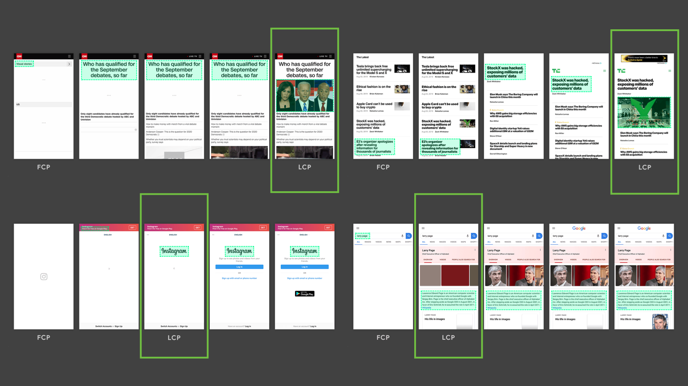
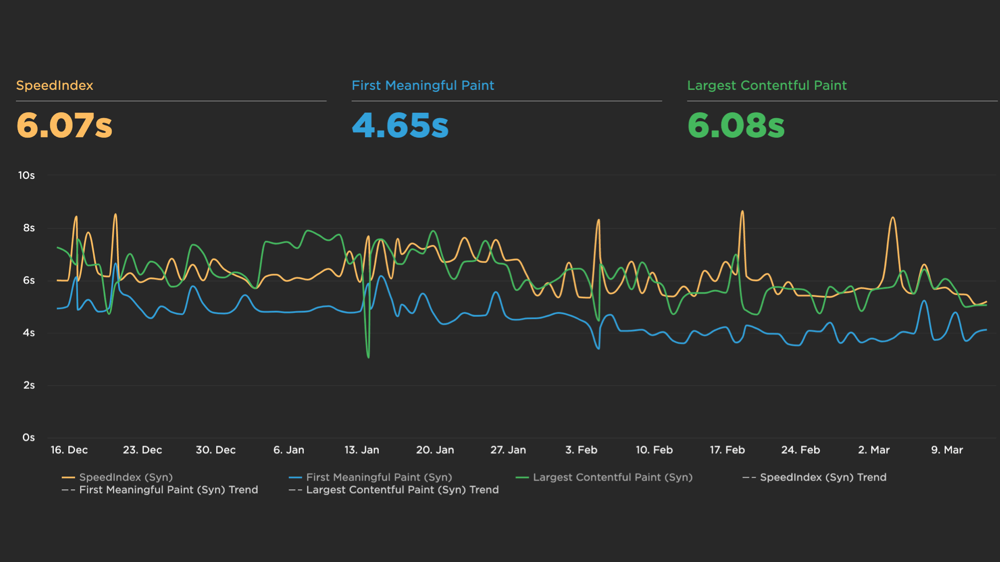

# Metrika „Největší vykreslení obsahu“ (Largest Contentful Paint, LCP)

Nová [metrika rychlosti webu](metriky-rychlosti.md) – Largest Contentful Paint (LCP) – představuje přesnější způsob měření momentu, ve kterém se vykreslí hlavní obsah stránky. Je velmi důležitá, protože je součástí [Core Web Vitals](web-vitals.md).

LCP se „dívá“, kdy byl prohlížeč zobrazil největší prvek ve stránce. Uživatelům tak pomáhá vyhodnotit, zda je stránka užitečná.

<figure>

<figcaption markdown="1">
*Obrázek: A máme tě! Jak vidíte, LCP poměrně chytře odhalí obsahově nejpodstatnější část stránky. Zde je ilustrace na různých typech webů. Zdroj: [web.dev](https://web.dev/lcp/#measure-lcp-in-javascript).*
</figcaption>
</figure>

Dobré LCP by podle Googlu mělo proběhnout do 2,5 sekundy. V měřeních reálných uživatelů (RUM) byste měli podle stejného zdroje vyhodnocovat 75. precentil.

## Proč LCP potřebujeme? {#proc}

Asi si řeknete, že pro měření vykreslení hlavního obsahu stránky už nějaké metriky máme. Jenže ty jsou složité nebo nepřesné:

<div class="related" markdown="1">
- [Metriky rychlosti webu](metriky-rychlosti.md)
- [Mýty o rychlosti webů](rychlost-myty.md)
</div>

- *[First Contentful Paint (FCP)](metrika-fcp.md)*  
  Popisuje spíše začátek vykreslování. Pokud stránka zobrazuje úvodní obrazovku nebo indikátor načítání, FCP se spustí, ale pro uživatele není tento okamžik  příliš relevantní.
- *[First Meaningful Paint (FMP)](metrika-fmp.md)*  
  Vykreslení primárního obsahu stránky. Bohužel, FMP je nepřesné – dle Google je kolem 20 % měření nepovedených a já můžu jen souhlasit. Na webech klientů se FMP spouští velmi nespolehlivě.
- *[Speed Index (SI)](speedindex.md)*  
  Index rychlosti ukazuje, jak rychle je viditelný obsah stránky naplněn do stavu stoprocentního vykreslení. SI ale reflektuje vykreslení viditelného [viewportu](viewport.md), nikoliv hlavního obsahu. Často je navíc Speed Index zkreslený komponentami třetí strany zobrazujícími cookie lištu nebo okno s chatem. SI je ještě k tomu obtížné ukládat do RUM dat, protože potřebujete záznam průběhu vykreslování.

Largest Contentful Paint je nová metrika [vyvinutá](https://calendar.perfplanet.com/2019/developing-the-largest-contentful-paint-metric/) jedním z týmů prohlížeče Chrome především jako spolehlivější alternativa [First Meaningful Paint FMP](metrika-fmp.md).

Dle autorů ale slušně koreluje hlavně s [Indexem rychlosti (SI)](speedindex.md) a do budoucna můžeme očekávat, že jej nahradí v RUM datech.

## Jak se LCP počítá? {#pocitani}

Jak už bylo řečeno, LCP je čas vykreslení největšího prvku viditelného v aktuálním viewportu. Pokud vám tahle věta v hlavě aktivovala jen další otazníky, vítejte v klubu.

<!-- AdSnippet -->

Pokusím se zde na některé z otázek odpovědět.

### Které elementy se pro LCP zvažují? {#pocitani-ktere-elementy}

Nejčastěji to jsou blokové prvky (`display:block`), ve kterých je obsažen text nebo obrázky (``).

Dále se jako LCP mohou zvažovat: `<image>` uvnitř `<svg>`, `<video>` (jen obrázky vložené jako poster), elementy s obrázkem na pozadí (mají v CSS `url()`, ([barevné přechody](css3-gradients.md) se ale ignorují).

Naopak se ke dni psaní neberou `<svg>` (což je nemalá nedokonalost téhle metriky) nebo `<video>` bez posterů a myslím, že ani `<canvas>`.

### Jak se počítá velikost prvku pro potřeby CSS? {#pocitani-velikost}

Počítá se jen samotný box model, tzn. `margin`, `padding`, ani `border` se nezapočítávají.

Bere se jen výchozí velikost a pozice prvků („initial size“). Pokud je pomocí JS přepočtete, aktuální verze LCP už to [nezohledňuje](https://web.dev/lcp/#how-are-element-layout-and-size-changes-handled).

Pokud se tedy prvky během renderování umísťují do viewportu, nezapočtou se. Pokud se z viewportu pomocí JS odstraňují, naopak se  započtou.

### Jak probíhá výběr kandidátů pro LCP? {#pocitani-vyber}

Je jasné, že viditelná část obrazovky se běheme renderování poměrně hodně mění. Existuje tedy pojem „LCP candidate“, prvek, který je v daném stavu obrazovky vždy považován za největší, ale ještě stále může být pro LCP nahrazen jiným.

[Hledání nových kanditátů](https://web.dev/lcp/#when-is-largest-contentful-paint-reported) LCP končí v momentě, kdy uživatel provede interakci se stránkou (tapnutí, kliknutí) nebo [odejde ze stránky pryč](https://github.com/WICG/largest-contentful-paint#the-last-candidate), např. vložením nového URL. Poslední LCP kandidát vyhrává a jako LCP je reportován čas jeho renderování.

<!-- AdSnippet -->

Pro reportování LCP je důležité, aby stránka byla ve viditelném okně či záložce prohlížeče. Pokud se renderování děje v záložce na pozadí, LCP nemusí být vůbec reportován nebo bude reportován až po zobrazení stránky, což může být i minuty, hodiny či dny po jejím načtení.

### Jaký je postup měření? {#pocitani-technicky}

Pokud vás to zajímá detailně technicky, pak postup měření v Chrome je následující:

1. Prohlížeč „kouká“ do [PerformanceEntry API](https://developer.mozilla.org/en-US/docs/Web/API/PerformanceEntry) na typ události `largest-contentful-paint`.
2. Tyto události na stránce postupně přibývají, protože se vykreslují nové prvky. Také se donačítají obrázky a webfonty nebo do viewportu může autor pomocí JS přidat nebo odebrat prvek.
3. Přestává se měřit, jakmile uživatel interaguje se stránkou (tapnutím, myší, klávesnicí, scrollem).
4. Prohlížeč reportuje vždy poslední `largest-contentful-paint` z `PerformanceEntry`.

## Jaké nástroje použít na měření LCP? {#mereni}

Metrika zatím není dostupná bez technických znalostí, ale očekávám, že se bude se postupně přidávat do nových verzí všech nástrojů.

### Google Lighthouse {#mereni-lighthouse}

V [Lighthouse](lighthouse.md) je LCP finálně dostupné [od verze 6](https://www.vzhurudolu.cz/blog/172-lighthouse-6).

Podobné je to s webovou implementací Lighthouse, [PageSpeed Insights](pagespeed-insights.md). Tam už je LCP dlouho k dispozici, podobně jako v našem nástroji [PageSpeed.cz](https://pagespeed.cz/).

Lighthouse a nástroje, které jej používají, jsou zároveň nejspolehlivějším zdrojem pro optimalizaci LCP. Udávají nejen hodnotu LCP, ale v části Diagnostika také určí, který prvek považuje za „Largest Contentful Paint element“.

### SpeedCurve {#mereni-speedcurve}

V profi-nástroji [SpeedCurve](speedcurve.md) je LCP k dispozici už nějakou dobu, ale je třeba říct, že se neměří vždy spolehlivě.

<figure>

<figcaption markdown="1">
*Obrázek: Na sadě velkých webů měřených synteticky přes [SpeedCurve](speedcurve.md), můžeme ilustrovat korelaci Largest Contentful Paint s indexem rychlosti.*
</figcaption>
</figure>

Navíc je zde nemožné získat informaci o tom, který element byl vybrán jako LCP.

### WebpageTest {#mereni-webpagetest}

Mocný WebpageTest zatím přidání Largest Contentful Paint do uživatelského rozhraní [jen zvažuje](https://github.com/WPO-Foundation/webpagetest/issues/1315) a čeká, zda se metrika ukáže jako užitečná.

Ani zde není možné získat informaci o tom, který element byl vybrán jako LCP.

### Chrome UX Report {#mereni-crux}

V datech z [CrUX](chrome-ux-report.md) už se LCP nějakou dobu ukládá jako experimentální a nyní jako běžné získávaná metrika. Není dostupný v běžných reportech, např. v Data Studiu, ale s trochu SQL si jej můžete vytáhnout z Google BigQuery.

### Vlastní měření JavaScriptem {#mereni-js}

Existuje návrh standardu jménem [Largest Contentful Paint API](https://wicg.github.io/largest-contentful-paint/), kde je možné vytáhnout data z API [PerformanceObserver](https://developer.mozilla.org/en-US/docs/Web/API/PerformanceObserver). Zhruba takto:

```js
const observer = new PerformanceObserver((list) => {
  let perfEntries = list.getEntries();
});
observer.observe({entryTypes: ['largest-contentful-paint']});
```

Takto je možné LCP získat z prohlížeče Chrome. Více informací o měření JavaScriptem je na [web.dev od Googlu](https://web.dev/lcp/#measure-lcp-in-javascript).

## Poznámky:

- Pozor na obrázky servírované z jiné domény. Z bezpečnostních důvodů není časové razítko vykreslování vystaveno pro cross-origin obrázky. Místo momentu vykreslení dostane prohlížeč informaci o jejich stažení, což může zkreslovat měření. Doporučuje se nastavit hlavičku [`Timing-Allow-Origin`](https://developer.mozilla.org/en-US/docs/Web/HTTP/Headers/Timing-Allow-Origin).

Měření je specifikováno v [Largest Contentful Paint API](https://wicg.github.io/largest-contentful-paint/). Při psaní jsem vycházel hlavně z podrobného [textu o LCP na webu web.dev](https://web.dev/lcp/).

<!-- AdSnippet -->
