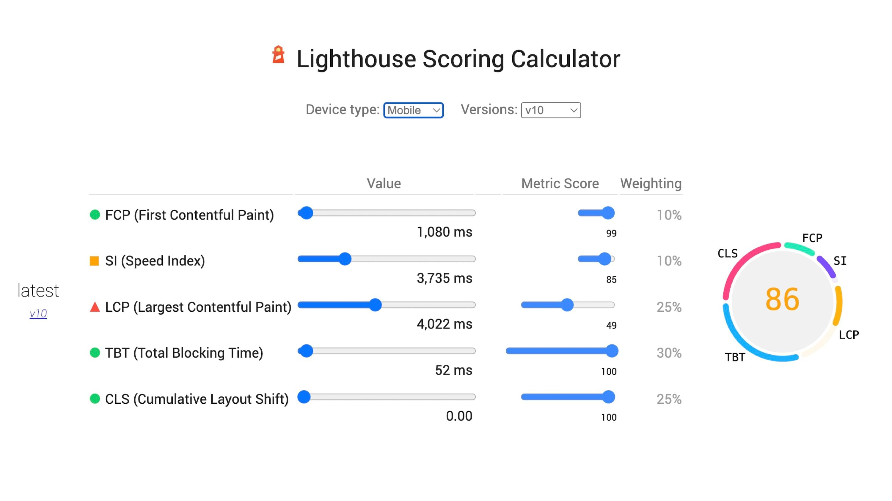
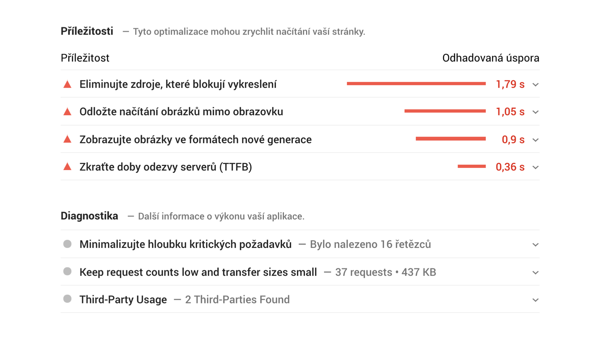

# Lighthouse Performance Score

Co je Lighthouse Performance Score? Jednoduše řečeno jde o číslo, kterým rychlost vaší stránky zhodnotí testery vycházející z nástroje [Lighthouse](lighthouse.md).

Skoro všichni jej nejspíš znáte. Je to ta hodnota v kolečku, ve kterém usilujeme o zelenou barvu. Moje otázka ale zní, zda je to usilování smysluplné. Čtěte dále.

<figure>

<figcaption markdown="1">
*Obrázek: Lighthouse Performance Score pro úvodní stránku Vzhůru dolů. Zelené to není, ale moc mě to netrápí. V článku to vysvětlím.*
</figcaption>
</figure>

Lighthouse Performance Score (pojďme používat zkratku LPS) lze považovat  za hlavní ze syntetických metrik. což jsou hodnoty měřené strojem, nikoliv z reálného provozu uživatelů.

<!-- AdSnippet -->

Obor měření rychlosti je velmi mladý a neustálený. [Metrik](metriky-rychlosti.md) rychlosti stahování a renderování stránky od doby [měření pomocí události Load](rychlost-myty.md#1) vzniklo daleko více.

Aktuálně se shodujeme na zhruba třech až desíti hlavních ukazatelích a je dobré, že se nám mohou všechny promítnout do jednoho čísla, skóre rychlosti nástroje Lighthouse. No a o něm je tenhle článek.

## LPS: obal na všechny důležité metriky {#obal}

Vtip „Lighthouse skóre“ je v tom, že všechny metriky aktuálně považované za důležité slučuje dohromady.

<figure>

<figcaption markdown="1">
*Obrázek: Z těchto metrik se Lighthouse Performance Score počítá.*
</figcaption>
</figure>

Nástroj Lighthouse změří každou z důležitých rychlostních metrik a vytvoří z nich jedno číslo.

Metriky obsažené v aktuální verzi LPS velmi dobře pokrývají celou rychlostní část uživatelského zážitku.

<figure>

<figcaption markdown="1">
*Obrázek: Nejdůležitější metriky rychlosti webu na filmovém pásu vykreslování. Ty zvýrazněné jsou obsažené v Lighthouse Performance Score.*
</figcaption>
</figure>

Ne všechny ukazatel jsou ale významově ekvivalentní.

Jednotlivé metriky mají svou váhu, na jejímž základě se do výsledného skóre započítávají.

Skóre každé metriky pak samozřejmě záleží na odlišnosti od optimální hodnoty. Obojí uvádím v tabulce.

<figure>

| Metrika                                           | Váha | Ideální hodnota |
|:--------------------------------------------------|-----:|----------------:|
| [First Contentful Paint (FCP)](metrika-fcp.md)    | 10 % |           ≤ 1,8 s |
| [Largest Contentful Paint (LCP)](metrika-lcp.md)  | 25 % |         ≤ 2,5 s |
| [Speed Index (SI)](speedindex.md)                 | 10 % |         ≤ 3,4 s |
| [Total Blocking Time (TBT)](metrika-tbt.md)       | 30 % |         ≤ 0,2 s |
| [Cumulative Layout Shift (CLS)](metrika-cls.md)   | 25 %  |           ≤ 0,1 |

  
<figcaption markdown="1">
*Tabulka: Metriky, jejich váhy a ideální hodnoty pro získání 100 % hodnocení v Lighthouse Performance Score od Lighthouse [verze 10](https://www.vzhurudolu.cz/blog/222-lighthouse-10).*
</figcaption>
</figure>

Všimněte si, jak moc důležité jsou metriky [Core Web Vitals](web-vitals.md). Mají 80 % vliv na celkové skóre.

Jak případné úspěchy v optimalizaci jednotlivých metrik pohnou s celkovým skóre si můžete vyzkoušet [na skvělém kalkulátoru](https://googlechrome.github.io/lighthouse/scorecalc/) z dílny autorů Lighthouse:

<figure>

<figcaption markdown="1">
*Obrázek: Interaktivní kalkulátor od tvůrců Lighthouse.*
</figcaption>
</figure>

## Co vše se projevuje do Lighthouse Performance Score? {#co-vse}

Pokud používáte nástroje pro měření LPS, asi vás zajímá, zda se do skóre projevují i další zobrazovaná čísla: například uživatelská Data pole z [Chrome UX Reportu](chrome-ux-report.md) nebo příležitosti ke zlepšení. Neprojevují.

<figure>

<figcaption markdown="1">
*Obrázek: Příležitosti ke zlepšení webu. Na rozdíl od dřívějších verzí nástroje Lighthouse se už do Performance Score nepočítají.*
</figcaption>
</figure>

LPS se počítá jen z metrik uvedených výše v tabulce.

Příležitosti ke zlepšení vám ale mohou pomoci dostat renderovací metriky na hezčí čísla. A ty vám pomohou zlepšit celkové skóre.

Když už jsme u celkového skóre – podívejme se ještě na dvě důležité věci. Co přesně znamenají ta procenta a jak si musíte stát, abyste se dostali do zelených čísel.

## Zelená, oranžová, červená – co znamenají tři úrovně skóre? {#tri-urovne}

V tabulce si pojďme ukázat, jakých skóre musíte dosáhnout pro kýžený posun v barvě.

| Barva                        | Skóre     |
|------------------------------|----------:|
| Zelená (dobrá rychlost)      | 90 – 100  |
| Oranžová (vyžaduje zlepšení) | 50 – 89   |
| Červená (špatná ryhlost)     | 0 – 49    |

Co ale přesně znamená hodnocení 100? Autoři píší, že [distribuce skóre](https://web.dev/performance-scoring/) je normální distribuce odvozená z metrik výkonu skutečných webů.

Když vychází nová verze Lighthouse, autoři dělají datovou studii na webech z HTTPArchive a zjišťují, jak se v oblasti skóringu pohybují ony. Výsledek vaší stránky je tedy porovnatelný se slušným vzorkem webových stránek.

Ale nastavení skóringu může být trochu matoucí:

- Se skórem 90 jste na 8. percentilu testovaných stránek, takže mezi 8 % nejrychlejších.
- Skóre 50 znamená, že jste na 75. percentilu, takže mezi 25 % nejrychlejších.

Skóre **50 bodů ze sta žádná tragédie, ale něco jako bronzová medaile**.

Je to trochu matoucí, že? A to není zdaleka konec zmatkům, které LPS mezi laiky vyvolává.

## Zavádějící metrika {#zavadejici}

„Je to nový SEO Servis“ říkají ti zkušenější z nás občas na adresu Lighthouse a LPS. Je to nadsazené, ale něco pravdy na tom je.

Jedno číslo je výhodné, protože je jednoduché, zároveň je zrádné, protože pro správné vyhodnocení musíte znát kontext.

### Chcete mít 100 bodů ze sta? A proč? {#zavadejici-100}

Dává například smysl usilovat o 100 bodů? U většiny webů nedává. Už jsem zodpověděl o dva odstavce výše, ale pro jistotu dodávám citaci z [příručky ke skóringu](https://web.dev/performance-scoring/) od autorů z Google:

> A „perfect“ score of 100 is extremely challenging to
> achieve and not expected. For example, taking a score
> from 99 to 100 needs about the same amount of metric
> improvement that would take a 90 to 94.

### Bez znalosti kontextu je to jen číslo {#zavadejici-kontext}

Lidé také často sami sebe napálí při pohledu na „Lighthouse skóre“ díky neznalosti kontextu:

1. Jak jsou na tom podobné weby? (Sledujte také konkurenci.)
2. Je LPS opravdu obrazem rychlosti, jak ji zažívají uživatelé? (Sledujte čísla u uživatelů neboli „data pole“.)
3. Neměříme špatnou stránku? ([Homepage slepota](pagespeed-insights.md#slepota) vám zabrání vidět širší kontextu vašeho webu.)

Lighthouse Performance Score je prostě zajímavá a důležitá metrika, ale v jejím případě se neobejdete bez znalosti širšího kontextu.

<!-- AdSnippet -->

Osobně vnímám LSP jako prostředníka pro vytyčení cílů optimalizace rychlosti, **nikoliv jako cílovou metriku, pomocí níž vyhodnocuji rychlost webu**.

### Různé tržní segmenty nabízejí různé možnosti {#zavadejici-segmenty}

Pozastavme se ještě u prvního bodu z předchozího seznamu. Není totiž možné házet všechny weby do jednoho pytle:

- U jednoduchých prezentačních webů obvykle bez problémů dosáhnete na skóre 90 bodů ze sta.
- Ani ty nejrychlejší velké e-shopy neobsahují příliš stránek s výsledkem nad 60 bodů.
- Provozovatelé webů živených reklamou jsou zase často rádi za skóre 30 nebo 40 bodů.

Takže než uděláte závěry, nejprve si ověřte, jak je na tom konkurence.

## Nástroje {#nastroje}

Ukažme si alespoň základní z nástrojů, které Lighthouse Performance Score zobrazují:

- [Lighthouse](lighthouse.md) je k dispozici v mnoha podobách, např. v Chrome DevTools nebo ve všech dále přítomných.
- [PageSpeed Insights](pagespeed-insights.md) je rychlý test, který vám také zobrazí základní pohled na uživatelské metriky.
- [PageSpeed.cz](https://www.vzhurudolu.cz/blog/171-pagespeed-cz) umožňuje kromě výše uvedeného také sledování rychlosti v čase.

[Nástrojů](rychlost-nastroje.md) pro měření rychlosti webu postavených na Lighthouse je ale opravdu hodně.

Podívejte se na video „Lighthouse“.

YouTube: [youtu.be/zkbzYJ7xNKw](https://www.youtube.com/watch?v=zkbzYJ7xNKw)

A ještě jednu věc byste měli vědět – že není dobré porovnávat výsledky z různých nástrojů nebo různých prostředí.

## Co když se čísla pro jednotlivá měření hodně liší? {#odlisna-cisla}

Je zcela v pořádku, když vám různé nástroje vracejí různé LPS. Důvodů může být hodně:

- Každý nástroj má jinak nastavené měření. Např. emulovanou rychlost připojení nebo výkon zařízení.
- Nástroje mohou používat různé verze Lighthouse a ty pak testovat na různých verzích Chrome. PageSpeed Insights například používá zhruba o dvě verze starší prohlížeč než je ten aktuální.

<!-- AdSnippet -->

Může se ovšem stát, že výrazně různá čísla bude vracet i Lighthouse pouštěný na stále stejném stroji, prohlížeči i nastavení. Variabilní totiž může být výkon vašeho stroje. Ujistěte se, že…

- měříte v anonymním okně prohlížeče a odstiňujete tak rozšíření do prohlížeče;
- se vám nespouští antivirový software;
- se do měřené stránky dynamicky nevkládá reklama nebo jiné variabilní prvky;
- na stránce neprobíhá A/B test, jehož jsou vaše měření obětí;
- máte rovnoměrně vytížené připojení k internetu;
- nezměnila se [verze Lighthouse](https://www.vzhurudolu.cz/blog/199-lighthouse-8) a tím také výpočet LPS.

Těch externích vlivů může být víc. Pro seriózní měření je vždy lepší testovat na jednotně nastaveném prostředí – například během procesu nasazování (CI – Continuous Integration) nebo využít už zmíněné nástroje, které měření od lokálních šumů izolují, jako je PageSpeed Insights, SpeedCurve či PageSpeed.cz.

## Jak zlepšit Lighthouse Performance Score? {#jak-zlepsit}

Základní technická doporučení ke zlepšení metriky vám dá každý z výše uvedených nástrojů. Zabývejte se hlavně doporučeními označenými jako „příležitosti“.

Zaměřím zde se hlavně tedy „soft“, nebo také procesní rady:

- Monitorujte rychlost průběžně - například na [PageSpeed.cz](https://app.pagespeed.cz/).
- Zaměřte se na jednotlivé metriky. Využijte [kalkulátor](https://googlechrome.github.io/lighthouse/scorecalc/), abyste dokázali odhadnout, jakých posunů můžete jejich optimalizací dosáhnout.
- Nepřehánějte to. Sledujte hlavně data od uživatelů.

Pokud si tedy chcete zapamatovat jen jednu metriku pro syntetická [měření rychlosti](metriky-rychlosti.md), volte Lighthouse Performance Score. Jde číslo, které má slušnou vypovídací hodnotu a sleduje vývoj oboru. Ale nikdy nezapomeňte na jiné kontexty než ten, který právě vidíte.
