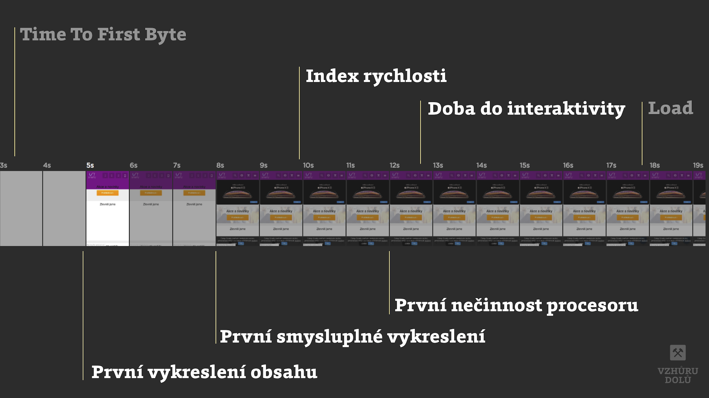

# Lighthouse Performance Score: metrika všech syntetických metrik

Co je Lighthouse Performance Score? Jednoduše řečeno jde o číslo, kterým rychlost vaší stránky zhodnotí nástroje [Lighthouse](lighthouse.md) nebo [PageSpeed Insights](pagespeed-insights.md).

Všichni jej nejspíš znáte. Je to ta hodnota v kolečku, u které usilujeme o zelenou barvu.

<figure>

<figcaption markdown="1">
*Obrázek: Lighthouse Performance Score pro úvodní stránku Vzhůru dolů.*
</figcaption>
</figure>

Lighthouse Performance Score (pojďme používat zkratku LPS) považuji u rychlosti webu za hlavní syntetickou metriku, tedy číslo měřené strojem, nikoliv z reálného provozu uživatelů.

Mimochodem, možná si někteří pamatujete, že jsem jako nejdůležitější metriku dlouho uváděl [Index rychlosti](speedindex.md), pak ještě přidal [Time To Interactive](metrika-tti.md). A teď zase LPS? Ano, je to tak. A určitě vás zajímá důvod.

<!-- AdSnippet -->

Obor měření rychlosti je velmi mladý a neustálený. [Metrik](metriky-rychlosti.md) rychlosti stahování a renderování stránky od doby [měření pomocí události Load](rychlost-myty.md#1) vzniklo daleko více. Zatím jsme se shodli zhruba na pěti až šesti hlavních metrikách. Pravděpodobně budou ještě přibývat, ale dobré je, že mohou být všechny obalené v jedné.

## Lighthouse Performance Score: obal na všechny důležité metriky {#obal}

Vtip LPS je v tom, že všechny metriky aktuálně považované za důležité slučuje dohromady. 

<figure>

<figcaption markdown="1">
*Obrázek: Jednotlivé metriky obsažené v Lighthouse Performance Score na filmovém pásu vykreslování webu.*
</figcaption>
</figure>

Změří každou z důležitých rychlostních metrik, přidá jim důležitost a váženým průměrem z nich vytvoří jedno číslo. A to je přesně to, co tento rychle se rozvíjející, ale navenek mírně zmatený obor potřeboval.

<figure>

| Metrika                                        | Váha     | Doporučená hodnota v ms    |
| ---------------------------------------------- | -------: | --------------------------: |
| [First Contentful Paint (FCP)](metrika-fcp.md) | 3        | 1 000                       |
| [First Meaningful Paint (FMP)](metrika-fmp.md) | 1        | 1 700                       |
| [Speed Index](speedindex.md)                   | 4        | 2 500                       |
| First CPU Idle (FCI)                           | 2        | 4 900                       |
| [Time to Interactive (TTI)](metrika-tti.md)    | 5        | 5 100                       |

  

<figcaption markdown="1">
*Tabulka: Metriky, jejich váhy a doporučené hodnoty pro získání 100 % hodnocení v Lighthouse Performance Score od Lighthouse verze 3. Zdroj: [Tabulka](https://docs.google.com/spreadsheets/d/1dXH-bXX3gxqqpD1f7rp6ImSOhobsT1gn_GQ2fGZp8UU/edit?ts=59fb61d2#gid=283330180) od autorů Lighthouse.*
</figcaption>

</figure>

Když tedy vezmeme výše uvedený příklad s měřením úvodní stránky Vzhůru dolů, čísla by nám po dosazení [do vlastní kopie tabulky](https://docs.google.com/spreadsheets/d/1lBGOHbJ3X3eYgXpvlvX6Q5Dmrod7jRfhifYqMzK3WX4/edit#gid=283330180) měla sedět k získanému celkovému skóre.

## Co vše se projevuje do Lighthouse Performance Score? {#co-vse}

Pokud Lighthouse nebo PageSpeed Insights používáte, asi vás zajímá, zda se do skóre projevují i další zobrazovaná čísla: například uživatelská Data pole z [Chrome UX Reportu](chrome-ux-report.md) nebo příležitosti ke zlepšení.

<figure>

<figcaption markdown="1">
*Obrázek: Příležitosti ke zlepšení webu. Na rozdíl od dřívějších verzí nástroje Lighthouse se už do Performance Score nepočítají.*
</figcaption>
</figure>

Ano, je to tak, LPS se počítá jen z metrik uvedených v tabulce.

Příležitosti ke zlepšení vám ale mohou pomoci dostat renderovací metriky na hezčí čísla. A ty vám pomohou zlepšit celkové skóre.

Když už jsme u celkového skóre – podívejme se ještě na dvě důležité věci. Co přesně znamenají ta procenta a jak si musíte stát, abyste se dostali do zelených čísel.

## Zelená, oranžová, červená – co znamenají tři úrovně skóre? {#tri-urovne}

V tabulce si pojďme ukázat, jakých skóre musíte dosáhnout pro kýžený posun v barvě.

| Barva                | Skóre     |
| -------------------- | --------: |
| Zelená (rychlý web)  | 90 – 100  |
| Oranžová (průměr)    | 50 – 89   |
| Červená (pomalý web) | 0 – 49    |

Co ale přesně znamená hodnocení 100? Autoři píší, že [distribuce skóre](https://github.com/GoogleChrome/lighthouse/blob/master/docs/scoring.md) je normální distribuce odvozená z metrik výkonu skutečných webů na HTTPArchive.

Pokud máte skóre 100, pak jste podle na 98. percentilu rychlých webů, takže mezi 2 % nejrychlejších. Skóre 50 ale znamená, že jste na 75. percentilu, takže mezi 25 % z nejrychlejších.

## Co když se čísla pro jednotlivá měření hodně liší? {#odlisna-cisla}

Je zcela v pořádku, když vám různé nástroje ([Lighthouse](lighthouse.md) nebo odvozeniny jako [PageSpeed Insights](pagespeed-insights.md), [SpeedCurve](speedcurve.md), [WebpageTest](rychlost-nastroje.md#webpagetest-org)) vracejí různé skóre. Důvodů může být hodně:

- Každý nástroj má jinak nastavené měření. Např. emulovanou rychlost připojení nebo výkon zařízení.
- Nástroje mohou používat různé verze Lighthouse a ty pak testovat na různých verzích Chrome. Mám například zjištěno, že PageSpeed Insights používá zhruba o dvě verze starší prohlížeč než je ten aktuální. V době psaní textu například tedy nezohledňoval nativní [lazy loading obrázků](lazy-loading-obrazku.md).

Může se ovšem stát, že výrazně různá čísla bude vracet i Lighthouse pouštěný na stále stejném stroji, prohlížeči i nastavení. Variabilní totiž může být výkon vašeho stroje. Ujistěte se, že…

- měříte v anonymním okně prohlížeče a odstiňujete tak rozšíření do prohlížeče;
- se vám nespouští antivirový software;
- se do měřené stránky dynamicky nevkládá reklama nebo jiné variabilní prvky;
- máte rovnoměrně vytížené připojení k internetu.

Těch externích vlivů může být víc. Pro seriózní měření je vždy lepší testovat na jednotně nastaveném prostředí – například během procesu nasazování (CI – Continuous Integration) nebo využít už zmíněné nástroje jako PageSpeed Insights, SpeedCurve či WebpageTest.

Na závěr už jen doporučení: Pokud si chcete zapamatovat jen jednu metriku pro syntetická měření rychlosti, volte Lighthouse Performance Score. Jde číslo, které má velmi slušnou vypovídací hodnotu a sleduje vývoj oboru. A pokud se oboru nevěnujete do hloubky, vlastně si ani nemusíte pamatovat, z čeho se skládá.
