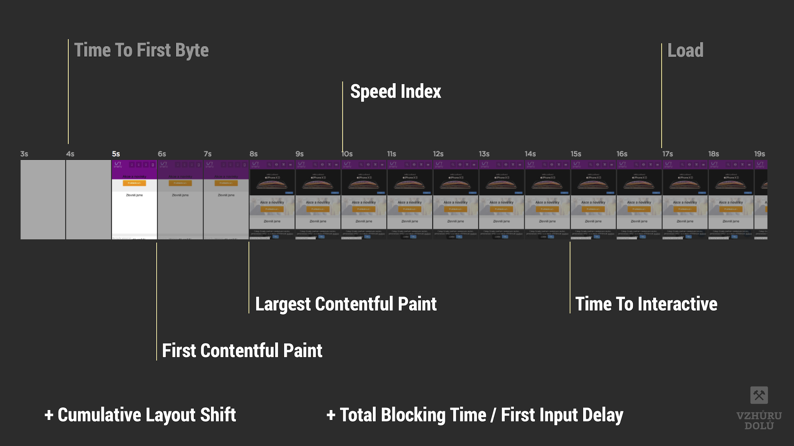

# Lighthouse Performance Score: metrika všech syntetických metrik

Co je Lighthouse Performance Score? Jednoduše řečeno jde o číslo, kterým rychlost vaší stránky zhodnotí testery vycházející z nástroje [Lighthouse](lighthouse.md).

Všichni jej nejspíš znáte. Je to ta hodnota v kolečku, ve kterém usilujeme o zelenou barvu. Moje otázka ale zní, zda je to usilování smysluplné. Čtěte dále.

<figure>

<figcaption markdown="1">
*Obrázek: Lighthouse Performance Score pro úvodní stránku Vzhůru dolů. Zelené to není, ale nijak mě to netrápí.*
</figcaption>
</figure>

Lighthouse Performance Score (pojďme používat zkratku LPS) považuji u rychlosti webu za hlavní syntetickou metriku. To znamená, že jde číslo měřené strojem, nikoliv z reálného provozu uživatelů (pro které se používá zkratka RUM).

<!-- AdSnippet -->

Obor měření rychlosti je velmi mladý a neustálený. [Metrik](metriky-rychlosti.md) rychlosti stahování a renderování stránky od doby [měření pomocí události Load](rychlost-myty.md#1) vzniklo daleko více.

Aktuálně se shodujeme na zhruba třech až šesti hlavních ukazatelích a je dobré, že se nám mohou všechny promítnout do jednoho čísla, skóre rychlosti nástroje Lighthouse.

## LPS: obal na všechny důležité metriky {#obal}

Vtip „Lighthouse skóre“ je v tom, že všechny metriky aktuálně považované za důležité slučuje dohromady.

<figure>
<!-- TODO metriky https://developers.google.com/speed/pagespeed/insights/?hl=cs&url=https%3A%2F%2Fwww.vzhurudolu.cz%2F -->

<figcaption markdown="1">
*Obrázek: Z těchto metrik se Lighthouse Performance Score počítá.*
</figcaption>
</figure>

Nástroj Lighthouse změří každou z důležitých rychlostních metrik, přidá jim důležitost a váženým průměrem z nich vytvoří jedno číslo. A to je přesně to, co tento rychle se rozvíjející, ale navenek mírně zmatený obor potřeboval.

Metriky obsažené v aktuální verzi LPS totiž velmi dobře pokrývají celou rychlostní část uživatelského zážitku.

<figure>
<!-- TODO vyměnit  -->

<figcaption markdown="1">
*Obrázek: Nejdůležitější metriky rychlosti webu na filmovém pásu vykreslování. Ty zvýrazněné jsou obsažené v Lighthouse Performance Score.*
</figcaption>
</figure>

Ne všechny ukazatel jsou ale významově ekvivalentní.

Jednotlivé metriky mají svou váhu, na jejímž základě se do výsledného skóre započítávají.

Skóre každé metriky pak samozřejmě záleží na odlišnosti od optimální hodnoty. Obojí uvádím v tabulce.

<figure>

| Metrika                                           | Váha | Ideální hodnota |
|:--------------------------------------------------|-----:|----------------:|
| [First Contentful Paint (FCP)](metrika-fcp.md)    | 15 % |           ≤ 2 s |
| [Largest Contentful Paint (LCP)](metrika-lcp.md)  | 25 % |         ≤ 2,5 s |
| [Time To Interactive (TTI)](metrika-tti.md)       | 15 % |         ≤ 3,8 s |
| [Speed Index (SI)](speedindex.md)                 | 15 % |         ≤ 4,3 s |
| [Total Blocking Time (TBT)](metrika-tbt.md)       | 25 % |         ≤ 0,3 s |
| [Cumulative Layout Shift (CLS)](metrika-cls.md)   | 5 %  |           ≤ 0,1 |

  
<figcaption markdown="1">
*Tabulka: Metriky, jejich váhy a ideální hodnoty pro získání 100 % hodnocení v Lighthouse Performance Score od Lighthouse verze 6.*
</figcaption>
</figure>

Všimněte si, jak moc důležité jsou dvě z nových metrik Web Vitals – Largest Contentful Paint (LCP) a Total Blocking Time (TBT). Spolu s CLS, zatím ne tak důležitou metrikou, se na celkovém skóre podílejí z 55 %.

Jak případné úspěchy v optimalizaci jednotlivých metrik pohnout s celkovým skóre si můžete vyzkoušet [na skvělém kalkulátoru](https://googlechrome.github.io/lighthouse/scorecalc/) z dílny autorů Lighthouse:

<!-- TODO obrázek kalkulátor, viz VD metriky -->

## Co vše se projevuje do Lighthouse Performance Score? {#co-vse}

Pokud nástroje pro měření LPS, asi vás zajímá, zda se do skóre projevují i další zobrazovaná čísla: například uživatelská Data pole z [Chrome UX Reportu](chrome-ux-report.md) nebo příležitosti ke zlepšení.

<figure>

<figcaption markdown="1">
*Obrázek: Příležitosti ke zlepšení webu. Na rozdíl od dřívějších verzí nástroje Lighthouse se už do Performance Score nepočítají.*
</figcaption>
</figure>

Ano, je to tak, LPS se počítá jen z metrik uvedených v tabulce.

Příležitosti ke zlepšení vám ale mohou pomoci dostat renderovací metriky na hezčí čísla. A ty vám pomohou zlepšit celkové skóre.

Když už jsme u celkového skóre – podívejme se ještě na dvě důležité věci. Co přesně znamenají ta procenta a jak si musíte stát, abyste se dostali do zelených čísel.

## Zelená, oranžová, červená – co znamenají tři úrovně skóre? {#tri-urovne}

V tabulce si pojďme ukázat, jakých skóre musíte dosáhnout pro kýžený posun v barvě.

| Barva                        | Skóre     |
|------------------------------|----------:|
| Zelená (dobrá rychlost)      | 90 – 100  |
| Oranžová (vyžaduje zlepšení) | 50 – 89   |
| Červená (špatná ryhlost)     | 0 – 49    |

Co ale přesně znamená hodnocení 100? Autoři píší, že [distribuce skóre](https://web.dev/performance-scoring/) je normální distribuce odvozená z metrik výkonu skutečných webů.

Když vychází nová verze Lighthouse, autoři dělají datovou studii na webech z HTTPArchive a zjišťují, jak se v oblasti skóringu pohybují ony. Výsledek vaší stránky je tedy porovnatelný se slušným vzorkem webových stránek.

Ale nastavení skóringu může být trochu matoucí:

- Se skórem 90 jste na 8. percentilu testovaných stránek, takže mezi 8 % nejrychlejších.
- Skóre 50 znamená, že jste na 75. percentilu, takže mezi 25 % nejrychlejšími.

<!-- TODO zvýraznit? -->

Ano, skóre 50 bodů tedy není žádná tragédie, ale něco jako bronzová medaile.

Je to trochu matoucí, že? A to není zdaleka konec zmatkům, které LPS mezi laiky vyvolává.

## Zavádějící metrika

<!-- A "perfect" score of 100 is extremely challenging to achieve and not expected. For example, taking a score from 99 to 100 needs about the same amount of metric improvement that would take a 90 to 94.
https://web.dev/performance-scoring/
 
  - kontexty (konkurence, viz eshopy), 
  - uživatelská data jsou zásadnější!
  - LSP je prostředník pro optimalizaci, nikoliv cíl
 -->

<!-- TODO

## Nástroje

- [Lighthouse](lighthouse.md)  
- [PageSpeed Insights](pagespeed-insights.md)

 -->

## Co když se čísla pro jednotlivá měření hodně liší? {#odlisna-cisla}

Je zcela v pořádku, když vám různé nástroje ([Lighthouse](lighthouse.md) nebo odvozeniny jako [PageSpeed Insights](pagespeed-insights.md), [SpeedCurve](speedcurve.md), [WebpageTest](rychlost-nastroje.md#webpagetest-org)) vracejí různé skóre. Důvodů může být hodně:

- Každý nástroj má jinak nastavené měření. Např. emulovanou rychlost připojení nebo výkon zařízení.
- Nástroje mohou používat různé verze Lighthouse a ty pak testovat na různých verzích Chrome. Mám například zjištěno, že PageSpeed Insights používá zhruba o dvě verze starší prohlížeč než je ten aktuální. V době psaní textu například tedy nezohledňoval nativní [lazy loading obrázků](lazy-loading-obrazku.md).

Může se ovšem stát, že výrazně různá čísla bude vracet i Lighthouse pouštěný na stále stejném stroji, prohlížeči i nastavení. Variabilní totiž může být výkon vašeho stroje. Ujistěte se, že…

- měříte v anonymním okně prohlížeče a odstiňujete tak rozšíření do prohlížeče;
- se vám nespouští antivirový software;
- se do měřené stránky dynamicky nevkládá reklama nebo jiné variabilní prvky;
- máte rovnoměrně vytížené připojení k internetu.

Těch externích vlivů může být víc. Pro seriózní měření je vždy lepší testovat na jednotně nastaveném prostředí – například během procesu nasazování (CI – Continuous Integration) nebo využít už zmíněné nástroje jako PageSpeed Insights, SpeedCurve či WebpageTest.

Na závěr už jen doporučení: Pokud si chcete zapamatovat jen jednu metriku pro syntetická měření rychlosti, volte Lighthouse Performance Score. Jde číslo, které má velmi slušnou vypovídací hodnotu a sleduje vývoj oboru. A pokud se oboru nevěnujete do hloubky, vlastně si ani nemusíte pamatovat, z čeho se skládá.
