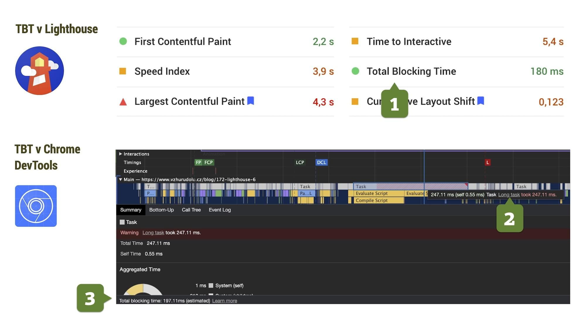

# Metrika „Celkový čas blokování“ (Total Blocking Time, TBT)

TBT je [metrika rychlosti webu](metriky-rychlosti.md), udávající celkový čas, ve kterém není vykreslená stránka schopná reagovat na vstupy uživatele.

Přesněji vzato, TBT je celková doba mezi událostmi [First Contentful Paint (FCP)](metrika-fcp.md) a [Time to Interactive (TTI)](metrika-tti.md), po kterou bylo hlavní vlákno prohlížeče neschopné reagovat na vstupy uživatele díky provádění dlouhých úloh v JavaScriptu.

Prohlížeč je „blokován“ když musí zpracovat [„Long task“ (dlouhý úkol)](https://w3c.github.io/longtasks/). Jde o úlohu, která běží v hlavním vlákně déle než 50 milisekund. Říkáme, že hlavní vlákno je „blokováno“, protože prohlížeč nemůže probíhající úkol přerušit. Uživatel prostě kliká, tapá… nic, reakce rozhraní má zpoždění. Prohlížeč totiž vykonává dlouhý úkol.

<!-- AdSnippet -->

Obvykle je metrika TBT výstupem pouze [nástrojů](rychlost-nastroje.md) pro syntetická měření, jako je [Lighthouse](lighthouse.md) nebo [WebpageTest](https://www.webpagetest.org/).

Jak jste asi pochopili, jde o metriku, která odpovídá na otázku: „Jak moc špatně napsaný JavaScript na stránce je?“. Pro tyhle účely už ale máme metriku jinou, ne?

## Srovnání s Time To Interactive (TTI) {#tti}

[TTI, čas do interaktivity](metrika-tti.md) označuje stránku za „spolehlivě interaktivní“, pokud v hlavním vlákně prohlížeče nastane alespoň pět sekund bez dlouhých úkolů.

Z toho vyplývá, že například blokující čas (TBT) trvající dohromady 100 ms, který je rozprostřený do 10 vteřin, může metriku TTI zhoršit úplně stejným způsobem, jako 10 vteřin trvající jediný „long task“. Takový si ani raději nechci představit.

<!-- AdSnippet -->

Tolik ke vztahu TTI s TBT. Čas do interaktivity, TTI, má při analýze JavaScriptu vloženého do stránky jednu nevýhodu – odvozuje se z [FCP, prvního vykreslení stránky](metrika-fcp.md).

Takže například zpoždění serverového času (v rámci metriky [TTFB](ttfb.md)) se do TTI promítne negativně, aniž by se přitom zhoršil javascriptový výkon na stránce. 

To je jako když celá třída dostane domácí úkol, protože Pepíček zlobil, že ano?

Metrika TBT je od jiných vlivů izolována, proto se na ni při analýze javascriptového výkonu doporučuji zaměřit. V nástrojích jako Lighthouse má ostatně větší váhu než Doba do interaktivity (TTI).

## Jak TBT změřit? Spíše synteticky {#mereni}

Total Blocking Time je možné snadno změřit [nástroji](rychlost-nastroje.md) pro syntetické testy webů.

<figure>

<figcaption markdown="1">
*Obrázek: Metrika Total Blocking Time (TBT) a její dostupnost v nástrojích Lighthouse a Chrome DevTools. Čísla vysvětlujeme v textu.*
</figcaption>
</figure>

Výběr z nástrojů pro změření TBT následuje:

### Lighthouse a PageSpeed Insights {#mereni-lighthouse}

Nástroj [Lighthouse](lighthouse.md) (nebo jeho nadstavba [PageSpeed Insights](pagespeed-insights.md)) zobrazují hodnotu TBT mezi šesti měřenými hodnotami (_na obrázku číslo 1_).

Do celkového [skóre rychlosti](metrika-lps.md) se TBT spolu [s LCP](metrika-lcp.md) projevuje největším podílem – dvaceti pěti procenty.

### Chrome DevTools {#mereni-devtools}

Vývojářské nástroje prohlížeče Chrome v záložce „Performance“ zobrazí jak jednotlivé dlouhé úkoly (_na obrázku číslo 2_), tak celkový čas blokování hlavního vlákna prohlížeče (_na obrázku číslo 3_).

Zde se tedy velmi dobře hledají také příčiny těchto nekalých dlouhých úloh, blokujících možnost interaktivity od uživatele.

### WebpageTest {#mereni-webpagetest}

Ve WebpageTestu najdete TBT jako jednu z nejdůležitějších metrik. Krátce po zveřejnění [Lighthouse 6](https://www.vzhurudolu.cz/blog/172-lighthouse-6) zareagoval tvůrce tohoto skvělého nástroje Pat Meenan tak, že bylo jasné, že si TBT hned velmi oblíbil:

<blockquote class="twitter-tweet">
Just swapped out &quot;First CPU Idle&quot; for &quot;Total Blocking Time&quot; in the main WebPageTest results UI. TBT is a much better indicator of the jankiness of the UI after it has rendered.  Something like FCP + TBT would make for a good top-level perf number that includes both.
&mdash; Patrick Meenan (@patmeenan) <a href="https://twitter.com/patmeenan/status/1256267827478175746?ref_src=twsrc%5Etfw">May 1, 2020</a></blockquote>

### A co u reálných uživatelů? {#mereni-rum}

Abyste získali čas do interaktivity stránky od reálných uživatelů (RUM, Google poněkud sedlácky říká „data z pole“), měli byste namísto TBT měřit zpoždění prvního vstupu – [First Input Delay (FID)](metrika-fid.md).

## Ideální hodnoty – zkuste se vejít to 200 ms {#idealni-hodnoty}

Podle Googlu byste se měli s TBT na průměrném mobilním zařízení vejít vždy do 300 milisekund.

U většiny webů to bude velký problém, poněvadž s JavaScriptem se na stránkách vůbec (ale vůbec!) nešetří. Zde by z mé strany mělo následovat velice smutné emoji, ale nechci vám kazit čtení.

Pojďme se ale mrknout na jednotlivé hranice, které pro vysvědčení [používá nástroj Lighthouse](lighthouse.md):

| Hodnota LCP        |  Mobil   |  Desktop  |
|:-------------------|---------:|----------:|
| Dobrá              | ≤ 200 ms |  ≤ 150 ms |
| Vyžaduje zlepšení  | ≤ 600 ms |  ≤ 350 ms |
| Špatný             | > 600 ms |  > 350 ms |

V nástrojích [Lighthouse](lighthouse.md) nebo [PageSpeed Insights](pagespeed-insights.md) se metrika TBT do [celkového skóre (LPS)](metrika-lps.md) projevuje váhou 30 %.

## Jak TBT optimalizovat? {#optimalizace}

Zjednodušeně vzato – optimalizačním cíle je zmenšit množství prováděného JS ve stránce. Pokročilí mohou hledat konkrétní „long tasks“ v DevTools a záložce Performance a optimalizovat jen tyhle části kódu.

Rady pro optimalizaci zatím vezmu jen velmi stručně a časem se k nim třeba ještě vrátím:

- Eliminujte množství JS vkládaného do stránky.
- Nepoužívejte zbytečné knihovny.
- Hledejte, které kód je zodpovědný za long-tasks v DevTools.

Nástroj Lighthouse s ohledem na optimalizaci Total Blocking Time radí:

- Minimalizujte používání kódu od třetích stran (rada Lighthouse v originále zní „Reduce the impact of third-party code“). [O optimalizaci third-parties](third-party.md) máme na Vzhůru dolů samostatný text.
- Omezte dobu provádění JavaScriptu („Reduce JavaScript execution time“).
- Minimalizuje práci v hlavním podprocesu („Minimize main thread work“).

<!-- AdSnippet -->
