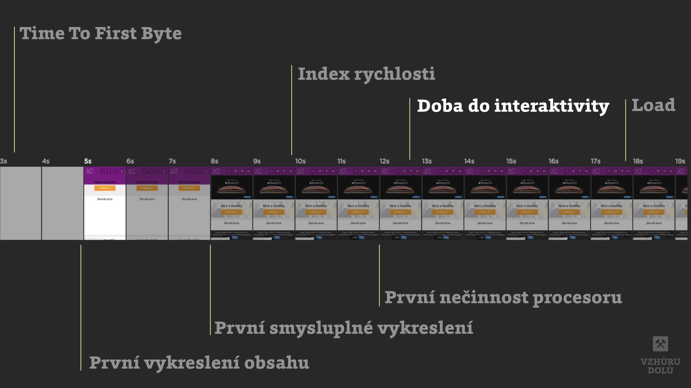

# Metrika „Čas do interaktivity“ (Time To Interactive, TTI)

[Metrika rychlosti webu](metriky-rychlosti.md), která říká kdy je stránka renderovaná a zároveň schopná spolehlivě reagovat na uživatelský vstup.

*Aktualizace k únoru 2023:* Metrika TTI se od [Lighthouse 10](https://www.vzhurudolu.cz/blog/222-lighthouse-10) nepoužívá. Je nahrazena kombinací [Total Blocking Time (TBT)](metrika-tbt.md) a [Largest Contentful Paint (LCP)](metrika-lcp.md). Pro zájemce ale metriku TTI samozřejmě vysvětlím:

Ptáte se, kdy stránka reaguje *spolehlivě*? Je to v momentě, kdy se načetly a spustily javascripty, které jsou k tomu potřeba. A když prohlížeč není „zaseknutý“ nebo „nalaguje“.

<figure>

<figcaption markdown="1">
*Kdy vzniká TTI nebo taky „Time To Interactive“*
</figcaption>
</figure>

Odborně vzato nesmí být vykreslovací jádro prohlížeče zatíženo dlouhotrvajícími úkoly. „[Long task](https://developers.google.com/web/fundamentals/performance/user-centric-performance-metrics#long_tasks)“ je definován jako zaseknutí vykreslovacího jádra na více než 50 ms.

TTI je odpovědí na otázku uživatele „Je to použitelné?“.

TTI jsou vlastně dvě různé metriky:

- [Consistently Interactive](https://developers.google.com/web/tools/lighthouse/audits/consistently-interactive), kterou ukazuje Lighthouse. Ta nepočítá s žádnými prodlevami v interakci se stránkou. Musí být vykreslená a reagující podle výše uvedených podmínek.
- [First Interactive](https://github.com/WPO-Foundation/webpagetest/blob/master/docs/Metrics/TimeToInteractive.md), kterou uvádí WebpageTest. První moment, kdy stránka může reagovat na uživatelské vstupy. Počítá se ale s možnými prodlevami, protože některé části stránky se dále stahují.

## Ideální hodnoty {#idealni-hodnoty}

Hranice, které pro vysvědčení používá [nástroj Lighthouse](lighthouse.md):

| Hodnota LCP        |  Mobil   |  Desktop  |
|:-------------------|---------:|----------:|
| Dobrá              |  ≤ 3,8 s |  ≤  2,5 s |
| Vyžaduje zlepšení  |  ≤ 7,3 s |  ≤  3,5 s |
| Špatný             |  > 7,3 s |  >  3,5 s |

