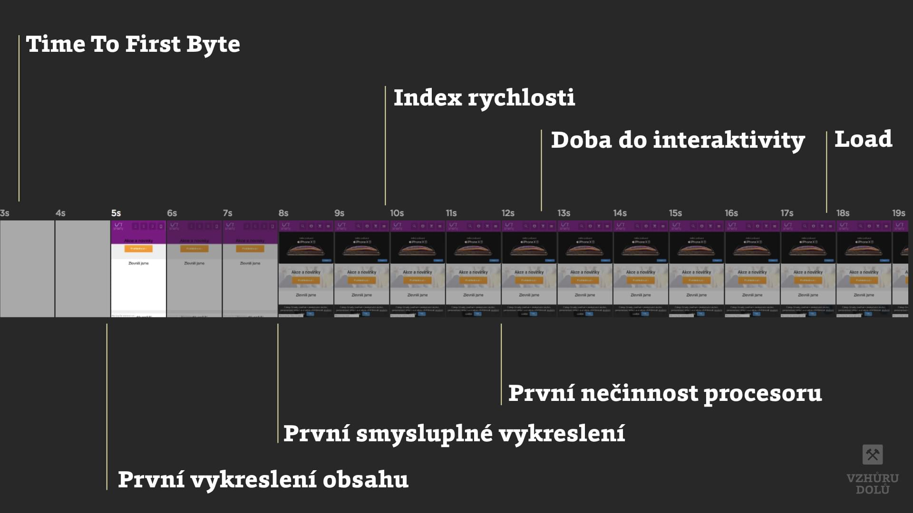

# Metriky rychlosti webu

V metrikách a událostech, které se týkají načítání a vykreslování stránky je děsný nepořádek. Pokusím se trochu uklidit.

Bude to užitečné hlavně pro ty z vás, kteří obor [rychlosti načítání](https://www.vzhurudolu.cz/rychlost-nacitani) trochu více sledujete. Ostatní odkážu na konec článku do [závěrečných doporučení](#doporuceni).

A teď už vzhůru na ty metriky. Tenhle text slouží totiž především jako rozcestník.

## Metriky Web Vitals {#web-vitals}

Web Vitals je označení pro metriky, které v roce 2020 vyhlásil Google. Jejich základní sadou jsou „Core Web Vitals“. 

Podle Google by se měřením a optimalizací pro tyto ukazatele měl zabývat úplně každý, kdo se kolem webdesignu motá.

Jde o následující tři metriky.

| Metrika                                        |  Kdy vzniká?                  |
|:-----------------------------------------------|:------------------------------|
| [Largest Contentful Paint (LCP)](metrika-lcp.md) | Největší vykreslení obsahu  |
| [First Input Delay (FID)](metrika-fid.md)      | Prodleva prvního vstupu     |
| [Cumulative Layout Shift (CLS)](metrika-cls.md) | Kumulativní posun layoutu    |

<figure>

<figcaption markdown="1">
*Obrázek: Jednotlivé metriky Web Vitals. Zdroj: [web.dev](https://web.dev/vitals/).*
</figcaption>
</figure>

→ *Detailně: [Web Vitals](web-vitals.md)*

## Další metriky {#dalsi}

Většina rychlostních metrik jsou prostě události, které po splnění určitých podmínek vznikají na časové ose postupu vykreslování stránky.

| Metrika                                        |  Kdy vzniká?                  |
|:-----------------------------------------------|:------------------------------|
| [Time To First Byte (TTFB)](ttfb.md)           | Rychlost serveru              |
| [DOM Content Loaded (DCL)](udalost-dcl.md)     | Rozparsování HTML prohlížečem |
| [First Paint (FP)](metrika-fp.md)              | První vykreslení              |
| [First Contentful Paint (FCP)](metrika-fcp.md) | První vykreslení obsahu       |
| [First Meaningful Paint (FMP)](metrika-fmp.md) | První smysluplné vykreslení   |
| [Total Blocking Time (TBT)](metrika-tbt.md)    | Celkový čas blokování JS      |
| [Time to Interactive (TTI)](metrika-tti.md)    | První možnost interaktivity   |
| [Speed Index](speedindex.md)                   | Vykreslení celého viewportu   |
| [Load](load.md)                                | Stažení všeho                 |
| [Lighthouse Performance Score](metrika-lps.md) | Všechny renderovací metriky   |

<figure>

<figcaption markdown="1">
*Postupný vznik událostí pro vykreslování stránky*
</figcaption>
</figure>

Metriky se dají získat různými způsoby a na to se teď zaměříme.

## Dva způsoby získávání metrik

Ukazatele je možné získat strojem nebo spočítat z návštěv skutečných lidí.

Podívejte se na video „Lighthouse“.

YouTube: [youtu.be/fR9n_yi050g](https://www.youtube.com/watch?v=fR9n_yi050g)

### Syntetická měření {#syntetika}

Na web pošlete robota, který simuluje reálného uživatele, jeho konkrétní prohlížeč, rozlišení, rychlost internetu a tak dále. Tohle je nyní převládající technika. Pracují tak všechny [nástroje](rychlost-nastroje.md), o kterých jsem psal: [Lighthouse](lighthouse.md), [PageSpeed Insights](pagespeed-insights.md), WebpageTest.org a další.

<!-- AdSnippet -->

### Měřením reálných uživatelů (RUM = Real User Monitoring) {#rum}

Daleko lepší metodika. Do stránky si obvykle vložíte skript, který měří vaše reálné uživatele. Rozumné analytické nástroje to už dnes umí, jen jsou nastavené spíše na velké weby a firmy. Prostě na ně potřebujete peněz jako želez.

U většiny webů vám RUM metriky dnes ale zobrazí i PageSpeed Insights a to z veřejné databáze [Chrome UX Report (CrUX)](chrome-ux-report.md). Dále umí schraňovat data od uživatelů i [SpeedCurve](speedcurve.md), ale to je drahé.

<figure>

<figcaption markdown="1">
*Nástroj PageSpeed Insights zobrazuje údaje z přehledu uživatelského dojmu Chromu ([Chrome User Experience Report](https://developers.google.com/web/tools/chrome-user-experience-report/)), do kterého existuje i veřejný přístup*
</figcaption>
</figure>

Metriky zatím většinou vznikají syntetickým měřením. RUM nástroje jsou drahé. Kromě CrUX, kam je možné dostat se bezplatně.

## Doporučení {#doporuceni}

Ano, já vím, je to trochu složité. Není ale asi potřeba, abyste si pamatovali metriky všechny a lpěli na nich. Zkusím vám na závěr doporučit jednoduchou strategii:

- Zaměřte se zejména na metriky obsažené ve [Web Vitals](web-vitals.md): LCP, FID a CLS.
- Dále si hlídejte [Lighthouse skóre](metrika-lps.md) pro oblast Performace, které zobrazuje také [PageSpeed Insights](pagespeed-insights.md).
- V dlouhodobém horizontu usilujte o zlepšení v metrikách od reálných uživatelů. Nejlépe je získáte od Chrome UX Reportu, odkud je umí vytáhnout [PageSpeed Insights](pagespeed-insights.md).
- Provnávejte výsledky vašich nejdůležitějších stránek s konkurencí. Viz můj [článek o rychlosti](rychlost-designeri.md) pro designéry a marketéry.
- Pokud potřebujete optimalizovat, dívejte se do časové osy vykreslování v prohlížeči. Buď v Chrome DevTools nebo WebpageTest.org. Viz můj [článek o nástrojích](rychlost-nastroje.md).

<!-- AdSnippet -->
