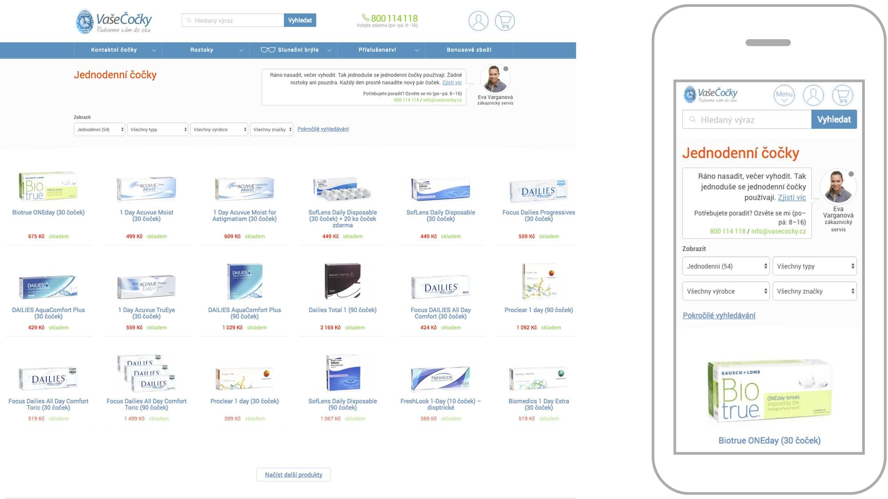

# Filozofie „Mobile First“

Mobile First je způsob návrhu uživatelského rozhraní, který z pohledu důležitosti staví mobilní zařízení minimálně na úroveň tradičních počítačů s velkými obrazovkami. 

Kromě reflexe nástupu smartphonů na trh má Mobile First ještě jeden – daleko zajímavější – vedlejší účinek. Učí nás navrhovat jednodušší a myslím že i lepší rozhraní.

Autor myšlenky, Luke Wroblewski, ji definoval asi takto:

> Designéři, navrhujte nejprve pro mobily. Prudce se šíří mezi uživateli. Nutí zaměřit pozornost na to nejdůležitější. A rozšiřují naše možnosti.

## Mobily budou používanější než desktop. Někde už jsou

Jak už jsem mnohokrát zmínil, podíl mobilů na trhu roste. Uživatelé příručních přístrojů budou jednou tvořit většinu návštěvnosti téměř jistě i na vašem webu. Proto „nejdříve mobily“.

<figure>

<figcaption markdown="1">
*94 % uživatelů přistupovalo ke konci roku 2016 na Facebook přes mobilní zařízení. 62 % jich používalo dokonce výlučně mobilní zařízení. Zdroj: Luke Wroblewski. [vrdl.in/6xnd5](https://twitter.com/lukew/status/758433206882361345)*
</figcaption>
</figure>

## Malý displej nutí designéry zaměřit pozornost na to nejdůležitější

Návrh rozhraní v desktopovém světě počítal s tím, že máme k dispozici velkou plochu obrazovky. Z takto vymyšleného rozhraní se pak ale varianta pro mobily odvozuje velmi špatně.

Pro mnohé designéry, včetně mě, je proto lepší si rozhraní navrhnout nejprve pro ty nejmenší displeje. 

<figure>

<figcaption markdown="1">    
*Rychlé ruční skici „Mobile First“ návrhů pro VašeČočky.cz*
</figcaption> 
</figure>

Při skicování mobilního rozhraní jsme omezení plochou. Uživatelské rozhraní pak přirozeně redukujeme na to nejpodstatnější. K přípravě verze pro větší displeje často stačí jen použít běžné techniky responzivního designu: zvětšení nebo mírné přeskládání elementů.

Zjednodušení řešení pak mimo jiné zvyšuje přístupnost webu nebo webové aplikace. Přístup Mobile First pomáhá minimálně ve třech oblastech:

- Zvyšuje srozumitelnost a přehlednost.
- Zavádí snadnější lineární způsob konzumování informací.
- Zvětšuje velikost ovládacích prvků.

Píše to Radek Pavlíček, přední expert na přístupnost, ve svém článku „Proč je Mobile First přístup dobrý i pro přístupnost“. [vrdl.in/mfprist](http://poslepu.cz/proc-je-mobile-first-pristup-dobry-i-pro-pristupnost/)

Je ale tento nový zjednodušující pohled na návrh jediným důsledkem filozofie „Mobile First“?

## Mobily také rozšiřují naše možnosti

Příchod mobilů neznamená pro designéry jen omezení: zmenšení plochy displeje, horší vykreslovací výkon nebo pomalejší internetové připojení. 

Znamená také nové možnosti. Mobily máme stále u sebe, poskytují informace o naší poloze a tak dále. Mnoho vlastností dnešních webů a aplikací by bez mobilů vůbec nemohlo vzniknout. Vezměme třeba daleko lepší možnosti lokalizace uživatelů nebo možnost okamžité reakce na newslettery nebo sociální sítě.

Opravdu ale chceme dávat mobily na první místo?

## Hlavně ne „Desktop First“!

Uvědomme si, že Wroblewski s myšlenkou přišel v roce 2009, jen dva roky po uvedení prvního iPhonu. Zvolání „Mobile First!“ vzniklo jako reakce na v té době převládající postup. Weby se navrhovaly jen pro velké displeje. Postupem zvaným „Desktop First“.

Mobilní rozhraní se pak vymýšlelo až v implementační fázi, nebo dokonce až po implementaci rozhraní pro velké displeje. Nastávaly ohromné vývojářské i designérské potíže. Ve výsledku pak velké kompromisy v uživatelském rozhraní na mobilech. Že je téma stále žhavé, ukazuje fakt, že v mnoha českých webařských týmech jde stále o aktuální způsob práce. To bolí!

## Dnes už nejde o upřednostnění mobilů, ale hledání jednoho řešení vhodného pro všechny

Pojmenování Mobile First vyvolává dojem, že mobilní zařízení je nutné vždy a všude upřednostňovat. Já se ale přikláním k méně vyhraněnému přístupu: všechny typy relevantních zařízení považujme za důležité. 

Pro mě i mnoho dalších je ale efektivnější myslet při návrhu rozhraní nejprve na mobily. Je to těžký začátek, ale šetřím si tak spoustu problémů v další fázích návrhu a implementace.

## „Desktop First“ a „Mobile First“ na příkladech

Příkladů řešení „Desktop First“ najdeme v Česku hodně. Vezměme Alzu, která má v době mého psaní dva oddělené weby pro malé a pro velké displeje. Webařský tým Alzy odvádí skvělou práci – stačí se podívat na jejich pozici na trhu. Nesou si s sebou ale zátěž desktopového webu. Ten už dnes plně nereflektuje rozšíření mobilních zařízení mezi uživateli.

Jen si například spočítejte, kolik různých navigací má desktopová verze Alzy. Už to samo o sobě nevěstí nic dobrého pro „převod“ do mobilní podoby. V mobilní verzi pak některé navigace „zmizí“, jiné zase vypadají výrazně jinak než na desktopu. Rozhraní tedy z pohledu uživatele trpí nekonzistencí. 

<figure>

<figcaption markdown="1">    
*Nynější Alza.cz jako příklad „Desktop First“ přístupu. Mobilní verze je  samostatný web na jiné doméně. Rozhraní na obou typech zařízení trpí nejednotností*
</figcaption> 
</figure>

Provozovatelé velkých a úspěšných webů samozřejmě často nechávají zásadní redesign až na chvíli, kdy je nezbytně nutný. Převod do responzivní verze „Mobile First“ v případě Alzy znamená práci na mnoho měsíců až let.

Na druhé straně spektra stojí Maternia, provozovatel e-shopů jako VašeČočky.cz nebo Lentiamo.co.uk a můj vážený klient. Tam se k zásadním změnám rozhodli už při zvažování výroby speciální mobilní verze.

Postupem Mobile First jsme postupně přepracovali celý web. Všechny komponenty rozhraní webu jsou co možná nejjednotnější z pohledu uživatele všech zařízení, ale i z pohledu návrhu a technologie.

<figure>

<figcaption markdown="1">    
*VašeČočky.cz jako příklad „Mobile First“ přístupu*
</figcaption> 
</figure>

Vedlejší, ale podstatnou výhodou je pak jednotnost na úrovni kódu, která Maternii šetří práci a zrychluje vývoj.

Tolik k Mobile First. Původní znění myšlenky hledejte ve slavném Wroblewského článku „Mobile First“. [vrdl.in/4slev](http://www.lukew.com/ff/entry.asp?933)

V další podkapitole se zaměříme na chování uživatelů.

