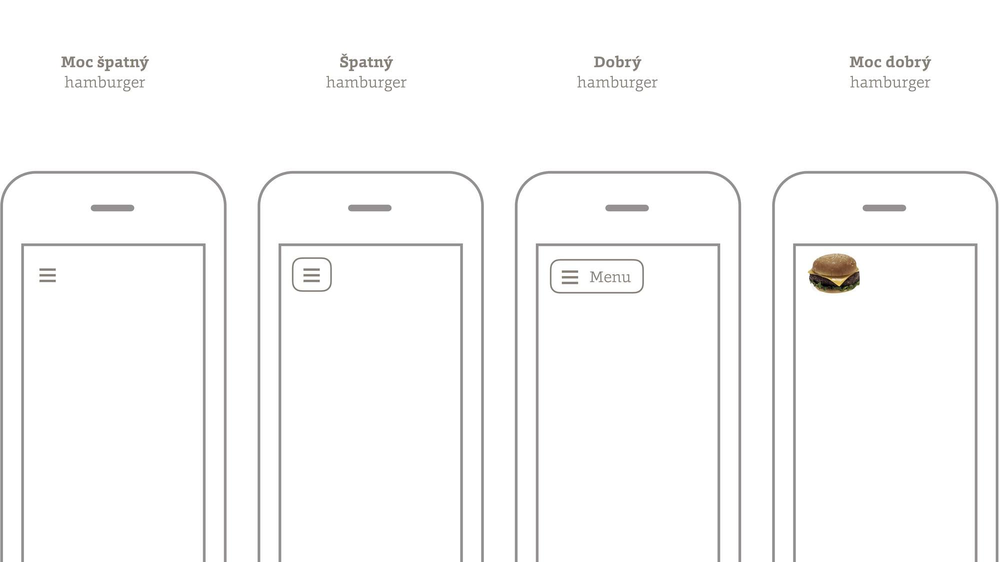
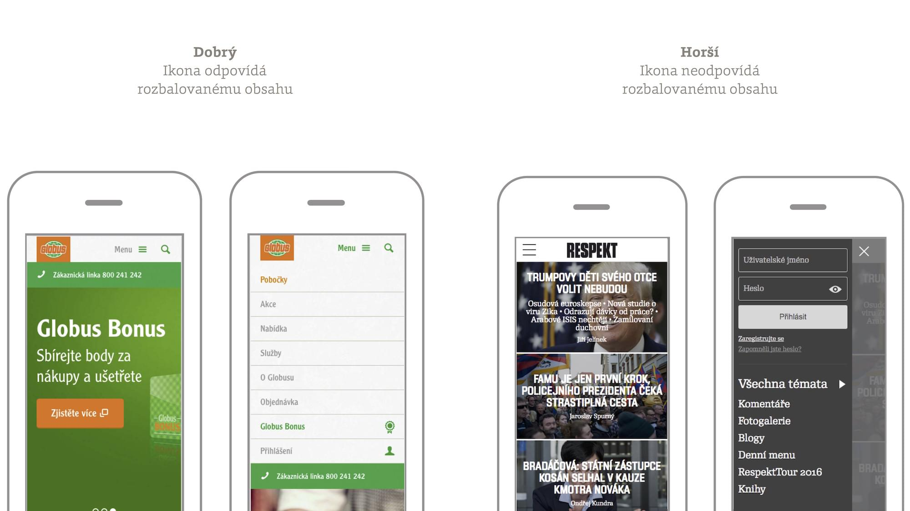

# Mobilní navigace: potřebujeme hamburgery?

Hlavní navigační oblasti webů jsme zvyklí dělat složité. Tak složité a strukturované, že se na malé mobilní obrazovky nevejdou. Proto je tam schováváme a opatřujeme vypínačem. 

<!-- AdSnippet -->

Jenže ono to schovávání není zase tak dobrý nápad. Pojďte, vezmeme to z gruntu a pozastavíme se také u ikony hamburgeru, oblíbeného tématu diskuzí.

Nejdříve mi ale dovolte jednu zásadní otázku.

## Proč jsme vlastně navigace neschovávali už v době čistě desktopových webů?

Protože navigace musí na webech plnit minimálně tři úkoly:

1. *Mapa*  
Uživatel by měl z navigace snadno pochopit strukturu webu a najít díky ní, co hledá.
2. *Ukazatel*  
Uživatel by měl vědět, kde se na mapě aktuálně nachází.
3. *Reklama*   
Zájmem provozovatele webu je, aby uživatel nepřišel o nic zajímavého. A právě na to může také hlavní navigace upozorňovat.

Zeptejme se teď sami sebe: Jak dobře tyto tři úkoly plní schovaná navigace? Že je neplní vůbec? Bingo!

<figure>

<figcaption markdown="1">    
*Dobré a špatné hamburgery*
</figcaption> 
</figure>

Řešení pro ideální svět stručných navigací na velkých displejích je jednoduché – prostě bychom navigaci neschovávali. Jenže mnozí z nás navrhují weby se složitými navigacemi a mnozí uživatelé mají zařízení s velmi malými displeji. 

## Jak uvažovat při návrhu hlavní navigace?

Snažte se ji zjednodušit a zobrazit alespoň její část. Pokud se stane, že na některých zařízeních navigaci uživatelé neuvidí, navrhujte web tak, aby na ni nemuseli spoléhat.

### 1. Navrhněte navigaci tak, aby byla co nejjednodušší 

Ano, už při vymýšlení struktury webu aktivujte režim [Mobile First](mobile-first.md). Na šedesát osm položek ve třech úrovních hlavní navigace raději zapomeňte. Jako designéři můžete uživatelům dát i jiné možnosti, jak procházet složité struktury webů: Jako příklad jmenujme vyhledávání nebo katalogové procházení.

### 2. Navrhněte web, jako by tam navigace nebyla 

Je pravděpodobné, že na těch nejmenších displejích budeme muset skoro vždy část navigace schovat. Proto se musíme naučit vymýšlet weby bez ní. Navigační schéma duplikujte v obsahu nebo třeba dejte do úvodní stránky něco jako mapu webu.

### 3. Pokud to jde, na mobilu ji prostě zobrazte celou

Svět je plný webů s navigací o čtyřech položkách, které používají hamburger jen proto, že to je „in“. Pokud je rozlišení dostatečně široké, navigaci zobrazte. 

Jestliže navigaci nedokážete zobrazit celou, zvažte [jiné návrhové vzory](responzivni-navigace.md) než prosté zapínání a vypínání. Až pokud žádná z těchto možností nezabrala, volte návrhový vzor s vypínačem navigace. Ano, ten, kterému podle vzhledu ikony říkáme „hamburger“. 

## Webdesign ikonu hamburgeru potřebuje

Ikona hamburgeru a schovávání navigace jsou v poslední době pod palbou kritiky. Kromě skrývání důležitého obsahu se jako nevýhoda uvádí nízká srozumitelnost ikony běžným uživatelům.

Ale na některých webech se „hamburgeru“ nedá vyhnout. Proto tvrdím, že ji webdesign jako obor potřebuje.

<!-- AdSnippet -->

O ikonách je známo, že trvá nějakou dobu, než se mezi uživateli zavedou. Lidé se nenarodili ani se znalostí ikon pro *play*, *pause* a *stop* na hudebních přehrávačích. 

> Jedním z hlavních důvodů, proč jsme schopni symboly (*play*, *pause* a *stop*) používat bez textového značení, je skutečnost, že si svou cestu mezi komunikační zkratky naší kultury našly díky neustálému opakování na magnetofonech a videopřehrávačích.

Píše to Andy Budd v článku „In defence of the hamburger menu“. [vrdl.in/28gc0](http://www.andybudd.com/archives/2016/01/in_defence_of_the_hamburger_menu/)

Ikona hamburgeru je nová a pro autory webů je výhodné, abychom ji (stejně jako ikonu pro *play*) uživatele naučili. Dosáhneme toho ale jen konzistentním používáním na webech. Prostě tím, že tři vodorovné čárky budou vždy znamenat totéž: otevření seznamu navigačních položek.

## Otevírá hamburger opravdu obsah, který reprezentuje?

Každá ikona je zjednodušenou abstrakcí obsahu, který následuje po její aktivaci. V případě ikony hamburgeru jde o seznam položek řazených pod sebou. Odpovídá to ale třeba víceúrovňové navigaci nebo celé liště sekundárního obsahu, na který se dostanete kliknutím na hamburger například u jinak výborného webu Respektu?

<figure>

<figcaption markdown="1">    
*Bylo by lepší, kdyby „hamburger“ vždy otevíral totéž, tedy seznam položek. Bohatší obsah, jaký otevírá na webu Respektu, by bylo vhodnější ikonou neopatřovat*
</figcaption> 
</figure>

## Dobře míněné rady pro správný návrh ikony otevírající navigaci

Takže – na některých webech je možné navigaci zobrazit celou i na mobilech. Autoři jiných webů zase použijí chytřejší navigační vzor, jako je prioritizace položek.

Zbývá nám tu množina webů, u kterých je schovávání navigace nebo její části  nevyhnutelné. Takže ano, hamburger je dobrý, protože jej někdy dost nutně potřebujeme. Je dobré ale při návrhu myslet na následující:

1. Ikonu prosím nezneužívejte pro typ obsahu, který nepředstavuje.
2. Ikonu opatřete textovým popiskem „Menu“, aby byla přístupná i uživatelům, kteří hamburger neznají. Respektive vždy popiskem, který přesně popisuje obsah, například „Kategorie“ nebo „Recepty“. 
3. Ikona by měla mít vzhled tlačítka. Z testů vyplývá, že lidé pak snadněji pochopí, že jde o aktivní prvek rozhraní. [exisweb.net/menu-eats-hamburger](http://exisweb.net/menu-eats-hamburger)

