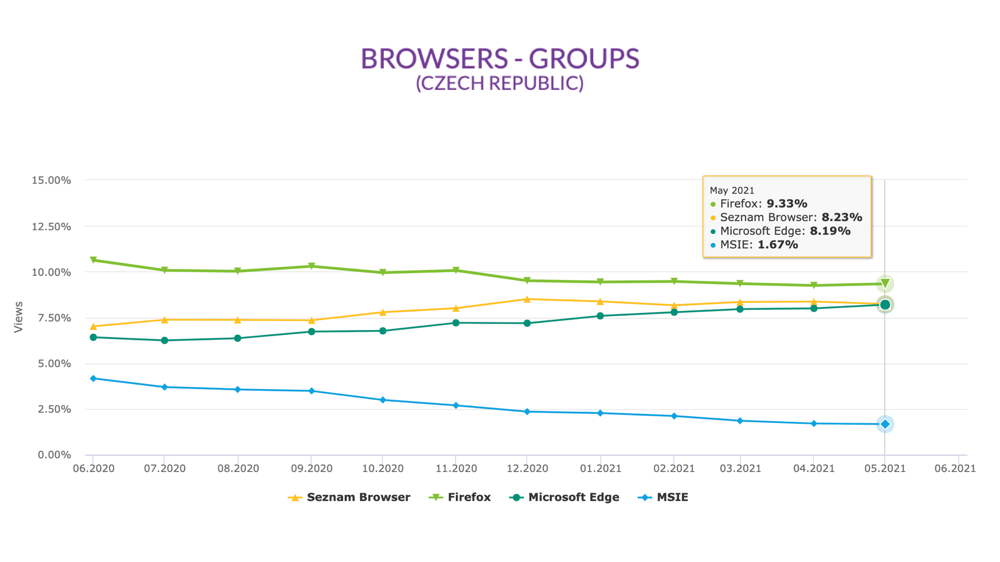
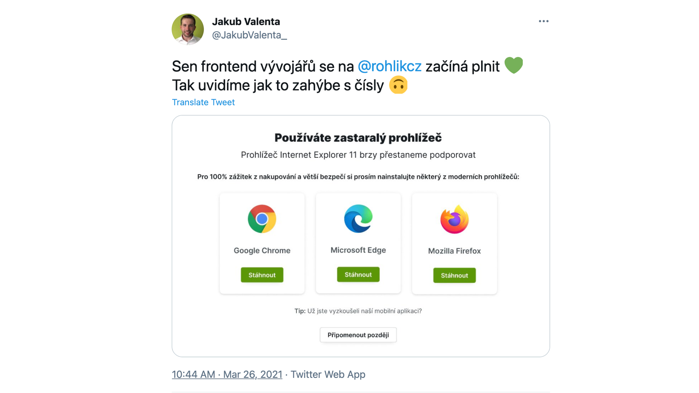

# Internet Explorer (je už mrtvý?)

MSIE dělá vývojářům starosti. Vlastnosti jako flexbox, ale hlavně grid je obtížné používat, pokud je na projektu nutné tento starý prohlížeč od Microsoftu podporovat.

Tento text píšu na konci března 2021. Pokud Internet Explorer stále ještě podporujete, myslím si, že byste od této praxe měli upouštet. Ale velmi to záleží od konkrétních projektů.

## Aktuální podíl MSIE mezi uživateli: v ČR mezi 1-2 % a klesá

Podívejte se na graf. Z toho je myslím jasné, že i v České republice bude možné Internet Explorer brzy přestat podporovat.

<figure>

<figcaption markdown="1">
*Podíl na trhu i méně významných prohlížečů, do 10 % zastoupení. MSIE je ten bleděmodrý, aktuálně ze všechn nejmenší. Zdroj: [rankings.gemius.com](http://ranking.gemius.com/cz/ranking/browsers/).*
</figcaption>
</figure>

V Česku má nyní IE zastoupení kolem 2 %. Tato čísla potvrzuje i další web, StatCounter a moje vlastní měření na webech klientů.

Daleko důležitější je ale trend vývoje. Zatímco začátkem roku 2019 mě zastoupení ještě u zhruba desetiny uživatelů, zkraje roku 2020 už jej používalo jen zhruba 5 %. No a v roce 2021 to je kolem dvou procent.

Každý rok to tedy klesne na polovinu a méně. V době, kdy tento text čtete, už pravděpodobně u vašich projektů nedává smysl tento prohlížeče podporovat.

<!-- AdSnippet -->

Bratrům Slovákům zde ale můžeme jen závidět. V zemi pod Tatrami je už totiž zastoupení MSIE podle čísel Gemiusu už nyní nulové.

## Výjimky povrzují pravidlo. Sledujte statistiky a příjmy

Jak zjistit, jestli můžu Explorer přestat podporovat?

Podíl MSIE v na používání se liší web od webu, takže například na Vzhůru dolů vidím v březnu 2021 pouhých 0,27 % návštěv od uživatelů s tímto prohlížečem. Na webech klientů ale vidím čísla mezi 1 - 2 %,někde i více.

Podíl prohlížečů zjistíte například v Google Analytics (Publikum > Technologie > Prohlížeč).

Je samozřejmě otázka, při jakém podílu na návštěvnosti je možné podporu prohlížeče vzdát. Obvykle se má za to, že podpora prohlížečů pod 1 % se nevyplácí, ale záleží na více faktorech:

- Kolik času a peněz musíte do podpory investovat. Troufám si říct, že toto číslo bude u Exploreru vysoké, protože už na příkladu gridu je vidět, jak moc odlišné řešení je pro Explorer nutné dělat.
- Jak důležití jsou uživatelé prohlížeče pro výdělečnost vašeho projektu.

Ten druhý bod je přitom klíčový. Vyfiltrujte si v Google Analytics tržby uživatelů Exploreru a porovnejte to se svými náklady.

Takto to pojali například vývojáři Rohlík.cz. Podíl IE je nízký, přepočteno na tržby se to pořád vyplatí. Ale je to otrava. Ukazují tedy uživatelům Exploreru hlášku, motivující je ke změně prohlížeče.

<figure>

<figcaption markdown="1">
*Máme vás rádi, ale nechtěli byste změnit prohlížeč? Hodně by nám to pomohlo. Zdroj: [Twitter](https://twitter.com/JakubValenta_/status/1375383150273126401).*
</figcaption>
</figure>

## A co starší verze Exploreru?

Dobrý dotaz. Raději jsem ve všech výše uvedených zdrojích ověřoval i přítomnost uživatelů s Explorerem 10 a staršímu. Musím zde tedy konstatovat, že tyto živočišné druhy už dávno vyhynuly.

Nejpozději do roka je bude následovat i Internet Explorer 11, poslední svého druhu.

<!-- AdSnippet -->

Explorer byl dobrý prohlížeč. Svého času. V době kdy přišla verze 4, udělal Microsoft prohlížečovou revoluci a otočil chod dějin ve svůj prospěch.

Od doby příchodu Firefoxu a pak nástupu Chrome jsme se s Explorerem my webaři už ale jen trápili, takže odchod oslavíme.

Důstojně, s respektem k nebožtíkovi, ale oslavíme.
