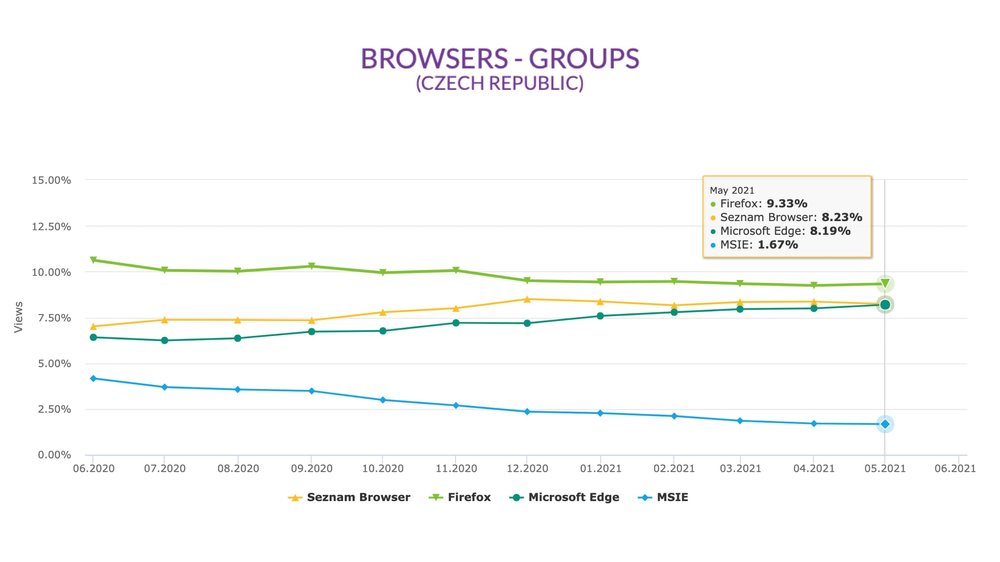
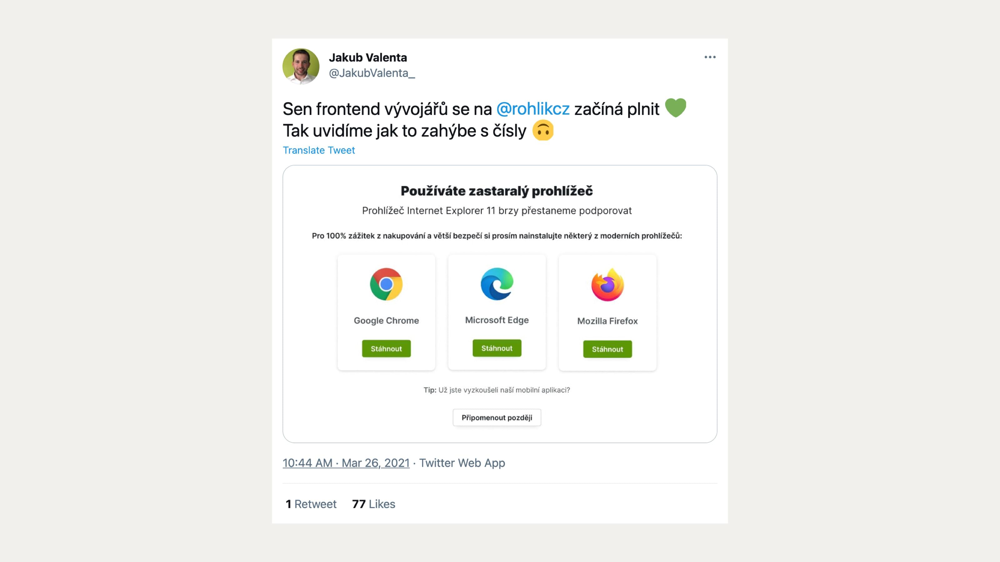
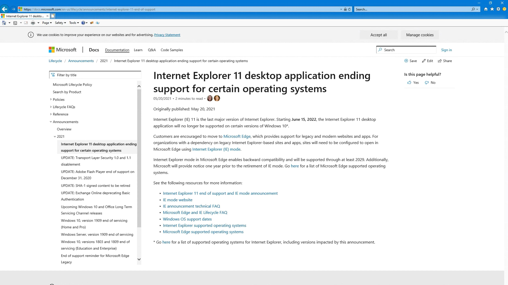

# Internet Explorer (je už mrtvý?)

Microsoft Internet Explorer (MSIE) dělá vývojářům starosti. Používat moderní vlastnosti jako [CSS grid](css-grid.md) je složitější a někdy i nemožné, pokud je na projektu nutné podporovat tento starý prohlížeč od Microsoftu.

Pokud Internet Explorer stále ještě podporujete, myslím si, že byste od této praxe mohli začít upouštět. To je důvod, proč píšu tenhle text.

Velmi to záleží na cílové skupině konkrétního projektu, ale drtivá většina vývojářů si myslím ukončení podpory v roce 2022 může dovolit.

<!-- AdSnippet -->

Toto je mé osobní rozloučení s prohlížečem, který do webdesignu přinesl mnoho dobrého. Ne, není to ironie. Jak brzy uvidíte, Explorer dříve stál na světlé straně Síly a možná vás překvapí, že to byl nejpokrokovější prohlížeč své doby.

## Aktuální podíl MSIE mezi uživateli je v ČR mezi 1–2 %. A dál klesá

Podívejte se na graf. Je z něj myslím jasné, že i v České republice bude možné Internet Explorer brzy přestat podporovat.

<figure>

<figcaption markdown="1">
Nejmenší z nejmenších. Podíl méně významných prohlížečů na trhu v ČR. Vývoj MSIE ukazuje světle modrá linka. Zdroj: [rankings.gemius.com](http://ranking.gemius.com/cz/ranking/browsers/).
</figcaption>
</figure>

V Česku měl MSIE v polovině roku 2021 zastoupení kolem 1,5 % a začátkem roku 2022 už jen kolem 1 %. Tato čísla potvrzuje i jiný statistický web, StatCounter.

Daleko důležitější je ale trend vývoje. Zatímco začátkem roku 2019 používala dědeček prohlížeč ještě zhruba desetina uživatelů, zkraje roku 2020 už jej pro přístup na weby využívalo jen zhruba 5 %. Každý rok tedy jeho popularita klesne na polovinu a méně.

<!-- AdSnippet -->

Ovšem bratrům Slovákům zde můžeme jen závidět. V zemi pod Tatrami je totiž zastoupení MSIE podle čísel Gemiusu už od roku 2021 nulové.

## Výjimky potvrzují pravidlo. Sledujte statistiky a příjmy

Jak zjistit, jestli můžu Explorer přestat podporovat?

Podíl MSIE na používání se liší web od webu, takže například na svém blogu, Vzhůru dolů, nevidím v únoru 2022 prakticky žádné návštěvy od uživatelů s tímto prohlížečem. Na webech klientů ale Google Analytics ukazují čísla vyšší.

Podíl prohlížečů zjistíte například právě v Google Analytics (Publikum > Technologie > Prohlížeč).

Je samozřejmě otázka, při jakém podílu na návštěvnosti je možné podporu prohlížeče vzdát. Obvykle se má za to, že podpora prohlížečů s podílem pod 1 % se nevyplácí, ale záleží na více faktorech:

- Kolik času a peněz musíte do podpory investovat. Troufám si říct, že toto číslo bude u Exploreru vysoké, protože už na příkladu CSS gridu je vidět, jak moc odlišné řešení je pro Explorer nutné dělat.
- Jak důležití jsou uživatelé prohlížeče pro výdělečnost vašeho projektu.

Ten druhý bod je přitom klíčový. Vyfiltrujte si v Google Analytics tržby uživatelů Exploreru a porovnejte je se svými náklady.

Takto to pojali například vývojářky a vývojáři v Rohlík.cz. Podíl MSIE je na Rohlíku nízký, jenže přepočteno na tržby se to pořád vyplatí.

Pro každého frontendistu je ovšem podpora takto zastaralého prohlížeče otrava. V Rohlíku tedy uživatelům Exploreru ukazují hlášku motivující je ke změně prohlížeče.

<figure>

<figcaption markdown="1">
*Máme vás rádi, ale nechtěli byste změnit prohlížeč? Hodně by nám to pomohlo. Zdroj: [Twitter](https://twitter.com/JakubValenta_/status/1375383150273126401).*
</figcaption>
</figure>

Ve schopnost těchto hlášek snížit podíl zastoupení starých prohlížečů zase tak moc nevěřím, ale jako součást širšího strategického balíčku „přemlouvání uživatelů“ smysl mají.

## Exploreru končí podpora od Microsoftu

Oficiální ukončení podpory mají v Microsoftu naplánované na polovinu června 2022.

<figure>

<figcaption markdown="1">
*Oznámení o ukončení podpory MSIE zobrazené v MSIE. Hurá, stránka se nerozpadla!*
</figcaption>
</figure>

Termín je pro uživatele Exploreru od Microsoftu nastavený velkoryse, ale předpokládám, že uživatelé ve spolupráci s webaři ukončí podporu Internet Exploreru daleko dříve.

## Starší verze Exploreru

Váš případný dotaz na rozšíření starších verzí MSIE než poslední, jedenácté, je samozřejmě správný.

Raději jsem ve všech výše uvedených zdrojích ověřoval i přítomnost uživatelů s Explorerem 10 a staršímu. A k naší společné radosti zde můžu konstatovat, že tyto živočišné druhy už dávno vyhynuly.

Nejpozději do roka je bude následovat i Internet Explorer 11, poslední svého druhu.

<!-- AdSnippet -->

## Odpočívej v pokoji. A děkujeme za vše dobré, milý Internet Explorere

Explorer byl dobrý prohlížeč – svého času. V době, kdy přišla verze 4, udělal Microsoft prohlížečovou revoluci a otočil chod dějin webu ve svůj prospěch.

Nicholas C. Zakas připomíná ve svém výborném článku „The innovations of Internet Explorer“ dobré věci, které nám MSIE přinesl:

> Věřte tomu nebo ne, ale Internet Explorer 4–6 je do značné míry zodpovědný za webovou vývojařinu, jak ji známe dnes. Řada proprietárních funkcí se stala de facto standardy a poté oficiálními standardy, přičemž některé z nich skončily ve specifikaci HTML5.

Z jeho textu, zmiňujícího mnoho inovací Exploreru, jsem vybral pár bodů, které stojí za připomenutí:

1. Internet Explorer 4 zlepšil práci s DOMem tím, že umožnil programový přístup ke každému prvku na stránce prostřednictvím `document.all`, což byl předchůdce `document.getElementById()`. Ve stejné verzi se také poprvé objevila vlastnost `innerHTML`.
2. Exploreru také vděčíme za vznik bublání událostí (event bubbling), tedy vlastnosti DOMu, bez které si dnes nedokážeme představit vývoj webů. Kromě toho vytvořili v Microsoftu řadu dalších událostí, které se nakonec staly součástí standardů W3C: `beforeunload`, `mouseenter`, `mouseleave` a další.
3. Ve verzi 3 přidal Microsoft kromě tehdy populárních rámy `<frame>` také novou vlastní značku: `<iframe>` pro vnitřní rámy, dodnes velmi populární, například pro vkládání komponent třetích stran, jako je reklama nebo přehrávače videí z YouTube.
4. Často se zapomíná, že v Microsoftu nepřímo vymysleli Ajax. Zpracování XML na straně klienta bylo součástí implementace XMLHttpRequest, která byla poprvé představena jako součást rozšíření ActiveX v páté verzi Internet Exploreru.
5. Internet Explorer 3 byl také první prohlížeč, který vsadil na CSS. V té době totiž konkurenční společnost Netscape prosazovala alternativní návrh, JavaScript Style Sheets (JSSS). Dodávám, že byť Netscape následně CSS začal implementovat, byl to začátek konce tohoto prohlížeče, protože používání CSS zde bylo velmi chybové. MSIE 4 byl první browser s rozumnou implementací základů CSS a i díky tomu se stal nejpoužívanějším prohlížečem světa.
6. První implementace box modelu v Internet Explorer 5 interpretovala šířku a výšku tak, že prvek má mít celkovou velikost včetně vnitřních okrajů a rámečku. To byl základ pro pozdější standardizovanou vlastnost `box-sizing:border-box`, i když v té době to bylo od Microsoftu opravdu nepěkné a webařům značně zavařil.
7. Mnoho nových vizuálních efektů z CSS3 má základ ve filtrech Internet Exploreru. Příkladem budiž použití vrženého stínu na prvek – filtr `Alpha` v CSS3 známe jako `opacity` a tak dále.

1. Zlepšil práci s DOMem tím, že umožnil programový přístup ke každému prvku na stránce prostřednictvím `document.all`, což byl předchůdce `document.getElementById()`.
2. Ve verzi 3 přidal Microsoft kromě tehdy populárních rámů (`<frame>`) také novou vlastní značku: `<iframe>` pro vnitřní rámy, dodnes velmi populární, například pro vkládání komponent třetích stran jako je reklama nebo přehrávače videí z YouTube.
3. Internet Explorer 3 byl také první prohlížeč, který vsadil na CSS. V té době totiž konkurenční společnost Netscape prosazovala alternativní návrh, JavaScript Style Sheets (JSSS).
4. Často se zapomíná, že v Microsoftu nepřímo vymysleli Ajax. Zpracování XML na straně klienta bylo součástí implementace XMLHttpRequest, která byla poprvé představena jako součást rozšíření ActiveX v páté verzi Internet Exploreru.

Celý text Nicholase C. Zakase najdete na odkaze: [vrdl.in/msieinn](https://humanwhocodes.com/blog/2012/08/22/the-innovations-of-internet-explorer/)

Samozřejmě je nutné ještě přidat rok 2011, kdy Microsoft vymyslí a v Internet Exploreru poprvé implementuje [CSS grid](css-grid.md).

Nezmínil jsem zde rok 2011, kdy Microsoft implementoval CSS grid. Ale to už znáte z předchozí kapitoly.

Od doby příchodu Firefoxu a pak nástupu Chromu nebo Edge od Microsoftu jsme se s Explorerem my webaři už ale jen trápili, takže odchod oslavíme.

Důstojně, s respektem k nebožtíkovi, ale oslavíme.
