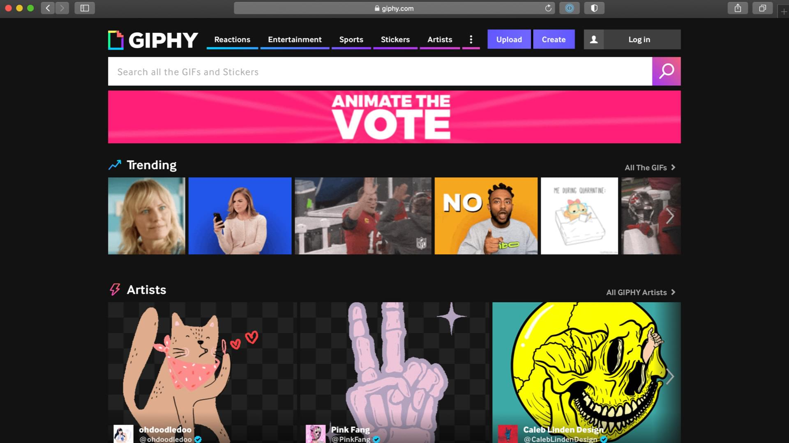
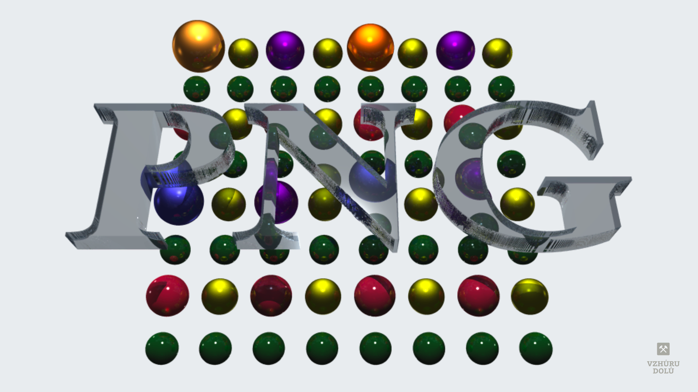
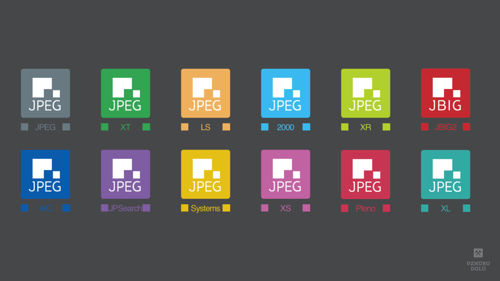
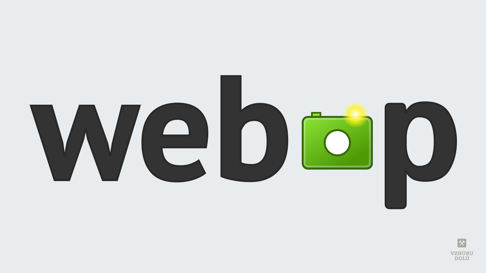
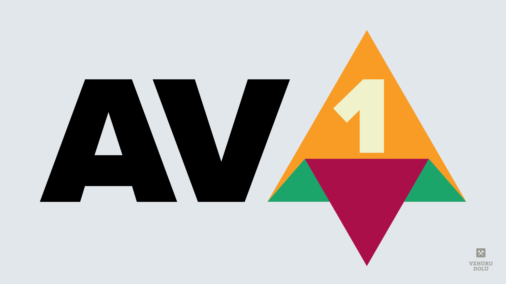

# Formáty obrázků pro web: JPEG, WebP, AVIF, PNG, GIF a SVG

Nedávno jsem si dělal rešerši obrázkových formátů. Jaké je (a bylo) možné používat v dnešních prohlížečích?

<!-- AdSnippet -->

Rozhodl jsem se, že se s vámi o ni musím podělit. Kromě jiného jde o krásný přehled (zatím neúspěšného) boje o nástupnictví JPEGu, přičemž starý král se pořád drží.

To se nedá říct o jiných formátech, jako je GIF nebo PNG. Těmi tedy začneme.

## GIF {#gif}

<figure>

<figcaption markdown="1">
*Obrázek: Pokud se nepletu, formát GIF žádné logo nemá. Jako ilustraci jsem tedy vybral… ani se neptejte.*
</figcaption>
</figure>

- GIF (Graphics Interchange Format) uvedla firma CompuServe už v roce 1987.
- Používá bezeztrátovou kompresi, ale užití dnes limituje maximum 256 barev.
- GIF je na současném internetu synonymem pro krátké animace (koťátek), byť ty už dávno většinou nejsou ukládány přímo v tomto formátu.
- **Podpora v prohlížečích:** Všechny ([CanIUse.com](https://caniuse.com/png)).
- Z našeho seznamu jde už o nejvíc překonaný formát, nahrazený PNG nebo WebP či nejnověji AVIFem.
- Více: [Wikipedie](https://cs.wikipedia.org/wiki/GIF)

## PNG {#png}

<figure>

<figcaption markdown="1">
*Obrázek: Ani s logem formátu PNG jsem úplně nepochodil. Takhle si formát představuje jeden z jeho autorů, [Greg Roelofs](http://www.libpng.org/pub/png/). Taky na vás dýchly devadesátky? Ano, ten formát je opravdu starý.*
</figcaption>
</figure>

- PNG (Portable Network Graphics) byl představen už v roce 1996 po licenčním zpoplatnění GIF.
- Je určený pro obrázky s bezztrátovou kompresí, není jako GIF omezený na 256 barev, zvládá osmibitovou průhlednost (tzv. alfa kanál).
- Kvůli nepřítomnosti ztrátové komprese se nehodí na obrázky typu fotografie. S animacemi je to u PNG horší (verze APNG je v prohlížečích [podporována](https://caniuse.com/apng), ale nevyužívá se v autorských nástrojích).
- Nejefektivnější kodeky na trhu jsou nyní pravděpodobně [pngquant](https://pngquant.org/) a [oxipng](https://github.com/shssoichiro/oxipng).
- **Podpora v prohlížečích:** Všechny ([CanIUse.com](https://caniuse.com/png)).
- Více: [Wikipedie](https://cs.wikipedia.org/wiki/Portable_Network_Graphics).

## JPEG {#jpeg}

<figure>

<figcaption markdown="1">
*Obrázek: Ani logo [JPEG](https://jpeg.org/) příliš známé není, byť je to vlastně král obrázkových formátů.*
</figcaption>
</figure>

- Představeno 1992. Název podle konsorcia Joint Photographic Experts Group.
- Určený pro ukládání fotografií a podobného obsahu. Tomuto obsahu už desetiletí vládne a ještě pravděpodobně dlouho bude díky tomu, jak je zavedený.
- Na webu je výhodou JPEG možnost [progresivního vykreslování](https://www.liquidweb.com/kb/what-is-a-progressive-jpeg/).
- Omezený na 8bitové snímky a postrádá podporu pro alfa kanál. Možná je jen ztrátová komprese.
- Pravděpodobně nejeefektivnější kodek na trhu je nyní [MozJPEG](https://github.com/mozilla/mozjpeg).
- **Podpora v prohlížečích:** Všechny.
- Více: [Wikipedie](https://cs.wikipedia.org/wiki/JPEG).

U nejpopulárnějšího formátu se ale ještě pojďme podívat na nejznámější „podverze“ se, kterými postupně konsorcium JPEG přicházelo.

### JPEG 2000 {#jpeg-2000}

- Rok 2000. Používá se zkratka JP2.
- Je založený na vlnkové transformaci. Přidává funkce jako rozsah podporovaných bitových hloubek, flexibilní počet barevných rovin, bezztrátová komprese, průhlednost atd.
- Ve ztrátové kompresi má údajně lepší výsledky než původní JPEG a v bezstrátové lepší než PNG.
- [Wikipedie](https://cs.wikipedia.org/wiki/JPEG_2000) také pravdivě uvádí, že se od JPEG 2020 „očekávalo, že nahradí originální standard JPEG, což se však nakonec nestalo“. Pravděpodobným důvodem je, že není zpětně kompatibilní s původní verzí formátu.
- **Podpora v prohlížečích:** Jen Safari ([CanIUse.com](https://caniuse.com/jpeg2000)).
- Více: [JPEG.org](https://jpeg.org/jpeg2000/), [Wikipedia](https://en.wikipedia.org/wiki/JPEG_2000), [Grafika.cz](https://www.grafika.cz/rubriky/polygrafie/jpeg2000-revolucni-format-pro-kompresi-obrazku--129130cz).

### JPEG XR {#jpeg-xr}

- Rok 2006. Pokus ve spolupráci s Microsoftem – původně se formát označoval jako _Windows Media Photo_ nebo _HD Photo_.
- **Podpora v prohlížečích:** Jen Explorer a starý Edge ([CanIUse.com](https://caniuse.com/jpegxr)).
- Více: [JPEG.org](https://jpeg.org/jpegxr/), [Wikipedie](https://cs.wikipedia.org/wiki/JPEG_XR).

### JPEG XT {#jpeg-xt}

- Rok 2015. Série rozšíření (XT nejspíš jako _extension_).
- Rozšiřuje JPEG pro více-bitové hloubky a podporuje alfa kanál a bezztrátovou kompresi atd.
- Zůstává zpětně kompatibilní.
- **Podpora v prohlížečích:** Nejspíš žádný.
- Více: [JPEG.org](https://jpeg.org/jpegxt/), [Wikipedia](https://en.wikipedia.org/wiki/JPEG_XT).

## WebP {#webp}

<figure>

<figcaption markdown="1">
*Obrázek: WebP od Google neslouží jen pro vykreslování fotografií, jak by se mohlo z loga zdát.*
</figcaption>
</figure>

- Rok 2010, autorem je [Google](https://developers.google.com/speed/webp).
- Webp je založen na „intra-frame“ kódování z formátu kódování videa VP8. Podporuje bezztrátového kódování a také bezztrátový alfa kanál, ale například nemá všechny možnosti JPEG 2000.
- Je koncipován jako náhrada JPEG i PNG. Ve většině případů s WebP získáte lepší výsledky než s těmito dvěma formáty.
- **Podpora v prohlížečích:** Všechny, jan v Safari až od macOS 11 BigSur ([CanIUse.com](https://caniuse.com/webp)).
- Více: [WebP na Vzhůru dolů](webp.md).

## HEIF {#heif}

- Představen v roce 2015 organizací MPEG (Moving Picture Experts Group). High-Efficiency Image File Format (HEIF) přichází se standardem videa High-Efficiency Video Coding (HEVC).
- HEIF je od roku 2017 používán zařízeními Apple k ukládání zaznamenaných snímků.
- **Podpora v prohlížečích:** Žádný ([CanIUse.com](https://caniuse.com/heif)).
- Více: [Wikipedie](https://cs.wikipedia.org/wiki/High_Efficiency_Image_File_Format).

## AVIF {#avif}

<figure>

<figcaption markdown="1">
*Obrázek: AVIF vlastní logo nemá, proto si musíme vystačit se značkou pro rodičovský formáte videí, [AV1](https://cs.wikipedia.org/wiki/AV1).*
</figcaption>
</figure>

- V roce 2018 vydala Alliance for Open Media jako součást otevřeného formátu kódování videa AV1.
- AVIF má obecně lepší kompresi než WebP, JPEG, PNG a GIF a je navržen tak, aby je nahradil.
- Zvládá ztrátovou i bezztrátovou kompresi, alfa kanál, animace a mnoho dalšího.
- Nevýhodou je nemožnost postupného vykreslování, dlouhá doba převodu obrázku a zatím slabší podpora v prohlížečích.
- **Podpora v prohlížečích:** Chrome, Opera a brzy asi Firefox ([CanIUse.com](https://caniuse.com/avif)).
- Více: [Wikipedie](https://cs.wikipedia.org/wiki/AV1), [Jake Archibald](https://jakearchibald.com/2020/avif-has-landed/).

## SVG {#svg}

- První standard pochází z roku 2001. SVG jako Scalable Vector Graphics.
- Jde o vektorový formát, ne jen pro obrázky, ale celé vektorové dokumenty.
- Chvíli trvalo než se prosadil, ale v současném světě webařiny je zcela nepostradatelný pro ikony, infografiky, animace a mnoho dalšího.
- SVG se samozřejmě z důvodu výkonu nehodí pro foto-realistické detaily, neumí také pracovat s 3D objekty.
- **Podpora v prohlížečích:** Všechny ([CanIUse.com](https://caniuse.com/svg)).
- Více: [SVG na Vzhůru dolů](https://www.vzhurudolu.cz/prirucka/svg), [Téma „SVG“ na Vzhůru dolů](https://www.vzhurudolu.cz/svg), [Wikipedie](https://cs.wikipedia.org/wiki/Scalable_Vector_Graphics).

## Další nové formáty v přípravě {#dalsi}

Během psaní textu mám v hlavě rozmlžené informace ještě o následujících připravovaných formátech:

- [JPEG-XL](https://jpeg.org/jpegxl/) – aktualizace JPEG určené pro ztrátovou i bezestrátovou kompresi, která by prý mohla být lepší než u WebP.
- WebPv2 – chystá se i nová verze WebP, ale zatím chybí více informací.

Uvidíme, jak se to s nimi vyvrbí.

## Stručné rady, co používat {#rady}

Kdysi se říkalo zjednodušeně říkalo: 

- Na fotky používejte JPEG.
- Na bannery, kde je text nebo obrázky s průhledností, používejte PNG.
- Na animace používejte GIF.

Myslím, že od té doby se toho hodně změnilo.

Jednak — GIF se mě dneska už zdá zbytečný. Máme HTML5 video, animace děláme pomocí [CSS](css3-animations.md), JS nebo [SVG](svg-inspirace.md).

<!-- AdSnippet -->

Moderní formáty jako [WebP](webp.md) nebo AVIF umí nahradit JPEG i PNG. Podpora WebP je už velmi slušná.

Pokud by mi to tedy moje pracovní postupy dovolily, upřednostňoval bych WebP a konkrétní obrázky optimalizoval ještě jako AVIF, který má skvělé výsledky. JPEG je zatím většiinou nutné jako alternativní řeší pro starší prohlížeče.

Pro srovnávání vzhledu obrázku v různých formátech existuje skvělý nástroj – [Squoosh](https://squoosh.app/).
