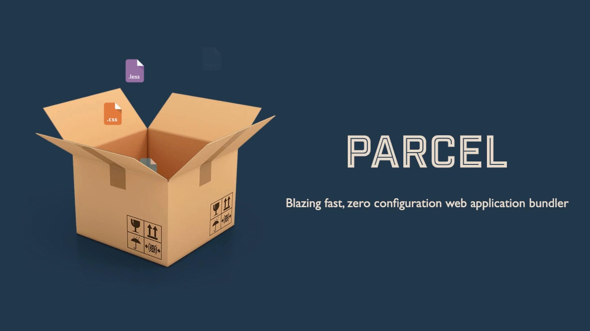

# Parcel.js

*Dnešní článek pro vás připravil Tomáš Smetka z [Pobo Page Builder](https://www.pobo.cz).*

<!-- Autor: Tomáš Smetka (smetka.tomas90@gmail.com) -->

Parcel.js slouží k vytváření balíčků (bundle) používaných na frontendu při vývoji webů a webových aplikací. Jde o nástroj podobné kategorie jako [Webpack](webpack.md), [Gulp](https://gulpjs.com/) nebo kdysi [Grunt](grunt.md).

Velkou výhodou Parcelu je rychlost, nulová konfigurace a široká škála podporovaných souborů.

## Proč Parcel.js a kam s ním? {#proc}

Parcel se hodí pro jakýkoliv typ projektů – jak klasické statické weby postavené na čistém HTML nebo např. na šablonách Pug, ale samozřejmě také pro projekty využívající React.js, Vue.js či Angular.



Díky tomu, že Parcel nevyžaduje složitou konfiguraci (díváme se na tebe, [Webpacku](webpack.md)), je ideální je pro začínající frontendisty, což ale neznamená, že jej neocení pokročilí.

Poslední rok jej bez problémů používám v aplikaci [Pobo Page Builder](https://www.pobo.cz), která využívá mix Vue.js a Latte, a nenarazil jsem větší potíže.

<blockquote class="twitter-tweet"><p lang="cs" dir="ltr">Parcel na drobnosti (nemusíš nic nastavovat) a Webpack, když se v tom chceš vrtat</p>&mdash; Roman Ožana (@OzzyCzech) <a href="https://twitter.com/OzzyCzech/status/1280232892728295424?ref_src=twsrc%5Etfw">July 6, 2020</a></blockquote>
<script async src="https://platform.twitter.com/widgets.js" charset="utf-8"></script>

Parcel.js nativně podporuje zdrojové mapy (source maps) pro snadnější ladění kódu ve vývojářských nástrojích prohlížečů a umožní rychlejší vyhledání problematického kódu při ladění např. [blackboxového zdrojáku](https://developer.chrome.com/devtools/docs/blackboxing).

<!-- AdSnippet -->

Součástí Parcel.js je podobně jako u Webpacku automatická obnova stránky v prohlížeči při úpravách (hot reloading, obdoba [Browsersync](browsersync.md)), který nám umožní opravdu rychlý vývoj.

Velkou výhodou je také automatický content hashing, který řeší problémy s invalidací cache. Parcel.js po buildu dynamicky mění názvy souborů, proto se vyvarujeme problémům, kdy návštěvník stránky vidí např. týden staré ikony. Konkrétně – Parcel.js při buildu místo názvu ikony `car.svg` použije formát `abcd123.svg`, přičemž číselný hash se mění při každém sestavení.

## Pojďme to zkusit – instalace {#instalace}

Pro ukázku budeme stylovat standardní HTML, pro stylování použijeme Sass a trochu JavaScriptu. [Nainstalujeme](https://github.com/parcel-bundler/parcel) si nejprve s pomocí [NPM](npm.md) Parcel.js:

```bash
npm install parcel@next
```

Než se podíváme na konfiguraci, do `.gitignore` si přidáme adresář `.parcel-cache`, který Parcel.js používá jako interní mezipaměť.

Nyní si vytvoříme v rootu projektu soubor `index.html` a vložíme do něj základní HTML:

```html
<!DOCTYPE html>
<html lang="en">
  <head>
    <meta charset="UTF-8">
    <title>Parcel.js demo</title>
    <link rel="stylesheet" href="dist/sass/app.css">
    <script src="dist/javascript/app.js"></script>
  </head>
  <body>
  </body>
</html>
```

V adresáři `assets/javascript` si vytvoříme testovací soubor `app.js`. Parcel.js používá ve [výchozím nastavení](https://parceljs.org/javascript.html#default-babel-transforms) `@babel/preset-env`, což je balíček doplňků, které umožňují kompilovat novější JS (ES6+) pro prohlížeč uvedený v konfiguraci, lze tedy v základu psát v ES6, CommonJS atd.

<!-- AdSnippet -->

Dále si v adresáři `assets/sass` vytvoříme soubor `app.scss`, který se bude starat o stylování dokumentu.

## Konfigurace package.json {#konfigurace}

Do `[package.json](package-json.md)` vložíme:

```js
 "scripts": {
    "dev": "parcel watch ./assets/sass/*.scss ./assets/javascript/*.js",
    "serve": "parcel serve index.html",
    "build": "parcel build ./assets/sass/*.scss ./assets/javascript/*.js --no-source-maps"
  },
```

Na první pohled je asi zřejmé, co v těchto příkazech bude Parcel.js dělat.

- [parcel watch](https://github.com/parcel-bundler/parcel#parcel-watch) sleduje změny v `*.sass` a `*.js` souborech umístěných v adresářích. Při změně dojde ke kompilaci a hot reloading propíše změny do souboru bez nového načtení stránky.
- [parcel serve](https://github.com/parcel-bundler/parcel#parcel-serve) nastartuje lokální server pro vývoj.
- [parcel build](https://github.com/parcel-bundler/parcel#parcel-build) zkompiluje kód do produkčního sestavení.

<div class="related web-only" markdown="1">
- [Automatizační devstacky](devstacky.md)
- [NPM, Node: rozcestník](rozcestnik-npm-node.md)
- [Node.js instalace](node-instalace.md)
</div>

Parcel.js ve výchozím nastavení zapisuje soubory do adresáře `dist`,  nicméně jej můžeme změnit připsáním direktivy `--out-dir`. Celý zápis poté bude vypadat např. následovně:

```js
 "scripts": {
    "dev": "parcel watch ./assets/sass/*.scss ./assets/javascript/*.js --out-dir public/www"
  },
```

Parcel poté soubory zapíše do adresáře `public/www`. Pro naše účely nám tato základní konfigurace postačí.

## Pojďme to nastartovat {#start}

Nyní si spustíme příklad příkazem `npm run serve`, v terminálu se zobrazí informace o nastartovaném serveru pro vývoj a čas buildu:

```bash
ℹ️ Server running at http://localhost:1234
✨ Built in 2.64s
```

V prohlížeči otevřeme URL `http://localhost:1234` a můžeme začít pracovat. Pokud uložíme změny v Sass, JavaScriptu či samotném `index.html`, hot reloading téměř ihned promítne změny.

## Proměnné s hesly nebo konfiguracemi {#promenne}

S velkou pravděpodobností budeme v kódu chtít [pracovat s proměnnými](https://parceljs.org/env.html) (API klíče, hesla, konfigurace, …). Parcel.js používá rozšířenou knihovnu [dotenv](https://github.com/motdotla/dotenv). Nastíníme si použití. V kořenovém adresáři si vytvoříme soubory:

- `.env` a přidáme do něj `EXAMPLE=foo`
- `.env.local` a tam přidám `EXAMPLE=bar`

V JavaScriptu si poté můžeme zavolat `process.env.EXAMPLE` a s hodnotou dále pracovat.

A to je všechno. Základní práce s Parcelem je snadná a to potěší všechny, kteří například zápasili s Webpackem. Nenechte se ale mýlit – Parcel.js je mocný nástroj. Ukázali jsme vám základy, ale doporučujeme pokračovat v [oficiální dokumentaci](https://github.com/parcel-bundler/parcel#cli-args--flags).

<!-- AdSnippet -->
