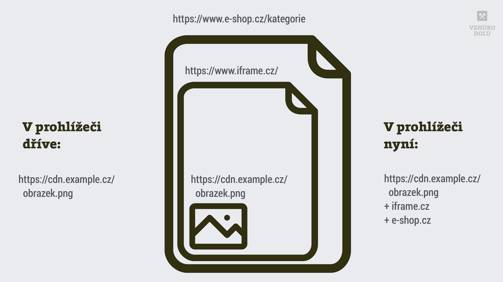

# Dělená cache v prohlížečích: konec sdílení zdrojů jako CSS, JS a webfonty

Chrome přichází od verze 86 s takzvanou dělenou mezipamětí ([partitioned cache](https://www.stefanjudis.com/notes/say-goodbye-to-resource-caching-across-sites-and-domains/)), která znemožňuje sdílení zdrojů z CDN mezi weby běžícími na různých doménách.

Aktuálně řada webů spoléhá na sdílení CSS, JS a webfontů ze společných adres, umístěných na velkých CDN. Vezměme pár typických příkladů:

```text
https://cdn.jquery.com/jquery.latest.js
https://www.google-analytics.com/analytics.js
https://fonts.gstatic.com/s/anton/v12/1Ptgg87LROyAm3Kz-C8CSKlv.woff2
https://cdn.example.cz/obrazek.png
```

Pokud uživatel měl některý z těchto zdrojů v mezipaměti prohlížeče, na webu, který tento zdroj používal také, už jej prohlížeč nemusel stahovat.

<!-- AdSnippet -->

Nyní jsou ale soubory do prohlížečové cache ukládány jako kombinace URL zdroje a názvu domény:

```text
https://cdn.jquery.com/jquery.latest.js-alza.cz
https://cdn.example.cz/obrazek.png-alza.cz

https://cdn.jquery.com/jquery.latest.js-mall.cz
https://cdn.example.cz/obrazek.png-mall.cz
```

Se sdílením souborů napříč doménami tím pádem máme utrum.

Pokud na to spoléháte ve svých strategiích pro optimalizaci rychlosti webu, může to mít nemalý vliv na rychlost webu u uživatelů (RUM měření).

## Proč nám to dělají? {#proc}

Pokrok nezastavíš. Aktuálně je mezi uživateli velká poptávka po bezpečnosti a soukromí. Safari, které je v této oblasti napřed, dělenou cache bez většího ohlasu naimplementovalo [už v roce 2013](https://bugs.webkit.org/show_bug.cgi?id=110269).

<!-- AdSnippet -->

Důvody, proč o izolaci dříve sdílených souborů uživatelé a tedy i tvůrci [prohlížečů](prohlizece.md) stojí mohou být zřejmé, ale raději uvedu příklady:

- _Bylo možné zjistit návštěvu konkrétního webu._  
Padouch mohl z historie procházení uživatele zjistit, zda navštívil konkrétní web nebo sadu webů.
- _Sledování uživatele napříč weby._  
Mezipaměť bylo možné použít k ukládání identifikátorů, které pak sloužily ke sledování uživatele napříč weby.

Zájemce o více informací pošlu do textu [Explainer - Partition the HTTP Cache](https://github.com/shivanigithub/http-cache-partitioning) a my ostatní se pojďme podívat, jak to funguje.

## Jak to přesně funguje a jaká je podpora? {#fungovani}

Ve skutečnosti to není tak jednoduché jak ukazuji na začátku článku. Do klíče, který identifikuje zdroj v mezipaměti prohlížeče se neukládá jen adresa zdroje a doména aktuálního webu, ale také doména rámce (`<iframe>`).

<figure>

<figcaption markdown="1">
*Obrázek: Schéma partitioned cache v prohlížečích.*
</figcaption>
</figure>

Vezměme zjednodušený příklad se sdíleným obrázkem:

```text
https://cdn.example.cz/obrazek.png
```

Teď si představme, že se obrázek vkládá do stránky `https://www.iframe.cz/` a ta se jako `<iframe>` vkládá do `https://www.e-shop.cz/kategorie`.

Autoři Chrome mluví o novém klíči „Network Isolation Key“, který obsahuje tuto sadu:

- Doménu druhého řádu pro stránku (přesněji [eTLD+1](https://web.dev/same-site-same-origin/) — `e-shop.cz`.
- Totéž pro aktuální iframe — `iframe.cz`.
- Adresu zdroje — `https://cdn.example.cz/obrazek.png`.

Podle textu [Gaining security and privacy by partitioning the cache](https://developers.google.com/web/updates/2020/10/http-cache-partitioning) od Googlu je podpora v prohlížečích následující:

<div class="rwd-scrollable f-6"  markdown="1">

| Prohlížeč | Podpora | Klíč domény | Klíč iframe |
|-----------|:-------:|:-----------:|:------------|
| Chrome    | ano     |     +       |     +       |
| Safari    | ano     |     +       |             |
| Firefox   | [v plánu](https://bugzilla.mozilla.org/show_bug.cgi?id=1536058) |             |             |

</div>

Takže: Moderní prohlížeče buď dělenou cache už podporují nebo to mají v plánu. Klíč se tvoří buď unikátně podle domény nebo podle domény a rámce (v případě použití `<iframe>`).

No a v zásadě tímto padá jeden z argumentů pro použití externích CDN za účelem sdílení souborů s jinými weby.

Jenže on tenhle argument padl už poměrně dávno.

## Dělená cache jako zabiják knihoven sdílených mezi weby. A proč to nevadí? {#zabijak-sdileni}

Dříve jste se mohli poměrně spolehnout, že uživatelé mají v mezipaměti prohlížeče soubory populárních knihoven už z jiných webů.

Jen to připomenu. Pokud jste například tahali jQuery z této adresy…

```text
https://ajax.googleapis.com/ajax/libs/jquery/3.5.1/jquery.min.js
```

…je možné, že dříve ji uživatel stáhl už na nějakém jiném webu. Tohle je věc, kterou partitioned cache zabila.

Je ale otázka, jestli lze zabít mrtvolu.

Osobně jsem z představy takto dělaných optimalizací začal střízlivět před mnoha lety. Poté, co jsem si přečetl [statistiky Stevea Souderse](https://www.stevesouders.com/blog/2013/03/18/http-archive-jquery/) z roku 2013. Ty ukazují, že roztříštěnost (například) verzí jQuery na webech je obrovská. 

Rovněž mylná je představa, že vývojáři používají poslední verze, u kterých by byla vyšší pravděpodobnost výskytu na jiných webech.

<figure class="f-6" markdown="1">
| Verze jQuery   | Podíl na webech  |
|----------------|-----------------:|
| 1.4.2 (http)   | 1,7 % |
| 1.7.2 (http)   | 1,6 % |
| 1.7.1 (http)   | 1,6 % |
| 1.3.2 (http)   | 1,2 % |
| 1.7.2 (https)  | 1,1 % |
<figcaption markdown="1">
*Tabulka: Podíl jQuery na webech v roce 2013. V té době ještě navíc záleželo na tom, zda je používaná verze běžící na HTTP nebo [HTTPS](https.md).*
</figcaption>
</figure>

To bylo v roce 2013, jež před druhou a třetí verzí jQuery. Nyní máme na světě zhruba [80 verzí jQuery](https://code.jquery.com/jquery/), přičemž v produkčním používání jich na světě, ale i v ČR a SR bude – no osmdesát, že ano.

Soudě i podle mé osobní zkušenosti, vývojáři zrovna tuhle knihovnu  aktualizují překvapivě hodně málo.

Šance, že uživatelé budou mít zrovna vaši verzi vaší oblíbené knihovny v mezipaměti prohlížeče, prostě byla i před rokem 2020 nevelká. A to ještě nepřišla poslední rána v podobě dělené cache.

<!-- AdSnippet -->

Takže pokud stahujete soubory např. ono jQuery od Google, moduly z `unpkg.com` nebo `cdnjs.com`, fonty od Google fonts, nikdo vám to rozhodně nezakazuje, protože CDN může být i tak přínosné, ale minimálně z důvodů sdílené cache už to smysl nedává.

## Co to pro webaře znamená? {#co-to-znamena}

Dopady jsou asi zřejmé, ale zkusím je ještě shrnout:

- Na webech ztrácí smysl používat veřejné CDN, pokud je jediným důvodem sdílení knihoven s jinými weby. Nepadají tím však další důvody pro CDN, jako je rychlost [TTFB](ttfb.md). Nedávno jsme o tom [diskutovali na Twitteru](https://twitter.com/machal/status/1320633765719384064).
- Webům, které používaly ty nejpopulárnější verze knihoven z větších CDN, může z důvodu nutnosti stahování poklesnout výkon webu měřený u uživatelů. Ale o nic zásadního většinou nepůjde.
- U těch na druhé straně – u provozovatelů CDN, kteří obsluhují velké objemy mezipaměti zdrojů pro mnoho webů, dojde tímto ke zvýšení provozu.

Nelíbí se vám to? Dobře, budu končit optimisticky i pro vás.

Do budoucna se teoreticky ke sdílení zdrojů napříč weby můžeme obloukem vrátit například přes návrh specifikace [Web Shared Libraries](https://www.youtube.com/watch?v=cBY3ZcHifXw).
