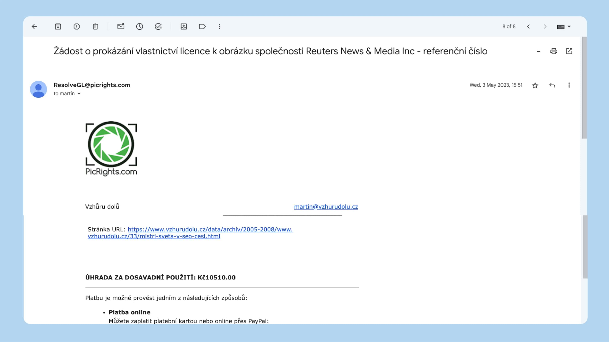
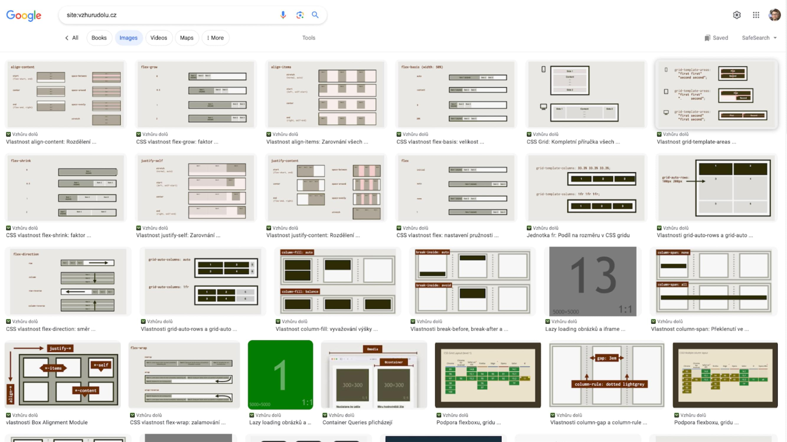

# Obrázky a paragrafy: moje zkušenost s PicRights

Nedávno jsem řešil údajné porušení autorských práv u jednoho obrázku, který jsem používal na Vzhůru dolů.

Přišlo mi to ve varování jako automatický e-mail. Ten jsem považoval za další podvod, scam, takže nazdar bazar.

Scam to nebyl. No nazdar!

Slyšte tedy můj příběh, který mě stál sedm tisícovek. Nebuďte jako já a neignorujte automatizované e-maily od PicRights.

## Můj příběh s „půjčeným“ obrázkem {#pribeh}

V květnu 2023 mi přišel e-mail s předmětem „Žádost o prokázání vlastnictví licence k obrázku společnosti Reuters News & Media Inc“ z adresy `ResolveGL@picrights.com`.

V obsahu se mimojiné píše:

> společnost PicRights Europe GmbH zjistila, že na Vaší webové stránce, sociální média nebo média dostupná z vaší internetové stránky, byl(y) použit(y) obrázek/obrázky společnosti Reuters News & Media Inc. Našemu klientovi společnosti Reuters News & Media Inc se nepodařilo najít žádnou platnou licenci pro používání tohoto obrázku / těchto obrázků Vaší společností. V důsledku toho požadujeme jménem společnosti Reuters News & Media Inc přiměřené odškodnění za toto nepovolené používání.

A dole je uvedený tenhle důkaz:

<figure>

<figcaption markdown="1">
*Pozdrav od robota, který má rád peníze.*
</figcaption>
</figure>

Společnost PicRights po mě chtěla zaplatit 10 tisíc korun za využití obrázku pro koláž [v článku](https://www.vzhurudolu.cz/data/archiv/2005-2008/www.vzhurudolu.cz/33/mistri-sveta-v-seo-cesi.html), který jsem napsal v roce 2006, tedy před sedmnácti lety.

S těmito typy e-mailů se obvykle nemažu. Víceméně je mažu, však [Inbox Zero](email-inbox-zero.md), že…

Udělal jsem rychlé googlení, narazil na články s titulky jako „copyright trolling“ a zařadil si PicRights do mentálního šuplíku po bok internetových podvodníků, kteří se snaží vydělat na lidské neznalosti.

Druhý e-mail přišel v červnu 2023. Třetí dorazil v červenci 2023. Obsahově byly stejné, i částka seděla. Nic jsem nedělal, na nic nereagoval, nic neplatil, obrázek dále visel na webu. S podvodníky se nebavím. Nazdar bazar.

Zkraje ledna 2024 ovšem přišla předžalobní výzva od kanceláře PRK Partners s předmětem „Porušení autorských práv“. Mám prý udělat tři věci zároveň:

* Odstranit fotku.
* Kontaktovat PicRights a vyřešit ten případ.
* Zaplatit asi 14 tis. Kč. (Přičetly se náklady na advokáty.)

Tohle už zase tak snadno ignorovat nešlo, Inbox Zero nepomáhal. Takže jsem to začal řešit s advokátkou [Petrou Dolejšovou](https://www.petradolejsova.cz/).

<!-- AdSnippet -->

Tušil jsem, že jsem to trošku podělal, takže Petra mě v zásadě nepřekvapila. Prý to není podvod, mám se s nimi zkusit spojit a domluvit se alespoň na snížení té částky. To mi doporučila udělat po vlastní ose, aby netekly zbytečné peníze ještě na právní zastoupení, které by ve výsledku mohlo být vyšší než samotná částka

Vzal jsem telefon a po chvíli se mi povedlo mluvit s člověkem z PRK Partners, který o tom něco věděl. Vysvětlil jsem mu situaci (archiv osobního blogu, velmi starý článek a bez šance na tom něco vydělat) a po chvíli vyjednávání jsme se dohodli, že zaplatím polovinu a oni ten případ uzavřou.

## Ponaučení: obrázky nepůjčovat, nepůjčovat, nepůjčovat (a když už tak nepublikovat) {#ponauceni}

V mém případě to bylo jasné – fotku jsem opravdu kdysi stáhl ze sport.cz. Obvykle to nemám ve zvyku, ale kdysi jsem občas dělal výjimky. Ono v té době, kdo to měl jinak…

Docela dobře si pamatuju, že v takových případech jsem doufal, že pokud tam uvedu zdroj, původní fotku upravím (přidával jsem do fotky bublinu, mělo jít o vtip, tedy šlo vlastně o odvozené dílo) a fotku vystavím na nevýdělečný web, jsem v suchu.

<!-- AdSnippet -->

Nejsem v suchu. Tyhle společnosti využívají roboty, kteří skenují web a získané informace párují s databázi fotek od agentur jako [AP](https://www.ap.org/contact-us/copyright-compliance) nebo Reuters. mimochodem v Česku nejspíš [spolupracují i s ČTK](https://www.ctk.cz/o_ctk/rada_ctk/zapisy/?id=3397).

Mimochodem, v mém případě byla trošku smůla, že jsem použil fotku od Reuters, což je agentura v tomto směru údajně docela drahá a důsledná.

Na rozdíl od některých jiných nejsou výzvy PicRights jen plané. O ceně a spravedlnosti si můžeme myslet cokoliv, ale ženě, algoritmům a právníkům se neodmlouvá.

## Co si z toho vzít? {#vzit}

Autorské právo ctím, ale jak jsem psal, velmi vzácně se historicky stalo, že jsem pro potřeby ilustrace použil „fotku z internetu“.

Nejsem expert na právo, ale mám pár webů a tomuto se chci v budoucnu vyhnout, takže vám alespoň řeknu, co jsem po této minikauze udělal:

### 1) Fotky stáhnout a neřešit {#vzit-1}

Pokud na obrázky nemáte práva nebo si tím nejste jistí, prostě je hned po prvním upozornění smažte. A je to. Podle mě s PicRights dále nijak komunikovat nemusíte a podle ohlasů na internetech se domnívám, že vám pak dají pokoj.

### 2) Udělejte si audit fotek na webu {#vzit-2}

Je možné, že vám zatím žádné upozornění nepřišlo, ale to neznamená, že vás nemají v merku. Pokud si nejste jistí původem svých fotek, raději si udělejte alespoň základní audit. Já prošel fotky v CMS a pak [obrázky z Google Images](https://www.google.com/search?q=site%3Avzhurudolu.cz&sca_esv=251b1afa33144db8&tbm=isch&source=hp&biw=1280&bih=1488&ei=pKS4ZafPBMCNi-gP6u-z-Ac&iflsig=ANes7DEAAAAAZbiytM94mAEb4Zu4fYhXoc-2g9dnO0NJ&ved=0ahUKEwinseLxyoSEAxXAxgIHHer3DH8Q4dUDCAc&uact=5&oq=site%3Avzhurudolu.cz&gs_lp=EgNpbWciEnNpdGU6dnpodXJ1ZG9sdS5jekjaF1AAWLoVcAB4AJABAJgBQaABxAeqAQIxOLgBA8gBAPgBAYoCC2d3cy13aXotaW1nwgIFEAAYgAQ&sclient=img).

<figure>

<figcaption markdown="1">
*Ještě, že si ilustrace většinou dělám sám. Ale výjimky se najdou a mohou být drahé.*
</figcaption>
</figure>

Beru to tak, že Google je velmi schopný robot, takže obrázky, které nezná on, snad nebudou znát ani roboti vydřiduchů jako jsou PicRights.

### 3) Zakažte robotům přístup do archivů {#vzit-3}

Na tom mém „ukradeném obrázku“ mě nejvíc štve, že jej roboti nalezli v archívu webu, který mám hlavně pro své soukromé účely. Některé moje starší články jsou bezesporu hodné čtení, ale obávám se, že ty z roku 2006 už fakt nikdo nečte.

Nejjednodušší je prostě zakázat robotům přístup pomocí předpisu v [robots.txt](https://www.jakpsatweb.cz/robots-txt.html):

```robotstxt
User-agent: *
Disallow: /data/
```

Pamatujte ale na to, že pro roboty jde jen o doporučení, nemusí to reálně prostě fungovat. Na `robots.txt` se asi u soudu odvolávat moci nebudete.

## Ohlasy a „co třeba nezaplatit?” {#nezaplatit}

Tento článek píšu i proto, že na českém internetu o problému PicRights nebylo možné cokoliv relevantního vygooglit.

Považoval jsem to tedy za okrajové téma, takže mě překvapilo, kolik lidí se mi po zveřejnění ozvalo, zejména na [Twitteru](https://twitter.com/machal/status/1752243358129402095) a [Facebooku](https://www.facebook.com/machal/posts/pfbid0vLTiDjcQsifXPdaEatPibz7TiwMM15CmA4AR8nMhgkNwSqBSdyyYkGoGS7d3wQN8l). Zejména diskuze na druhém jmenovaném je zajímavá.

Nevím, jestli vám to k něčemu bude, ale většina se zachovala jako já – fotky odstranila a zaplatila. Byli zde i tací, kteří PicRights považují za scam a nezaplatili jim ani korunu, např. s odkazem na [vložení obrázku přispěvovatelem](https://www.facebook.com/machal/posts/pfbid02yo5vVLkkTFzHtp55cgwcsoThKATmYTUiBJpt6LdqG9eTdSgbv8uK1fcW57RbZRcLl?comment_id=1419159425378245).

Ale já nejsem žádný právník, zeptejte se těch svých.

## Bonus: právo kolem obrázků z fotobank (taky docela peklíčko) {#bonus}

Když už jsem s Petrou řešil tuhle kauzičku, poslala mi jeden svůj pěkný [článek o právu kolem obrázků z fotobank](https://www.petradolejsova.cz/blog/na-co-pozor-u-materialu-z-fotobank) na internetu. Tedy pěkný… mně se to vůbec nelíbí, co si budeme povídat.

Dávám to sem proto, že i v téhle oblasti působí vydřidušské algoritmy napojené na právníky. Pokud používáte obrázky z fotobank, raději se ujistěte:

* Dvakrát měřte, takže čtěte licenční podmínky, jestli se opravdu vztahují na váš způsob použití.
* Ujistěte se, že na fotkách nejsou známé motivy (např. známá fotka Che Guevary), platí tam totiž licence i k původní fotce.
* Dejte si bacha na využití obrázků, kde jsou lidé nebo loga. Dotčené osoby nebo firmy se mohou bránit.

Tož tak. Obávám se, že PicRights a spol. vydělávají nemalé prašule, takže těchto případů bude jen přibývat. Nepodceňujte to.

<!-- AdSnippet -->
