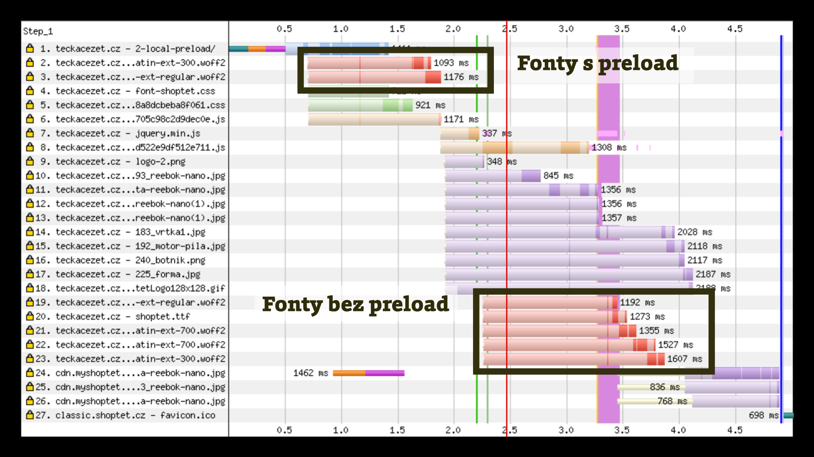
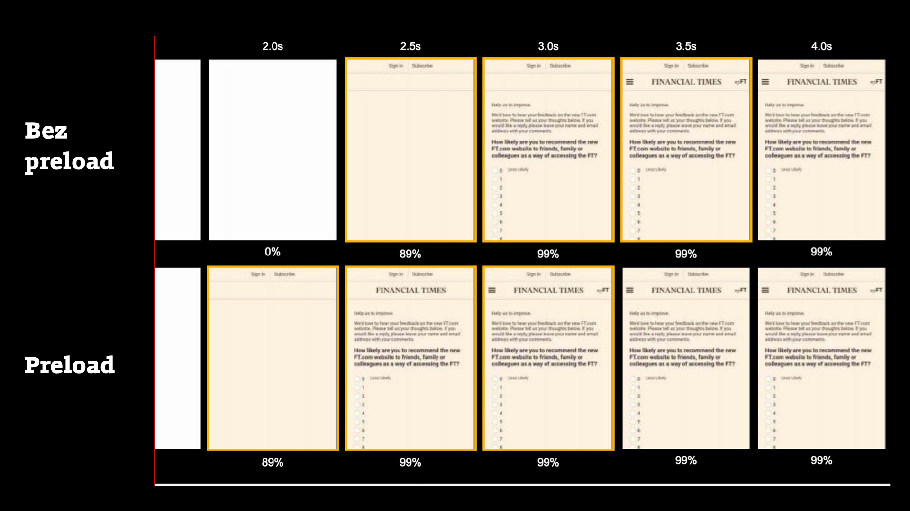

# Preload: Přednačtení prvků stránky

Preload je deklarace, které vyvolává dřívější stažení prvku stránky a v případě JavaScriptu odděluje stažení od spuštění.

Vezměme jednoduchý příklad s webfonty. Pravděpodobně jich v CSS máme nalinkováno více. Dva konkrétní soubory včak chceme stáhnout s vyšší prioritou. Uděláme to takhle:

```html
<link rel="preload" href="font-1.woff2" as="font" type="font/woff2" crossorigin>
<link rel="preload" href="font-1.woff2" as="font" type="font/woff2" crossorigin>
```

Prohlížeč těmto dvěma souborům zvýší prioritu stažení. Ve vodopádu průběhu stahování prvků ze stránky to bude vypadat jako na následujícím obrázku.

<figure>

<figcaption markdown="1">
*Obrázek: Preload předbíhá ve frontě. Vytrhne soubory webfontů z jejich přirozeného pořadí a ty přednačtené stáhne dříve.*
</figcaption>
</figure>

Díky tomuto triku pak dojde k rychlejšímu zobrazení písem ve správném fontu na důležitých místech stránky:

<figure>

<figcaption markdown="1">
*Obrázek: Před nasazením preload to tak rychlé nebylo. Optimalizace webfontů u Financial Times. Zdroj: [Addy Osmani](https://medium.com/reloading/preload-prefetch-and-priorities-in-chrome-776165961bbf).*
</figcaption>
</figure>

Preload je užitečná pokročilá technika, kterou podporují všechny prohlížeče kromě Firefoxu a Internet Exploreru. Dejme ale důraz na slovo *pokročilá*.  

## Opatrně s tím

Ve zkušených rukou je preload užitečná věc. Raději ale upozorním na to, že jako v mnoha jiných případech je to dobrý sluha, ale zlý pán.

Dokud si nejste zcela jistí, co děláte, s preloadem si raději nehrajte. Ono totiž porušení přirozeného vodopádu stahování frontendových souborů může být ke škodě.

Už na prvním obrázku je například jedna nevýhoda vidět – díky tomu, že se soubory přednačtených fontů stahují souběžně s CSS, oddálí zpracování stylů a tím také [první vykreslení stránky](metrika-fcp.md).

Stále častěji totiž potkávám weby, kde byla aplikována tzv. Babicova přednačítací metoda: „Když už nevíš, co s tím, dej tam preload.“ Opatrně s tím.

V detekci zbytečných preloadů může pomoci sledování konzole prohlížeče. Chrome totiž hlásí nevyužité přednačtení:

> The resource … was preloaded using link preload but not used within a few seconds from the window's load event. Please make sure it wasn't preloaded for nothing.

Tato informativní hláška se zobrazí zhruba [3 vteřiny](https://github.com/GoogleChromeLabs/preload-webpack-plugin/issues/8#issuecomment-277105884) po události [Load](load.md). Je pravděpodobné, že jde o zbytečný `<link rel="preload">`.

## Atribut `as` – určení prioritizace {#atribut-as}

Tento nepovinný atribut vám doporučuji k preload přidávat vždy. Přednačtené prvky stránky používající atribut `as` totiž budou mít stejnou prioritu jako typ zdroje, který je uvedený v hodnotě.

Například `preload as="style"` získá nejvyšší prioritu, zatímco `as="script"` získá nízkou nebo střední prioritu. Tyto prvky pak také podléhají stejným zásadám [Content Security Policy (CSP)](https://developer.mozilla.org/en-US/docs/Web/HTTP/CSP) a do prohlížeče dorazí se správnou hlavičkou `Accept`.

Možných hodnot atributu as je celá řada. Vybírám zde ty nejvíce použitelné:

<div class="rwd-scrollable f-6"  markdown="1">

| Hodnota   | Typ souboru                           |
|-----------|---------------------------------------|
| audio     | Audio, typicky v prvku `<audio>`.     |
| document  | HTML dokument, typicky `<frame>` nebo `<iframe>` ([bug v Chrome](https://bugs.chromium.org/p/chromium/issues/detail?id=593267)). |
| embed     | Prvek `<embed>`.                      |
| fetch     | Prvek, který použijeme pomocí fetch nebo XHR, např. JSON soubor. |
| font      | Soubor s fontem, např. WOFF2.         |
| image     | Obrázek.                              |
| object    | Prvek `<object>`.                     |
| script    | Soubor s JavaScriptem.                |
| style     | CSS soubor.                           |
| worker    | Soubor s JavaScriptovým web workerem. |
| video     | Video soubor, typicky v prvku `<video>`. |

</div>

Všechny možné hodnoty atributu `as` jsou [ve specifikaci](https://fetch.spec.whatwg.org/#concept-request-destination).

## Atribut `type` - mime type {#atribut-type}

Nepovinný atribut, který umožní prohlížeči zvážit, zda daný typ prvku podporuje a tedy zda jej chce stahovat nebo ne.

Vezměme příklad:

```html
<link rel="preload" href="video.webm" as="video" type="video/webm">
```

Soubor `video.webm` přednačtou díky atributu `type="video/webm"` pouze prohlížeče, které formát WEBM zvládají, tedy všechny kromě Safari.

## Atribut `crossorigin` – pravidla pro CORS, u webfontů nutné {#atribut-crossorigin}

Pokud máte na webu nastaveno [Cross-Origin Resource Sharing (CORS)](https://developer.mozilla.org/en-US/docs/Web/HTTP/CORS), můžete u `<link rel="preload">` uvést atribut `crossorigin`. Toto platí hlavně pro případy, kdy stahujete prvky z jiné domény než je ta, odkud se stahuje dokument.

V případě přednačtení webfontů ale platí, že byste tento atribut [měli uvádět](https://drafts.csswg.org/css-fonts/#font-fetching-requirements), i když jsou soubory stahované ze stejné domény. Pokud byste `crossorigin` neuvedli, stáhnou se soubory s fonty dvakrát. Takže vždy takto:

```html
<link rel="preload" href="font-1.woff2" as="font" type="font/woff2" crossorigin>
```

## Atribut media - Media Queries {#atribut-media}

Může se vám stát, že některý soubor potřebujete přednačíst jen v určitém responzivním nebo klidně jiném kontextu. Pak neváhejte využít volitený atribut `media`:

```html
<link rel="preload" as="image" href="obrazek.jpg" media="(min-width: 640px)">
```

Zde můžeme ukončit téma atributů a podívat se úplně jinam. Vlastně úplně mimo HTML.

## HTTP hlavička {#http-hlavicka}

Občas se hodí přidávat informace o dokumentu už rovnou na backendu, bez nutnosti zásahu do HTML. Je tudíž dobré vědět, že v HTTP hlavička vás ráda uvítá i s těmito potřebami.

Následuje bambilión různých příkladů:

```text
Link: <https://example.com/font.woff2>; rel=preload; as=font; type="font/woff2"
Link: <https://example.com/app/script.js>; rel=preload; as=script
Link: <https://example.com/logo-hires.jpg>; rel=preload; as=image
Link: <https://fonts.example.com/font.woff2>; rel=preload; as=font; crossorigin; type="font/woff2"
```

## JavaScriptem a dynamicky {#js}

Jestliže se vám zachtělo přidávat `<link rel="preload">` naopak až při zpracování stránky na frontendu, JavaScriptem, možnosti tady jsou:

```html
<script>
  var res = document.createElement("link");
  res.rel = "preload";
  res.as = "style";
  res.href = "main.css";
  document.head.appendChild(res);
</script>
```

Uvedený kód do DOMu přidá následující:

```html
<link rel="preload" href="main.css" as="style">
```

### Detekce podpory

Když už jsme u JS, mohla by se vám také hodit detekce podpory `<link rel="preload">`…

```js
var preloadSupported = function() {
  var link = document.createElement('link');
  var relList = link.relList;
  if (!relList || !relList.supports)
    return false;
  return relList.supports('preload');
}
```

…čímž se dostáváme k tématu podpory v prohlížečích.

## Podpora v prohlížečích {#prohlizece}

Kromě Exploreru zatím podle [CanIUse](https://caniuse.com/#feat=link-rel-preload) přednačtení nepodporuje Firefox. Podle [Bugzilly](https://bugzilla.mozilla.org/show_bug.cgi?id=1222633) vlastně trochu podporuje, ale nechávají to skryté za vlaječkovým nastavením. Takže v praxi nepodporuje. 

Nemělo by to vadit, protože hrátky s přednačtením považuji za klasických příklad progressive enhancement, dobrovolného vylepšení uživatelského prožitku.

<figure>

<figcaption markdown="1">
*Obrázek: Podpora přednačtení prohlížečích. Zdroj: [CanIUse Embed](https://caniuse.bitsofco.de/).*
</figcaption>
</figure>

## Možné scénáře použití {#pouziti}

### Přednačtení kritických fontů {#pouziti-font}

O použití pro potřeby webových fontů se v článku několikrát otíráme:

```html
<link rel="preload" href="font-1.woff2" as="font" type="font/woff2" crossorigin>
<link rel="preload" href="font-2.woff2" as="font" type="font/woff2" crossorigin>
```

Je ale dobré zdůraznit, že se tímto soubory s webfonty dostanou prioritou stahování ještě před naše CSS a zpozdí nám tím mírně [metriku FCP](metriky-fcp.md).

Proto bychom takto neměli zvýhodňovat všechny řezy webfontů, ale jen ty opravdu podstatné právě pro první vykreslení stránky.

### Zvýšení priority obrázku z CSS {#pouziti-obrazek}

Vezměme, že v hlavičce stránky máme obrázek. Ten je ale vložený v CSS na pozadí prvku:

```css
.hero {
  background-image: url(hero.jpg);
}
```

Je asi přirozené takto podobný typ obrázků vkládat, ale ve frontě stahování dostane nízkou prioritu. Pokud bychom obrázku chtěli pomoci k dřívějšímu zobrazení, zvážíme preload:

```html
<link rel="preload" href="hero.jpg" as="preload">
```

### Zvýšení priority asynchronního JS {#pouziti-async}

Tento [způsob vložení JavaScriptu](js-async-defer-module.md) do HTML určitě znáte:

```html
<script src="script.js" async></script>
```

Je výhodný pro méně důležité a samostatně fungující prvky stránky, protože neblokuje první vykreslení. Jenže tento soubor se pak stáhne a kód uvnitř provádí [s velmi nízkou prioritou](js-priority.md).

Pokud bychom prioritu chtěli zvýšit, uděláme to právě pomocí přednačtení:

```html
<link rel="preload" href="script.js" as="script">
```

Web Treebo takto vykreslovací metriky zlepšil o 1 vteřinu. Píše to Addy Osmani ve svém textu [Preload, Prefetch And Priorities in Chrome](https://medium.com/reloading/preload-prefetch-and-priorities-in-chrome-776165961bbf).

### Asynchronní stažení CSS {#pouziti-async-css}

Občas se může hodit soubory se styly načítat asynchronně, například při nějaké vlastní implementaci kritického CSS. 

Preload tuto vlastnost nabízí díky tomuto elegantnímu triku:

```html
<link rel="preload" href="style.css" onload="this.rel=stylesheet”>
```

### Spuštění JS definované vývojářem, nikoliv prohlížečem {#pouziti-spusteni-js}

Další hezký příklad využití jsem našel [ve specifikaci](https://www.w3.org/TR/preload/#early-fetch-and-application-defined-execution):

```html
<script>
  function preloadFinished(e) { ... }
</script>
<link rel="preload" href="app.js" as="script" onload="preloadFinished()">
```

V tomto případě je spuštění nějakého kódu navázáno na dokončení stahování (`onload`). Spouštět však můžeme, kdykoliv si sami definujeme. Nemusíme prostě nechat čas spuštění přednačteného JavaScriptu na prohlížeči.

### Stažení i spouštění JS na míru {#pouziti-js-stazeni-spousteni}

Když půjdeme ještě dál, můžeme si zevnitř javascriptového kódu řídit moment stažení i spuštění libovolného souboru s JS. Navrhuje to [Yoav Weiss](http://yoavweiss.github.io/link_htmlspecial_16/#59):

```js
function downloadScript(src) {
  var el = document.createElement("link");
  el.as = "script";
  el.rel = "preload";
  el.href = src;
  document.body.appendChild(el);
}
function runScript(src) {
  var el = document.createElement("script");
  el.src = src;
}
```

Tím jsme vyčerpal své vědomosti o `<link rel="preload">`. Budu rád za každý váš tip, trik nebo připomínku v komentářích.

Preload může být výborná věc k doladění rychlosti vašeho webu, ale jak už jsem napsal – nepoužívejte jej bezhlavě a dobře testujte.
