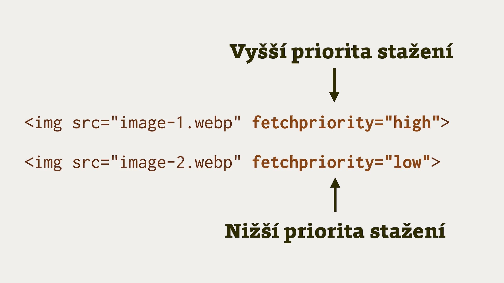
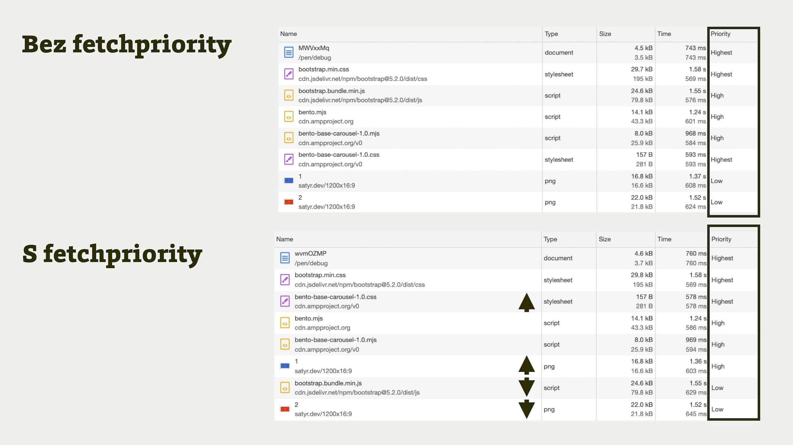

# Priority Hints a atribut fetchpriority: jak vytunit rychlost načtení prvků stránky

Priority Hints jsou prostředkem k úpravě prioritizace stahování souborů do prohlížeče.

Lidsky řečeno to znamená, že s jejich pomocí můžete zrychlit načtení webu jen pomocí přidání pár řádků kódu.

<!-- AdSnippet -->

Je to ale obecně už dost pokročilá metoda, takže ji nedoporučuji používat pokud přesně nevíte, co děláte.

Priority Hints (česky asi jako „doporučení k upřednostnění“) zatím navíc podporují jen prohlížeče postavené na jádře Chromium, což používání sice neznemožňuje, ale trošku omezuje.

Tím končí část textu plná varování a teď už k věci.

<figure>

<figcaption markdown="1">
S Priority Hints v kapse prohlížeči doporučíte, aby zvýšil nebo snížil pořadí prvku ve frontě stahování. Nic víc, nic míň.
</figcaption>
</figure>

Specifikace Priority Hints zavádí atribut `fetchpriority`, který lze použít s prvky HTML, jako jsou `img`, `link`, `script` a `iframe`:

```html
<!-- První obrázek ve viewportu, kterému zvýšíme prioritu načtení: -->


<!-- Komponenta třetí strany, které snížíme prioritu načtení: -->
<iframe src="https://example.com" fetchpriority="low"></iframe>
```

Dále zavádí atribut `priority` do nastavení při stažení prvků JavaScriptem pomocí [funkce fetch()](https://developer.mozilla.org/en-US/docs/Web/API/fetch):

```html
<script>
fetch('https://example.com/', {priority: 'high'})
.then(data => {
  // Spustíme fetch s vyšší prioritou
});
</script>
```

No a jako poslední možnost je vám k dispozici vložení doporučení do HTTP hlavičky:

```text
Link: </app/style.css>; fetchpriority=high
Link: </app/script.js>; fetchpriority=low
```

Z výše uvedeného je asi už jasné, že pořadí ve frontě stahování můžeme zvyšovat i snižovat. Měníme tak výchozí nastavení priority prvků, například v případě, že se nám jich stahuje až moc najednou.

Zmiňuji to proto, že se při čtení můžete ptát, proč se zabývat věcí jako prioritizace v době [protokolu HTTP/2](http-2.md), kdy se prvky stahují skoro najednou a rychle.

Problém je v tom „najednou“. Například při úvodním vykreslení stránky chceme rezervovat dostupné datové připojení jen pro pár nejdůležitějších prvků a ostatní trošku odložit.

## Atribut fetchpriority versus přednačtení {#versus-preload}

Vy zkušenější víte o existenci instrukce k přednačtení – [`<link rel="preload">`](preload.md). Priority Hints preload nenahrazují, ale doplňují. „Doporučení k upřednostnění“ umožňují jemnější ladění prioritizace.

* Preload se používat uvnitř `<head>` v HTML nebo hlavičce HTTP odpovědi.
* Preload nelze použít např. uvnitř skriptu pro Fetch.
* Preload neumí snížit prioritu.
* Preload má [podporu v Safari](preload.md#prohlizece), kdežto atribut `fetchpriority` zatím jen v prohlížečích Chromium.

Volně cituji podle [specifikace Priority Hints](https://wicg.github.io/priority-hints/):

> Preload je povinné načtení prostředku, který je nezbytný pro aktuální stav stránky. Priority Hints mohou napovědět, že priorita prostředku by měla být nižší nebo vyšší než jeho výchozí priorita, a mohou být také použity k poskytnutí podrobnějšího určení priority.

V praxi budeme nejspíš potřebovat obojí, `preload` i `fetchpriority`, přičemž tipuji, že někdy bude stačit vhodné použití preloadu a většinou ani to ne. Prostě jde o doplněk pro nás, [hračičky s rychlostí webu](https://www.pagespeed.cz/).

<!-- AdSnippet -->

Jen na okraj: Specifikace původně mluvila o atributu `importance` a ten byl také [propagovaný](https://twitter.com/addyosmani/status/1087614725809160192) na různých místech, ale nakonec se vše změnilo právě na `fetchpriority`.

## Pár příkladů do praxe {#priklady}

Na praktických příkladech to bude všechno jasnější.

### Příklad s karuselem {#priklady-karusel}

Tohle je docela evergreen všech článků o Priority Hints a já jej nevynechám, protože je to velmi dobrý příklad.

Vezměme, že na homepage e-shopu máme karusel. To si asi umíme představit, protože e-shop bez karuselu se hledá fakt špatně. Bohužel.

Nevýhodou většího počtu obrázků v úvodním HTML ale je to, že všechny mají stejnou prioritu načítání. Z toho pak vyplývá, že se budou stahovat najednou. Líné načtení pomocí [atributu loading="lazy"](lazy-loading-obrazku.md) se sem úplně nehodí, protože to by se mělo aplikovat ideálně až na prvky mimo první viewport. Právě k tomuto účelu zde ale je atribut `fetchpriority`:

```html
<ul class="carousel">
  
  
  
  
</ul>
```

Tento příklad jsem si rozpracoval do malého demíčka na CodePenu, abyste viděli vliv Priority Hints na vlastní oči.

[V prvním CodePenu](https://codepen.io/machal/pen/MWVxxMq) je vidět, že jsem se s implementací nepáral. Do hlavičky dokumentu jsem prostě frnknul styly [Bootstrapu](https://getbootstrap.com/docs/5.2/getting-started/download/) a [Bento Carouselu](https://bentojs.dev/components/bento-carousel/) tak, jak mně to autoři frameworků doporučili.

V horní části obrázku zde pak uvidíte, jak má tento copy/paste přístup neblahý vliv na priority stahování v prohlížeči:

<figure>

<figcaption markdown="1">
Jak atribut fetchpriority změní pořadí stahování prvků ve stránce.
</figcaption>
</figure>

Dolní část pobrázku to ukazuje už po optimalizaci. Stačilo rozumně přeskupit [prvky v hlavičce](https://www.pagespeed.cz/blog/srovnejte-si-to-v-head) (CSS před JS) a atribut `fetchpriority` použít pro snížení přednosti načítání pro JavaScript Bootstrapu a všechny obrázky v karuselu kromě prvního.

Však si to vyzkoušejte na výsledném CodePenu.

CodePen: [cdpn.io/e/wvmOZMP](https://codepen.io/machal/pen/wvmOZMP)

### Zvýšení priority async skriptu nebo jeho závislosti {#priklady-skript}

Pokud do stránky potřebujete vložit [asynchronní JS](js-async-defer-module.md), což obvykle potřebujete, musíte s překousnout fakt, že takovéto skripty se vkládají [s nízkou prioritou](js-priority.md). Většinou to nevadí, někdy ale jo. Docela dost jo.

S pomocí atributu `fetchpriority` je ale možné takovýto skript popostrčit ve frontě stahování nahoru:

```html
<script src="script.js" async fetchpriority="high"></script>
```

Pokud má script závislost, která není vidět v HTML, asi byste pro jeho popostrčení použili preload. I preload bude ovšem vyhodnocen jako s nižší prioritou, proto můžete i ten nechat předběhnout jiné prvky ve frontě stahování:

```html
<link rel="preload" href="dependency.js" as="script" fetchpriority="high">
```

### Změnit pořadí prvků stahovaných pomocí Fetch API  {#priklady-fetch-api}

Opět pěkný příklad ze specifikace. Vezměme, že pro potřeby frontendové apky stahujeme dva JSON soubory s obsahem. V jednom je podstatný obsah, ve druhém něco méně podstatného. I zde je možné pomoci si vlastností `fetchpriority`:

```js
// Články musíme načíst hned
fetch('/api/articles.json', { priority: 'high' }).then(/* … */)

// Související články chvilku počkají
fetch('/api/related.json', { priority: 'low' }).then(/* … */)
```

Na závěr ještě upozornění: Pokud si s tímto budete hrát, opravdu s nastavováním priorit šetřete a dávejte to jen tam, kde to má opravdu přínos. Stejně jako se na každém druhém webu špatně používá preload, a ve výsledku pak [škodí rychlosti](https://blog.webpagetest.org/posts/removing-unused-preloads-on-festival-foods/), očekávám vlnu pokažené rychlosti webů s pomocí atributu fetchpriority.

Ve specifikaci k tomu vyloženě píší:

> Označení všeho v dokumentu jako vysoce prioritního pravděpodobně zhorší uživatelský prožitek.

Já vím, vy to víte. To jen pro jistotu.

## Podpora v prohlížečích {#podpora}

V článku rozebírám vlastnost, která je sice zajímavá a podporovaná všem prohlížeči postavenými na jádře Chromium, ale zatím to není standard a Safari a Firefox k ní zatím nenašli cestu.

Pokud fetchpriority budete používat rozumně, jako [Progressive Enhancement](https://zdrojak.cz/clanky/graceful-degradation-vs-progressive-enhancement/), pak vám poslouží a nebude moc vadit, že uživatelé Safari a Firefoxu neuvidí benefity vaší optimalizace.

V konkrétních prohlížečích vypadá podpora následovně:

* Chrome od verze [101](https://chromestatus.com/feature/5273474901737472).
* Edge také od verze 101.
* Firefox: probíhá [diskuze](https://github.com/mozilla/standards-positions/issues/25) a [hledání pozice](https://github.com/mozilla/standards-positions/issues/606) k draftu specifikace.
* Safari: zatím bez signálů o úvahách na implementaci.

Více hledejte na [CanIUse.com](https://caniuse.com/mdn-html_elements_img_fetchpriority).

<!-- AdSnippet -->
