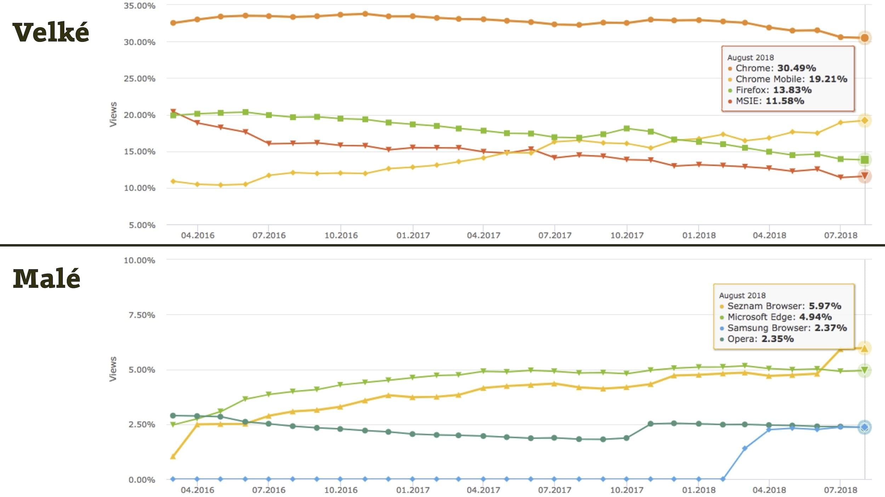

# Prohlížeče v Česku

Vstupem Chrome na desktop a nástupem mobilů začaly nové Browser Wars. Od roku 2017 ale rostou i další nové prohlížeče – Samsung Browser a v ČR pak ten od Seznam.cz.

Pro webaře může být tohle prostředí trochu nepřehledné, proto aktualizuji starší text.

## Počítače: Chrome jako jediný masivně roste. Na desktopu má větší než poloviční podíl  {#pocitace}

<figure>

<figcaption markdown="1">
*Obrázek: Podíl desktopových prohlížečů. Zdroj: Google Analytics pro weby cestovky Rekrea v červnu 2018*
</figcaption>
</figure>

*Chrome* samozřejmě ukousl největší část trhu. Dále je ale vidět, že v Česku na desktopech spíše stagnuje a rostou hlavně nové menší prohlížeče.

*Firefox* se drží na druhém místě, ale níže je vidět, že stále klesá.

*Internet Explorer* – ještě stále je tu s námi. U tohoto webu jde z 97 % o verzi 11 a stejné to bude i u jiných webů. Dobrá zpráva tedy je, že u většiny projektů rozhodně není potřeba optimalizovat pro verze 8, 9 ani 10.

*Edge*, nový moderní prohlížeč od Microsoftu, roste. Ale pomalu.

*Opera* se dlouho držela kolem čtyřprocentního podílu. S nástupem „nových malých“ ale také začala klesat.

## Mobilní zařízení: tři pětiny podílu a dominance Chrome {#mobily}

[Data z Gemius](http://ranking.gemius.com/cz/ranking/platforms/) k srpnu 2018 ukazují tyto podíly:

- PC: 61,82 %
- Telefony: 33,41 %
- Tablety: 4,57 %

Mobilní zařízení jsou tedy už i v ČR na podílu ke čtyřiceti procentům.

Čísla ze Západu ukazují, že to půjde přes polovinu a výše. Ale vy už jistě dávno neváháte, že budoucnost webu je v mobilech.

<figure>

<figcaption markdown="1">
*Obrázek: Podíl mobilních prohlížečů. Zdroj: Google Analytics pro weby cestovky Rekrea v červnu 2018*
</figcaption>
</figure>

Mezi mobilními prohlížeči tedy vede *Chrome Mobile*.

Druhé je *Safari Mobile*. Mobilní zařízení od Apple jsou samozřejmě velmi rozšířená i v Česku.

Jaké třetí ukazují Analytics *Android Webview*, což by dle všeho měl být Chrome nebo něco postavené na Chromiu. [Dříve](https://www.quirksmode.org/blog/archives/2015/02/android_webview.html) to mohl být také stařičký *Android Browser*, což už snad neplatí. V Google Anylytics je uváděný zvlášť se zanedbatelným podílem 1,12 %.

Nezapomeňte na *Samsung Internet* a *Seznam.cz*. Oba dva jsou velmi podobné Chrome, za chvíli se dozvíte více.

Když sečteme všechny prohlížeč postavená na jádru Chrome („Chromium“) kromě Safari nemá v ČR na mobilních zařízení žádnou konkurenci.

## Trendy: Roste mobilní Chrome a nové menší prohlížeče

<figure>

<figcaption markdown="1">
*Obrázek: Trendy podílu prohlížečů na českém trhu pro „velké“ i „malé“ prohlížeče. Zdroj: Gemius mezi dubnem 2016 a srpnem 2018, [ranking.gemius.com](http://ranking.gemius.com/)
</figcaption>
</figure>

Na prvním grafu je hezky vidět, že zatímco *desktopový Chrome* stagnuje, ten mobilní hodně roste.

*Firefox* a *Internet Explorer* verze 11 bezútěšně klesají. Nyní jsou na 14 a 12 procentech, přičemž toho prvního je trochu škoda.

A menší prohlížeče? *Opera* zdá se neustále mírně klesá. Roste *prohlížeč od Seznamu* – to je v Česku novinka – a *Samsung Browser*, což je novinka globání.

Mimochodem, skoky v grafu si vysvětluji změnami v měření Gemiusu. Je vidět, že prohlížeč od Seznamu začali rozlišovat až poměrně pozdě.

## K jednotlivým prohlížečům: ke dnešku je jich minimálně 16

Ke krátkému komentáři pro zajímavost přidávám i skóre [na HTML5test.com](https://html5test.com/). To udává podporu moderních HTML5 technologií. Čím vyšší, tím lepší.

### 9 prohlížečů, se kterými musíte počítat

- **[Chrome](https://en.wikipedia.org/wiki/Google_Chrome)**  
  Ten, co všechno sní. Celosvětově podle má podle Statcounter.com už dvě třetiny podílu.
  <small>HTML5test.com: 505/555 (verze 55)</small>
- **[Firefox](https://en.wikipedia.org/wiki/Firefox)**  
  Celosvětově mírně klesá. Teď má na světě podle Statcounter podíl 11 %. Mozille nelze upřít snahu. Firefox chce zrychlit, [zavřela boční projekty](https://twitter.com/jsnajdr/status/785095932782190592) a přichází [s drobnými inovacemi](https://testpilot.firefox.com/experiments). Jenže Google má v případě Chrome z jejich pohledu dost nešťasnou kombinaci *umu* vyrábět výborný prohlížeč a *síly* cokoliv protlačit.
  <small>HTML5test.com: 491/555 (verze 59)</small>
- **[IE 11](https://en.wikipedia.org/wiki/Internet_Explorer_11)**  
  Podle vývoje za poslední dva roky ubrala relativně moderní jedenácka podíl ostatním prohlížečům od Microsoftu. Přepokládám, že teď začne klesat ve prospěch Edge a ostatních prohlížečů.
  <small>HTML5test.com: 312/555</small>
- **[Edge](https://en.wikipedia.org/wiki/Microsoft_Edge)**  
  Moderní prohlížeč od Microsoftu roste méně než bych čekal.
  <small>HTML5test.com: 492/555 (verze 17)</small>
- **[Opera](https://en.wikipedia.org/wiki/Opera_(web_browser))**
  Od verze 15 je Opera postavená na stejném jádru jako Chrome, takže s testováním na ní tolik práce není.
  <small>HTML5test.com: 518/555 (verze 45)</small>
- **[Safari](https://en.wikipedia.org/wiki/Safari_(web_browser))**  
  Z moderních prohlížečů je to dnes největší *brzda*. Ještě nedávno byl WebKit synonymem inovací na webu, pamatujete? Aktualizuje se klasicky až s verzemi operačního systému.
  <small>HTML5test.com: 471/555 (verze 11.1)</small>
- **[Chrome Mobile](https://en.wikipedia.org/wiki/Google_Chrome_for_Android)**    
  Na mobilech zatím jednoznačně kraluje. Jedinou konkurenci má v iOS zařízeních od Apple a v možném nástupu prohlížeče od Samsungu. U Chrome na iOS pozor. Je to jen pseudoprohlížeč, tedy jiné rozhraní pro mobilní Safari. Píšu o tom dále.  
  <small>HTML5test.com: 486/555 (verze 52)</small>
- **[Samsung Internet](http://developer.samsung.com/internet)**  
  Nový prohlížeč od Samsungu, který se ve statistkách (včetně Google Analytics) aktuálně schovává  pod mobilní Chrome. Moc o něm nevíme, ale Samsung zařízení patří mezi nejprodávanější i v ČR, takže s ním nějak musíme začít počítat. V mobilech má ikonu fialové zeměkoule. [vrdl.cz/b/71-samsung-internet](https://www.vzhurudolu.cz/blog/71-samsung-internet) 
- **Android Browser**  
  Starší prohlížeč postavený na Webkit jádře. Modrá zeměkoule s nápisem Internet. Týká se Androidů ve verzích 4.x. Často jej upravovali výrobci zařízení, takže ho můžete znát třeba i pod jinými názvy. V téhle rodině prohlížečů je pěkný galimatyáš. Už se myslím ale nevyvíjí. [slides.com/html5test/the-android-browser](http://slides.com/html5test/the-android-browser)  
  <small>HTML5test.com: 356/555 (verze 30)</small>
- **[Safari Mobile](https://en.wikipedia.org/wiki/Safari_(web_browser))**  
  Jediné vykreslovací jádro dostupné na iOS. Všechny tamní prohlížeče, včetně Chrome, používají pro renderování stránek Safari. 
  <small>HTML5test.com: 378/555 (verze 9.3)</small>

### Speciální kategorie: WebView a prohlížeče uvnitř aplikací

Většina dnešních zhlédnutí webů na mobilech se neodehrává vědomým spuštěním prohlížeče, ale otevřením stránky kliknutím na odkaz uvnitř aplikací. Ve Facebooku, Twitteru nebo třeba e-mailové apce. Dříve jsem o tom podrobně psal na Vzhůru dolů. [vrdl.cz/b/19-prohlizec-facebook](https://www.vzhurudolu.cz/blog/19-prohlizec-facebook)

Jakým prohlížečem se pak stránka vykreslí? Vývojáři nativních mobilních aplikací jej znají jako WebView komponentu. Ta startuje jádro výchozího prohlížeče pro konkrétní operační systém. Na iOS je to vždy mobilní Safari, na dnešních Androidech obvykle Chrome. 

I v těchto kontextech doporučuji weby testovat. Prohlížeče tam mívají trochu jiné uspořádání ovládacích prvků a některé funkce neumí.

### Vymírající nebo zatím slabě zastoupené prohlížeče

Weby je možné a slušné vyrobit tak, aby se zásadně nerozsypaly ani v méně obvyklých browserech. Rozhodně ale nedoporučuji trvat na plnohodnotném zobrazení v nich. [Náhradních řešení](fallback.md) se pro ně dá vymyslet celá řada.

- **[IE 8](https://en.wikipedia.org/wiki/Internet_Explorer_8)**   
  Děkujeme, ale už opravdu odejdi. Vypadá to, že jeho éra právě končí spolu s Windows XP.  
  <small>HTML5test.com: 33/555</small>  
- **[IE 9](https://en.wikipedia.org/wiki/Internet_Explorer_9)**  
  IE9 běží na systémech, kde lze obvykle aktualizovat na novější verzi.  
  <small>HTML5test.com: 113/555</small>  
- **[IE 10](https://en.wikipedia.org/wiki/Internet_Explorer_10)**  
  Také IE10 běží na systémech, kde lze obvykle aktualizovat na novější verzi. Tipuji, že IE8, 9 i 10 v roce 2017 vymřou úplně.  
  <small>HTML5test.com: 265/555</small>  
- **[Internet Explorery Mobile](https://en.wikipedia.org/wiki/Internet_Explorer_Mobile)**  
  Výchozí prohlížeče na Windows Phone verzí 7 a 8. V Analytics u relevantní projektů pod jednoprocentním podílem trhu.  
  <small>HTML5test.com: 310/555 (verze 11 na Windows Phone 8.1)</small>  
- **[Edge Mobile](http://jecas.cz/edge-mobile)**  
  Výchozí prohlížeč na mobilních Windows 10. V Analytics vidím u cestovky s průměrnou českou návštěvností kolem 0,2 % podílu. Ale poroste.    
  <small>HTML5test.com: 444/555 (Windows Phone 10) </small>   
- **[Opera Mobile](http://www.opera.com/cs/mobile)**
  Běžná mobilní Opera s jádrem Blink. Může mít asi 0,3 % podílu.    
  <small>HTML5test.com: 481/555 (verze 37)</small>  
- **[Opera Mini](http://www.opera.com/cs/mobile/mini)**  
  Proxy prohlížeč bez vlastního renderovacího jádra co dokáže šetřit datový objem, ale weby renderuje ošklivě. Dříve populární, dnes už v ČR zapadá. U cestovky vidím 0,1 % návštěv.

### Prohlížeče s menším než pětiprocentním podílem tvoří asi 15 % trhu

Jak už jsem na Vzhůru dolů psal, pětiprocentní nebo jiná hranice pro podporu prohlížečů je velmi zrádná. Prohlížeče pod touto hranicí teď tvoří kolem šestiny pageviews. Čtěte „pohádku o pěti procentech“. [vrdl.cz/b/20-pet-procent](https://www.vzhurudolu.cz/blog/20-pet-procent)

Podporujte prostě různé prohlížeče různým způsobem a vynakládejte na to energii, které odpovídá byznys hodnotě jejich uživatelů s výhledem do budoucna.

## Renderovací jádra: vede samozřejmě Blink

K polovině prázdnin 2016 má jádro Blink (Chrome, Opera) podíl na trhu 48 procent. Gecko (Firefox) 20 %, Trident (Internet Explorer) 18,3 %, WebKit/KHTML (Safari) 9,0 % , EdgeHTML (Edge)  3,7 % a už nevyvíjené Presto (Opera 12-) 0,5 %.

## Závěrečná doporučení pro webaře

- **Moje obecná čísla berte s rezervou**. Sledujte hlavně vlastní Google Analytics.
- **Nebojte se nových technologií**. [Flexbox](css3-flexbox.md) má v těchto číslech přibližně 98 % podporu. Totéž SVG. Obojí vám ušetří práci a nabídne nové možnosti. Fallbacky ve starých prohlížečích rozhodně nedělejte plnohodnotné se zobrazením v moderních prohlížečích. Obvykle se vám to nevyplatí.
- **Nepodceňujte menší prohlížeče**. Zařízují sedminu zhlédnutí stránek. Naučte se testovat tak, abyste s tím neměli moc práce. Doporučím zase svůj článek. [vrdl.cz/p/jak-testovat-responzivni-weby](https://www.vzhurudolu.cz/prirucka/jak-testovat-responzivni-weby)
- … a raději doslovně pro méně zkušené: Pokud by vás snad napadlo, že web se prohlíží hlavně na Chrome a pak trochu Firefoxu, ošklivě se klamete. 

Atd:

- Podíly mobilních prohlížečů mám z Google Analytics cestovky Rekrea, protože Rankings.cz neumí rozumně rozeznat jednotlivé mobilní prohlížeče.
