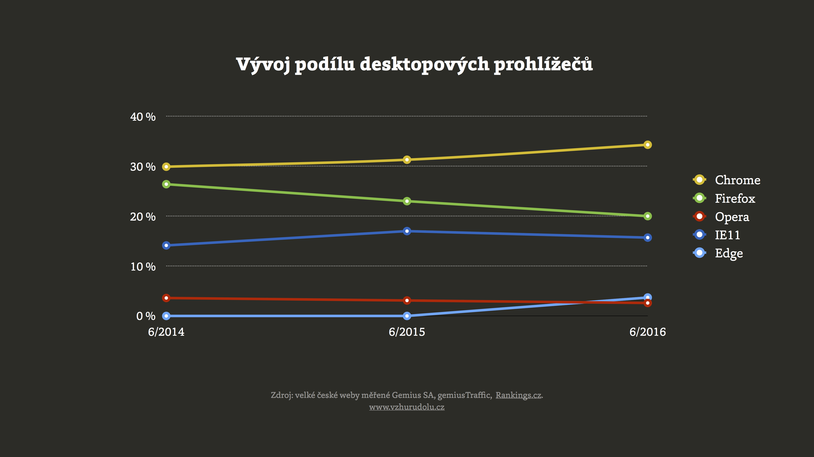

# Prohlížeče: Chrome sice vede, ale prohlížečů je pořád hodně

Pro potřeby webové vývojařiny si tady pojďme shrnout aktuáln stav trhu prohlížečů. Čísla v článku jsou vytažená z Rankings.cz ke konci června 2016:

* **Chrome stabilně roste**.  
Teď se v Česku dostal přes třetinu shlédnutí stránek. Ostatní prohlížeče stagnují nebo klesají
* **Staré Explorery už skoro vymřely**.  
Všechny Internet Explorery kromě verze 11 už mají podíl pod půl procenta a rychle klesají. 
* **Mobilní zařízení mají přes pětinu celku**.  
Více než polovina mobilních shlédnutí stránek je z mobilního Chrome.

## Desktop: Chrome jako jediný masivně roste, na desktopu přes třetinu

|* Prohlížeč *|* Vývoj za dva roky *|* Podíl k  6/2016 *|* HTML5test.com skóre *|
| [Chrome](https://en.wikipedia.org/wiki/Google_Chrome) | ⇧ | 34,26 | 492/555 (v52) |
| [Firefox](https://en.wikipedia.org/wiki/Firefox) | ⇩ | 20,37 | 461/555 (v48) |
| [IE 8](https://en.wikipedia.org/wiki/Internet_Explorer_8) | ⇩ | 0,50 | 33/555 |
| [IE 9](https://en.wikipedia.org/wiki/Internet_Explorer_9) | ⇩  | 0,46 |  113/555 |
| [IE 10](https://en.wikipedia.org/wiki/Internet_Explorer_10) | ⇩ | 0,47 |  265/555 | 
| [IE 11](https://en.wikipedia.org/wiki/Internet_Explorer_11) | ⇧ | 15,66 |  312/555 |
| [Edge](https://en.wikipedia.org/wiki/Microsoft_Edge) | ⇧ | 3,7 | 460/555 (v14) |
| [Opera](https://en.wikipedia.org/wiki/Opera_(web_browser)) | ⇩ | 2,6 | 496/555 (v40) |
| [Safari](https://en.wikipedia.org/wiki/Safari_(web_browser)) | ⇧ | 1,14 | 370/555 (v9.1) |

- V posledních měsících také přestal klesat Firefox. Držím palce, aby nešlo o výjimku, protože konkurence je potřebná.
- Staré Internet Explorery (IE) jsou nad hrobem. Už dlouho se to týká verzí 9 a 10, teď už konečně i osmičky. 
- Edge, nový moderní prohlížeč od Microsoftu, roste. Ale pomalu.
- Opera se před lety držela kolem čtyřprocentního podílu. V posledním roce ale také začala klesat.
- Desktopové Safari (Macy) v ČR kupodivu mírně roste.

## Mobily: pětinový podíl na pageviews a dominance Chrome

Na 20 % podílu ze shlédnutých stránek se mobily samozřejmě nezastaví. Za rok budou mít minimálně čtvrtinu a tak dále. Čísla ze Západu ukazují, že to půjde přes polovinu a dál. Doufám, že už dávno neváháte o tom, že budoucnost je v mobilech.

|* Prohlížeč *|* Vývoj za dva roky *|* Podíl k  6/2016 *|* HTML5test.com skóre *|
| [Chrome Mobile](https://en.wikipedia.org/wiki/Google_Chrome_for_Android) | ⇧ | 11,74 | 486/555 (v52) |
| Android Browser | ⇩ | 5,06 | 356/555 (v30) |
| [Safari Mobile](https://en.wikipedia.org/wiki/Safari_(web_browser)) | ⇩ | 1,17 | 378/555 (v9.3) |

- Mobilní Chrome statistiky samozřejmě ovládne, protože je to nyní na Androidu hlavní prohlížeč. 
- Android Browser je už nevyráběná verze Webkitu, která do cca dvou let úplně vymře. Týká se některých Androidů do verze 4.x. 
- Podíl kolem půl procenta ještě mohou mít Opery Mini a Mobile a mobilní Explorer či Edge. 
- U Chrome na iOS pozor. Je to jen pseudoprohlížeč – jiné rozhraní pro mobilní Safari. Dávejte si pozor také na zobrazování webu uvnitř aplikací, hlavně Facebooku. [Článek](http://www.vzhurudolu.cz/blog/19-prohlizec-facebook).

## Renderovací jádra

K polovině prázdnin 2016 to vypadá takto:

- Blink (Chrome, Opera): 48%
- Trident/EdgeHTML (IE, Edge): 22%
- Gecko (Firefox): 20%
- WebKit/KHTML (Safari): 9%
- Presto (Opera 12-): 0,5%

## Prohlížeče s menším než pětiprocentním podílem tvoří asi 15 % trhu

Jak už jsem [dříve psal](http://www.vzhurudolu.cz/blog/20-pet-procent), pětiprocentní nebo jiná hranice pro podporu prohlížečů je velmi zdrádná. Prohlížeče pod pět procent teď tvoří kolem šestiny pageviews. 

Podporujte prostě různé prohlížeče různým způsobem a vynakládejte na to energii, které odpovídá byznys hodnotě jejich uživatelů s výhledem do budoucna.

## Odkud jsou čísla?

Z GemiusRanking ([rankings.cz](http://rankings.cz/)). Měří podíl na shlédnutých stránkách u velkých českých webů.

## Doporučení pro webaře

- Jakákoliv **obecná čísla berte s rezervou**. I ta moje. Sledujte hlavně vlastní [Google Analytics](google-analytics-vyvojari.md).
- **Nepodceňujte menší prohlížeče**. Mají sedminu shlédnutí stránek. Naučte se [testovat tak](jak-testovat-responzivni-weby.md), abyste s tím neměli moc práce.
- **Nebojte se nových technologií**. [Flexbox](css3-flexbox.md) má v těchto číslech přibližně 98 % podporu. Totéž [SVG](svg.md). Obojí vám děsně ušetří práci a nabídne nové možnosti. Fallbacky ve starých prohlížečích rozhodně nedělejte plnohodnotné se zobrazením v moderních prohlížečích. Obvykle se vám to nevyplatí.
- … a raději doslovně pro méně zkušené: Pokud by vás snad napadlo, že Web je hlavně Chrome a pak trochu Firefox, ošklivě se klamete.

