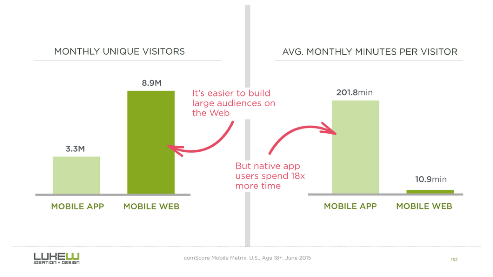
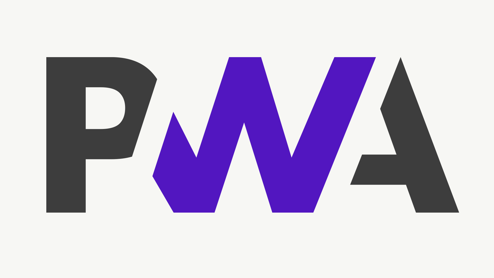
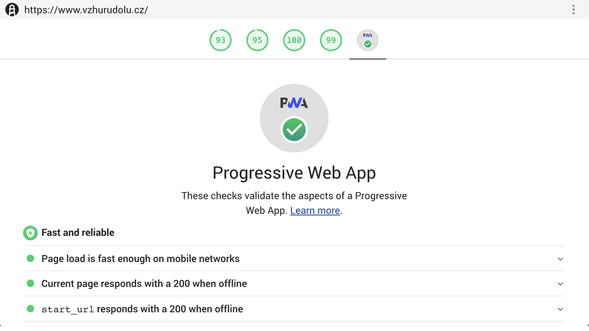
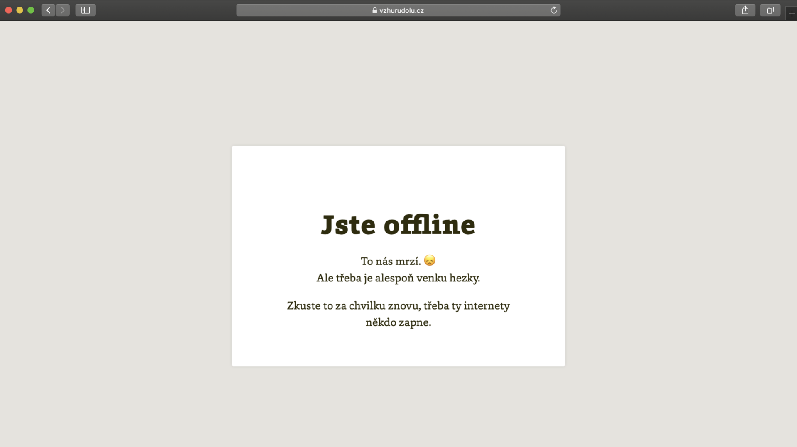

# Progresivní webové aplikace: Co to je? A jak webu zařídit plné hodnocení PWA v Lighthouse

PWA (progresivní webové aplikace) je označení pro weby, které přebírají některé vlastnosti nativních aplikací: umí například běžet offline, mají přístup k hardwaru a posílají notifikace uživateli.

<p class="video">
Video: <a href="https://www.youtube.com/watch?v=-TvcSwA5oC8">Co to je PWA</a> ~ Martin popisuje progresivní webové aplikace i pro netechnické diváky.
</p>

PWA tak kombinují výhody světa webů se světem nativních aplikací. Jak jsem psal v textu [Weby versus aplikace](weby-vs-aplikace.md):

* síla webů je v _záběru_ (možnost získat slušnou návštěvnost za málo peněz),
* nativní aplikace nabízejí zase větší _zápřah_ uživatele (chuť věnovat aplikaci více času).

<figure>

<figcaption markdown="1">
*„Reach (web) vs. Rich (native) OR why you want both.“ Zdroj: Luke Wroblewski na Twitteru. [vrdl.in/8lh4f](https://twitter.com/lukew/status/649255909420503041)*
</figcaption>
</figure>

V tomhle textu se nebudeme příliš zabývat teoretickým popisem PWA. Rovnou vám ukážu, jak si základní podporu „PWA“ zapnout na vašem webu. A přitom se doufám o progresivních webových aplikacích něco dozvíte.

Nejdřív ale krátké zamyšlení nad oním „přebírání funkcí nativních aplikací“ v definici PWA.

## PWA jako buzzword {#buzzword}

Vy, kteří weby děláte už nějakou dobu, víte, že „přebírání funkcí nativních aplikací“ dělají webové technologie odjakživa.

<figure>

<figcaption markdown="1">
*Obrázek: PWA má také neoficiálně oficiální [logo](https://medium.com/samsung-internet-dev/we-now-have-a-community-approved-progressive-web-apps-logo-823f212f57c9).*
</figcaption>
</figure>

Web tohle „přebírání“ dělá od té doby, kdy lidé zjistili, že tahle platforma nebude skvělá jen pro dokumenty, ale také pro aplikace.

Bez téhle tendence by neexistovaly [API](http://www.webondevices.com/9-javascript-apis-accessing-device-sensors/) jako Geolocation, Device Orientation, Battery Manager a další.

Ale když se zamyslíme znova, asi bychom v CSS neměli moduly pro tvorbu pokročilého layoutu, [Grid](css-grid.md) a [Flexbox](css3-flexbox.md). Bez snahy přiblížit weby appkám i v rychlosti by neexistoval [AMP](amp.md).

<!-- AdSnippet -->

„PWA“ tedy považuji za buzzword, který označuje určitou fázi onoho přebírání a určité konkrétní technologie, v jejichž centru je [Service Worker](https://developers.google.com/web/fundamentals/primers/service-workers/). Buzzword je to ale užitečný, usnadní popularizaci a zapojení vývojářů nativních aplikací do naší milé webové platformy.

## Jak to „zapnout“ na webu a dosáhnout plného hodnocení PWA na Lighthouse?  {#zapnuti}

Nedávno jsem si hrál s nastavením PWA pro Vzhůru dolů. Zde je tedy návod, jak si základní vlastnosti progresivních webových aplikací zprovoznit na jakémkoliv webu.

Získáte tím:

1. Možnost nainstalovat web jako samostatnou aplikaci. (Pokud používáte Chrome, zkuste na tomto webu použít tlačítko `+` v adresním řádku.)
2. Možnost zobrazení vlastní offline stránky. (Vypněte si internet, Vzhůru dolů by vám mělo zobrazit specifickou chybovou stránku.)
3. Možnost přednačíst část obsahu hlavního webu při vstupu z AMP Cache.

Jsou to opravdu jen ty nejzákladnější vlastnosti PWA, ale pro začátek to nebudeme komplikovat.

### Lighthouse PWA skóre {#zapnuti-pwa}

Nástroj pro testování technické kvality webů [Lighthouse](lighthouse.md) znáte už z jiných zdejších textů.

<p class="video">
Video: <a href="https://www.youtube.com/watch?v=cYdek3ZUS-c">PWA pro vývojáře</a> ~ Jak udělat z webu progresivní webovou aplikaci a získat maximální hodnocení na Lighthouse?
</p>

Kromě [rychlosti webů](https://www.vzhurudolu.cz/rychlost-nacitani), technického SEO a dalších okruhů Lighthouse také ukazuje, jak moc váš web splňuje základní požadavky kladené na PWA.

<figure>

<figcaption markdown="1">
*Obrázek: To je bezva, Lighthouse říká, že náš web považuje za PWA. Takovou malou, jednoduchou… ale PWA.*
</figcaption>
</figure>

Pojďme tedy zkusit dosáhnout plného hodnocení Lighthouse pro PWA.

Než se do toho pustíme, měli byste mít už splněné body, o kterých jsem na Vzhůru dolů psal dříve.

### Vstupní požadavky {#zapnuti-pozadavky}

Váš web by měl mít následující vlastnosti a schopnosti:

* Běžet na [protokolu HTTPS](https.md) a přesměrovávat provoz z HTTP na HTTPS.
* Obsahovat meta [značku pro viewport](viewport-meta.md) s nastavenou vlastností `width` nebo `initial-scale` a být [responzivní](https://www.vzhurudolu.cz/kniha-responzivni-design/).
* Být jakžtakž rychlý. [Zdá se](https://developers.google.com/web/progressive-web-apps/checklist), že pro splnění základních požadavků se potřebujete dostat s [interaktivitou](metrika-tti.md) pod 10 vteřin. Pokročilejší cíl je pak poloviční.
* Zobrazovat obsah, i když je JavaScript nepřítomný. Tedy mít implementovaný Server-side Rendering.
* Mít správně nastavené [favikony](favicon.md).
* Fungovat napříč prohlížeči, viz [testování responzivních webů](jak-testovat-responzivni-weby.md).

Kompletní [checklist i s popisem](https://developers.google.com/web/progressive-web-apps/checklist) dává Google k dispozici, nebo si zkuste spustit [Lighthouse](lighthouse.md) a řídit se doporučeními, které vám nabídne. A nebo prostě čtěte dál.

### Krok 1: Manifest webové aplikace {#zapnuti-krok-1}

[Web app manifest](https://developer.mozilla.org/en-US/docs/Web/Manifest) je JSON soubor, který poskytuje informace o PWA: jejím názvu, barvách, ikonách…

Pokud jste použili [Favicon Generator](https://realfavicongenerator.net) z textu [o ikonách](favicon.md), už nějaký `manifest.json` nejspíš máte. Doplníme jej o pár údajů, takže nakonec vypadá [nějak takto](https://www.vzhurudolu.cz/favicon/manifest.json):

```json
{
  "name": "Vzhůru dolů",
  "short_name": "VD.cz",
  "icons": [
    {
      "src": "/favicon/android-chrome-192x192.png",
      "sizes": "192x192",
      "type": "image/png"
    },
    {
      "src": "/favicon/android-chrome-512x512.png",
      "sizes": "512x512",
      "type": "image/png"
    }
  ],
  "theme_color": "#3d6a0d",
  "background_color": "#3d6a0d",
  "display": "standalone",
  "start_url": "/"
}
```

Abych uspokojil Lighthouse, musel jsem oproti verzi z Favicon Generatoru přidat položky `short_name` a `start_url`.

Tenhle manifest je hodně stručný. Deklaruje názvy webu, ikony a barvy okolních ovládacích prvků. Ale pro naše potřeby je úplně v pohodě. Pojďme dál.

### Krok 2: Instalace Service Workera {#zapnuti-krok-2}

[Service Worker](http://js.chobits.ch/service-worker/) je JavaScript, který stránka nainstaluje do prohlížeče, aby tam běžel i v době, kdy uživatel na našem webu zrovna není.

Ano, potvrzuji, že je to ohromná věc! Service Worker je jádro pudla všech PWA, protože umožňuje nastavení běhu aplikace offline, rozesílání push notifikací nebo chytrou práci s keší prohlížeče.

<!-- AdSnippet -->

Nám zde půjde jen o pouhé zobrazení vlastní stránky, upozorňující na offline stav uživatele.

Service Worker je JavaScript, který sedí v kořenovém adresáři stránky tak, aby měl přístup ke všem souborům webu. Obvykle se jmenuje `sw.js` nebo `service-worker.js`.

Zatím nebudeme řešit, co je obsahem toho souboru a prostě si jej nainstalujeme. Kamkoliv do vašeho JavaScriptu nebo HTML tedy můžete přidat něco takového:

```js
if ('serviceWorker' in navigator) {
  navigator.serviceWorker
    .register('/sw.js');
  });
}
```

Zjišťuje to, zda prohlížeč podporuje Service Workera (`('serviceWorker' in navigator)`). [CanIUse ukazuje](https://caniuse.com/#feat=serviceworkers), že to bude úspěšné ve všech dnešních prohlížečích kromě Internet Exploreru 11.

V moderních prohlížečích to tedy spustí registraci daného souboru. Prohlížeč si tedy soubor `sw.js` někam umístí a spustí.

Více informací o Service Workeru:

* [Web Fundamentals od Google](https://developers.google.com/web/fundamentals/primers/service-workers/)
* [Service Worker Cookbook](https://serviceworke.rs) s různými ukázkami využití
* [Přednáška Filipa Hráčka na WebExpo](https://slideslive.com/38894532/service-worker-nejdulezitejsi-webova-inovace-od-dob-hyperlinku) (starší, ale výborná)

Soubor `sw.js` je zatím prázdný, pojďme to napravit.

### Krok 3: Stránka pro běh webu offline {#zapnuti-krok-3}

Další z požadavků Lighthouse pro správné základní PWA je „offline stránka“ informující uživatele, že nemá připojení k internetu.

Tu naši uvidíte poté, co si vypnete připojení k internetu a obnovíte Vzhůru dolů v prohlížeči.

<figure>

<figcaption markdown="1">
*Obrázek: Jste offline. To naštve.*
</figcaption>
</figure>

Jak to zařídit? Vytvoření offline stránky vám zabere jen chvilku. Obvykle se jmenuje `offline.html` a sídlí u kořene webu: [vzhurudolu.cz/offline.html](https://www.vzhurudolu.cz/offline.html).

Jen asi budete muset (jako já) do této stránky přemístit také veškerá CSS a odstranit odkazy na všechny externí zdroje.

Pro implementaci samotného Service Workeru, zajišťujícího registraci offline stránky jsem využil [amp-sw](https://github.com/ampproject/amp-sw), který je dodávaný autory AMP, ale dá se z větší části použít i pro běžné stránky.

Je to vlastně jen obal pro knihovnu [Workbox](https://developers.google.com/web/tools/workbox), usnadňující práci se Service Workery.

Takhle to vypadá:

```js
importScripts("https://cdn.ampproject.org/sw/amp-sw.js");

AMP_SW.init({
  offlinePageOptions: {
    url: "/offline.html"
  }
});
```

Využil jsem tuto cestu, protože je z pohledu psaní JavaScriptu velmi úsporná a na Vzhůru dolů AMP používám. Možností, jak pomocí Service Workeru registraci offline stránky zařídit, je ale hodně:

* [Offline Fallback Recipe](https://serviceworke.rs/offline-fallback_service-worker_doc.html) na serviceworke.rs.
* [Create a really, really simple offline page](https://deanhume.com/create-a-really-really-simple-offline-page-using-service-workers/) od Deana Humeho.

To je vše. V tuhle chvíli jsme z obyčejného webu vytvořili progresivní webovou aplikaci, splňující požadavky Lighthouse. Jednoduchou, ale naši PWA.

## Na závěr {#zaver}

Postupný „přechod“ na PWA a využití Service Workerů považuji za směr, kterým by se měly vydat v zásadě všechny weby. Jsem tedy rád, že se mi konečně povedlo sepsat alespoň tento úvod.

<p class="video">
Video: <a href="https://www.youtube.com/watch?v=sly6IF_lEQ8">PWA na Frontendisti.cz</a> ~ Josef Ježek: Rychlé a modulární progresivní webové aplikace.
</p>

Milerád se k tématu ještě vrátím. V tuto chvíli vám nabídnu alespoň pár odkazů k dalšímu studiu.

* V češtině více píše například [Ackee studio](https://www.ackee.cz/blog/proc-a-jak-psat-progresivni-webove-aplikace/) nebo [Northrem](http://js.chobits.ch/service-worker/).
* Zajímavé jsou samozřejmě push notifikace. Více o nich najdete například na [serviceworke.rs](https://serviceworke.rs/push-simple_index_doc.html), detailní tutoriál je na [blogu iZettle](https://medium.com/izettle-engineering/beginners-guide-to-web-push-notifications-using-service-workers-cb3474a17679).
* Service Workery umí pracovat s cache prohlížeče, což může být velmi prospěšné pro rychlost webu. Nějaký úvod je například [na KeyCDN](https://www.keycdn.com/blog/service-workers).
* Service Workera je možné také instalovat z [AMP stránky](amp.md) běžící v AMP Cache, pomocí komponenty [amp-install-serviceworker](https://amp.dev/documentation/examples/components/amp-install-serviceworker/).

<!-- AdSnippet -->
