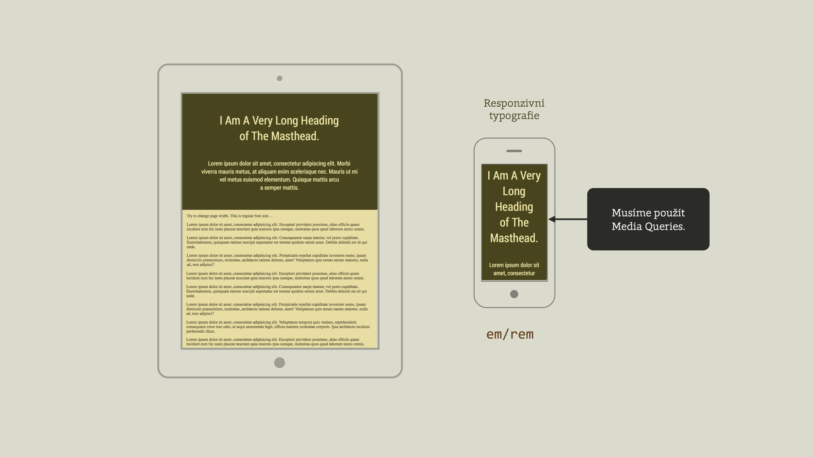
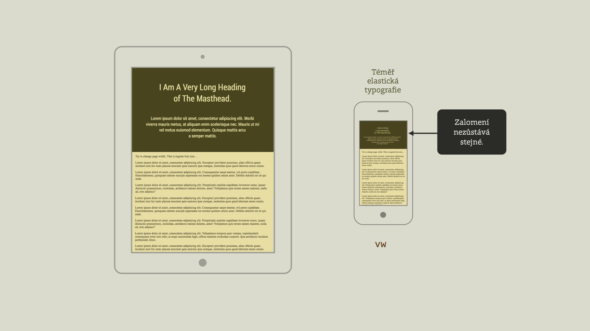
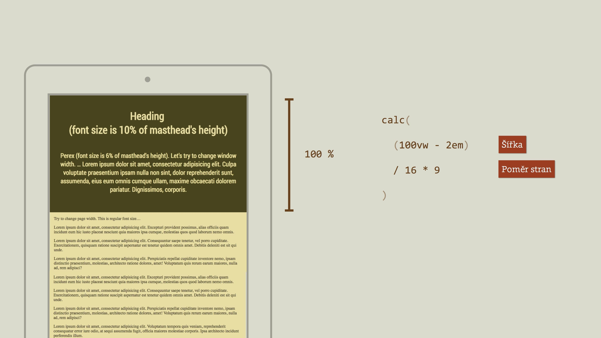
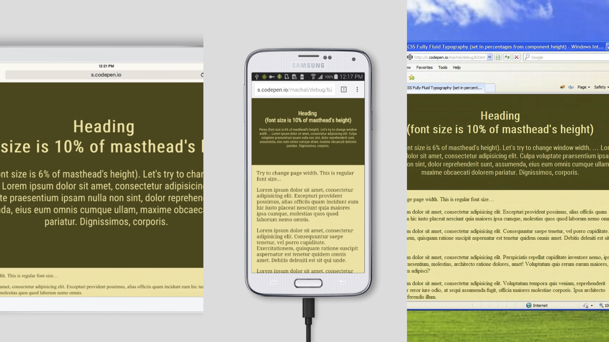

# CSS řešení: Elastická typografie počítaná v procentech z výšky komponenty

Pojďme si rozebrat jedno z řešení, které jsem ukazoval v přednášce [na WebExpo 2016](https://www.vzhurudolu.cz/prednaska/webexpo-2016-246).

<!-- AdSnippet -->

V komponentách, u kterých známe [poměr stran](css-pomer-stran.md), umožňuje nastavit svislý (typografický) rytmus v procentech z jejich výšky.

Typografické hlavičky se na webu dělají docela často. Jenže když chcete, aby na různě velkých displejích vypadaly hezky, musíte pro jednotlivé [breakpointy](breakpointy.md) dělat ruční zásahy pomocí [Media Queries](css3-media-queries.md):



Shodou okolností jem před čtyřmi lety na WebExpu mluvil [o téměř vektorovém webu](http://webexpo.cz/praha2012/prednaska/pozor-front-end-stavba/). Tam jsem se u některých komponent snažil dosáhnout pružnosti, kterou známe z PDF.  Tehdy jsem ale ještě neznal jednotky viewportu.

## Téměř elastická typografie pomocí `vw`

Nejčastěji se pro elastickou typografii používají právě nové [jednotky viewportu](css3-jednotky.md#jednotky-viewportu-vw-vh-vmin-vmax): `vw`, `vh`, `vmin` a `vmax`. Nejzajímavější je „volkswagen“ – `vw`. 

```css
.box__heading { 
  font-size: 7vw; /* 7 % šířky okna */
}
```



Jenže nastavení [typografie](typografie.md) a tedy svislého rozměru v procentech ze šířky okna, tedy vodorovného rozměru, samo o sobě nestačí. Nezohledňuje totiž vnitřní ani vnější okraje. Text se tedy v určitých velikostech okna zalomí. Podívejte se na demo: [cdpn.io/e/bZzmGg](https://codepen.io/machal/pen/bZzmGg?editors=1100#0).

## Elastická typografie v procentech z výšky komponenty

Způsobů jak elastickou typografii vytvořit [je více](https://www.smashingmagazine.com/2016/05/fluid-typography/). Já jsem nedávno přemýšlel nad variantou nastavení svislých rozměrů v procentech z výšky okna: 

```css
.box__heading { 
  font-size: 10bh; /* 10 % z výšky boxu */
}
```

Jenže nic jako `10bh` v CSS nemáme, že? Můžeme to ale spočítat, pokud známe poměr stran komponenty. Ten je v našem případě 16 : 9. Výšku pak vypočteme ze šířky a poměru stran:

```
((šířka okna) - (vodorovný padding)) / 16 * 9)
```

Jedno procento výšky okna tedy vypočteme:

```
((šířka okna) - (vodorovný padding)) / 16 * 9 / 100)
```

V CSS pak využijeme [funkci calc()](css3-calc.md) a zápis pak vypadá takto:

```css
calc( (100vw - 2em) / 16 * 9 / 100 )
```



Těch deset procent z výšky komponenty pak zapíšeme takto: 

```css
.box__heading { 
  font-size: calc( 10 * ( (100vw - 2em) / 100 / 16 * 9 ) );
}
```

V preprocesoru bychom to pak moli napsat elegantněji. Používám SCSS:

```scss
$boxHeightPercent: "( (100vw - 2em) / 100 / 16 * 9 )";

.box__heading { 
  font-size: calc( 10 * #{$boxHeightPercent} );
}
```

Hotovo. Tohle řešení funguje ve všech prohlížečích, které podporují jednotky `vw` – tedy všech moderních. 

<!-- AdSnippet -->

Je dobré ještě pomyslet na náhradní řešení v MSIE verze 9 a starších:


```scss
.box__heading { 
  font-size: 2em;
  font-size: calc( 10 * #{$boxHeightPercent} );
}
```

Výsledek pak v různých zařízeních vypadá takto:



Samozřejmě. Měli bychom pak ale ještě myslet na nějaká minima a případně i maxima. Znovu tady pro zájemce odkážu na [článek na Smashing Magazine](https://www.smashingmagazine.com/2016/05/fluid-typography/).

Živé demo i s fallbackem je tady: [cdpn.io/e/bZzmGg](https://codepen.io/machal/pen/bZzmGg?editors=1100#0).

