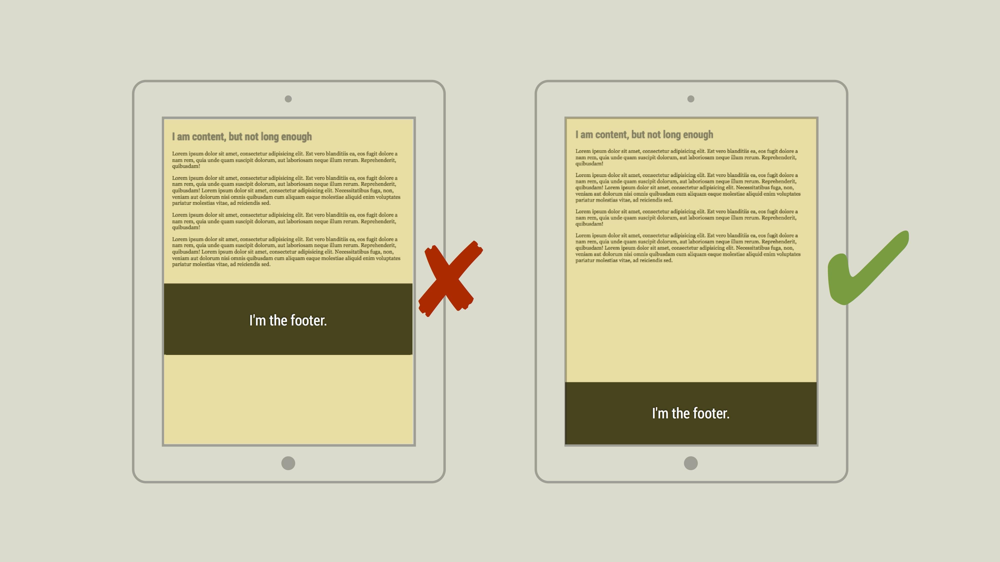

# CSS řešení: Patička přilepená ke spodní hraně okna

Jsou věci, které na CSS grafici prostě nemůžou vystát. Jako třeba patičku, která zůstává viset za obsahem.



Zrovna tento problém se dá velmi jednoduše vyřešit. Pomocí nových [CSS jednotek](css3-jednotky.md) a [Flexbox layoutu](css3-flexbox.md). 

Projděme si patičku rozpitvat jako další z řešení, která jsem ukazoval [během přednášky na WebExpo 2016](http://www.vzhurudolu.cz/prednaska/webexpo-2016-246).

Hotový Codepen je tady: [http://cdpn.io/e/jrEGYZ](http://codepen.io/machal/pen/jrEGYZ).

## 1. Stránku roztáhneme na celou výšku okna a uděláme z ní flexbox rodiče

Nejdřív musíme tělo dokumentu roztáhnout na celou výšku okna:

```css
body {
  height: 100vh;
}
```

Pak z něj uděláme rodiče flexboxu a směr layoutu nastavíme na příčný:

```css
body {
  display: flex;
  flex-direction: column;
}
```

## 2. Obsah „flexí“, ale nezmenší se pod délku textu

V dalším kroku musíme obsahovému bloku jemně oznámit, aby se roztahoval na výšku co mu síly stačí (`flex-grow: 1`), ale nezmenšoval se pod svou výchozí velikost (`flex-shrink: 0`), která je určená výškou obsahu (`flex-basis: auto`). 

```css
.content {
  flex-basis: auto;
  flex-grow: 1;
  flex-shrink: 0;
}
```

Jistě, zkratka `flex: 1 0 auto` by udělala to samé, ale kvůli snadnějšímu pochopení jsem zvolil doslovný zápis.

## 3. Patička „neflexí“

Nakonec nastavíme samotnou patičku. Ta bude mít výšku podle aktuálního obsahu (`flex-basis: auto`) a zároveň se nezvětší ani nezmenší.

```css
.footer {
  flex-basis: auto;
  flex-grow: 0;
  flex-shrink: 0;
}
```

Totéž bychom mohli zapsat zkratkou `flex: none`. Prostě patičce oznámit, aby „neflexila“, nechovala se pružně. 

Řešení bude fungovat ve všech dnešních prohlížečích. Patičku zobrazenou „postaru“ uvidíte jen v Internet Exploreru verze 9 a starších.

Hotové řešení je tady: [http://cdpn.io/e/jrEGYZ](http://codepen.io/machal/pen/jrEGYZ).
