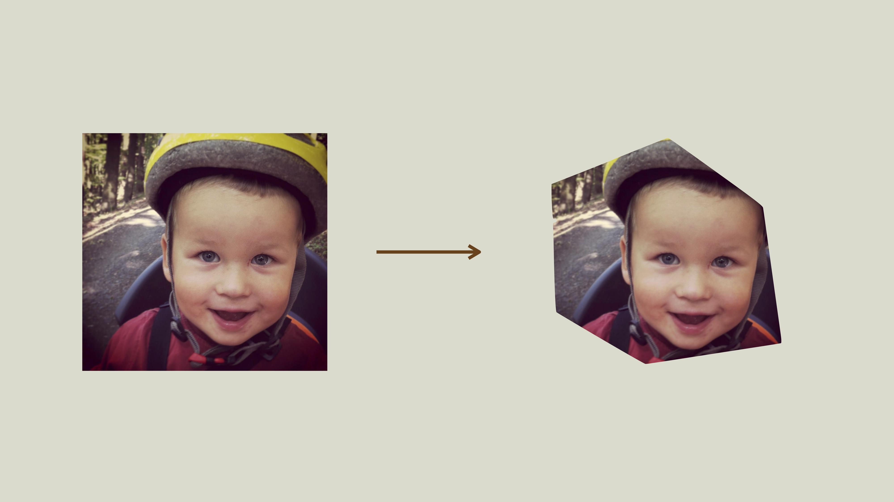

# Řešení: Vlastní výřezy obrázků pomocí SVG

Mám fotku a chci ji udělat specifický výřez v přímo v kódu. Pomocí CSS snadno zařídím kulatý, jenže co vlastní tvar? 

<!-- AdSnippet -->

Po čase pro vás mám další z příkladů, které jsem ukazoval na přednášce [„10 praktických CSS3 a SVG řešení“](https://www.vzhurudolu.cz/prednaska/webexpo-2016-246) na Webexpo 2016.



[Možností](https://codepen.io/yoksel/full/fsdbu/) je víc, ale když chci, aby to fungovalo prakticky ve všech prohlížečích, zvolím [SVG](svg.md). Výřez nezvládne jen Internet Explorer 8 a starší. Ale uděláme pro ně docela vyčůrané náhradní řešení, vydržte.


## 1) Nejdříve fotka v SVG

```html
<svg>
  <image xlink:href="image.jpg" 
    alt="Image">  
</svg>
```

Namísto prostého `` použijeme SVG obrázek, abychom na něj mohli aplikovat tvar masky.


## 2) Definuji tvar výstřižku

```html
<clipPath id="clip-path">
  <path d="…">
</clipPath>
```

Všimněte si, že zde nepoužívám zanoření do `<defs>`, oblasti pro vymezení později využívaných objektů. Nefungovalo by to totiž v aktuálních verzích Safari.


## 3) Výstřižek pak na obrázek nasadím

```html
<image clip-path="url(#clip-path)" …>
```

A máme skoro hotovo. Nic složitého, že? Ještě trochu vysvětlování a pak ten fallback pro starší prohlížeče.

Nasazení ořezového tvaru (`clip-path`) dělám přímým parametrem v SVG kódu. Proč jsem nepoužil [CSS vlastnost `clip-path`](https://codepen.io/machal/pen/qRPbYZ), která je také standardně k dispozici? Opět kvůli Safari, které ji zatím neumí.

<!-- AdSnippet -->

Na obrázku nahoře jste mohli vidět, že jsem si v grafickém editoru naklikal něco jako *metalový* šestiúhelník. 

Vaše maska může pochopitelně vypadat jak chcete vy: trojúhelník, srdce nebo třeba obrys nosu vašeho šéfa. Proti gustu žádný dišputát. A jasně, tvar i obrázek v něm můžete třeba animovat po najetí myši.

Řešení bude fungovat ve všech dnes vyráběných [prohlížečích](prohlizece.md). Ve starých bez podpory SVG obrázek ani ořez neuvidíte.

## 4) Víte, že prohlížeče znají `<image>`? Postavíme na tom náhradní řešení pro staré Explorery

Mohli bychom pro ně přidat [SVG fallback](svg-fallbacky.md) pomocí značky `<desc>`:

```html
<desc>
  
</desc>  
```

Ale neuděláme to. Prohlížeče se totiž tváří, že [značku `<image>` znají](https://jakearchibald.com/2013/having-fun-with-image/), i když by ji znát neměly. Přeborníkem v tomto je, chválabohu, právě Explorer. Náš `<image>` uvnitř `<svg>` považuje za ``, kterému jsme zapomněli přidat parametr `src`. Švanda, což? To nám ale umožní vrátit se na začátek a udělat vtipně jednoduchý fallback:

```html
<svg>
  <image 
    xlink:href="image.jpg" 
    src="image.jpg" 
    …>  
</svg>
```

Tady je živá ukázka: [cdpn.io/e/jrPpdO](https://codepen.io/machal/pen/jrPpdO).
