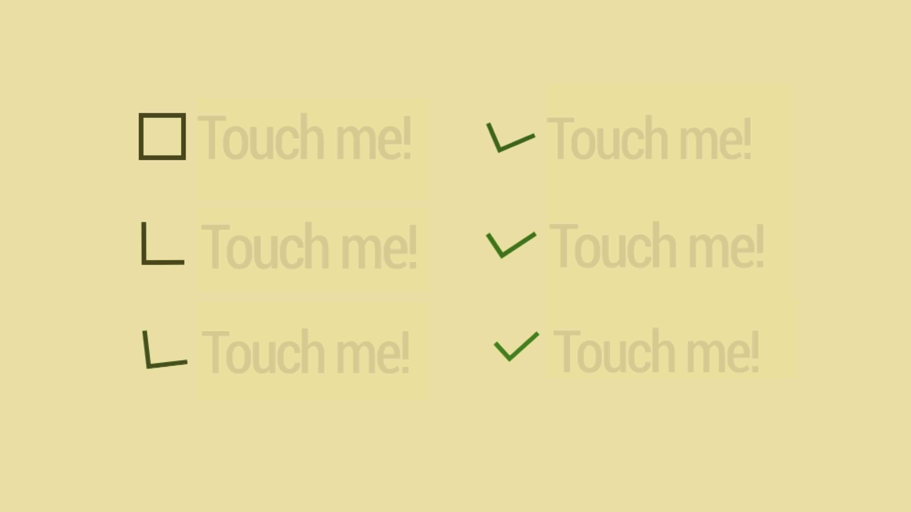

# CSS řešení: Zeldmanovo zatržítko

Podíváme se na další z řešení, které jsem ukazoval v přednášce [na WebExpo 2016](https://www.vzhurudolu.cz/prednaska/webexpo-2016-246).

Je to jednoduchá, ale efektní věc postavená na [animovaných přechodech](css3-transitions.md) a [transformacích](css3-transformations.md). Zatržítko mě zaujalo právě svou jednoduchostí.

Proč Zeldmanovo? Řešení jsem poprvé viděl na [studio.zeldman.com](http://studio.zeldman.com/).

Podívejte se: [cdpn.io/e/ozgPwm](https://codepen.io/machal/pen/ozgPwm).



Jak na to? 

## 1. Na HTML nic není…

…a to je dobře, protože řešení je díky tomu plně přístupné a funkční i ve starých prohlížečích.

```html
<label class="checkbox">
  <input type="checkbox" class="checkbox__input" />  
  <span class="checkbox__label">Touch me!</span>
</label>
```

Jak na vlastní vzhled zatržítka? Stylování samotného checkboxu funguje jen v prohlížečích postavených na jádrech Webkit a Blink. Pomocí `appearance: none` bychom zrušili jeho výchozí styl a pak z něj prostě udělali běžný čtverec s rámečkem.

My ale chceme univerzální řešení. Jedno z nich spočívá v překrytí nativního zatržítka  vrstvou a přidání falešného zatržítka do druhé.


## 2. Překryjte nativní zatržítko

Z rodiče uděláme kontejner pro absolutní pozicování: 

```css
.checkbox {
  position: relative;  
  …
}
```

Z nového pseudoelementu pak vytvoříme překryvnou vrstvu:

```css
.checkbox__label:before {
  content: ' ';
  display: block;
  position: absolute;
  top: 0;
  left: 0;
  height: 2.5rem;
  width: 2.5rem;
  background: #EDE29F;  
}
```

## 3. Vytvoříme falešné zatržítko

Pomůžeme si dalším pseudoelementem:

```css
.checkbox__label:after {
  content: ' ';
  display: block;
  position: absolute;
  top: 0;
  left: 0;  
  height: 2.5rem;
  width: 2.5rem;
  border: .35rem solid #48440E;
  background: #EDE29F;  
  transition: 200ms;  
}
```


## 4. Nastylujeme cílový vzhled zatržítka

```css
.checkbox__input:checked ~ .checkbox__label:after {
  border-top-style: none; 
  border-right-style: none;
  transform: rotate(-45deg);
  height: 1.25rem;
  border-color: green;
}
```

Jakmile na něj někdo klikne: 

- zmizí horní a pravý rámeček (`border-*` pravidla)
- otočí se o 45 stupňů doleva (`transform: rotate(-45deg)`)
- zmenší se výška na polovic (`height: 1.25rem`)
- zmení se barva rámečku (`border-color: green`)

Všimněte si, že využíváme vlnovkový selektor pro elementy se stejným rodičem. Podívejte se i na další [CSS3 selektory](css3-selektory.md).

## 5. Animujeme!

Tohle je ta jednodušší část. Pomohou nám [animace přechodů](css3-transitions.md). Však se podívejte na kód:

```css
.checkbox__input {
  transition: 100ms;
}
```

## Náhradní řešení pro staré Explorery

Řešení bude fungovat v Internet Exploreru od verze 10 a všech dnešních prohlížečích.  

V IE 8 a 9 by se ale zobrazovalo špatně. Důvody jsou v nepodpoře CSS transformací konkrétního typu nebo pokročilejších selektorů. Nemůžeme proto použít detekci vlastností. Pomohou nám [podmíněné body třídy](https://css-tricks.com/snippets/html/add-body-class-just-for-ie/). Problematické části prostě odstraníme:

```css
.old-ie .checkbox__label:before,
.old-ie .checkbox__label:after {
  display: none;
}
```

Staré Explorery pak zobrazí klasický systémový checkbox.

A je to. Tady je živé demo: [cdpn.io/e/ozgPwm](https://codepen.io/machal/pen/ozgPwm).
