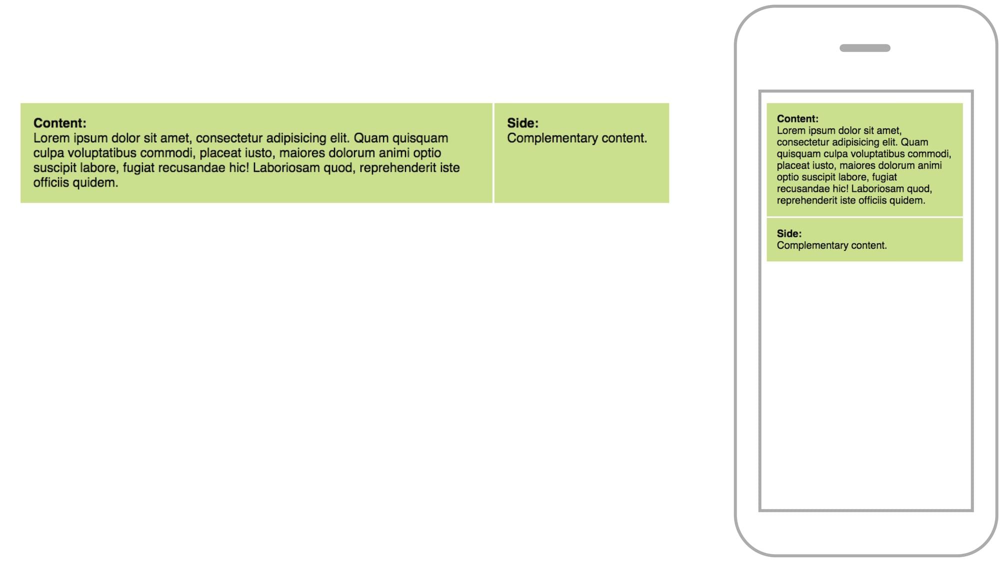
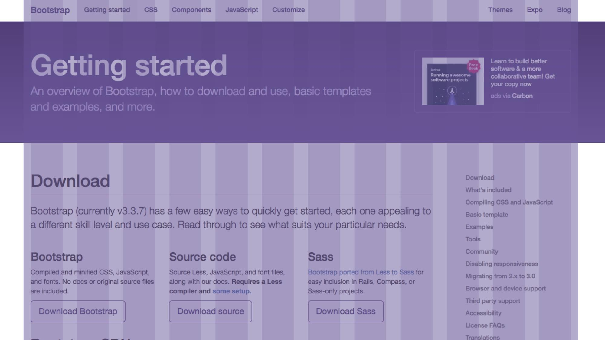

# Responzivní layout

Pro rozvržení celé stránky nebo jednotlivých komponent máme několik technických možností. Jako výchozí vám doporučím používat flexbox, ale projdeme si je všechny. Používáte rozvržení do mřížky? Za momentík vám povím něco i o něm.

## Flexbox

Flexbox se prohlížeče naučily relativně nedávno, ale buďme za něj rádi, protože jde o první pořádný nástroj pro tvorbu layoutu v CSS. Oproti „float“ a jiným technikám ze staré školy má řadu výhod. 

Sám flexbox používám jako výchozí variantu pro jakékoliv v něm realizovatelné rozvržení stránky nebo její komponenty. Podpora v prohlížečích je téměř plná. 

Vezměme jednoduché dvousloupcové rozvržení stránky:

```html
<div class="layout">
  <div class="col col-main"> … </div>
  <div class="col col-complementary"> … </div>  
</div>  
```

Sloupce bychom chtěli rozdělit na tři a jednu čtvrtinu šířky. Jednoduchá krása flexboxu je pak vidět v CSS kódu:

```css
.col-main { flex: 3; }  
.col-complementary { flex: 1; }
```

Pomocí [Media Queries](css3-media-queries.md), které už známe, pak layout nastavíme jen pro obrazovky od určité šířky:

```css
@media only screen and (min-width: 40em) {
  .layout {
    display: flex;
  }
}
```

<figure>

<figcaption markdown="1">    
*Jednoduchý responzivní dvousloupcový layout tři ku jedné realizovaný flexboxem. Živá ukázka je pro vás připravená na CodePenu. [cdpn.io/e/wobjoq](https://codepen.io/machal/pen/wobjoq)*
</figcaption> 
</figure>

Flexbox je plný užitečných vlastností, ale kvůli tomu relativně složitý. Pro jeho studium doporučuji buď jednodušší online příručku na Vzhůru dolů, nebo svůj e-book „Vzhůru do CSS3“, kde jej podrobně vysvětluji i s příklady.  [vrdl.cz/p/css3-flexbox](https://www.vzhurudolu.cz/prirucka/css3-flexbox) a [vrdl.cz/ebook](https://www.vzhurudolu.cz/ebook)

## Brzy už i Grid Layout

Flexbox je velmi mocná technologie pro jednosměrný typ layoutu. Pokud ale potřebujeme rozvržení po vodorovné i svislé ose, s flexboxem se pracuje hůře. Pro ty účely nově připravilo konsorcium W3.org koncept rozvržení do mřížky, Grid Layout. 

V době vydání knihy už jej některé prohlížeče podporují ve svých veřejných verzích. Na implementaci „gridu“ ale pracují prohlížeče všechny, takže jej už brzy budeme moci začít používat.

Podívejte se na specifikaci nebo web „Grid by Example“ od Rachel Andrew, kterou znáte z Webexpa 2016. [w3.org/TR/css-grid-1/](https://www.w3.org/TR/css-grid-1/) a [gridbyexample.com/examples/](http://gridbyexample.com/examples/)

## Layout pomocí zastarávajících metod: `float`, `position:absolute`, `display:table`, `display:inline-block`…

Nic proti nim. Dlouho nám pomáhaly a tímto jim děkujeme. Je ale dobré vědět, že jde o techniky, které pro tvorbu rozvržení nebyly vymyšleny, takže mají mnoho nevýhod. Když můžete použít flexbox, použijte jej. Pokud flexbox použít nemůžete, inspirujte se návrhovými vzory pro layout na webu „This is Responsive“ od Brada Frosta. [vrdl.in/rtpk3](https://bradfrost.github.io/this-is-responsive/patterns.html#layout)

## Vícesloupcový layout pomocí vlastností `column` 

Primárně slouží k zalamování textů do sloupců na širších displejích. Prostě k „novinové“ sazbě. Může se ale hodit na širších obrazovkách pro dodržení optimální šířky řádku, na což si jistě vzpomínáte z kapitoly o základech typografie. Na webu se to často nepoužívá, ale hodit se může. [vrdl.cz/p/css3-multicolumn](https://www.vzhurudolu.cz/prirucka/css3-multicolumn)

Stručný průlet technickými možnostmi bychom tímto mohli uzavřít. Pojďme si ale ještě doporučit jednu netechnickou, designérskou metodu.

## Tip: používejte mřížku

Mřížka (nebo také „grid“) rozděluje plochu stránky do sloupečků a jednotlivé komponenty rozhraní jsou pak do nich zarovnány.

Je to skvělý nástroj, protože výrazně zrychluje práci kodéra. Opět je to věc, kterou se webařina naučila z tisku. Všechny rozumné noviny a knihy jsou do nějaké mřížky vysázeny. Layout do mřížky díky své pravidelnosti usnadňuje uživatelům, aby stránku pochopili.

<figure>

<figcaption markdown="1">    
*Vizualizovaný grid v Bootstrapu, který toto rozvržení zpopularizoval. Jde ale o prastarý typografický koncept. [getbootstrap.com](http://getbootstrap.com/)*
</figcaption> 
</figure>

Kromě toho je práce s pravidelnou mřížkou pro vývojáře efektivnější. Pokud použijete některou z hotových knihoven v CSS, bude vám stačit pracovat s třídami v HTML a nebudete muset každý kus layoutu stylovat zvláštním CSS kódem. V Bootstrapu 4 například rozdělení stránky na dvě poloviny zařídíme takto jednoduše:


```html
<div class="row">
  <div class="col"> … </div>
  <div class="col"> … </div>  
</div>
```

Více informací o systému pro tvorbu rozvržení do mřížky v Bootstrapu 4 najdete opět na Vzhůru dolů. [vrdl.cz/p/bootstrap-4-grid](https://www.vzhurudolu.cz/prirucka/bootstrap-4-grid)  


