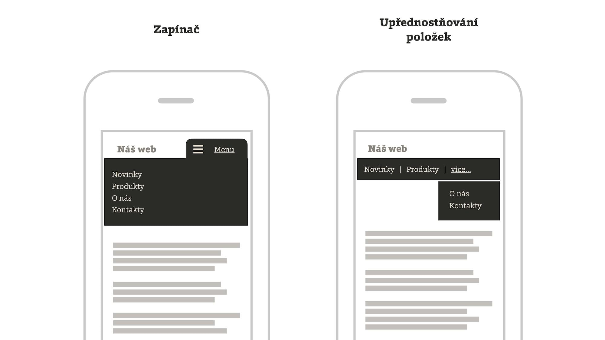

# Návrhové vzory responzivních navigací

Projdeme si osm možností, jak navrhnout navigaci na responzivních webech. Od uživatelsky složitých a implementačně jednoduchých až po ty, ehm, dobré.

<!-- AdSnippet -->

Většina webů si ale vystačí se dvěma: upřednostňujícím a přepínacím vzorem. Podívejme se nejprve na ně.

<figure>

<figcaption markdown="1">    
*Hlavní návrhové vzory pro responzivní navigace: zapínač (také přepínač nebo Toggle) a upřednostňování se schováváním (Priority+)*
</figcaption> 
</figure>

## Upřednostňování položek (Priority+)

Se zmenšující se šířkou obrazovky se zmenšuje i počet položek v navigaci. Na mobilních šířkách obrazovky pak zůstává opravdu jen to důležité. Ostatní položky navigace jsou obvykle dostupné na rozbalení.  

Technicky je možné tento návrhový vzor řešit i dost jednoduše jen pomocí CSS. [cdpn.io/e/adeMzP](https://codepen.io/olach/details/adeMzP) 

## Přepínač (Toggle)

Celou navigaci na malých displejích schováte do tlačítka. Nejčastěji s ikonou „hamburgeru“. Je to nejpoužívanější typ responzivní navigace, jenže má svá úskalí a často je vhodnější použít jiný. Jeho nevýhodou je hlavně skrytí celé navigace, která tím přestává zastávat role, jež má na webu hrát. O schovávání navigace a hamburgeru jsem [už psal](mobilni-navigace-hamburger.md). 

Návrhový vzor *přepínač* zpopularizoval například framework Bootstrap a najdete jej na většině dnešních responzivních webů. 

### Speciální varianta přepínače: vyjíždění do obrazovky (Off Canvas)

Chování, které znáte z nativních aplikací. Nejobvyklejší je vyjíždění ze strany, které je vhodné pro schovávání bohatého obsahu. V tom případě ale není dobrý nápad použít ikonu hamburgeru. Podívejte se na ukázky od Luka Wroblewskiho. [lukew.com/ff/entry.asp?1569](https://www.lukew.com/ff/entry.asp?1569)

### Víceúrovňové navigace: speciální varianta a speciální úroveň ošemetnosti

Oba už zmíněné návrhové vzory je samozřejmě možné použít i pro víceúrovňové navigace. Jen opatrně, protože uživatelské ovládání na mobilech nemusí být nejpříjemnější. Řešení vždy testujte.

<!-- AdSnippet -->

Demo víceúrovňové navigace na pěkném webu „Adventures in Responsive Navigation“. [vrdl.in/t2n7r](http://responsivenavigation.net/examples/multi-toggle/index.html)

## Konverze do jiného stylování

Pokud v navigaci zvládnete mít jen nízké jednotky položek, můžete je  zobrazit všechny a na malých obrazovkách jen upravit stylování. 

## Přestylování a skok do patičky

Navigace je v HTML někde dole. Na malých displejích je umístěná v patičce. Na velkých displejích se pomocí stylů umístí do hlavičky. Implementačně je *skok do patičky* asi nejméně náročná volba. Uživatelsky ovšem dle mého názoru málo přívětivá. Umístění navigace je takto nekonzistentní napříč zařízeními. Dnes už bych *skok* na běžné weby nepoužil. Snad jen v opravdu jednoduchých případech. [vrdl.in/9em7w](http://responsivenavigation.net/examples/clean-grid/index.html)

## Konverze do `<select>`

Navigaci pomocí Javascriptu na mobilech proměníte v nativní seznam položek. Výhodou je opět jednoduchá implementace. Nevýhodou horší uživatelská přívětivost seznamu položek na mobilních zařízeních. Ukázka je na CSS Tricks. [vrdl.in/navsel](https://css-tricks.com/convert-menu-to-dropdown/)

## Navigace jen v patičce

Na některých webech hlavní navigaci v hlavičce nepotřebujete. Žádná speciální péče o mobilní zařízení pak není potřebná.

## Vzor „nohy nahoru a nedělat nic“

Raději zmíním i tento „návrhový vzor“. Jak jsem psal [v textu o ikoně hamburgeru](mobilni-navigace-hamburger.md), často se navigace na mobilech schovává zbytečně. Když v ní máte velmi málo položek, tohle je nejlepší řešení: uvařit si kafe, dát nohy nahoru a nedělat nic.

Podívejte se na video „Responzivní navigace“.

YouTube: [youtu.be/D4IDwYCWfJk](https://www.youtube.com/watch?v=D4IDwYCWfJk)

