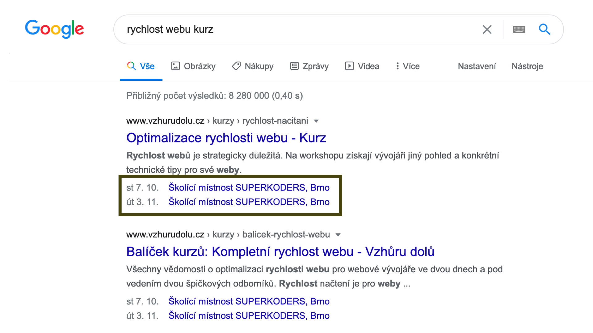
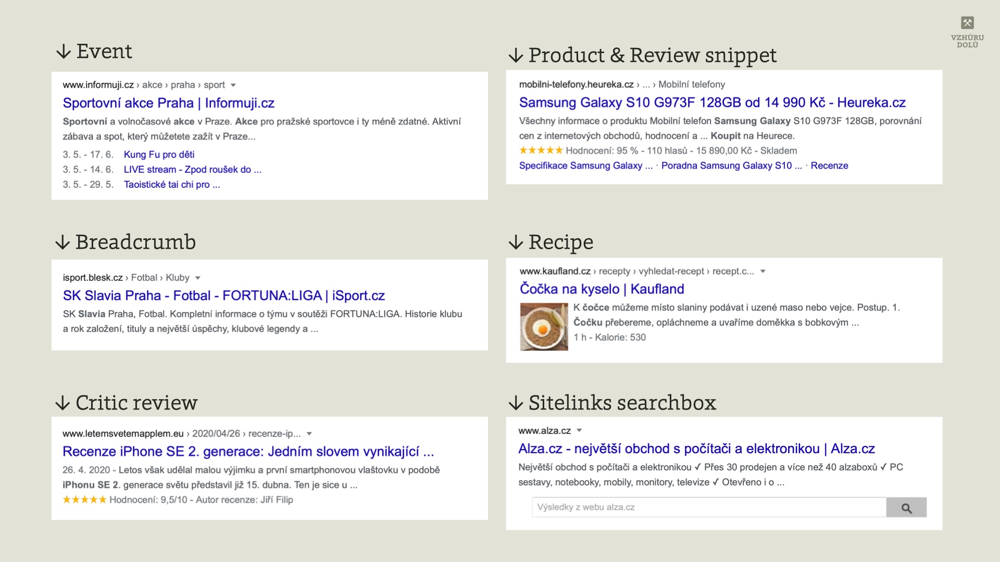
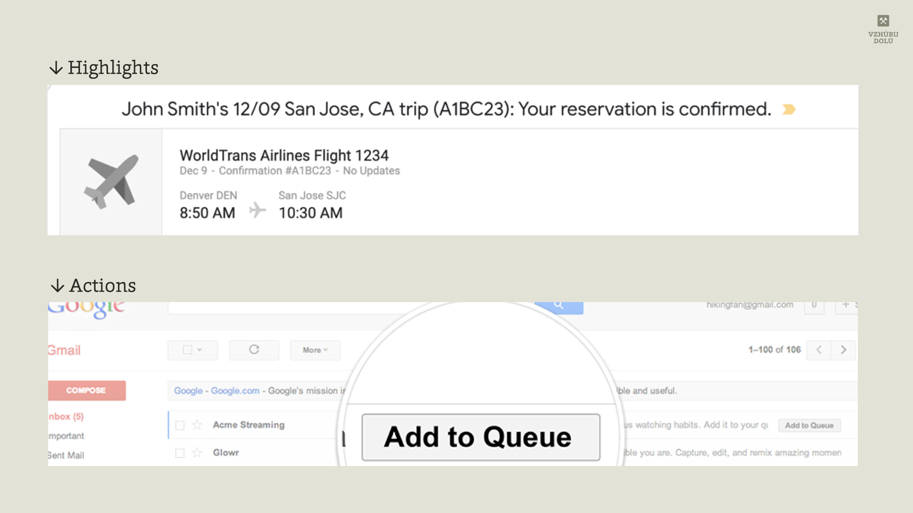

# Strukturovaná data (aneb Rich Snippets): Kódem za atraktivnější výsledky vyhledávání pro váš web

Strukturovaná data (nebo také „strukturované úryvky“) umí zajistit vizuálně zajímavý formát zobrazení ve výsledcích vyhledávání Google – „Rich Snippets“.

Zjednodušeně řečeno do stránky přidáte nějaký kus kódu ve formátu JSON-LD, jako v tomto případě strukturovaný popis události…

```html
<script type="application/ld+json">
{
  "@context": "http://schema.org",
  "@type": "Event",
  "name": "Optimalizace rychlosti webu"
}
</script>
```

…a ve výsledcích vyhledávání se časem objeví speciální výpis této informace:

<figure>

<figcaption markdown="1">
*Obrázek: Strukturovaná data typu Event ve výsledcích vyhledávání Googlu.*
</figcaption>
</figure>

Pojďme ale od tohoto triviálního příkladu více do hloubky.

## Obsah {#toc}

<div markdown="1" id="toc" class="f-6">

- [Typy strukturovaných dat](#typy)
- [Vložení do stránky](#vlozeni)
- [Příklad s událostí](#priklad)
- [A co jiné vyhledávače?](#jine-vyhledavace)
- [Kontroverze](#kontroverze)
- [Dynamické vložení dat](#dynamicky)
- [A co Gmail?](#gmail)
- [Závěr](#zaver)

</div>

Strukturovaná data jsou standardizovaný formát pro poskytování informací o stránce a pro třídění obsahu stránky. Vyhledávání Google také strukturovaná data používá k aktivaci zvláštních funkcí a vylepšení výsledků vyhledávání.

<!-- AdSnippet -->

Zároveň jde z pohledu HTML kódu o jeden z nejsilnějších nástrojů pro získávání konkurenční výhody ve vyhledávači. Je to logické, ale bylo také mnohokrát prokázáno, že vizuální atraktivita výsledku vyznačených pomocí Rich Snippets zvyšuje šanci, že na ně uživatelé kliknou (a tedy zlepšuje míru prokliku, CTR).

Podívejte se na video „Strukturovaná data“.

YouTube: [youtu.be/IRU9RZU9wHQ](https://www.youtube.com/watch?v=IRU9RZU9wHQ)

## Jaké typy strukturovaných dat můžeme do zdrojáku vložit? {#typy}

Je jich hodně, ale ne všechny mají smysl pro všechny weby a ne všechny fungují na českém Google.

Strukturovaná data většinou používají slovník ze [Schema.org](https://schema.org/). Pokud jde ale o zobrazování ve vyhledávání Googlu, měli byste se raději spoléhat na dokumentaci na webu [developers.google.com](https://developers.google.com/search/docs/guides/search-gallery).

Do tabulky jsem vybral ty nejzajímavější „rich snippety“. Odkazy v tabulce vedou na dokumentaci jednotlivých typů dat.

<div class="f-6 rwd-scrollable"  markdown="1">

| Název | Český Google? | Popis |
|:------|:-------------:|:----- |
| [Article](https://developers.google.com/search/docs/data-types/article)               | \+           | Článek (zprávy, sport, blog) s možným výpisem v Top Stories karuselu a dalšími „rich results“.            |
| [Book](https://developers.google.com/search/docs/data-types/book)                     |              | Informace o knize a možnost ji koupit přímo z výsledků vyhledávání.                                       |
| [Breadcrumb](https://developers.google.com/search/docs/data-types/breadcrumb)         | \+           | Ve výsledcích vyhledávání ukazuje pozici stránky v hierarchii webu.                                       |
| [Carousel](https://developers.google.com/search/docs/data-types/carousel)             | \+           | Zobrazí posuvný karusel, většinou i s obrázky. Funguje s typy Article, Recipe, Course, Restaurant, Movie. |
| [Course](https://developers.google.com/search/docs/data-types/course)                 |              | Vzdělávací kurzy, které se zobrazí ve výpisu pod sebou.                                                   |
| [Critic review](https://developers.google.com/search/docs/data-types/critic-review)   |              | Ukázka z delší, profesionální recenze. Funguje s typy Book, Movie, Local business.                        |
| [Event](https://developers.google.com/search/docs/data-types/event)                   | \+           | Typicky kulturní nebo sportovní události. Lze použít i např. na kurzy.                                    |
| [FAQ](https://developers.google.com/search/docs/data-types/faqpage)                   |              | Často kladené otázky. Zobrazí rozklikávací seznam otázek a odpovědí.                                      |
| [How-to](https://developers.google.com/search/docs/data-types/how-to)                 |              | Návod, jehož kroky se zobrazí v přehledném karuselu.                                                      |
| [Local Business](https://developers.google.com/search/docs/data-types/local-business) | \+           | Informace o firmě, její adrese, otevírací době. Zobrazuje se v postranní liště výsledků vyhledávání.      |
| [Logo](https://developers.google.com/search/docs/data-types/logo)                     | \+           | Logo firmy nebo organizace.                                                                               |
| [Movie](https://developers.google.com/search/docs/data-types/movie)                   |              | Informace o filmu, se kterými je možné se dostat do „Movie Carousel“.                                     |
| [Product](https://developers.google.com/search/docs/data-types/product)                         | \+           | Produkt, jeho název, cena a dostupnost.                                                                            |
| [Q&amp;A](https://developers.google.com/search/docs/data-types/qapage)                             |              | Otázky a odpovědi. Podobné zobrazení jako u FAQ.                                                                   |
| [Recipe](https://developers.google.com/search/docs/data-types/recipe)                           | \+           | Recept, včetně obrázku, videa nebo délky trvání. Zobrazuje se ve zvláštním karuselu.                               |
| [Review snippet](https://developers.google.com/search/docs/data-types/review-snippet)           | \+           | Shrnutí uživatelských recenzí. Lze používat u typů Book, Recipe, Movie, Product, Software App, and Local business. |
| [Sitelinks Searchbox](https://developers.google.com/search/docs/data-types/sitelinks-searchbox) | \+           | Vyhledávání na webu přímo ze stránky výsledků Googlu.                                                              |
| [Video](https://developers.google.com/search/docs/data-types/video)                             | \+           | Video i s možností definovat segmenty, tedy části na které je možné přímo skočit.                                  |

</div>

Kompletní dokumentaci všech strukturovaných dat hledejte na [developers.google.com](https://developers.google.com/search/docs/guides/search-gallery).

<figure>

<figcaption markdown="1">
*Obrázek: Některé z typů strukturovaných dat, které lze používat na českém Googlu.*
</figcaption>
</figure>

## Jak strukturovaná data do webu vložit? {#vlozeni}

Je několik možností jak Google poprosit o zobrazování vašeho obsahu v úryvcích. Začneme ale nástroji pro ověření, zda máte data v pořádku.

### Kontrola {#vlozeni-kontrola}

Možná už strukturované úryvky na webu máte a potřebovali byste jen ověřit, zda je vše v cajku. Tady pomohou následující nástroje.

- [Google Search Console](google-search-console.md) v sekci „Strukturovaná data, která nelze analyzovat“ zobrazuje přehledný graf o počtu nepovedených Rich Snippets na vašem webu.
- [Test rozšířených výsledků](https://search.google.com/test/rich-results) vám velmi pomůže, protože je dostupný i bez Search Console.

### Vložení pro klikače {#vlozeni-klikani}

- [Zvýrazňovač dat](https://support.google.com/webmasters/answer/2692911) (Data Highlighter) je starší nástroj, kde se napojíte na weby, které máte v Search Console a v průvodci si na něm naklikáte některé Rich Snippets.
- [Pomocník](https://www.google.com/webmasters/markup-helper/) je někde na půl cesty mezi klikáním a kódem. Umí také vygenerovat strukturované úryvky pro e-mailové klienty (asi jen Gmail).

### Vložení pro vývojáře {#vlozeni-vyvojari}

Protože jsme na kodérském webu, ukážeme si jak lze strukturované úryvky vyznačit přímo v kódu:

- [JSON-LD](http://json-ld.org/) – formát, který Google doporučuje, s čímž naprosto souhlasím. Do datového bloku v HTML kódu ve [značce `<script>`](html-script.md) vložíte strukturované informace ve formátu podobném JSONu.
- [Microdata](https://www.w3.org/TR/microdata/) – starší formát, kdy se data vkládala do HTML značek, např. `<p itemprop="description">` se používal pro vložení popisu události.
- [RDFa](https://www.w3.org/TR/rdfa-lite/) – ještě starší formát. Velmi podobný mikrodatům – `<span property="name">Martin Michálek</span>`.

Pokud můžete, používejte JSON-LD. Oddělíte si tak data pro vyhledávač od HTML, což je výhodné.

## Příklad s událostí {#priklad}

Pojďme si zápis demonstrovat na schématu _Event_, které může označovat sportovní nebo kulturní události. Nebo taky [školení](https://www.vzhurudolu.cz/kurzy):

```html
<script type="application/ld+json">
{
  "@context": "http://schema.org",
  "@type": "Event",
  "name": "Mistrovský vývoj webů na WordPressu",
  "description": "Vyvíjet weby na míru s WordPressem může být fajn zážitek.",
  "startDate": "2019-09-14T09:30",
  "url": "http:\/\/www.vzhurudolu.cz\/kurzy\/wordpress",
  "location": {
    "name": "KC Greenpoint",
    "url": "http://www.kc-greenpoint.cz",
    "@type": "Place",
    "address": {
      "@type": "PostalAddress",
      "addressLocality": "Praha",
      "streetAddress": "Dvouletky 529/ 42",
      "postalCode": "100 00"
    }
  },
  "offers": {
    "@type": "Offer",
    "price": "4490",
    "priceCurrency": "Kč",
    "url": "http:\/\/www.vzhurudolu.cz\/kurzy\/wordpress"
  }
}
</script>
```

Všimněte si několika věcí:

- `startDate` a jakékoliv časové údaje je potřeba stroji poskytnout v ISO formátu.
- Schémata je do sebe možné zanořovat – viz zde vložené typy obsahu _Place_ a _Offer_.

Ve výsledcích vyhledávání Googlu to pak může vypadat tak jako vidíte v první obrázku článku.

## A co jiné vyhledávače? {#jine-vyhledavace}

Tento formát vkládání [podporuje](https://www.bing.com/webmaster/help/marking-up-your-site-with-structured-data-3a93e731) také vyhledávač Bing, jen musíte počítat s daleko menším počtem podporovaných vlastností.

Český Seznam.cz strukturovaná data podporuje jen velmi málo až vůbec, alespoň podle Dušana Janovského:

> V organiku jenom odkazy na kotvy do obsahu (typicky Wikipedie, ale i jiné weby). O ničem jiném nevím, ale je možné, že tam ještě něco máme. Osobně vnímám jako problematické ověřování těch informací a jako odstrašující příklad rád udávám ty hvězdičky z “hodnocení”.
>
> — *<cite>Dušan Janovský [na Twitteru](https://twitter.com/janovsky/status/1256676009685979136)</cite>*

## Kontroverze. Jen velmi mírná, ale přesto si neodpustím rýpnutí… {#kontroverze}

Vývojářská část mého srdce plakala, když jsme kdysi data pro vyhledávače vkládali do HTML pomocí atributů a tedy formátu Microdata. Způsobovalo to horší přehlednost a spravovatelnost kódu. Vkládání pomocí JSON-LD tyto nevýhody nemá, ale nějaké mouchy bych tady viděl.

<!-- AdSnippet -->

Předně se nám z pohledu vývojáře – s tím jak přibývají Rich Snippets – stále více rozpojuje struktura stránky v HTML pro uživatele s tím, co po nás chtějí stroje. Znamená to tedy práci na dvou místech, což je vždy méně efektivní a pak také náchylnější k chybám.

### Strukturovaná data a rychlost webu {#kontroverze-rychlost}

JSON-LD vnímám jako problematický i jako specialista [na rychlost webu](https://www.vzhurudolu.cz/rychlost-nacitani). JSON-LD zvětšuje velikost úvodního HTML, které je kritické pro rychlost prvního renderingu stránky. U většiny klientů zatím jen o jednotky procent dat, ale ono to bude růst.

### Nemá to být mimo HTML? {#kontroverze-mimo}

Dávalo by smysl ta data poskytovat mimo dokument, jako externí JSON soubor, že…? A to už jsme kousek od metody, která mě připadá optimální – API. Nějaké první pokusy u Googlu představuje jejich [Indexing API](https://developers.google.com/search/apis/indexing-api/v3/quickstart), takže jsem zvědavý, jak moc se to bude vyvíjet.

### Zneužívání strukturovaných dat {#kontroverze-zneuzivani}

Podvody se strukturovanými daty jsou problém, na který ve výše uvedeném tweetu narážel i Dušan Janovský. Mnoho SEO fiškulínů se snažilo dostat například hvězdičkové hodnocení i do typů obsahu, pro které původně určený nebyl – typicky k článkům.

Podívejte se na video „Tomáš Bukovský: Zvýší vám rich snippety návštěvnost?“.

YouTube: [youtu.be/rv_HgfAJRec](https://www.youtube.com/watch?v=rv_HgfAJRec)

Google to ale začal více hlídat a [od roku 2019](https://webmasters.googleblog.com/2019/09/making-review-rich-results-more-helpful.html) už je možné hvězdičky zobrazovat jen u konkrétních typů obsahu.

## Dynamické vložení dat {#dynamicky}

Pokud z nějaké důvodu nemůžete vložit datové úryvky přímo do HTML, je možné využít dynamického vložení. Existují dva způsoby:

1. [Google Tag Manager](google-tag-manager.md) – pomocí funkce „Custom HTML“ vložíte strukturovaná data. [Více informací](https://developers.google.com/search/docs/guides/generate-structured-data-with-javascript#use-google-tag-manager).
2. Vložení vlastním JavaScriptem – stáhnete data a dynamicky je vložíte do značky `<script>` v DOMu. [Více informací](https://developers.google.com/search/docs/guides/generate-structured-data-with-javascript#custom-javascript).

Zatím jsem to nikde nezkoušel, ale je třeba si uvědomit, že zpracování JavaScriptu na straně uživatele bude vždy z principu pomalé, takže bych výrazně preferoval umístění dat do HTML už na serveru.

## A co Gmail? {#gmail}

Jak už mnozí z vás vědí, podobná technologie se používá také pro vkládání speciálních funkcí e-mailů v Gmailu.

<figure>

<figcaption markdown="1">
*Obrázek: Zvýraznění (Highlights) a rychlé akce (Actions) v Gmailu. I tohle dokážou zařídit strukturovaná data.*
</figcaption>
</figure>

Do příchozí zprávy v Gmailu je možné vkládat tlačítka pro rychlé akce, shrnutí objednávek, faktur, rezervací a mnohé, mnohé další.

Nikdy jsem se tím do hloubky nezabýval, takže to zde uvádím hlavně pro kontext a odkážu vás na [oficiální dokumentaci](https://developers.google.com/gmail/markup/reference).

## Open Graph {#og}

Velmi podobná věc jako Rich Snippets je Open Graph a podobné specifikace. I ty se snaží o sémantický popis stránky. Nikolik však jejího obsahu jako spíše stránky jako celku:

```html
<meta property="og:title" content="Titulek stránky">
<meta property="og:image" content="obrazek.jpg">
```

O [Open Graph, Twitter Cards a oEmbed](meta-open-graph.md) píšu ve zvláštním textu.

## Závěr {#zaver}

Jak jsem uvedl, svoje problémy strukturovaná data mají, ale pragmaticky vzato:

Velmi doporučuji data v JSON-LD připravovat.

Většinou jde o pár hodin vývojářské práce, ale efekt pro návštěvnost může být velmi slušný.

<!-- AdSnippet -->
