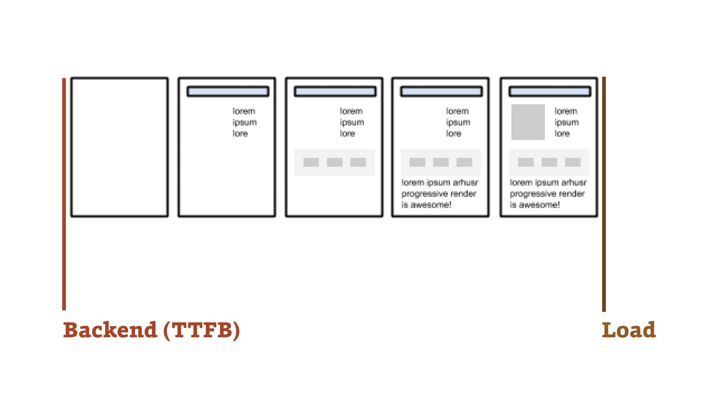

# 7 blbostí z oblasti webové rychlosti

V praxi poradce k rychlosti webů musím často vysvětlovat některá koncepční nepochopení. Teď nastává ta chvíle, kdy je milerád vyvrátím.

<div class="toc web-only f-6" markdown="1">

1. [Pomůže zlepšit čas načtení (load time)](#1)
2. [Je to problém backendu](#2)
3. [Může za to WordPress (nebo jiná platforma)](#3)
4. [Google Analytics ukazují pěkná čísla](#4)
5. [Zrychlíme to zmenšením datového objemu](#5)
6. [Řešení je snížit počet dotazů na server](#6)
7. [Zmenšíme datový objem obrázků a tím to vyřešíme](#7)

</div>

<!-- AdSnippet -->

Z [dřívějšího textu](rychlost-nacteni.md) už víme, že rychlost načítání není bod v čase. Že jde o časový úsek – uživatelský prožitek během načítání a vykreslování stránky. Pokud tohle přijmeme, můžeme společně konstatovat, že uvedených sedm prohlášení jsou vážně – *ehm* – blbosti.

<p class="video">
Video: <a href="https://www.youtube.com/watch?v=u0UhPmLpZnc">Blbosti kolem webové rychlosti</a> ~ Téma textu v přednášce z brněnského srazu Frontendisti.cz.
</p>

V textu diskutuji s „imaginárním vymlouvačem“. Představme si sedm reakcí na moji zprávu, že web je prostě pomalý. Tady je ta první:

## 1) „Pomůže zlepšit čas načtení (load time)“ {#1}

Ale jistě, je dobré o něj usilovat, ale nestačí to. Load time patří mezi [všemi událostmi](metriky-rychlosti.md), které vznikají na časové ose vykreslování webu, k těm méně zajímavým.

Vzniká až ve chvíli, kdy prohlížeč stáhl všechny zdroje, které ke stránce stáhnout měl – styly, skripty, ale i obrázky. Jenže to už může být stránka velmi dlouho vykreslená.

Tato konkrétní metrika je navíc technicky zaměřená a neříká nic o uživatelském prožitku.

<figure>

<figcaption markdown="1">
*Dva příklady vykreslování stránky. Oba mají stejný datový objem, stejnou událost Load, ale vykreslují se různě*
</figcaption>
</figure>

Srovnejme na obrázku uvedené časové osy renderingu: U druhé sice nastane událost Load dříve, ale uživatelský prožitek z vykreslování bude vážně o ničem. Zvýší se pravděpodobnost, že někteří uživatelé po vteřinách sledování bílé obrazovky utečou.

## 2) „Je to problém backendu“ {#2}

Není. Nebo ne obvykle. Když vezmu české weby, které jsem dosud zkoumal, čas backendu se obvykle vejde do vteřiny, velmi často je i menší než ideální půl vteřina.

Zato na frontendovou mašinerii musejí nebozí uživatelé čekat *dloooouhé* vteřiny. Případy, kdy se na pomalejším 3G na mobilu něco děje desítky vteřiny nejsou tak vzácné, jak bych si přál.

<blockquote class="twitter-tweet"><p lang="cs" dir="ltr">Zajímavé, jak rozšířená je myšlenka „náš web je pomalý, protože běží na pomalé platformě [dosaďte oblíbenou]“.<br>90 % problémů je přitom na frontendu.</p>&mdash; Martin Michálek (@machal) <a href="https://twitter.com/machal/status/1047423382017462272?ref_src=twsrc%5Etfw">October 3, 2018</a></blockquote>
<script async src="https://platform.twitter.com/widgets.js" charset="utf-8"></script>

Moje tvrzení na Twitteru sice není založené na širším výzkumu, ale praxe českých a slovenských webů mě ho stále potvrzuje.

<!-- AdSnippet -->

Opět navíc platí – backendový čas je technická metrika, která na vnímanou rychlost webu vliv má, ale není jediná určující. Má vliv na prožitek při procházení webu. Velká část frontendu se vám načte při otevření první stránky, takže při přechodu na další stránku nezpomaluje. Po kliknutí na další stránku už začíná být rychlost backendu důležitá u všech webů.

Mýtus zaměření se na rychlost backendu (jinak také [Time To First Byte, TTFB](metriky-rychlosti.md#TTFB)) uvádím záměrně hned za událostí Load (celkové načtení webu). Představují totiž dva extrémy v časové ose, kterým lidé přikládají zbytečnou důležitost.

<figure>

<figcaption markdown="1">
*Backend a Load time, dvě krajní (a ne až tak zajímavé) metriky na časové ose*
</figcaption>
</figure>

Daleko zajímavější jsou z pohledu prožitku uživatele [události](metriky-rychlosti.md), které vznikají mezi těmito dvěma póly: First Contentful Paint (FCP), Speed Index (SI) nebo úplně nejvíc Time To Interactive (TTI).

## 3) „Může za to WordPress (nebo jiná platforma), my s tím nic nenaděláme“ {#2}

*„Když už nevíte kudy kam, hoďte to na WordPress.“* (Cituje z Babicovy kuchařky líného webového vývojáře.)

WordPress (a platformy) obecně bývají často obviňovány z pomalosti. Ale jsou to opět jen mýty a předsudky.

Jeden nedávný průzkum, kde WordPress „vyšel“ jako „nejpomalejší platforma“ jsem [nedávno komentovat a porovnával](https://www.vzhurudolu.cz/blog/125-wordpress-richman) s čistými instalacemi WordPressu, které poskytl [Honza Bien](https://www.vzhurudolu.cz/lektori/jan-bien). Výsledky vás jistě nepřekvapí:

| Weby                           | TTFB   |
|--------------------------------|-------:|
| Weby ze studie D. Richmana     | 1,73 s |
| Čistá instalace WordPressu     | 0,38 s |
| blog.seznam.cz                 | 0,17 s |

Ano, za pomalé weby nemůže WordPress, ale vývojáři – nebo častěji amatérští správci – konkrétních webů. A ano, nejčastěji se to pokazí bezhlavou instalací všech možných pluginů.

<div class="related" markdown="1">
- [Jak zrychlit web](jak-zrychlit-web.md)
- [Proč řešit rychlost](rychlost-nacitani-proc.md)
- [Metriky rychlosti](metriky-rychlosti.md)
</div>

Mluvím jen o WordPressu, ale vztahuje se to na všechny platformy, jejichž frontendové a backendové nastavení mají v moci vývojáři konkrétních webů.

Srovnání rychlosti webů běžících na jednotlivých CMS [dělali v Reshoper](https://www.reshoper.cz/datablog/studie-jak-rychle-jsou-ceske-e-shopy/), jenže opět platí, že to spíše vypovídá něco o daných webech než o platformách. Mimochodem, „vyhrály“ to e-shopy běžící na Shoptetu. Jenže jak už jsem naznačil – může to říkat i spoustu jiných věcí, než že právě tenhle redakční systém je dobrou volbou pro vytvoření rychlého e-shopu.

## 4) „Google Analytics nám ukazují pěkná čísla“  {#4}

To je fajn, ale Analytics ukazují jen backendový, síťový čas a celkovou dobu načtení. A jak už jsem říkal – tyhle metriky nepřeceňujme.

<figure>

<figcaption markdown="1">
*Co vám o rychlosti ukazují Google Analytics? V základním nastavení nic úžasného*
</figcaption>
</figure>

Na druhou stranu – na Analytics je skvělé, že tyto hodnoty ukazují od reálných uživatelů a s možností filtrovat různé kontexty.

Je také výborné, že si do nich můžete sami ukládat [uživatelská časování](https://developers.google.com/analytics/devguides/collection/analyticsjs/user-timings). Takže se v GA můžete směle dívat na rozumnější metriky, stačí si to doprogramovat.

Věřím také, že Google pravděpodobně časem do Analytics přidá podobné vlastnosti jaké jsou k dispozici v nových PageSpeed Insights – metriky FCP (First Contentful Paint) a TTI (Time To Interactive) přímo od uživatelů [z Chrome UX Report](chrome-ux-report.md).

Takže: Výchozí hodnoty nepřeceňujme, ale Analytics jako nástroj rozhodně nezavrhujme.

## 5) „Zrychlíme to zmenšením datového objemu stránky“ {#5}

Zrychlíte, ale na celkovém uživatelském prožitku to nemusí být znát.

Už to asi vyplynulo z předchozího textu, ale pro jistotu opakuji: Má smysl se soustředit jen na uživatelský prožitek při renderingu stránky.

<!-- AdSnippet -->

Datový objem s tím nemusí mít nic společného. Čistě teoreticky se může stát, že snížením datového objemu zhoršíte UX zobrazování stránky.

Opět tedy platí: Datový objem je potřeba sledovat, ale jen jako vedlejší metriku.

## 6) „Zrychlíme to snížením počtu dotazů na server“ {#6}

Můžeme ale nemusíme. Platí to samé jako u předchozího bodu.

I tady platí: Je to dobrý směr uvažování, ale ne priorita. Pokud váš web běží na [HTTP/2](http-2.md) (což by měl), na množství requestů ve většině případů zase tak moc nezáleží.

Nová verze protokolu vám pak umožní kejkle, kterými budete chtít počet requestů dokonce uměle navyšovat. Zde je ukázka ze zdrojáku Vzhůru dolů:

```html
<link rel="stylesheet" href="/css/1-base.min.css?7477">
<link rel="stylesheet" href="/css/2-components.min.css?3690">
<link rel="stylesheet" href="/css/3-libraries.min.css?6821">
<link rel="stylesheet" href="/css/4-helpers.min.css?3690">
```

Proč myslíte, že jsem jeden stylopis rozdělil do čtyř a cíleně tak zvýšil počet souborů na webu?

Ano, klíč je v těch číslech za otazníkem. Vyjadřují datum a čas poslední změny souboru. Uživatel totiž [stáhne jen měněné části CSS](https://alistapart.com/article/the-best-request-is-no-request-revisited). Nikoliv tedy celý soubor pokaždé když ve stylech něco změníme.

Kreativní práce s dotazy na server má na HTTP/2 své limity, ale pojďme si obecně říci, že nutnost vždy a všude zmenšovat počet dotazů na server je — prostě *mýtus*.

## 7) „Zmenšíme datový objem obrázků a tím to vyřešíme“ {#7}

Optimalizací obrázků můžeme web zrychlit, ale až v pozdějších fázích vykreslování.  Takže opět platí – je to rozumné, ale obvykle to není priorita.

<figure>

<figcaption markdown="1">
*Obrázkový obsah má nízkou prioritu, takže se stahuje až po stylech a skriptech*
</figcaption>
</figure>

Obrázky jsou zdroj, na který prohlížeč při optimalizaci webu nečeká. Daleko větší službu udělá datové optimalizace CSS a synchronních JavaScriptů, hlavních kritických zdrojů pro vykreslení stránky.

Optimalizaci *servírování* obrázků ale udělejte. Obsah `` sice má nízkou prioritu stahování, může ale odsouvat některé důležité  zdroje odkazované v CSS: webfonty, ikony a tak dále.

Nasaďte [lazy loading](lazy-loading.md) na všechny obrázky, které nepotřebujete indexovat vyhledávači. Servírujte obrázky v alternativním úsporném formátu [WebP](webp.md). JPEG a PNG soubory zmenšete progresivními službami jako je knihovna [MozJPEG](https://github.com/mozilla/mozjpeg) nebo komerční řešení [Kraken.io](https://kraken.io/).

Takže už víme, kudy při optimalizaci rychlosti webu cesta nevede. Pojďme si ale ještě na závěr shrnout, jakým směrem se naopak vydat.

Ještě jsem vás neotrávil? Skvělé, pak přidávám pozitivní doporučení na závěr:

1. Měřte rychlost průběžně a dlouhodobě. Například nástroji [SpeedCurve](speedcurve.md) nebo [Speed Demon](https://medium.com/dev-channel/introducing-speed-demon-a36d95dd0174).
2. Sledujte [metriky průběhu vykreslování](metriky-rychlosti.md): Start Render, Speed Index, Time To Interactive a další.
3. Sledujte vývoj metrik od reálných uživatelů, například [z Chrome UX Report](chrome-ux-report.md), který je dostupný také [v nových PageSpeed Insights](pagespeed-insights.md).
4. Optimalizujte podle doporučení nástroje [Lighthouse](lighthouse.md) a časové osy vykreslování, opět z Lighthouse nebo [z WebpageTest.org](https://www.webpagetest.org/).

<!-- AdSnippet -->
