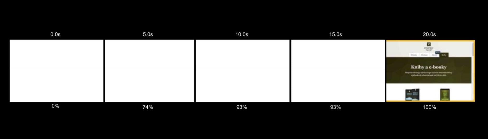
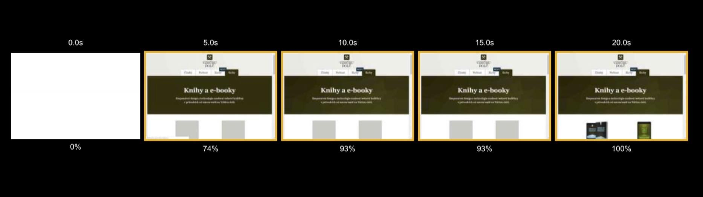

# Co je „rychlost načtení“ webu?

Vlastně nic. Taková věc totiž neexistuje.

Rychlost webu není moment v čase. Je to krátká, ale významná časová epizoda, ve které uživatelé prožívají seznamování s vaším webem.

Představte si rychlost webu jako animaci. 

Nebo jako krátký, ale důležitý předfilm, který se odehrává před očima uživatele ve chvílích, kdy čeká na stažení a vykreslení stránky.

<!-- AdSnippet -->

Uživatel má mnoho pochybností: Děje se vůbec něco? Bude to rychlé? Čekám na správný web? Plní web moje očekávání? Líbí se mi? Nemám jít raději na Facebook?

Podívejme se na jeden příklad takového vykreslovacího filmu:

<figure>

<figcaption markdown="1">
*Dlouho nic a pak heuréka! Jenže – bude na ni někdo čekat?*
</figcaption>
</figure>

Nic moc zábava, že? Dlouho se nic neděje a na konci přijde velký zvrat. Asi nějaká kazachstánská artová záležitost. František Fuka by filmu dal 20 %. Pokud by vydržel do konce. Pusťme si jiný:

<figure>

<figcaption markdown="1">
*Postupné vykreslování webu, které uživatele pomalu vtahuje do „děje"*
</figcaption>
</figure>

Tady to už je lepší…  Předfilm skoro jako od Spielberga.

Tímhle úvodem se vám snažím vnuknout myšlenku, že načítání webu není bod v čase. Že je to prožitek. Uživatelský prožitek.

## Jistě, je to UX

Rychlost webu definuji jako: Uživatelský prožitek během načítání a vykreslování viditelné části stránky.

To je dost dlouhé pojmenování, vím. Ale snad docela přesné.

## Nejde jen o načítání

Chcete kratší? Než o „rychlosti načítání webu“ prosím raději mluvme o „rychlosti webu“. Nejde totiž jen o rychlost načítání, ale také jeho vykreslování prohlížečem, což rozhodně není zanedbatelný proces. Hlavně na méně výkonných mobilech nebo designérsky a funkčně expresivnějších webech.

Jak ale zjistit spokojenost uživatele s tímto krátkým úsekem uživatelského prožitku? Těžko jej otestujeme v usability labu.

<!-- AdSnippet -->

Musíme se zde spokojit se selským rozumem, který říká: Čím rychlejší, tím lepší. A pokud selský rozum nestačí, podívejte se [na případové studie](https://wpostats.com/) velkých firem. Všechny došly k překvapivému závěru: Čím rychlejší, tím lepší.

Ale vážně: Naše touha podívat se rychlosti na zoubky trochu zblízka je na místě. Během vykreslování webu totiž nastává mnoho důležitých událostí, které je možné měřit. Ty nám o průběhu vykreslování dokáží podat lepší obrázek.

## Prožitek jde vyjádřit metrikami

[Metrikami](metriky-rychlosti.md) jako je Time To First Byte, Speed Index nebo Time To Interactive.

<figure>

<figcaption markdown="1">
*Některé z důležitých metrik pro rychlost webu. Jsou samá zkratka, vypadá to pak hodně odborně, že ano?*
</figcaption>
</figure>

Metriky měří různé věci. Například čas serveru (TTFB), první vykreslení obsahu (FCP), první možnou interaktivitu uživatele (TTI) a další. Důležité je, že to jsou metriky závislé na kontextu. Výstupem každého nástroje a každého jeho nastavení budou jiné hodnoty těchto metrik.

## „Rychlost načtení našeho webu je 1,2 s“ Pardon? Nerozumím vám…

Proto: Nemůžeme říci něco jako *„Rychlost načtení našeho webu je 1,2 s“*. Protože neznáme stránku, metriku ani způsob měření.

*„Speed Index úvodní stránky webu je 1,2 s, měřeno pomocí WebpageTest na rychlosti 3G fast se zařízením Nexus 5”*. To zní líp.

Děkuji vám za pozornost.

<!-- AdSnippet -->
