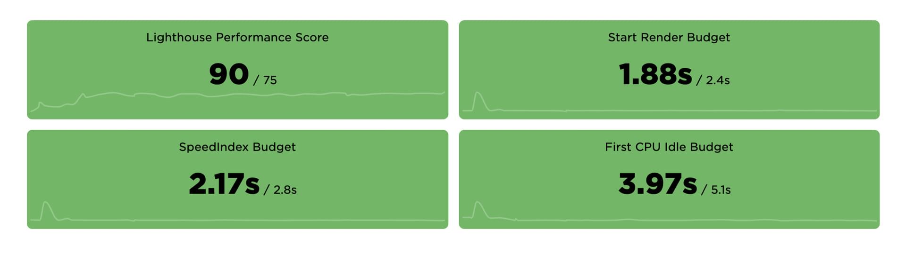

# SpeedCurve: Nástroj pro průběžnou analýzu rychlosti webu

Pojďme si dnes něco povědět o hlavním nástroji, který u klientů používám pro analýzu rychlosti webu.

<figure>

<figcaption markdown="1">
*Obrázek: Úvodní stránka SpeedCurve nabízí základní měření a porovnání s konkurencí.*
</figcaption>
</figure>

[SpeedCurve](https://speedcurve.com) je nástroj pro automatický průběžný monitoring rychlosti, který zobrazuje reporty, sloužící jako podklad pro optimalizaci.

Interně jeho měření používá [Lighthouse](lighthouse.md) a WebpageTest, tedy [nástroje](rychlost-nastroje.md), které někteří čtenáři Vzhůru dolů znají jako své boty. A ti samí asi budou znát i [metriky](metriky-rychlosti.md), které SpeedCurve dokáže hlídat.

Video: <a href="https://www.youtube.com/watch?v=xZvWR9obQ_0">SpeedCurve: Průběžné sledování rychlosti webu</a> ~ Případová studie použití SpeedCurve během optimalizace Rohlík.cz.

SpeedCurve je můj hlavní nástroj u klientů, kterým dlouhodobě hlídám rychlost webu. Není tak drahý jak by se mohlo zdát, ale k ceně se ještě dostaneme. Nejprve si pojďme projít vlastnosti monitorovací aplikace. Budu ukazovat grafy od [Rohlík.cz](https://www.rohlik.cz/), mého milého klienta, o kterém jsem mluvil na výše uvedené přednášce.

## Vlastnosti {#vlastnosti}

Z mnoha reportů a funkcionalit, které SpeedCurve nabízí, jsem vybral tři: průběžné měření webu, porovnání s konkurencí a hlídání rychlostních limitů.

### 1) Průběžné měření {#vlastnosti-1}

Report ukazuje, jak si web stojí v čase. SpeedCurve obvykle máme nastavený tak, aby spouštěl test jednou denně.

<figure>

<figcaption markdown="1">
_Obrázek: Průběžný vývoj vykreslovacích a načítacích metrik. Výkyvy jsou běžné, důležité je mít zlepšující se dlouhodobý trend._
</figcaption>
</figure>

Podívejte se také na [živé demo](https://speedcurve.com/demo/site/?b=apple-ipad&cs=lg&d=30&dc=2&de=1&ds=1&r=us-west-1&s=299&u=908&share=39tfnozeq94p1o0hndk1kpbg4vb7cg) pro britské noviny Guardian. 

### 2) Porovnání s konkurencí {#vlastnosti-2}

Jak už jsem mnohokrát psal, usilovat o ideální hodnoty [metrik rychlosti](metriky-rychlosti.md) je sice bezva cíl, který ovšem je v krátkém časovém horizontu většinou nereálný. Proto je dobré vybrat si jednoho či dva nejrychlejší konkurenty jako benchmark, srovnávací měřítko.

<figure>

<figcaption markdown="1">
_Obrázek: Srovnání aktuálně měřených konkurentů pro Rohlík.cz. Toho je ovšem jen jeden kontext z mnoha, mobilní úvodní stránka._
</figcaption>
</figure>

[Demo](https://speedcurve.com/demo/benchmark/?b=apple-ipad&cs=lg&d=30&dc=2&de=1&ds=1&l=article&m=speedindex&r=us-west-1&share=39tfnozeq94p1o0hndk1kpbg4vb7cg) pro Guardian.

### 3) Hlídání rychlostních limitů {#vlastnosti-3}

Když neprobíhá intenzivní optimalizace rychlosti, necháváme SpeedCurve šlapat na volnoběh. Aplikaci tedy příliš nenavštěvujeme. Předtím ovšem vždy nastavíme rychlostní limity (Performance Budgets) pro podstatné metriky.

SpeedCurve kontroluje, zda se dlouhodobě (po dobu alespoň tří dnů) nepřekračují. Pokud ano, dorazí varovný e-mail.

<figure>

<figcaption markdown="1">
_Obrázek: Červená laťka aneb rychlostní limity ve SpeedCurve._
</figcaption>
</figure>

Limity je možné kontrolovat také ve speciálním pohledu, který je možné si vystavit ve firemním kontrolním panelu:

<figure>

<figcaption markdown="1">
_Obrázek: Zelené plochy rychlostních limitů říkají, že tady je vše v pořádku._
</figcaption>
</figure>

Míst, kam se do SpeedCurve dívám, je opravdu hodně. Mimo uváděné tři zásadní si pak pochvaluji například tyto:

* _Tipy na vylepšení_  
SpeedCurve sbírá a seskupuje tipy na vylepšení od známého nástroje [Lighthouse](lighthouse.md), jehož autorem je Google. Průběžně tedy vidíte, co je možné vylepšit a jakou prioritu to má. Viz [demo](https://speedcurve.com/demo/improve/?cs=lg&s=299&share=39tfnozeq94p1o0hndk1kpbg4vb7cg).
* _Aktuální testy: Filmový pás_  
Každý jednotlivý test je dělaný pomocí nesmrtelného WebpageTestu. Pokud tento nástroj znáte, ale nevyhovuje vám zobrazení průběhu načítání, SpeedCurve se vám bude líbit. Jeho výstupy jsou o řád přehlednější. [Demo](https://speedcurve.com/demo/test/190528_BY_19a28d49946b7af766b39efedeca6627/?share=39tfnozeq94p1o0hndk1kpbg4vb7cg).
* _Deploy a porovnání před a po_  
Do [API od SpeedCurve](https://api.speedcurve.com/) můžete automaticky posílat publikování každé nové verze (deploy) vašeho webu. Je pak možné snadno srovnávat stav před a po jejím zveřejněním. Viz [demo](https://speedcurve.com/demo/deploy/?b=apple-ipad&cs=lg&dl=246598&dp=419933&r=us-west-1&s=299&u=908&share=39tfnozeq94p1o0hndk1kpbg4vb7cg).
* _Third party dashboard_  
Nově představený panel pro kontrolu dopadu komponent třetích stran na výkon vašeho webu. [Demo](https://speedcurve.com/demo/thirdparty/?b=apple-ipad&cs=lg&d=30&dc=2&de=1&ds=1&r=us-west-1&s=299&u=908&share=39tfnozeq94p1o0hndk1kpbg4vb7cg).

Zatím by to mohlo stačit. Pro bližší představu si proklikejte demo a s dotazy se ozvěte do komentářů či do e-mailu.

<!-- AdSnippet -->

Zásadní otázka ale zní: Co za to?

## Cena a měření reálných uživatelů {#cena}

Jak už jsem říkal na výše uvedené přednášce v Rohlík.cz, SpeedCurve znám už léta, ale dlouho mě unikal cenový tarif Pay-As-You-Go, kde platíte jeden cent za jeden syntetický test. Ani u středně velkých projektů se obvykle s cenou nedostanete nad 25 až 30 dolarů měsíčně.

Pokud byste ovšem stáli o monitoring reálných uživatelů, bude to už _darda_. Pak se připravte cenu od dvanácti tisíc dolarů ročně. [speedcurve.com/pricing/](https://speedcurve.com/pricing/)

Základní měření reálných uživatelů ovšem dostanete i zadarmo od Googlu. Podívejte se na moje video o Chrome UX Reportu (CrUX).

Video: <a href="https://www.youtube.com/watch?v=wvVmumXPQPM">Chrome UX Report: Jak rychlý je web u skutečných uživatelů?</a> ~ Databáze o rychlosti webů. Co to je a jak získat informace o vašem webu?

Reporty z CrUX samozřejmě nejsou plnohodnotná náhrada, ale pro většinu běžných webů postačující.

## Pro koho to je? {#pro-koho}

Cena určuje cílovou skupinu. Pro malý blogýsek to není, ale pokud intenzivně optimalizujete, může být výhodné využít měsíční zkušební verzi zdarma nebo si zaplatit měsíc až dva měření.

U projektů, které nemají problém si na sebe vydělat a zároveň řeší rychlost bych v vůbec neváhal. Ostatně: Bez SpeedCurve osobně žádnou dlouhodobou optimalizaci rychlosti webu nedělám.

## Alternativy ke SpeedCurve {#alternativy}

Existují, jistě. Jen jim vždycky něco chybí. Ale pokud toužíte ušetřit nebo vám více vyhovuje vlastní či úplně jiná řešení, alespoň pár vám jich nabídnu:

* [Lighthouse](lighthouse.md) můžete pouštět automaticky a nově podporuje také [Performance Budgets](https://developers.google.com/web/tools/lighthouse/audits/budgets).
* [Speed Demon](https://medium.com/dev-channel/introducing-speed-demon-a36d95dd0174) je jednoduchý nástroj, který automaticky pouští WebpageTest a kontroluje rychlostní limity.
* [New Relic Browser](https://newrelic.com/products/browser-monitoring) – známý monitorovací software má také funkčnost pro sledování rychlosti frontendu. (Za upozornění děkuji Lukáši Konarovskému.)

Jistě si vzpomenete i na další rychlostní monitorovače. Neváhejte je navrhnout, rád je zde doplním.

<!-- AdSnippet -->
