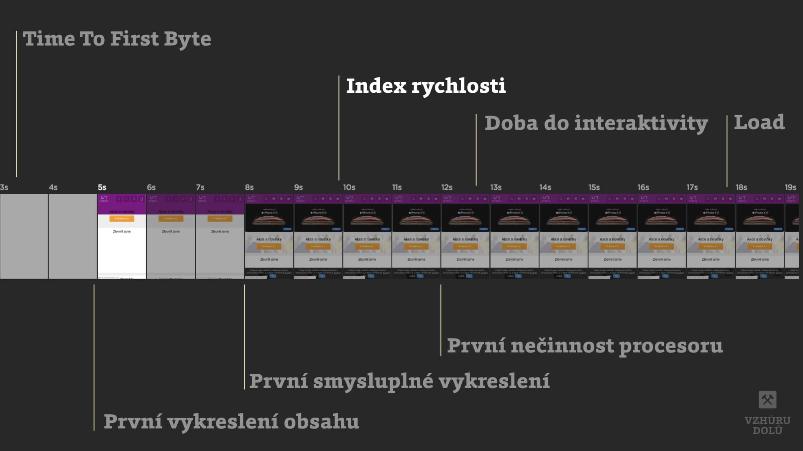
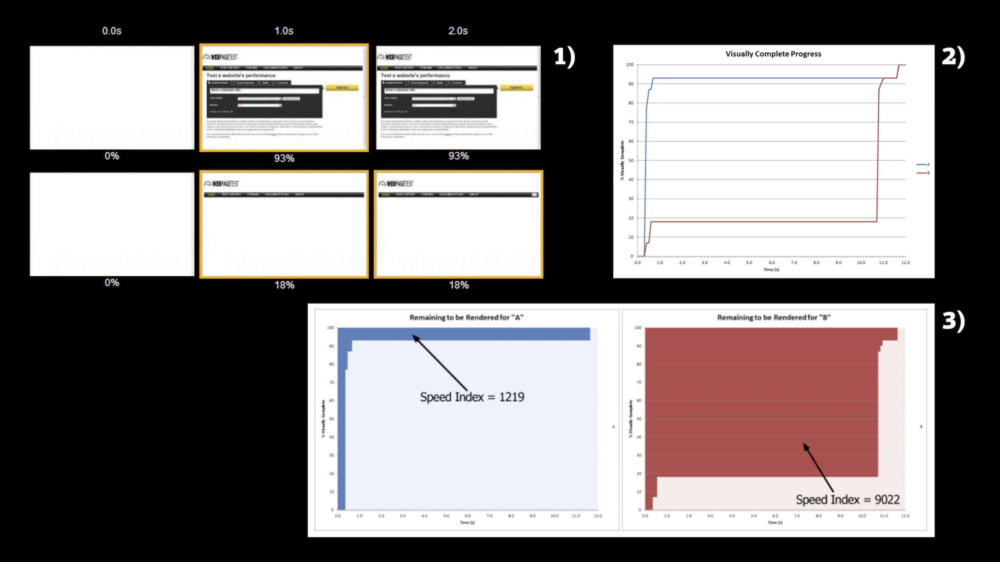

# Metrika „Index rychlosti“ (Speed Index, SI)

[Metrika rychlosti webu](metriky-rychlosti.md), která ukazuje jak rychle je viditelný obsah stránky naplněn do stavu stoprocentního vykreslení.

<!-- AdSnippet -->

Čím nižší je, tím lépe. I Speed Index je navázán na konkrétní technologický kontext – prohlížeč, šířku okna nebo typ připojení.

<figure>

<figcaption markdown="1">
*Kdy vzniká TTI nebo taky „Time To Interactive“*
</figcaption>
</figure>

Tohle je trochu jiná metrika než všechny ostatní. SpeedIndex neukazuje čas události, jde o celkové skóre stránky.

<figure>

<figcaption markdown="1">
*1) Vezměme jeden web se dvěmi různými postupy vykreslování. 2) Do grafu si vykreslíme postup vykreslování obou případů. Ve vodorovné ose je čas, ve svislé procenta vykreslení viditelné části obrazovky. 3) Speed Index je plocha nad průběhem grafu. (Zdroj obrázku: WebpageTest.org)*
</figcaption>
</figure>

## Ideální hodnoty {#idealni-hodnoty}

Hranice, které pro vysvědčení používá [nástroj Lighthouse](lighthouse.md):

| Hodnota LCP        |  Mobil   |  Desktop  |
|:-------------------|---------:|----------:|
| Dobrá              |  ≤ 3,4 s |  ≤  1,3 s |
| Vyžaduje zlepšení  |  ≤ 5,8 s |  ≤  2,3 s |
| Špatný             |  > 5,8 s |  >  2,3 s |

V nástrojích [Lighthouse](lighthouse.md) nebo [PageSpeed Insights](pagespeed-insights.md) se metrika Speed Index do [celkového skóre (LPS)](metrika-lps.md) projevuje váhou 10 %.

## Nástroje pro měření

Speed Index je známý především z WebpageTest.org. Nástroj Lighthouse ukazuje podobnou veličinu [Perceptual Speed Index](https://developers.google.com/web/tools/lighthouse/audits/speed-index).

Problémem Speed Indexu je to, že se aktuálně počítá z video-záznamu průběhu načítání stránky. Nelze jej tedy použít pro sbírání dat od všech uživatelů, jen pro syntetické testy. Další problém je v tom, že čeká na vizuální „hotovost“ stránky. Pokud tedy na stránce máte animované prvky, například automatický karusel, asi vám Speed Index naroste do nebeských výšin.

Pro měření reálných uživatelů není Index Rychlosti příliš vhodný, i proto vznikla v orce 2020 alternativa v podobě [Largest Contentful Paint (LCP)](metrika-lcp.md).

Více o [Speed Indexu](https://sites.google.com/a/webpagetest.org/docs/using-webpagetest/metrics/speed-index).

<!-- AdSnippet -->
