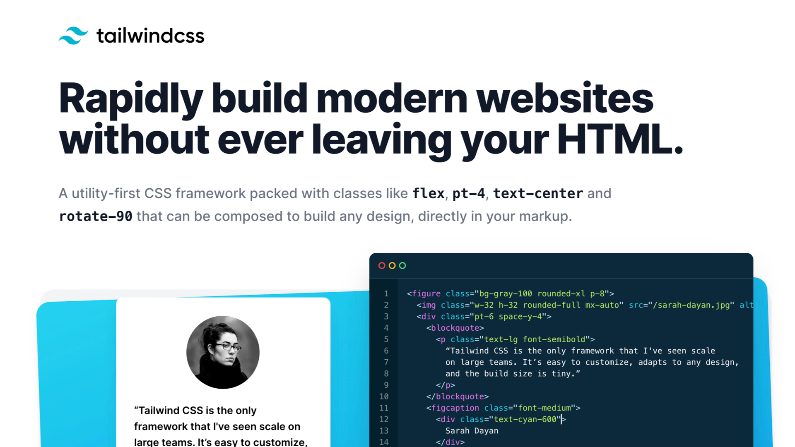

# Tailwind CSS

CSS framework, který má vcelku slušnou šanci změnit mnohým z nás způsoby, jakými jsme zvyklí psát HTML a CSS kód.



Propaguje zápis pomocí utilitárních tříd, tedy více HTML a méně CSS. Dělá to ve jménu zlepšení zážitku vývojáře – zjednodušení jeho práce. Ve jménu produktivity.

[Tailwindem](https://tailwindcss.com/) se pár měsíců zabývám a v mnohém se mi tenhle přístup líbí. V tomhle článku se pokusím shrnout, o co jde a kdo z vás by Tailwindu měl věnovat pozornost.

## Popularita

Z pohledu počtu hvězdiček na Githubu to ještě tak moc vidět není. [tailwindlabs/tailwindcss](https://github.com/tailwindlabs/tailwindcss) jich má asi 45 tisíc, podobně jako další nový framework Bulma ([jgthms/bulma](https://github.com/jgthms/bulma)). Kam se hrabou na Bootstrap se 150 tisíci hvězdičkami.

Zajímavější je pohled do ankety [State of CSS 2021](https://2020.stateofcss.com/en-US/technologies/) – spokojenost uživatelů s Tailwindem je 90 %, jedna z nejvyšších vůbec.

State of CSS 2020:

<figure>

<figcaption markdown="1">
*Zatím ne tak moc používaný, ale s velkou spokojeností uživatelů. Tailwind hledejte uprostřed levého horního čtverce.*
</figcaption>
</figure>

Spokojenost s frameworkem Bulma je kolem 60 %. A s Bootstrapem je spokojená jen necelá polovina uživatelů.

Díky dramatickému nárůstu uživatelské základy získal Tailwind v téhle anketě ocenění [Most Adopted Technology](https://2020.stateofcss.com/en-US/awards/).

## Utility? Ne, utility-first framework

Mě na Tailwindu nejvíc zaujalo zaměření na [utility](css-utility.md) (jinak též atomické nebo užitkové CSS). Jednotlivé třídy totiž reprezentují vlastnosti a jejich vybrané hodnoty:

```html
<button class="rounded-md bg-black text-white" type="submit">
  Buy now
</button>
```

Jak asi předpokládáte, tento kód vytvoří černé tlačítko s bílým textem a středně zakulacenými rohy. Viz ukázka: [play.tailwindcss.com/EgD4vOaAFv](https://play.tailwindcss.com/EgD4vOaAFv).

<!-- AdSnippet -->

Z mých dřívějších textů možná víte, že atomický přístup mě osobně vyhovuje, protože představuje nízkoúrovňový systém designu.

Jakmile jej dostanete do hlavy, psaní kódu vám začne jít výrazně rychleji, protože nejste nucení přepínat kontexty CSS a HTML.

Podmínkou pro správné využití atomických tříd je ovšem možnost abstrakce – nechci přeci každé tlačítko znovu zapisovat jako kombinaci mnoha jednotlivých tříd.

A právě Tailwind dotáhl možnosti abstrakce ze všech utility frameworků nejdál.

## Abstrakce a komponenty stále žijí

O Tailwindu nejde mluvit jako o „utility frameworku“, kam spadá třeba starší [Tachyons](https://tachyons.io/). V případě Tailwind CSS jde o „utility first“ framework.

Pomocí užitkových tříd buď přímo zapisujete CSS kód nebo je použijete k abstrahování.

Nejjednodušší možností abstrakce je [direktiva `@apply`](https://tailwindcss.com/docs/extracting-components). pomocí níž prostě jednodušší komponenty zapíšete pomocí staré dobré [metodiky BEM](bem.md):

```css
.btn {
  @apply rounded-md bg-black text-white;
}

.btn--secondary {
  @apply bg-gray-100 text-black;
}
```

Viz ukázka: [play.tailwindcss.com/61qN16fO0Y](https://play.tailwindcss.com/61qN16fO0Y).

Pro složitější komponenty ovšem `@apply` není dobrou cestou a tak vám spolu s autory frameworku vřele doporučuji využívat komponentová zobecnění šablonovacícho frameworku, který používáte.

Zde je zjednodušený příklad ve Vue.js:

```js
// Recipes.vue:

<template>
  <div class="divide-y divide-gray-100">
    <Nav>
      // …
    </Nav>
  </div>
</template>

// Nav.vue:

<template>
  <nav class="p-4">
    <ul class="flex space-x-2">
      <slot></slot>
    </ul>
  </nav>
</template>
```

Další z možností abstrakce je napsání vlastního [pluginu do `tailwind.confing.js`](https://tailwindcss.com/docs/plugins#adding-components).

## Jakýkoliv design

V [podcastu o Tailwindu](https://www.vzhurudolu.cz/podcast/198-podcast-tailwind) jsme s Robinem Pokorným, Honzou Bienem a Adamem Kudrnou rozebírali rozdíly mezi [Bootstrapem](https://www.vzhurudolu.cz/bootstrap) a Tailwindem.

Mimo jiné jsme došli k tomu, že Bootstrap má, přes velké možnosti úprav vzhledu pomocí nastavení v preprocesoru, určitou tendenci ovlivňovat vzhled výsledku.

Na velké části webů a webových aplikací, používajících nejznámější CSS framework, je tenhle framework prostě vizuálně poznat. (A na další velké části webů je použitý úplně zbytečně.)

<figure>

<figcaption markdown="1">
*Bootstrap Expo: Galerie krásných a kreativních webů, které používají… layoutovou mřížku z Bootstrapu.*
</figcaption>
</figure>

Tailwind je v tomhle jiný – nenabídne vám hotové komponenty, ale nízkoúrovňový CSS framework nad konkrétními vlastnosti a sadou předvybraných (a nastavitelných) hodnot.

Toto velmi ocení typičtí „CSSkaři“ – frontendové kodérky a kodéři, jejichž běžným úkolem je kódování velmi odlišných designů webu.

Jak ve své přednášce říká [Honza Bien](https://www.webmistr.wtf/): Tailwind je první CSS framework, který mu umožnil rychle nakódovat jakýkoliv design.

<div class="rwd-media">
<iframe width="560" height="315" src="https://www.youtube-nocookie.com/embed/BeRrKqw-zo8" title="YouTube video player" frameborder="0" allow="accelerometer; autoplay; clipboard-write; encrypted-media; gyroscope; picture-in-picture" allowfullscreen loading="lazy"></iframe>
</div>

Má pravdu, Webmistr.

## Bootstrap versus Tailwind: komponenty versus utility?

Možnost nakódovat jakýkoliv design je skvělá pro někoho, kdo CSSka velmi dobře zvládá a potřebuje zrychlit svou práci, ale ne pro typického uživatele Bootstrapu – vývojáře, který do detailů CSS až tak vidět nechce nebo nemůže.

Zatímco Bootstrap je „component-first“ a až v posledních verzích začal hojně [přidávat utility](https://www.vzhurudolu.cz/prirucka/bootstrap-4-utility/), Tailwind na to jde z druhé strany – DNA frameworku tvoří právě utility a komponenty si buď postavíte sami nebo využijete některé předpřipravené externí nástroje, jako [Taiwind UI](https://tailwindui.com/), [Headless UI](https://headlessui.dev/) nebo [Heroicons](https://heroicons.com/) pro ikony.

I tyto dva přístupy jsme srovnávali [v květnovém vydání podcastu](https://www.vzhurudolu.cz/podcast/198-podcast-tailwind):

<div class="rwd-media">
<iframe width="560" height="315" src="https://www.youtube-nocookie.com/embed/c-0mTG5GXmI" title="YouTube video player" frameborder="0" allow="accelerometer; autoplay; clipboard-write; encrypted-media; gyroscope; picture-in-picture" allowfullscreen loading="lazy"></iframe>
</div>

Je vůbec zajímavé sledovat, jak nově vzniknuvší konkurence přinutila autory Bootstrapu reagovat. Jejich přístup k utilitám a rychlá reakce na Tailwind jsou určitě pozoruhodné.

Bootstrap má však jiné DNA. Je postavený na [preprocesoru](https://www.vzhurudolu.cz/blog/12-css-preprocesory-1) Sass, takže klasika. 

V Tailwindu veškeré nastavování probíhá na úrovni JavaScriptu – jednak nad [PostCSS](postcss.md), ale také ve velmi mocném konfiguračním souboru.

### Konfigurace: velká síla na pozadí

Soubor `tailwind.config.js` obstarává kompletní [konfiguraci Tailwindu](https://tailwindcss.com/docs/configuration). Díky použití JS se zde mohou vcelku silně rozšiřovat možnosti frameworku.

Jako nejjednodušší úroveň si asi lze představit [nastavování barev](https://tailwindcss.com/docs/customizing-colors) a podobných elementů designu:

```js
// tailwind.config.js
module.exports = {
  theme: {
    colors: {
      transparent: 'transparent',
      current: 'currentColor',
      blue: {
        light: '#85d7ff',
        DEFAULT: '#1fb6ff',
        dark: '#009eeb',
      },
      gray: {
        darkest: '#1f2d3d',
        dark: '#3c4858',
        DEFAULT: '#c0ccda',
        light: '#e0e6ed',
        lightest: '#f9fafc',
      }
    }
  }
}
```

Dále je například možné přidat vlastní utility:

```js
// tailwind.config.js
module.exports = {
  mode: 'jit',
  theme: {
    extend: {
      boxShadow: {
        embos: '1px 1px 2px rgb(0 0 0 / 25%), inset -1px -1px 1px rgb(0 0 0 / 25%)',
      },
    }
  }
}
```

Vybrat z předpřipravených pluginů…

```js
// tailwind.config.js
module.exports = {
  plugins: [
    require('@tailwindcss/typography'),
    require('@tailwindcss/forms'),
    require('@tailwindcss/line-clamp'),
    require('@tailwindcss/aspect-ratio'),
  ]
}
```

…nebo přidat vlastní. [V dokumentaci pluginů](https://tailwindcss.com/docs/plugins) uvidíte, jak mocný nástroj je možné vytvořit, když dovolíte konfiguraci na úrovni JavaScriptu, tedy plnohodnotného programovacího jazyka.

## Varianty: stavy, pseudotřídy, breakpointy…

I když v Tailwindu vzhled zapisujete pomocí tříd, existují jejich varianty, pro [responzivní breakpointy](breakpointy.md):

```html
<button class="bg-black text-white p-2 sm:p-4 rounded" type="submit">Buy now</button>
```

V této ukázce bude mít tlačítko větší vnitřní okraj (`padding`) na šířkách obrazovky od breakpoitu `sm` – viz třída `sm:p-4`. Na menších poloviční – `p-2`. Viz demo: [play.tailwindcss.com/EoXdekog6A](https://play.tailwindcss.com/EoXdekog6A?size=554x720)

Všem těmto podmínečným zobrazením, jako jsou konkrétní body zlomu designu, stav po najetí myši, mód tmavého zobrazení… říkají autoři tohoto frameworku [varianty](https://tailwindcss.com/docs/configuring-variants) a máte jich k dispozici téměř dvacet.

## Pro koho to je a co já na to?

Pokud fandíte přístupu s psaním utility tříd, pak asi moc neváhejte - Tailwind je myslím v této oblasti ze všech frameworků nejdál.

Tailwind je také velmi vhodný pro ty, kteří pracují agenturně, takže kódují různé designy webů a konvenční komponentové frameworky jako Bootstrap pro ně nebyly. Jakmile jej dostanete do krve, jsem přesvědčený, že vám ušetří spousty kóderského času.

<!-- AdSnippet -->

Já už aktivně a za peníze CSSka nepíšu, ale frameworky mě zajímají (už jen kvůli [konzultací k rychlosti webů](https://www.vzhurudolu.cz/martin)) a Tailwind jsem použil na některých osobních projektech. Pokud bych na to měl čas, pravděpodobně bych jej nasadil i zde na Vzhůru dolů, kde používám kombinaci vlastního utility frameworku a BEMovských komponent.

Pokud odhlédnu od své specifické situace, nebojím se říct, že Tailwind mě nadchnul. Mentální zábrany používat utility třídy jsem si vnitřně zboural už před lety a velmi oceňuji praktičnost tohoto přístupu.

Co se mi na Tailwindu líbí?

- V oblasti utility frameworků je rozhodně nejdál.
- Jde aktivně naproti možnosti abstrakce utilit do komponent.
- Má [skvělou dokumentaci](https://tailwindcss.com/docs), což je vždy základ úspěšnosti nástroje.
- Při správné práci ([JIT kompilace](https://tailwindcss.com/docs/just-in-time-mode)) s ním tvoří velmi malé CSS.
- Má výborně vymyšlenou konfiguraci, takže je možné jej od základu předělat pro vlastní potřeby.
- Stavy a responzivita řešená prefixy v názvech tříd (`sm:hover:opacity-75`).
- Ve [verzi 2.1](https://blog.tailwindcss.com/just-in-time-the-next-generation-of-tailwind-css) autoři přidali možnost vkládat libovolné hodnoty přímo do tříd v HTML: `top-[-113px]` nebo `md:top-[-113px]`, což je… _mindfucking_.

Co se mi na Tailwindu nelíbí? Kromě jediné věci, té první v následujícím seznamu, asi nic.

Zbytek je spíše o nevýhodách pro určitou skupinu lidí, vycházejících ze zcela jiného pojetí frameworku než na jaké jsme zvyklí např. u Bootstrapu.

- Některé názvy utilit úplně nekorespondují s vlastnostmi v CSS (`leading` = `line-height`) a je tak nutné se učit nová pojmenování.
- Díky použití PostCSS a JavaScriptu bude kombinace s preprocesory jako Sass trošku skřípat.
- Pro úspěšnou práci s Tailwindem byste měli znát CSS, což např. u Bootstrapu tak moc neplatí.
- Zobecňování do komponent se neděje na úrovni CSS, takže kodérka či kodér musejí umět pracovat se šablonovacím jazykem.

## Kam dál?

V článku jsem se pokusil o úvod pro nezasvěcené. Kam dál pokračovat?

- Záznam z mého webináře [Atomické CSS a Tailwind](https://www.vzhurudolu.cz/video/webinar-tailwind-atomicke-css), kde vše vysvětluji na živých ukázkách a vezme vám to necelou hodinu času.
- Pokud ještě nejste přesvědčeni o utilitách: Moje články: [K čemu jsou dobré?](css-utility.md) a [kombinování s komponentami](css-utility-komponenty.md). Adam Wathan: [“Best practices” don’t actually work](https://adamwathan.me/css-utility-classes-and-separation-of-concerns/).
- Pokud se Tailwind chcete naučit na videích a máte dost času: [kurz od Yablko](https://www.youtube.com/watch?v=5mgrioodze8) nebo [Tailwind from zero to production](https://www.youtube.com/playlist?list=PL5f_mz_zU5eXWYDXHUDOLBE0scnuJofO0).
- [Tailwind Play](https://play.tailwindcss.com/), pískoviště, kde je možné framework zkoušet a to včetně nastavení konfigurace.

Zapomněl jsem na něco? Napište mi do komentářů nebo [e-mailem](mailto:martin@vzhurudolu.cz?subject=%C4%8Cl%C3%A1nek%20%E2%80%9ETailwind%20CSS%E2%80%9C) o vašich zkušenostech s Tailwindem.

<!-- AdSnippet -->
