# Optimalizace rychlosti komponent třetích stran

Komponenty třetích stran (third parties nebo také 3P)  nám zpomalují weby. To víme. Ale skutečně jsme jako vývojáři proti nim tak bezbranní, jak si občas myslíme?

V posledních měsíci jsem měl to _štěstí_ (s ironií i bez), že jsem [u několika klientů](https://www.vzhurudolu.cz/martin#rychlost) řešil nepříjemnosti vzniklé nasazením nových komponent třetí strany.

Dneska si tedy ukážeme tři fáze efektivní optimalizace komponent třetích stran:

* [Měření](#mereni) – jak identifikovat problematické komponenty.
* [Optimalizace](#optimalizace) – jak minimalizovat jejich dopady na rychlost webu.
* [Komunikace](#komunikace) – jak předcházet problémům a účinně řešit ty už vzniklé.

Než ale začneme, pojďme si nadefinovat, o čem to tady mluvím a jaký problém to představuje.

## 94 % webů obsahuje nějakou komponentu třetí strany {#problem}

<figure>
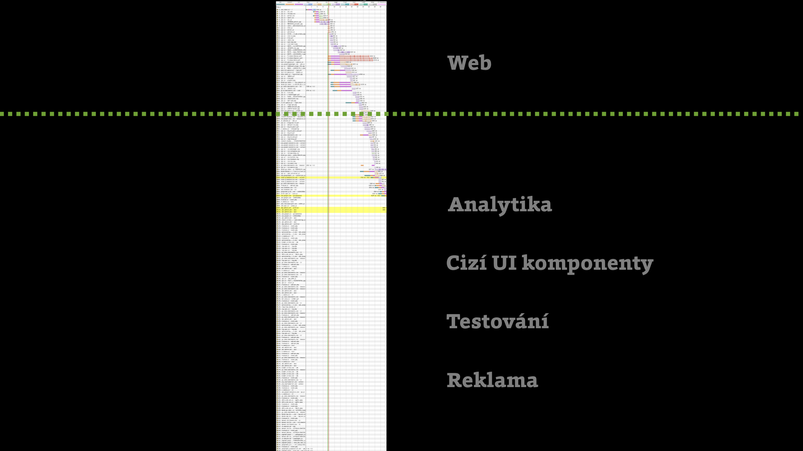
<figcaption markdown="1">
*Obrázek: Samotný web může v některých případech představovat jen menší část toho, co prohlížeč stahuje a provádí. Následují čtyři obvyklí podezřelí.*
</figcaption>
</figure>

Když mluvíme o komponentách třetích stran, myslíme zpravidla tyto čtyři jejich hlavní kategorie:

1. _Analytika_  
[Google Analytics](google-analytics-vyvojari.md), Google Tag Manager… obvykle nepředstavují velký problém.
2. _Cizí UI komponenty_  
Chatovací služby jako [Smartsupp](https://www.smartsupp.com/cs/), obecně ale jakékoliv cizí komponenty využívající CDN a vykreslující se v uživatelském rozhraní. Zde už se jedná obvykle o větší problém z pohledu optimalizace rychlosti.
3. _Testování_  
Kromě vývojářských nástrojů typu [Sentry](https://sentry.io/) sem patří i nástroje pro uživatelské testování. Zejména A/B testování  (Optimizely, Google Optimize…) představuje pro rychlost velký problém.
4. _Reklama_  
U velkých obsahových webů živených reklamou je tato část z pohledu rychlosti samozřejmě doslova zabijácká. I tady se ale dá leccos udělat.

Jak asi víte nebo alespoň tušíte, u různých typů webů jsou 3P komponenty různě velkým problémem. Na Vzhůru dolů skoro žádné nejsou (držíme dietu!), průměrný e-shop jich ale pár obsahuje a řešit je už musí. No a – velké obsahové weby bez optimalizace třetích stran s rychlostí webu nehnou.

<!-- AdSnippet -->

[Statistiky HTTP Archivu](https://almanac.httparchive.org/en/2019/third-parties) ostatně ukazují, že „problém třetích stran“ se týká skoro každého webu a ještě k tomu to je problém nemalý:

* 94 % desktopových stránek obsahuje alespoň jednu 3P komponentu.
* 56 % z nich obsahuje alespoň jednu reklamu.
* 49 % requestů a 28 % datového přenosu měřených stránek jde na vrub 3P.
* 57 % času spouštění javascriptů pochází od  third-party komponent.

Ne, před komponentami třetích stran se u vývoje webu neschováme. Jak to ale vyřešit?

Doporučím vám postup _změřit  >  vyřešit > vykomunikovat_.

## Měříme dopad komponent třetích stran {#mereni}

Pokud nemáme důkazy, nemůžeme nic dělat, milý Watsone.

Pojďme tedy zjistit, jak velký opruz představují komponenty třetích stran právě pro váš web.

### Lighthouse & PageSpeed Insights {#mereni-lighthouse}

Tohle je nejjednodušší cesta. V [Lighthouse](lighthouse.md) nebo [PageSpeed Insights](pagespeed-insights.md) si nechte otestovat web a ejhle, viníci zpomalení webu se nám vybarvují.

První report, který vám ukážu, je zaměřený přímo na komponenty třetích stran. Pokud se to týká vašeho webu, uvidíte v diagnostice sekci „Snižte vliv kódu třetích stran“ („Reduce the impact of third party code“).

<figure>
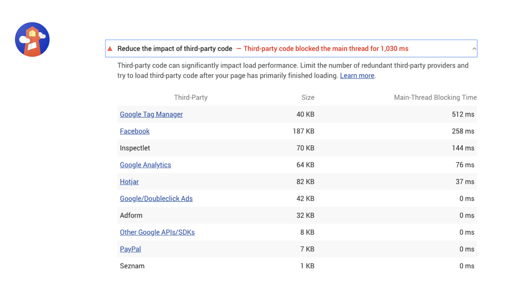
<figcaption markdown="1">
*Obrázek: Kdo nám tady loupe perníček? Tenhle report odhalí největší žrouty dat (Size) a blokátory hlavního procesu prohlížeče (Main-Thread Blocking Time). Zásadnější je to obvykle to druhé, pokud by vás to zajímalo.*
</figcaption>
</figure>

Lighthouse ale umí i podrobnější analýzu, například o čase, který potřebují jednotlivé JavaScripty. V mnoha reportech jde totiž zapnout zobrazování statistik také o třetích stranách, jako například v tom s názvem „Reduce JavaScript execution time“.

<figure>
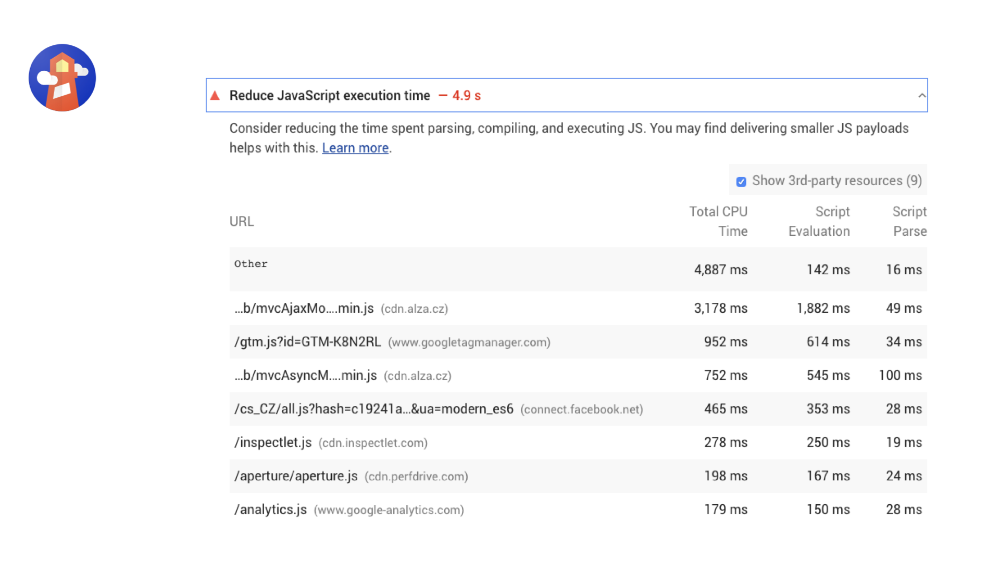
<figcaption markdown="1">
*Obrázek: Kdo nám tady loupe javascriptový perníček? Všimněte si zatržítka „Show 3rd-party resources“.*
</figcaption>
</figure>

Aktuální nevýhodou reportů v Lighthouse je kategorie „Other“, kam toho hodně mizí. Ale autoři [to řeší](https://github.com/GoogleChrome/lighthouse/issues/8526).

### WebpageTest {#mereni-webpagetest}

[WebpageTest](https://www.webpagetest.org/) toho pro analýzu komponent třetích stran nabízí hodně, ostatně jako pro cokoliv kolem rychlosti webu.

Chci tady vypíchnout jeho možnost srovnání více testů. Aneb: Jak zjistit, jaký vliv mají na rychlost webu komponenty třetích stran?

Udělejte prostě jeden test standardně a druhý pak s blokováním konkrétní třetí strany. A dbejte na to, aby měly podobný backendový čas ([TTFB](ttfb.md)), aby se daly porovnávat.

<figure>
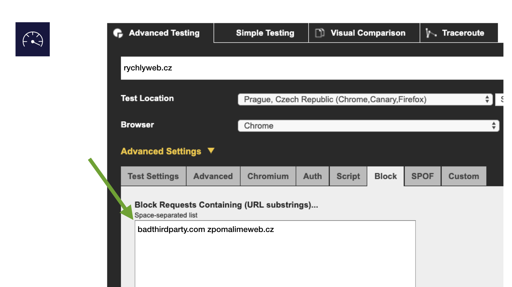
<figcaption markdown="1">
*Obrázek: Kdo neblokuje, jako by nebyl. Ve WebpageTestu je možné zablokovat všechny domény, ze kterých přicházejí komponenty třetích stran. To budou ale krásné výsledky! Nebo ne?*
</figcaption>
</figure>

Až se pak v testu proklikáte na obrazovku časové osy, můžete do URL přidat čárku a za ní ID dalšího testu.

<figure>
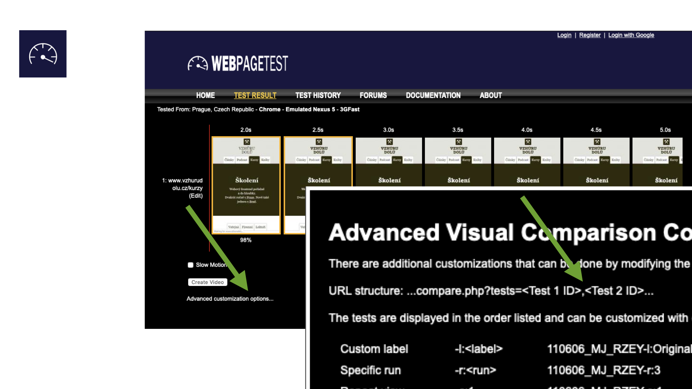
<figcaption markdown="1">
*Obrázek: Složité nastavení WebpageTestu, ze kterého nás zajímá jediná čárka.*
</figcaption>
</figure>

WebpageTest vám pak vyrobí srovnávací obrazovku, kde je možné porovnat oba testy.

_Tip:_ Alternativně je možné to udělat výběrem dvou testů z vaší testovací historie. Mrkněte se do „Test History“ po přihlášení do WebpageTestu.

Taková data jsou skvělý podklad pro argumentaci směrem ke klientovi nebo přímo vývojářům třetí strany.

<figure>
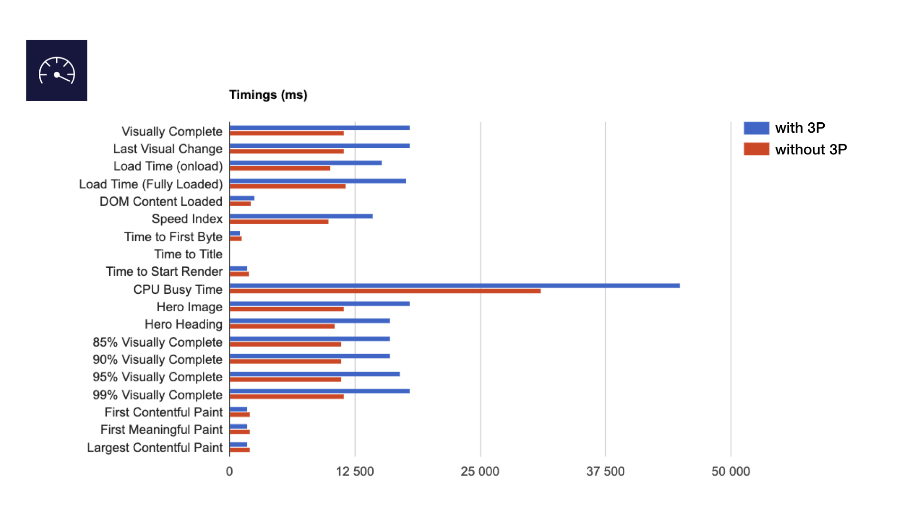
<figcaption markdown="1">
*Obrázek: A máme ho, milý Watsone! Nejužitečnější graf z WebpageTestu porovnává metriky obou testů. To už je vcelku jasný důkaz usvědčující pachatele.*
</figcaption>
</figure>

Podobný graf mi u jednoho klienta pomohl vyřešit problém s výkonem jednoho reklamního systému. Ani ne za týden od zaslání grafu bylo vše výrazně lepší.

### Chrome DevTools {#mereni-devtools}

Ale za analýzou komponent třetích stran nemusíme chodit daleko. Leccos se dozvíme také přímo z prohlížeče. Používám pro ty účely DevTools v Chrome.

V Chrome DevTools si zapněte zobrazování „third party badges“. (Ctrl/Cmd+Alt+J > Ctrl/Cmd+Shift+P > Show third party badges).

<figure>
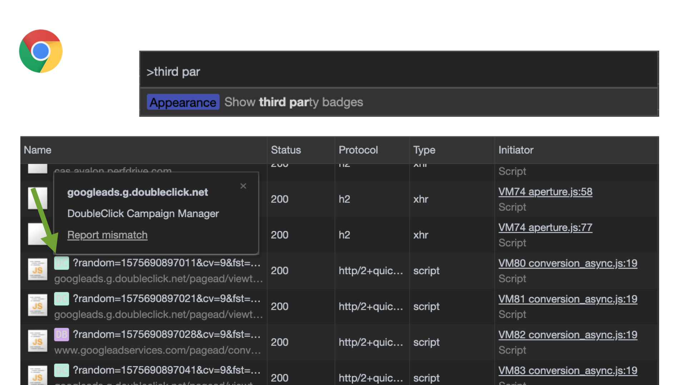
<figcaption markdown="1">
*Obrázek: My si na vás posvítíme, potvory! (DevTools > Network)*
</figcaption>
</figure>

Pusťte si pak nahrávání průběhu stahování v záložce „Network“. Zapnutím odznáčků pro komponenty třetí strany získáme přehled o zdrojích jednotlivých stahovaných (a často neidentifikovatelných) souborů.

Další příjemná analýza je k dispozici v záložce „Performance“:

<figure>
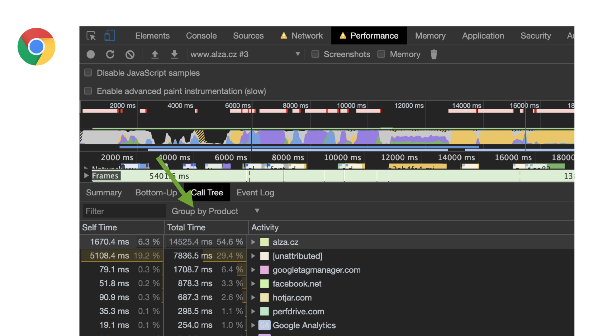
<figcaption markdown="1">
*Obrázek: Tak, kdo tady krade prohlížeči nejvíce času? (DevTools > Performance)*
</figcaption>
</figure>

Podobně jako v Lighthouse, i v záložce „Performance“ prohlížeče můžete získat čísla o čase, který v hlavním vlákně spotřebují jednotlivé skripty.

### SpeedCurve {#mereni-speedcurve}

Z mého pohledu poskytuje nejpraktičtější analýzu můj oblíbený nástroj [SpeedCurve](speedcurve.md).

<figure>
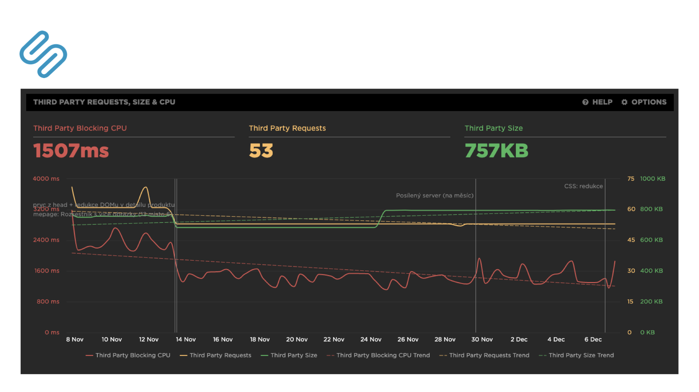
<figcaption markdown="1">
*Obrázek: Historie ukáže nejednu tragédii. Vývoj vlivu komponent třetích stran v čase.*
</figcaption>
</figure>

Na grafu je vidět čas blokování hlavního procesu („Third Party Blocking CPU“), počet dotazů („Third Party Requests“) a jejich velikost („Third Party Size“).

Další graf je pak mým soukromý vítězem celého zápolení grafů v tomto článku.

<figure>
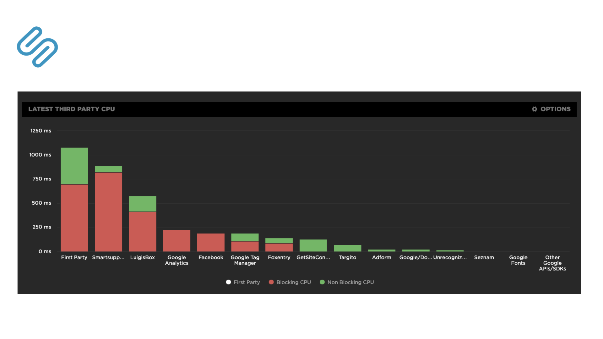
<figcaption markdown="1">
*Obrázek: Kolik času prohlížeče si přivlastní každá komponenta třetí strany?*
</figcaption>
</figure>

Na výše uvedeném grafu je vidět celkový čas a ten je pak rozdělený na „hodný“ a „zlý“. Zelené jsou „hodné“ úseky, kdy se v prohlížeči něco zpracovává méně než 50 ms. „Zlé“ červené úseky zablokují prohlížeč na více než 50 ms, takže uživatel už může poznat nějaké zpomalení.

To bychom měli k nástrojům vše. Máte nějaký vlastní tip na měření? Pochlubte se v komentářích. Teď už ale pojďme na samotnou optimalizaci.

## Optimalizace komponent třetích stran {#optimalizace}

Následuje pět mých nejčastějších optimalizačních technik. Hádejte, které to jsou?

### Třeba to tam nemusí být…? {#optimalizace-nemusi}

Tohle zní trochu jako knížecí rada, viďte? Ale řeknu vám příklad: Na jednom webu jsme hledali důvod, proč je nasazená komponenta [Targito](https://www.targito.com/). Obsahovala blokující CSS i JS soubory, takže s tím bylo potřeba něco udělat.

Po chvilce pátrání se přišlo na to, že oba soubory slouží _jen_ k podpoře zobrazení modálního okna pro určitý typ příchozích uživatelů.  No jo — ale blokující CSS a JS se stahovaly všem.

```html
<!-- Targito popup -->
<script src="https://cdn.targito.com/…/p.js"></script>
<link rel="stylesheet" href="https://cdn.targito.com/…/p.css">
```

Targito umožňuje tuto věc vyřešit jinak – přesměrováním uživatele na konkrétní URL, které vytvoří autoři webu:

```text
example.com/thanks
```

Udělalo se to a pak se oba blokující soubory mohly odmazat. Výrazně to klientovi vylepšilo [Speed Index](speedindex.md) a další ukazatele. No, není to lepší varianta?

Dle mých zkušeností je tato situace poměrně častá. Komponenty třetích stran na web většinou nasazují netechničtí lidé, kteří nemají znalosti vývojářů a tudíž je nenapadnou alternativní varianty řešení – bez nasazení oné komponenty.

Už tady se dostáváme k poslednímu, nejzásadnějšímu, bodu – špatné nasazení komponenty třetí strany je většinou jen _důsledek_ špatné komunikace uvnitř týmu.

### Zástupný symbol (placeholder) {#optimalizace-placeholder}

V řadě případů můžeme na místo zlobivé komponenty vykreslit zástupný symbol, jako třeba obrázek, který ve správném čase nahradíme samotnou komponentou.

Pojďme na příklad. Na [Smarty.cz](https://www.smarty.cz/) jsme například řešili [zlobící chatovací nástroj Freshchat](https://www.vzhurudolu.cz/blog/123-freshchat). S jeho autory se bohužel v té době nedalo rozumně domluvit.

<figure>

<figcaption markdown="1">
*Obrázek: Vylétlo to vysoko. Máme problém, Houstone!*
</figcaption>
</figure>

Vývojář Adam Košťálek ale přišel s krásným řešením:

1. Freshchat se nevkládá do HTML kódu.
2. Na místě, kde se vykreslovalo tlačítko Freshchatu se vykresluje stejně vypadající obrázek.
3. Až v momentě, kdy na obrázek uživatel klikne, vložíme Freshchat do HTML a otevřeme komunikační okno.

Řešení by bylo možné dále vylepšit přednačtením souborů Freshchatu v momentě, kdy se prohlížeč nudí (např. [onload](load.md)). Nebo čekáním na přiblížení ukazatele myši do oblasti kolem, abychom se zbavili prodlevy mezi proklikem a otevřením okna alespoň na desktopu.

<figure>
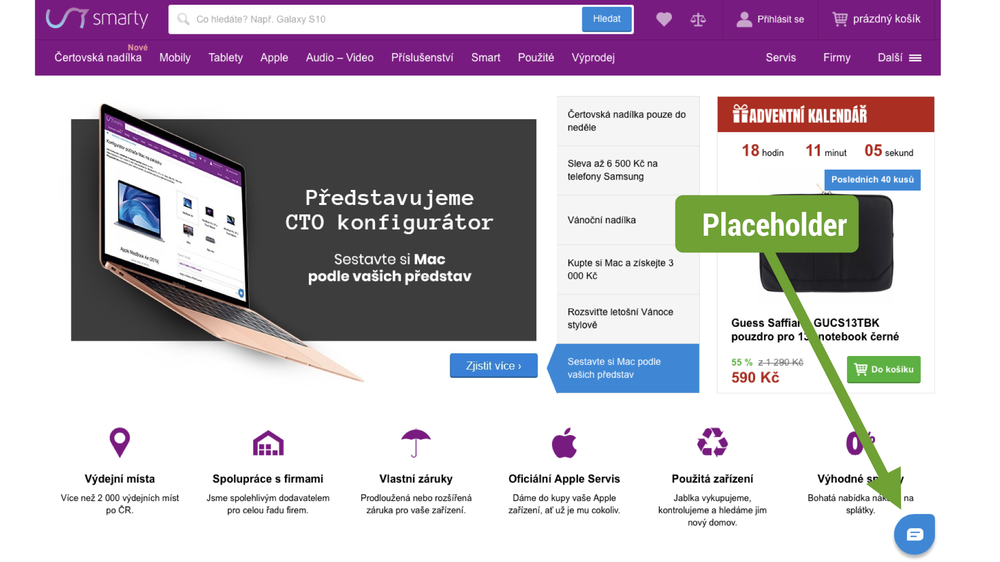
<figcaption markdown="1">
*Obrázek: Vypadá to jako Freshchat, ale není to Freshchat. Zároveň to nemálo zrychlí vykreslení stránky uživateli.*
</figcaption>
</figure>

Tuhle techniku je možné užívat na všechny komponenty uživatelského rozhraní třetích stran, které se načítají pomalu a zároveň dynamicky nemění svůj vzhled.

Jde ale vlastně jen o část daleko zajímavější techniky – lazy loadingu.

### Odložené načtení (lazy loading) {#optimalizace-lazyloading}

[Líné načtení](lazy-loading.md) je v kontextu komponent třetích stran asi nejužitečnější technikou.

<div class="related" markdown="1">
- [7 bl­bos­tí z ob­las­ti webo­vé rych­los­ti](rychlost-myty.md)
- [Lazy loading obrázků a iframe](lazy-loading-obrazku.md)
</div>

Vždycky je potřeba si klást otázku: Který uživatel a kdy komponentu použije? Cílem je zbavit se stahování a spouštění balastu, který uživatelé nepotřebují, už při úvodním vykreslování stránky.

Lazy loading je možné aplikovat podle celé šíře možných podmínek nasazení:

* _Šablona_  
V šabloně detailu článku určitě nemusíte stahovat 3P komponentu, kterou používáte na úvodní stránce.
* _Zařízení_  
Na mobilu není nutné stáhnout a spustit například lightbox, který používáte jen na velkých displejích.
* _Klik_  
Komponenty, které jsou v úvodním vykreslení schované a používají se až po kliknutí uživatele, je také možné odložit. Viz ostatně příklad s Disqus, který bude následovat.
* _Posun stránky_  
Komponenty, které používáte v patičce (například vkládané komponenty od Facebooku), můžete stahovat, až na ně uživatel posune stránku. Využijte [Intersection Observer](intersection-observer.md).

A teď ten příklad s [Disqus](https://disqus.com/): Na Vzhůru dolů tuhle komentářovou službu vcelku spokojeně využívám už léta.

Jenže – Disqus se s weby rozhodně nepáře. Dokáže na pozadí stáhnout klidně kolem 2,5 MB, aniž by přitom bylo jisté, že uživatel chce komentáře využít. Zároveň se Disqus na Vzhůru dolů používá až po rozkliknutí komentářové sekce, takže vůbec nemusí zatěžovat všechny uživatele.

Řešení? Líné načtení (lazy loading) [funkcí load_disqus()](https://w3bits.com/load-disqus-on-click/) až po rozkliknutí komentářové sekce.

```javascript
$("#disqus_trigger").click(function() {
  $(".js .comments").toggleClass("is-opened");
  load_disqus('vzhurudolu');
});
```

V tomto případě to každému návštěvníkovi ušetřilo slušný objem stahovaných dat.

### Odblokovat (async/defer) {#odblokovat}

Tohle už je asi známé, ale pro jistotu: Dbejte na to, aby komponenty třetích stran nebyly servírovány jako blokující vykreslení.

Pokud nebereme v potaz výjimky, jako je A/B testing, je to u naprosté většiny 3P komponent úplně zbytečné.

Správně servírovaná komponenta se stáhne asynchronně, tedy s parametrem `async`:

```html
<script src="https://cdn.example.com/3P.js" async></script>
```

Styly si pak JavaScript postahuje sám, takže také asynchronně.

Pokud to některá komponenta třetí strany doporučuje dělat jinak, kontaktujte prosím autory.

Parametr `async` lze samozřejmě vyměnit za `defer` nebo jiné metody, podle preferované [priority stahování a spouštění JavaScriptu](js-priority.md).

### Preconnect {#optimalizace-preconnect}

Pokud už nevíte, jak komponentu urychlit, může pomoci [přednavázání spojení](preconnect.md):

```html
<link href="https://cdn.example.com/" rel="preconnect">
<link href="https://cdn.example.com/" rel="dns-prefetch">
```

Prohlížeč už na začátku procesu zpracovávání stránky připraví spojení na cizí doménu, takže stažení souborů z ní bude o trochu rychlejší. Hodí se to dělat především u webů běžících na [HTTP/2](http-2.md).

Ovšem pozor – doporučuji šetřit s množstvím domén zde uvedených. Zaměřte se hlavně na komponenty, které se dotýkají vykreslování viditelné části stránky.

### Selfhosting (viz ušetření 1,7s na Optimizely) {#optimalizace-selfhosting}

Abyste se zbavili prodlevy způsobené CDN, můžete si (opět hlavně na HTTP/2) komponentu přesunout na vlastní doménu. Určitě bych vám ale nedoporučoval dělat u Google Analytics a podobných často aktualizovaných komponent.

Líbí se mi však [případovka od Casper.com](https://medium.com/caspertechteam/we-shaved-1-7-seconds-off-casper-com-by-self-hosting-optimizely-2704bcbff8ec), kde ušetřili 1,7 sekundy selfhostováním Optimizely, nástroje pro A/B testování.

<p class="video">
Video: <a href="https://www.youtube.com/watch?v=6capkjTohTg">„To my ne, to oni!“</a> ~ V přednášce se kromě doporučeného postupu věnuji také ukázkám řešení konkrétních komponent třetí strany a Google Tag Manageru.
</p>

Tím bych uzavřel mé technické tipy na optimalizaci komponent třetích stran. Pokud máte nějaké další, neváhejte je zmínit v komentářích.

Úplně nejdůležitější techniku jsem si nechal na konec. I když se do ní vývojářům často nechce, v téhle oblasti to bez ní nepůjde.

## Komunikace {#komunikace}

Nutnost intenzivnější komunikace vnímám na všech stranách: u autorů komponent třetích stran, u marketérů tyto komponenty nasazujících a také u vývojářů. Ve svých tipech se zaměřím jen na tu poslední skupinu.

### Dělejte osvětu, než je pozdě {#komunikace-osveta}

Marketéři a další lidé, kteří u vás nasazují third-party komponenty by měli vědět, že se na vás mohou kdykoliv obrátit, když budou potřebovat pomoci s výběrem nebo správním nasazením komponenty třetí strany.

<!-- AdSnippet -->

Neuškodí také provádět menší osvětu. Vysvětlit, že je vhodné konzultovat výběr komponent, ale také způsob jejich nasazení s vámi.

### Problém? Hlaste to klientovi (on platí) {#komunikace-klient}

Pokud už naměříme nějaké problém s třetí stranou, často máme chuť napsat přímo jejím autorům. Tady ale zadržte.

Mě se velmi osvědčil tento postup: Připravím data (důkazy) a pak s nimi jdu za klientem. Pokud pak píšeme třetí straně, dělá to klient.

Ten totiž za komponentu třetí strany obvykle platí, takže má u jejich autorů daleko větší respekt než jeho vývojáři.

### Autoři third-party {#komunikace-autori-3p}

Komunikace s autory 3P komponent je ovšem důležitá. Kromě toho, že jim můžeme poskytnout čísla o zhoršení rychlostních metrik webu, je vhodné jim ukázat konkrétní problémy, které by měli řešit.

Častým kamenem úrazu je špatně napsaná dokumentace, podle které už tak často technicky nekompetentní marketéři napáchají zbytečné škody. Dejte třetí straně feedback i k dokumentaci.

### Pomozte ostatním vývojářům {#komunikace-pomoz}

Third-party komponent jsou stovky a tak by velmi pomohlo, když bychom se o úspěšné nebo neúspěšné optimalizaci navzájem informovali – tweet nebo článek určitě pomůže ostatním.

Existuje zde také databáze komponent třetích stran, podle které je identifikuje například také Lighthouse nebo Chrome DevTools: [Third Party Web](https://github.com/patrickhulce/third-party-web). Bohužel v ní není moc našich lokálních dodavatelů 3P. Pomůže, když uděláte pull request a těmito nástroji neidentifikovanou třetí stranu vložíte.

Tímhle bychom téma mohli uzavřít. Tradičně to shrnu v odpovědi na otázku: Jak optimalizovat rychlost komponent třetích stran?

1. _Změřit_  
Zjistit, kde máme problém a posbírat důkazy do fáze komunikace.
2. _Vyřešit_  
Možností je celá řada, ale nezapomeňte hlavně na lazy loading.
3. _Komunikovat_  
Jakmile máme důkazy, vzhůru s nimi za klientem nebo autory komponent.

Pokud cítíte, že máte problém s třetími stranami, neuškodí provést menší audit a o jeho výsledcích informovat lidi, kteří komponenty třetích stran do webu nasazují – klienty, marketéry, správce obsahu a další.

Snad jsem vám alespoň trochu pomohl a budu vděčný za vaše další tipy v komentářích.

<!-- AdSnippet -->
