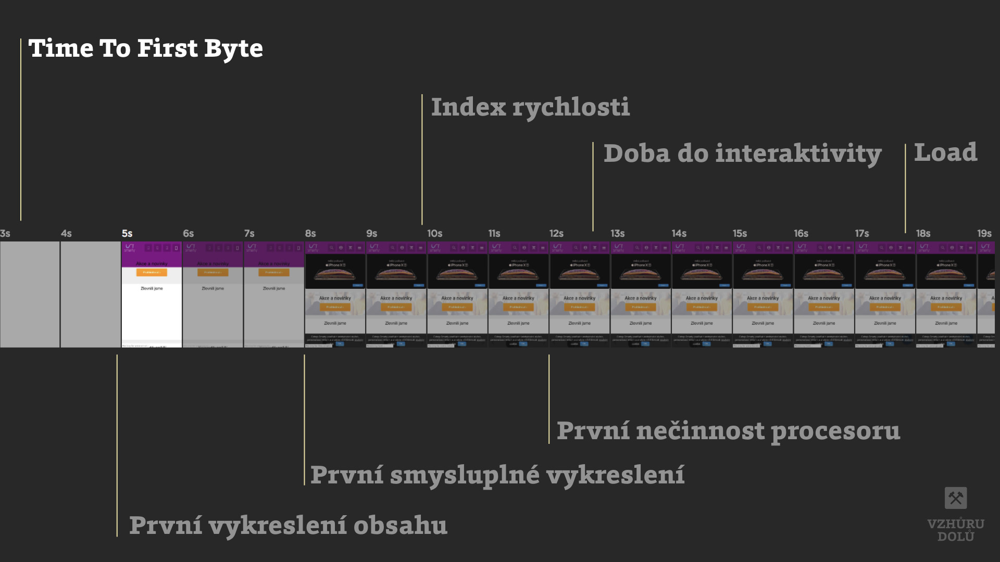
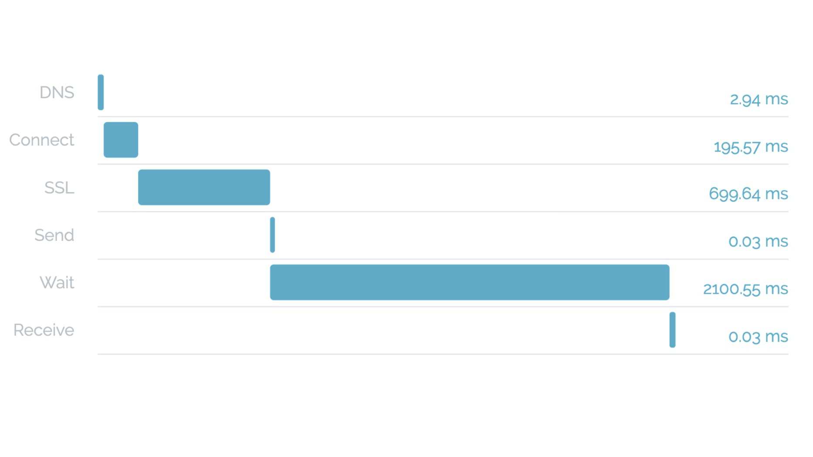

# Co je „Doba do načtení prvního bajtu“ (nebo „Time To First Byte“ nebo TTFB)

[Metrika rychlosti webu](metriky-rychlosti.md), která vzniká ve chvíli, kdy prohlížeč stáhne první bajt z vašeho HTML.

Ukazuje tedy rychlost serveru a backendové části aplikace. A taky samozřejmě rychlost sítě.

<figure>

<figcaption markdown="1">
*Obrázek: TTFB nebo taky „Time To First Byte“*
</figcaption>
</figure>

Takže laicky řečeno: Pokud je server pomalý může to být připojením mezi ním a prohlížečem. Pokud je to pomalý odevšad, asi máte pomalý server.

## Je to důležité? Ano, ale ne tak moc jak si mnozí myslí. Držte to pod půl vteřinou

[Jeden z mýtů](rychlost-myty.md#2) kolem webové rychlosti je to, že ji čas serveru obecně zásadně ovlivňuje.

TTFB ale tvoří skoro vždy tu menší část problému u pomalých webů – větší zásek je obvykle v (ne)optimalizaci frontendu.

Nicméně i tak není dobré TTFB podceňovat: Důležitý je například pro [Crawl Budget vyhledávačů](https://www.contentkingapp.cz/akademie/crawl-budget/) – kolik stránek vám robot bude schopný projít, což se týká hlavně u velkých webů.

TTFB byste měli i na pomalých připojeních držet co nejvíce pod půl vteřinou.

## Jak TTFB měřit?

TTFB ukazují asi všechny pořádnější nástroje:

- [PageSpeed Insights](pagespeed-insights.md) (jako „dobu odezvy serverů“)
- [WebpageTest.org](https://www.webpagetest.org/) (jako „First Byte“)
- [SpeedCurve](https://speedcurve.com) a další monitorovací nástroje.

První uvedený je postavený na nalyzátoru [Lighthouse](lighthouse.md), takže vám rovnou nahlásí, pokud je váš serverový čas příliš vysoký.

Průběžně monitorovací nástroje jsou u TTFB skoro nepostradatelné, protože jednotlivá měření se od sebe mohou i relativně hodně lišit.

Doba do načtení prvního bajtu prostě nastává různě podle momentálního vytížení serveru.

### Vývojářské nástroje prohlížečů

Myslím, že všechny moderní prohlížeče mají v Developer Tools nějakou záložky „Network“, kde si stačí nahrát stahování webu a pak rozkliknout řádek se stažením úvodního HTML. 

### Měření z příkazové řádky

Lze to dělat pomocí nástroje `curl`. Líbí se mi řešení [od Haydona Jamese](https://haydenjames.io/analyze-websites-ttfb-time-first-byte/):

```bash
curl -o /dev/null -w "Connect: %{time_connect} TTFB: %{time_starttransfer} Total time: %{time_total} \n" https://www.vzhurudolu.cz/
```

Ve shrnutí vrací tohle:

```bash
Connect: 0.040612
TTFB: 0.904507
Total time: 1.886265
```

### ByteCheck: Specializovaný měřič TTFB

Pro netechniky může být zajímavý tenhle online nástroj:

→ [bytecheck.com](http://www.bytecheck.com)

<figure>

<figcaption markdown="1">
*Obrázek: TTFB rozebraný na jednotlivé části procesu od ByteCheck.com*
</figcaption>
</figure>

Jak vidíte z obrázku, doba do načtení prvního bajtu se skládá z několika časových úkonů:

- Rozlišení *DNS* (převod názvu domény na IP adresu)
- *SSL* čas (pro zpracování bezpečnostního certifikátu)
- *Send* je  zaslání dotazu na server
- *Wait* označuje čas, po který se čekalo na samotný server
- *Receive* je doba do příchodu prvního bajtu do klienta (nejčastěji prohlížeče)

Je to zjednodušené, protože do hry cestou vstupují různé proxy servery nebo třeba technologie Service Worker. Detailní vysvětlení je na [developers.google.com](https://developers.google.com/web/tools/chrome-devtools/network/reference#timing-explanation).

## Kde leží příležitosti ke zlepšení?

Právě onen *Wait* čas ale právě ukazuje dobu práce samotného serveru. A zde leží příležitosti ke zlepšení. Do backendu a do serverů moc nevidím, takže zůstanu u obecných tipů:

- optimalizace databáze nebo backendového kódou
- implementace cache
- úprava serverové konfigurace
- lepší hosting

Takhle se to dobře říká, že ano? 

<!-- AdSnippet -->

## Proč to gzip zpomaluje, ale stejně jej chceme?

[V Cloudflare](https://blog.cloudflare.com/ttfb-time-to-first-byte-considered-meaningles/) pro legraci změřili jak moc se liší TTFB u stránky se zapnutou a vypnutou kompresí pomocí gzipu. 

První sloupec možná některé z vás překvapí:

|              | TTFB  | Stažení HTML |
|--------------|------:|-------------:|
| Gzip vypnutý | 213µs | 43ms         |
| Gzip zapnutý | 1.7ms | 8ms          |

Jasně, před vysláním prvního bajtu Gzip opravdu věci zpomalí. Jenže pak začne dělat svou komprimační práci a už na HTML kódu ušetří spoustu dat.

Takže ne, tohle nemá být návod na vypnutí Gzip. Raději se prosím ujistěte, zda jej máte všude zapnutý.

Shrnu teď to nejdůležitější:

- TTFB je nejlepší způsob jak měřit výkon serveru.
- Pro měření rychlosti webu je velmi nedostačující, mrkněte se na [jiné metriky](metriky-rychlosti.md).
- Do měření TTFB se může projevovat pomalé internetové připojení. 
- TTFB může být pro různá měření a různé stránky webu velmi různě vysoké. Má tedy smysl sledovat jen jeho dlouhodobý trend.


