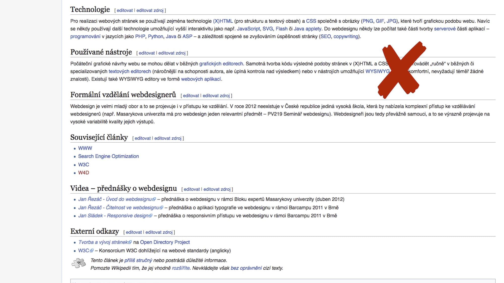
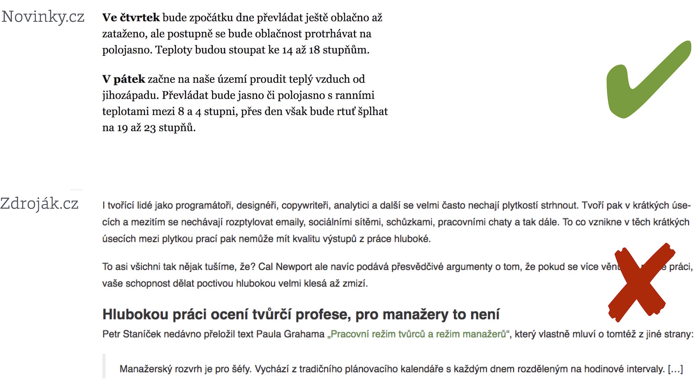
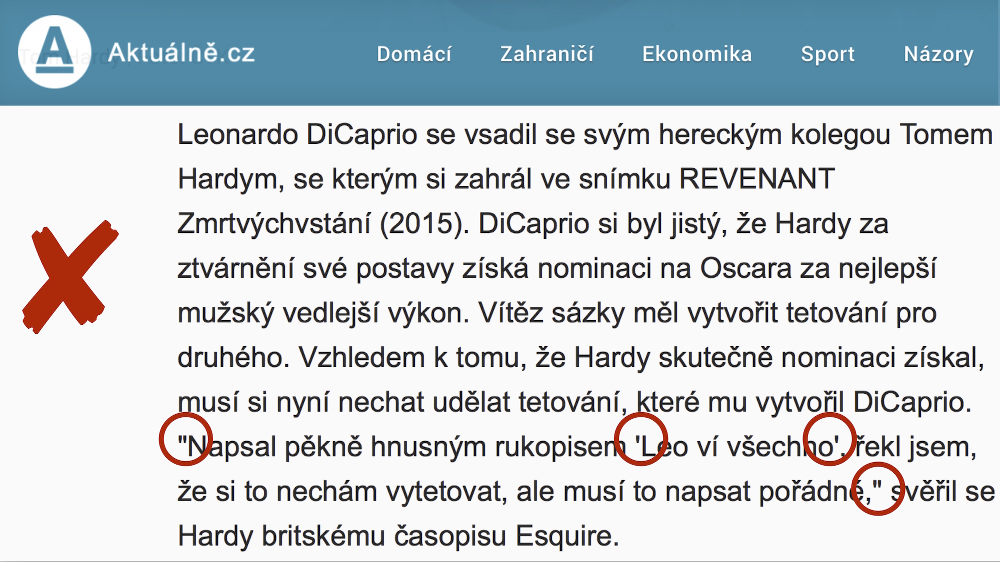

# Typografie na webu

Pojďme si projít základní množinu znalostí o využití písma na webu, zmínit pár častých chyb a dvakrát podtrhnout hlavní pravidlo pro stavbu responzivního rozvržení stránky. Předtím ale ještě zmíním jeden účel písma, na který se často zapomíná. 

## Písmo v nás vyvolává emoce

Než se začteme, může nám typ písma (spolu s dalšími prostředky vizuálního designu) sdělit informaci, co od webu očekávat. Jsem na webu seriózního magazínu, užitného webu typu e-shopu, nebo na stránkách Déčka, určeného pro děti? Asi je jasné, že tohle všechno je možné sdělit nebo zpochybnit mimo jiné i volbou písma. Je toho ale mnohem více.

Pro potřeby předání základní úrovně typografických znalostí mně tady připadá lepší začít z druhého konce. Chybami.


## Časté typografické chyby

Vypadají triviálně, ale weby jsou jich plné. Příliš dlouhé řádky, špatný kontrast a nesprávné znaky.


### 1) Příliš dlouhé řádky

Wikipedie je smutným rekordmanem v délce řádku. Řádek by obecně neměl obsahovat více než 75 znaků, aby oči nepřeskakovaly na řádky sousedící. Ještě o tom budu psát.

<figure>

<figcaption markdown="1">    
*Wikipedie na počítačovém rozlišení obrazovky*
</figcaption> 
</figure>


### 2) Špatný kontrast a další technické parametry

Novinky jsou nejen vysázené Georgií, patkovým písmem s vynikající čitelností pro delší texty, ale také velmi kontrastní barvou. Na českém webu jsou i výrazně horší weby než Zdroják, ale uvádím ho jako hůře čitelnou variantu díky kombinaci několika faktorů. 

<figure>

<figcaption markdown="1">    
*Zdroják.cz má bezpatkové písmo s horším kontrastem a délkou řádků kolem 120 znaků*
</figcaption> 
</figure>

Kontrast si můžete zkontrolovat v nástroji WCAG Contrast Checker. [contrastchecker.com](http://contrastchecker.com/).

### 3) Nesprávné znaky

Každé rozumné písmo má speciální symboly pro uvozovky (nikoliv symbol palce), pomlčky (nikoliv spojovník, který na klávesnici můžete považovat za minus) nebo výpustku (nikoliv tři běžné tečky). 

<figure>

<figcaption markdown="1">    
*Aktuálně.cz používá nesprávné znaky*
</figcaption> 
</figure>

Není to žádná buzerace typografických snobů – prostě se to lépe čte. Typografický tahák od Beneš a Michl vám může velmi pomoci. [vrdl.in/am9wu](http://blog.benes-michl.cz/data/blog/typographic_cheatsheet_1_1.pdf) (PDF)


## Ideální šířka a výška řádku

Teď zpozorněte, protože zmíním jeden ze základních designérských principů dnešního (responzivního) webdesignu.

Na příkladu Wikipedie jsem ukazoval, jak se může dlouhý řádek negativně projevit do celkové čitelnosti textu a webu. A není to jen problém Wikipedie.

Platí totiž následující:

- 66 je ideální počet znaků na jedné řádce,
- 45–75 je pak vyhovující rozmezí.

U webů, jako je právě Wikipedie, se čtenářům stává, že snadno ztrácejí aktuálně čtenou řádku. Rychlost čtení se tím snižuje.

Jsou to pravidla, která zpopularizoval Robert Bringhurst ve své knize „The Elements of Typographic Style“ a která jsou průběžně potvrzována nejrůznějšími studiemi. Ale vyzkoušet si je můžete i sami na sobě. 

Na malých displejích však není možné optima dosáhnout. Doporučení pak říkají s ubývajícím počtem znaků na řádce snižovat i jeho výšku, protože oči častěji přecházejí z jedné řádky na druhou. 


Tady je jedno z možných řešení v CSS, které ukazoval Marko Dugonjić ve své přednášce „Responsive Web Typography“ na WebExpo 2014. [vrdl.in/rwdtypo](https://speakerdeck.com/maratz/responsive-web-typography-at-webexpo)


```css
/* Méně než 45 znaků */
body { line-height: 1.4 }
p    { margin-bottom: 1.4em }

/* 45-60 znaků */
body { line-height: 1.45 }
p    { margin-bottom: 1.45em }

/* 60-75 znaků */
body { line-height: 1.5 }
p    { margin-bottom: 1.5em }
```

Toto nastavení předpokládá vysázení patkovým písmem a do jednoho sloupce. Drobně se samozřejmě může měnit podle parametrů písma. Jinak to bude pro nepatkové písmo, pro jiný kontrast, pro specifický charakter písma nebo počet sloupců. Nejlépe nám správnou volbu potvrdí poctivé uživatelské testování, ale pro začátek stačí nastavení písem testovat na různých zařízeních a různých lidech ve vašem okolí.

Příliš malý řádkový proklad spojuje sousedící znaky, zhoršuje čitelnost slov a ve výsledku zpomaluje čtení. Příliš velký zase vypadá jako seznam samostatných položek a nutí uživatele přemýšlet, zda se jedná o souvislý text nebo o nějakou formu odrážek.

Nicméně délka a výška řádku je první designérské pravidlo, na které bychom při návrhu rozhraní měli myslet. Postup návrhu pak ideálně vypadá tak, že zvolíme písmo, získáme obsah a až na těchto dvou nerozlučných přátelích postavíme systém pro layout stránky.


## Další zdroje o typografii

Jasně, vnímáte mě dobře. Typografii mám za jeden ze zásadních stavebních kamenů přípravy vizuálu skoro každého webu. A myslím, že ze všech pěti prostředků grafického designu, které jsem zmiňoval, by právě typografii měli nejvíce rozumět i kodéři a vývojáři. Protože oni jsou často ti „sazeči“, kteří mohou mnohé ovlivnit.

* *Kniha „On Web Typography“*  
Skvělá učebnice typografie od Jasona Santa Maria. [vrdl.in/76nb2](https://abookapart.com/products/on-web-typography)
* *Přednáška „Praktická typografie pro webové kodéry“*  
Dan Srb se hezky rozpovídal na jedné z akcí Frontendisti.cz. [youtu.be/bJLGEMQ3rnM](https://youtu.be/bJLGEMQ3rnM)
* *Online kniha „The Elements of Typographic Style Applied to the Web“*  
Bible od Roberta Bringhursta a spoluautorů. [webtypography.net](http://webtypography.net/toc/)


