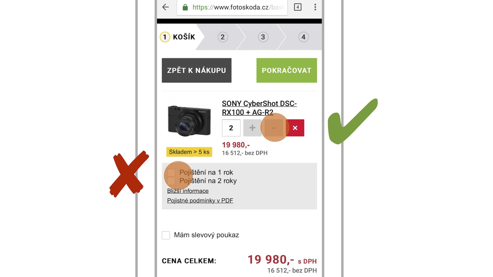

# Minimální plocha aktivní plochy: alespoň centimetr čtvereční

Robert Wadlow byl podle Wikipedie nejvyšším člověkem v historii. Přezdívalo se mu Obr z Altonu. Když navrhuji rozhraní, dost na něj myslím. Hned vysvětlím proč. 

Titěrné aktivní plochy v uživatelském rozhraní jsou častým hříchem responzivních webů. Ano, kurzorem myši se trefíte skoro na cokoliv.

Palec sedmnáctileté dívky bude menší než palec Roberta Wadlowa. Ten totiž měřil 272 cm a vážil okolo 220 kg. Proto raději při vymýšlení rozhraní myslím na Obra z Altonu než na mladé dívky, jestli mi rozumíte.

Co se týká minimální plochy aktivní plochy, moderní webařina se nejčastěji odkazuje na další výzkum Stevena Hoobera, provedený tentokrát ve spolupráci s Patti Shank. Zjistili, že potřebná minimální plocha se různí podle vzdálenosti od kraje obrazovky:

* ve středu obrazovky je 7 čtverečních milimetrů
* na krajích obrazovky je to 11 čtverečních milimetrů

Přiznávám, že ve svých myšlenkách na Obra z Altonu si pravidlo zjednodušuji. Chci aktivní plochu vždy alespoň jeden čtvereční centimetr.

<figure>

<figcaption markdown="1">    
*E-shop FotoŠkoda.cz má jeden z těch povedenějších košíků na mobilech. Všechno velké, navigace jednoznačná. Jen prvky v šedivé ploše s „Pojištěním“ by můj palec ani na pětiapůlpalcovém iPhonu netrefil. Na výšku alespoň centimetr, prosím*
</figcaption> 
</figure>


## Jak ideální plochu zapsat kódem?

Za předpokladu, že máte správně nastavenou meta značku pro viewport, to dokonce lze zapsat v CSS tak, aby ve všech dnešních mobilních zařízeních byla plocha přibližně centimetr veliká.

Podle Joshe Clarka, kterého cituji v předchozích textech, mají téměř všechna dotyková zařízení rozlišení kolem 160 DPI (CSS pixelů na palec). Přepočtem do centimetrů čtverečních dostaneme při obvyklé výchozí velikosti písma v prohlížečích (`16px`) tento výsledek:


```css
/* 10mm při 160 DPI ≅ 63px ≅ 4rem */
.touch { width: 4rem; height: 4rem; }
```

Budou to lidé trefovat palcem? Navrhněte to na plochu centimetru čtverečního. Navrhněte to i pro obra z Altonu.

Na závěr odkážu na zmíněný výzkum Stevena Hoobera a Patti Shank: „Making mLearning Usable: How We Use Mobile Devices“. 
[vrdl.in/aug5z](http://shoobe01.blogspot.cz/2014/11/making-mlearning-usable-how-we-use.html) 

