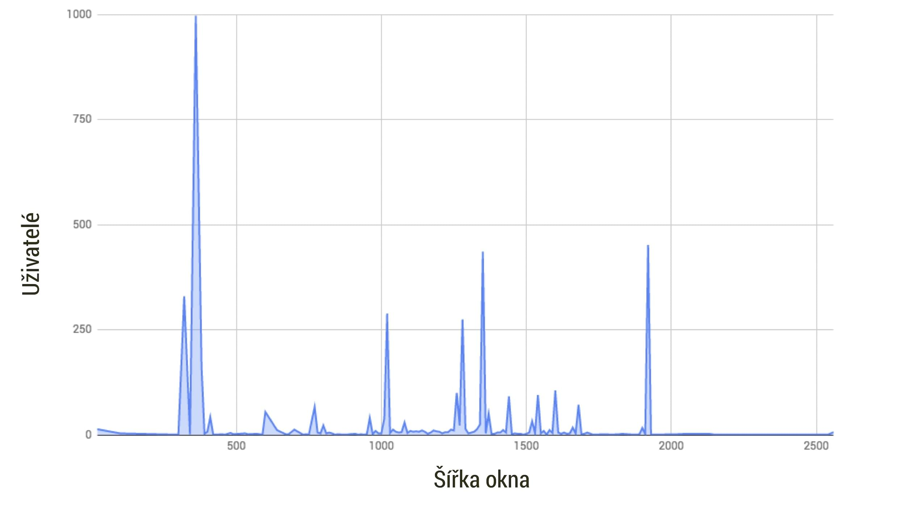
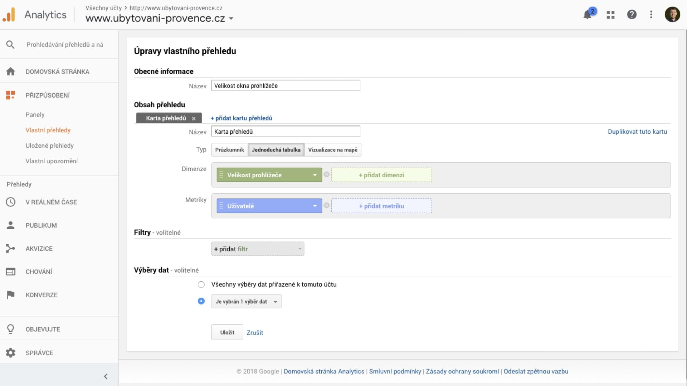
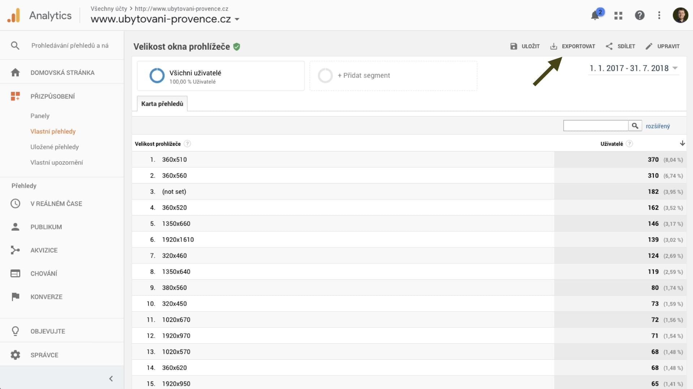

# Google Analytics: S jakými viewporty navštěvují uživatelé můj web?

Data o velikostech okna (nebo viewportu) dodávají na rozdíl od [rozlišení displeje](rozliseni-displeje.md) do [responzivního designu](https://www.vzhurudolu.cz/responzivni-design) informaci, bez které se nedá rozumně vymýšlet design webu.

Jde o nejdůležitější uživatelský kontext, kterému se weby přizpůsobují. Mají vliv na [tvorbu breakpointů](breakpointy.md), hojně se s nimi pracuje [v CSS a JavaScriptu](velikost-okna-css-js.md).

<!-- AdSnippet -->

Jenže z veřejně dostupných dat tady vyjít nemůžeme: [Gemius](http://ranking.gemius.com/cz/), [Statcounter](http://gs.statcounter.com/) nebo i [Google Analytics](google-analytics-vyvojari.md) standardně nabízejí jen přehled pro rozlišení obrazovky, který je webařům tak nějak *na pytel*.

Ukážu vám ale způsob, jak z Google Analytics (GA) data vytáhnout a prezentovat v jakžtakž použitelné podobě. Jako na následujícím obrázku.

Je jen potřeba si v GA připravit vlastní report a data z něj pak vybrousit přes Google tabulku. Chcete si to zkusit na svých datech? Pojďme si to projít postupně.

## Návod krok za krokem {#navod}

Poznámka  hned na začátek: Měřený web musí být responzivní nebo  – technicky řečeno – musí používat [meta značku pro viewport](viewport-meta.md). U neresponzivních webů vám do Analytics všechny mobilní zařízení ukáží výchozí layoutový viewport, obvykle v šířce 980 px.

V ukázce používám data z malého webíku [ubytovani-provence.cz](http://www.ubytovani-provence.cz/).

### 1) Google Analytics: Vlastní report velikost okna {#navod-1}

V Google Analytics si vytvořte vlastní report:  
*(Přizpůsobení → Vlastní přehledy  → Nový vlastní přehled)*

- Název: Třeba *„Velikosti okna prohlížeče“*
- Typ: *Jednoduchá tabulka*
- Skupina metrik: Přidat metriku *Uživatelé*
- Úrovňové přechody dimenze: Přidat dimenzi *Velikost prohlížeče*
- Uložit a je to

Všechna ostatní nastavení klidně ponechte ve výchozím stavu.

V angličtině je to popsáno například na [CSS Tricks](https://css-tricks.com/google-analytics-can-show-screen-resolution-%E2%89%A0-browser-window/).

### 2) Uložte do Google tabulky {#navod-2}

Po otevření reportu (*Přizpůsobení → Vlastní přehledy*) uvidíte přehled po velikostech okna, ale ten vám nicmoc neřekne.

Já si vše uložil do Google tabulky a dále s tím pracoval tam:

- *Exportovat → Tabulky Google*

Pozor, Analytics mají limit 5 000 řádků exportu. Většinou to nevadí, ale některé projekty to může limitovat. Na to jsem vyzrál [úpravou počtu řádků](https://www.hobo-web.co.uk/how-to-export-more-then-500-rows-to-csv-up-to-50000-rows-google-analytics-tip/) přímo v URL adrese.

- [Google Analytics: přidání webu](google-analytics-pridani.md)
- [Google Analytics: průvodce měřením](google-analytics-vyvojari.md)

Tabulka by v tomto kroku měla vypadat [asi takto](https://docs.google.com/spreadsheets/d/1A4AvTM9KejtlG6DFUH0-G1sytm4SZvhnCBMMgn_lBKw/edit?usp=sharing).

### 3) Pročistit Google tabulku {#navod-3}

Tady jsme z rozlišení odmazal nepotřebné údaje a taky výšku okna, protože design uzpůsobuji hlavně jeho šířce. Spojil jsem stejné šířky okna do jednoho řádku a seřadil.

- Odmazat hlavičku: Pomocí *Odstranit řádky* z kontextové nabídky.
- Odmazat řádek s `(not set)` – s tím asi nic neuděláme.
- Zafixovat první řádek s popisky dat: *Zobrazit → Ukotvit → 1 řádek*.
- Odmazat výšky okna: Označit první sloupec a pak *Upravit → Najít a nahradit*, do *Najít* dát `x(.*)$` a zatrhnout *Vyhledávání pomocí regulárních výrazů*. Pak  jen *Nahradit vše*.
- Spojit stejná čísla do jednoho řádků: Nainstaloval jsem si kvůli tomu [Power Tools](https://chrome.google.com/webstore/detail/power-tools/dofhceeoedodcaheeoacmadcpegkjobi?utm_source=permalink). A pak jdu na *Doplňky → Power Tools → Data*. Pomocí *Combine rows* vyberu v druhém kroku sloupec *Velikost prohlížeče*. *Action* ve třetím kroku je *Calculate numbers* a *Delimiter / function* pak *[SUM]*. Nakonec už jen *Finish*.
- Tabulku jsem seřadil od nejmenšího rozlišení po největší: *Data  → Seřadit list podle sloupce A, A-Z*.

Výsledná tabulka: [Ukázka](https://docs.google.com/spreadsheets/d/1cKKFrS887KiIHHtZ8Nv-vli9XN_rqXNCsUKQDmNmqDk/edit#gid=1063209725).

### 4) Plošný graf {#navod-4}

Dostali jsme se k docela hezké reprezentaci čísel. Mě by však zajímala distribuce rozlišení na ose. K tomu je samozřejmě ideální graf.

- *Vložit → Graf*
- Ve formuláři: *Typ grafu: Plošný* a *Použít sloupec A jako popisky*

Výsledná tabulka s grafem: [Ukázka](https://docs.google.com/spreadsheets/d/18PHIBsQOsKL7cqiE2fVo2RmmHTAym2C1Fi7An8vJMOw/edit#gid=1063209725).

## Graf rozdělení šířky viewportů na vašem projektu {#graf}

<!-- AdSnippet -->

Dostaneme se k docela hezky vypovídajícím grafu.

Na jeho základě můžu vymýšlet body zlomu designu (breakpointy) nebo minimálně ověřovat jejich nastavení.

Když například vezmu nastavení breakpointů například ze vcelku rozumného článku [The 100% correct way to do CSS breakpoints](https://medium.freecodecamp.org/the-100-correct-way-to-do-css-breakpoints-88d6a5ba1862), bylo by rozdělení u analyzovaného projektíku následující:

* 0 - 599 pixelů: 35 %
* 600 - 899 pixelů: 5 %
* 900 - 1 199 pixelů: 13 %
* 1 200 - 1 799 pixelů: 35 %
* 1 800 pixelů a více: 12 %

Tady bych zvažoval, zda breakpointy nenastavit jinak – je zde velmi málo uživatelů s obrazovkami šířky 600-900 pixelů a s velmi velkými displeji. Ale k nastavování breakpointů se ještě vrátím v dalším textu.

Dvě poznámky na závěr:

1. Necítím se jako analytický profík, takže pokud máte námět na vylepšení nebo zjednodušení procesu nebo výsledné prezentace, velmi je vítám.
2. Docela dost by mě zajímaly grafy z vašich projektů - zejména těch s větší návštěvností. Tušíte správně, že se to dost liší projekt od projektu. Budu moc rád, když je nasdílíte.

<!-- AdSnippet -->
