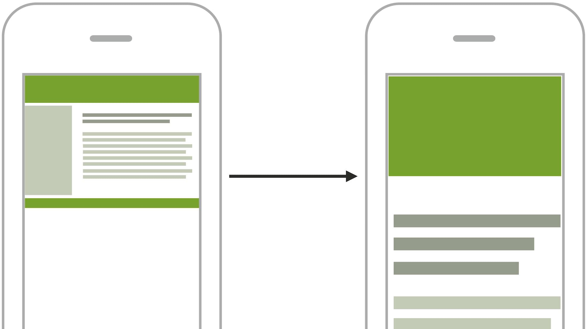
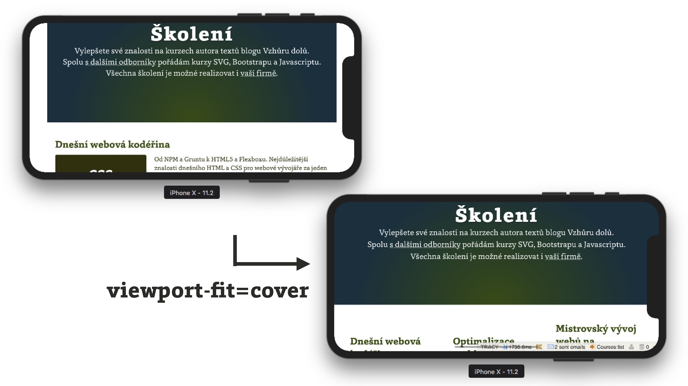

# Meta značka pro viewport

Lidsky řečeno slouží k informování prohlížeče o tom, zda a jak jste web připravili pro mobilní zařízení.

<figure>

<figcaption markdown="1">
*Obrázek: Po vložení meta značky pro viewport se z desktopového rozlišení stane mobilní*
</figcaption>
</figure>

Bez použití meta značky se web vykreslí do výchozího layoutového viewportu, který má většinou šířku 980 pixelů. Web bude vypadat „jako na počítači, jen zmenšený“. S použitím meta značky pro viewport se šířka [layoutového viewportu](viewport-mobily.md) nastaví na velikost rozlišení v [CSS pixelech](css-pixel.md).

## Jednoduchá varianta {#varianta-jednoducha}

Dnes už nebude takový problém, pokud použijete následující zápis:

```html
<meta name="viewport" content="width=device-width">
```

Když byste ale moc stáli o podporu všech starších a méně významných kontextů (iOS 8, Windows Phone nebo přilepení ke kraji obrazovky – „snap“ mód – v desktopových Windows), volte spíše následující verzi.

## Varianta s podporou všech zařízení {#varianta-plna}

V HTML hlavičce:

```html
<meta name="viewport"
  content="width=device-width, initial-scale=1">
```

K tomu si do CSS doplňte:

```css
@-ms-viewport {
  width: device-width;
}
```

Proč takhle složitě?

- Bez `initial-scale=1` totiž Safari na iOS 8 a starších renderuje stránku do rozlišení jako by bylo otočené na výšku, i když jej používáme na šířku.
- Bez `@-ms-viewport` v CSS vám Internet Explorer a Edge nespočítají správný viewport v takzvaném „snap“ módu, přichycení ke kraji obrazovky na desktopových Windows.

Teoreticky dělá `initial-scale=1` na všech zařízeních totéž co `width=device-width`, ale bez toho druhého chybuje Internet Explorer na mobilních Windows 8 stejným způsobem jako osmá a starší verze mobilního operačního systému od Apple.

<!-- AdSnippet -->

Jak už jsem na začátku textu naznačil – svět se nezboří, když na tohle zapomenete. Mobilní Windows jsou v roce 2018 i z pohledu uživatelské základny prakticky mrtvá platforma. „Snap“ mód ve Windows zase dle mého názoru skoro nikdo nepoužívá. iOS 8 a starší je podobný případ.

## Parametry meta značky pro viewport {#parametry}

Do atributu `content` je možné dávat různé vlastnosti a jejich hodnoty.

### `width` {#width}

Nastaví šířku layoutového viewportu v pixelech. Nejčastěji využívaná hodnota `device-width` sjednotí šířku layoutového viewportu se šířkou ideálního viewportu. Takže uživatel nebude muset zoomovat a vaši responzivní stránku uvidí jedna ku jedné. Pokud použijete hodnotu, např. `width=400`, nastavíte šířku layoutového viewportu na 400 pixelů. Nenapadá mě ale moc rozumných důvodů, proč to dělat.

### `initial-scale` {#initial-scale}

Nastaví výchozí zoom, ale také šířku layoutového viewportu. Ve výsledku dělá zápis `initial-scale=1` totéž jako `width=device-width`. Jak už jsem psal: Pokud chcete maximální kompatibilitu, uvádějte oba dva.

### `user-scalable` {#user-scalable}

Hodnota `no` zakazuje uživateli jakkoliv zoomovat.  Prosím, nepoužívejte ji. Zoomování je na mobilních zařízení fakt potřeba. Ať už jde o zvětšení textu v horších světelných podmínkách, nebo jen touhu vidět detaily z nějakého obrázku, přibližování obsahu prostě potřebují všichni uživatelé. Safari na iOS 10 a novějších navíc zákaz zoomování úplně ignoruje. <span class="ebook-only">Více o tom píšu [v kapitole o častých chybách](responzivni-ui-caste-chyby.md).</span>

### `minimum-scale`/`maximum-scale` {#scale}

Minimální a maximální možný zoom. `maximum-scale=1` ruší možnost přiblížení stejně jako `user-scalable=no`. Opět naléhám – prosím, nepoužívejte to.

### `shrink-to-fit` {#shrink-to-fit}

Pokud nějaké prvky pozicujete částečně mimo viewport (například pomocí `position: absolute`), na zařízeních s iOS se vizuální viewport přepočítá tak, aby se zobrazil i onen pozicovaný element.

Může se ale stát, že si to takhle nepřejete. Třeba jen chcete, aby byl element částečně ořízlý a mimo viewport. Od iOS 9 můžete použít deklaraci `shrink-to-fit=no`, kterou to zařídíte.

Hezky je to vysvětlené na Stack Overflow, i s ukázkou v CodePen: [https://stackoverflow.com/a/33949647/889682](https://stackoverflow.com/a/33949647/889682)

Váš meta tag pro viewport by pak měl vypadat takto:

```html
<meta name="viewport"
  content="width=device-width, initial-scale=1.0, shrink-to-fit=no">
```

### `viewport-fit` {#viewport-fit}

Nová vlastnost, která řeší způsob zobrazování na zařízeních s jinou než hranatou obrazovkou. Jako příklad vezměme chytré hodinky nebo iPhone X. Vlastnost může mít následující hodnoty (už znáte z `background-size`):

- `auto` - výchozí stav, který vše nechává na prohlížeči. U iPhone X například odpovídá hodnotě `contain`.
- `contain` - zmenší viewport pro stránku tak, aby byla vidět celá. Jakou barvu vykreslí po stranách, záleží na prohlížeči. iPhone X v `background-color` z `body`.
- `cover` - roztáhne viewport pro stránku tak, aby nikde „nevyčuhovaly“ neobarvené části rozhraní prohlížeče. S tím rizikem, že kulaté rohy nebo výčnělky na displeji zařízení některé části stránky překryjí.

<figure>

<figcaption markdown="1">
*Pokud má stránka různobarevné pozadí, jako Vzhůru dolů, hodí se do meta značky přidat ještě viewport-fit=cover*
</figcaption>
</figure>

<div class="web-only" markdown="1">
Více o tom píšu [v článku o iPhone X](https://www.vzhurudolu.cz/prirucka/iphone-x).
</div>

<div class="ebook-only" markdown="1">
Více o tom píšu na blogu v článku o iPhone X. [vrdl.cz/p/iphone-x](https://www.vzhurudolu.cz/prirucka/iphone-x)
</div>

<!-- AdSnippet -->

Stručné řešení pro vaše weby: Pro layout s jednobarevným pozadím si jen zkontrolujte nastavení `background-color` na `body`. Pro weby s různobarevnými prvky zabírajícími celou šířku si přidejte parametr do meta značky pro viewport:

```html
<meta name="viewport"
  content="width=device-width, viewport-fit=cover">
```

## Tipy, triky, zajímavosti {#tipy}

### Meta viewport raději moc nenastavujte Javascriptem  {#js}

Hodí se to, jen když nemáte přístup do `<head>`. Teoreticky jde Javascriptem meta značka pro viewport i měnit, ale nedělejte to. Je to náročné na překreslování stránky. Vyrobte raději normální responzivní web s jedním meta tagem pro viewport.

### Odstranění prodlevy mezi tapnutím a akcí trvající 300 ms  {#300ms}

Když budete mít viewport nastavený správně, s hodnotou `width`, aktuální prohlížeče postavené na jádrech WebKit a Blink samy odstraní prodlevu mezi tapnutím a akcí. Starší prohlížeče prodlevu dělaly proto, že po tapnutí prstem čekaly, zda nepřidáte prst druhý a nemáte tedy v úmyslu stránku zvětšovat. Více si o tom můžete přečíst <span class="ebook-only" markdown="1">na blogu vývojářů WebKitu. [vrdl.in/l72eg](https://webkit.org/blog/5610/more-responsive-tapping-on-ios/)</span> <span class="ebook-only" markdown="1">[na blogu vývojářů WebKitu](https://webkit.org/blog/5610/more-responsive-tapping-on-ios/).</span>

### Zavináčové pravidlo `@viewport` v CSS {#zavinac}

Instrukce pro způsob zobrazování by se měla dávat do CSS, že ano? S logičtěji umístěným zápisem `@viewport { }` přišlo W3C, ale moderní prohlížeče jej zatím nezvládají. Výjimkou je Internet Explorer a Edge, které pravidlo využívají v takzvaném „snap“ módu na desktopových Windows. <span class="ebook-only" markdown="1"> [vrdl.cz/p/viewport-windows](https://www.vzhurudolu.cz/prirucka/viewport-windows)</span> <span class="web-only" markdown="1">Psal jsem o tom [ve starším článku](https://www.vzhurudolu.cz/prirucka/viewport-windows).</span>

### Weby na WatchOS – pokud máte web optimalizovaný pro viewporty menší než 320px {#watch-os}

Chytré hodinky od Appple vynucují zobrazení našich webových dílek  na zápěstí uživatelů ve viewportu širokém 320 CSS pixelů. Pokud bychom tomu chtěli zabránit a zobrazit je ve výchozím CSS rozlišení (o šířce 272 nebo 312 pixelů podle typu hodinek), musíme si dupnout následujícím kódem:

```html
<meta name="disabled-adaptations" content="watch">
```

Vtipné je, že WatchOS ve výchozím režimu vynucují přepočítaný viewport uvnitř přepočítaného viewportu. Ale co už – my léta víme, že viewporty na mobilních zařízeních jsou jako teorie relativity. Vím, že existují, víme že jsou složité, ale skoro nikdo jim přesně nerozumí.

<div class="ebook-only" markdown="1">

Více o [webech na WatchOS](weby-watchos.md) píšu ve zvláštní kapitole.

Teď se pojďme podívat na jeden parametr webů, jehož podcenění může mít daleko horší důsledky – rychlost načítání. Nepatří sem jen zdánlivě. V průběhu práce na projektu ji totiž nesmíme nechat na závěr.

</div>

<!-- AdSnippet -->
