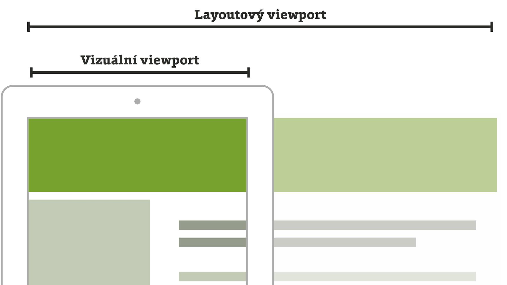

# Viewport ve webdesignu: layoutový, vizuální a ideální

Dozvíte se, co je layoutový, co vizuální a co ideální viewport. A také proč je jich tolik.

Co to ale ten *viewport* vlastně je? V kontextu webdesignu jde o označení pro výřez stránky viditelný v okně prohlížeče. Na zařízeních, kde je možné měnit velikost okna (typicky počítačích), tedy viewport představuje šířku a výšku okna bez rozhraní prohlížeče.

Na mobilních zařízeních potřebují webaři viewportů více, protože obrazovka je malá. Z toho pak vyplývá:

- weby se mu chtějí přizpůsobovat různým způsobem,
- uživatelé zase stránku hodlají zvětšovat nebo zmenšovat.

<!-- AdSnippet -->

Od výrobců zařízení jsme tedy dostali dva viewporty a ještě jeden navíc. Jako bonus. Nejdříve ale k historickému kontextu.

## Proč neexistuje jen jeden viewport a za co může první iPhone {#proc-ne-jeden}

První iPhone přišel v roce 2006 do situace, kdy byl prakticky každý web navržený jen pro velké displeje. S tím se dítko Steva Jobse snažilo vypořádat zmenšením layoutu webu a přidáním možnosti konkrétní části zvětšovat.

Zároveň v Applu doufali, že začnou vznikat weby přizpůsobené malým obrazovkám. Proto přišli s možností, jak  webaři mohou mobilním  zařízením  sdělit, že pro ně web upravili. My pro to dnes už rutinně používáme [meta značku pro viewport](viewport-meta.md):

```html
<meta name="viewport" content="width=device-width">
```

Obvykle se tím sjednotí šířka layoutového viewportu se šířkou ideálního viewportu. Je to tedy jednoduché. Ale když uživatel začne stránku zvětšovat nebo zmenšovat, jsme opět v situaci dvou viewportů. Proto je musíme znát.

Zpět tedy k našim viewportům. Budeme používat terminologii Petera-Paula Kocha a rozlišovat viewporty layoutové, vizuální a ideální. [quirksmode.org/mobile/metaviewport](http://www.quirksmode.org/mobile/metaviewport/)

<figure>

<figcaption markdown="1">
*Obrázek: Viewport layoutový a vizuální. Při použití správné meta značky jsou oba při načtení responzivní stránky na všech zařízeních stejně široké*
</figcaption>
</figure>

## Layoutový viewport {#layoutovy}

To je plocha, do které se vykresluje layout stránky napsaný v CSS.

Pokud vložíte meta značku pro viewport, má stejné rozměry jako vnitřní část okna prohlížeče. Svou velikost ale mění, když uživatel zoomuje, zvětšuje nebo zmenšuje viditelnou část stránky.

Když na meta značku zapomenete, použije se výchozí šířka layoutového viewportu, která je na dnešních zařízeních vždy 980 pixelů.

<!-- AdSnippet -->

Javascriptem zjistíte rozměry layoutového viewportu pomocí `document.documentElement.clientWidth` a `clientHeight`. K layoutovému viewportu se vztahují [Media Queries](css3-media-queries.md) pro velikost okna `min-width` a `max-width`.

## Vizuální viewport {#vizualni}

Jedná se o „průzor“, přes který se díváte na layoutový viewport, a tedy stránku samotnou.

Do rozměrů se nezahrnují ovládací prvky prohlížeče. Vizuální viewport zůstává pořád stejný.

Javascriptem zjistíte rozměry vizuálního viewportu pomocí `window.innerWidth` a `innerHeight`. Bez posuvníku pak díky `document.documentElement.clientWidth` a `clientHeight`. Více najdete [v textu o velikosti okna](velikost-okna-css-js.md).

## Ideální viewport  {#idealni}

Ideální viewport je trochu z jiné kategorie než dva předchozí. Hodnotu totiž určuje výrobce prohlížeče. Představuje ideální rozměry layoutového viewportu. Počítá se z rozlišení obrazovky v CSS pixelech.

Hodnotu ideálního viewportu získáte, když vydělíte hardwarové rozlišení hodnotou `resolution` (nebo postaru `device-pixel-ratio`).

Takový iPhone X má hardwarové rozlišení kratší strany 1125 pixelů, ale v CSS pixelech je to 375 (Device Pixel Ratio je  3). Ideální viewport je tedy široký 375 pixelů.
  
Více informací je k dispozici ve zvláštním textu <span class="ebook-only" markdown="1">[o CSS pixelu](zmeny-css-pixel.md)</span> <span class="web-only" markdown="1">[o CSS pixelu](css-pixel.md)</span>. 


<div class="web-only" markdown="1">

  Můžete pokračovat článkem o [meta značce pro viewport](viewport-meta.md) nebo [výpočtu velikosti okna v CSS a JS](velikost-okna-css-js.md).

</div>

<p class="video web-only">

Video: <a href="https://www.youtube.com/watch?v=Un1lofU64oo">Viewporty na mobilních zařízeních</a> ~ Praktická demonstrace viewportů na mobilních zařízeních a jak se k nim dostat v Javascriptu.

</p>

<div class="ebook-only" markdown="1">

  Po téhle exkurzi do technické teorie se podíváme na její praktické využití  v meta značce pro viewport.  

</div>

<!-- AdSnippet -->
