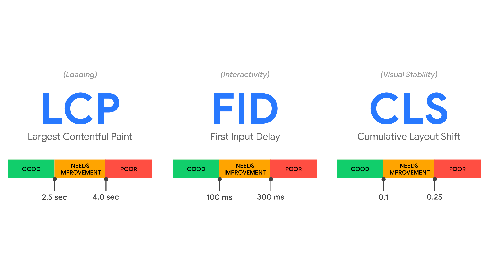
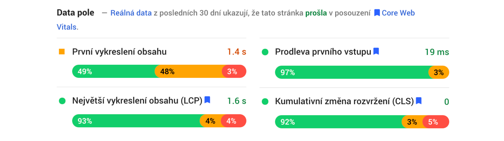

# Web Vitals

Web Vitals je sada metrik, které Google nově označuje za důležité pro sledování dobrého uživatelského zážitku na webu.

Aktuálně je totiž [měření rychlosti](rychlost-nastroje.md) (a UX) webu poměrně složitá disciplína, ve které se stěží orientují specialisté (ke kterým se počítám). Pro všechny ostatní je to zcela nepřehledné.

<!-- AdSnippet -->

Nově tedy budeme měřit hlavně tři metriky – LCP, FID a CLS. Dostali jsme k tomu nástroje a příslib, že se to už nebude moc často měnit.

Google tentokrát [zcela jasně říká](https://webmasters.googleblog.com/2020/05/evaluating-page-experience.html), že na tuto sadu metrik bude v budoucnu hledět při posuzování kvality webu. Je zde tedy jednoznačná vazba na SEO.

Pojďme si v tomto textu dát rychlý úvod do metrik ve Vitals obsažených a do způsobů měření.

## Metriky {#metriky}

V sadě Web Vitals je metrik více, ale ty nejpodstatnější Google označuje jako *Core Web Vitals*. Jde tedy o jakési „základní životní funkce“ každého webu, jak by zněl jeden z možných překladů.

### Core Web Vitals {#core}

Celé se to točí kolem tří hlavních metrik:

* [*Largest Contentful Paint (LCP)*](metrika-lcp.md)  
Největší vykreslení obsahu. Metrika, která popisuje rychlost načítání stránky – *načítací (loading)* výkon. Jde o něco mezi [FCP](metrika-fcp.md) a [SpeedIndexem](speedindex.md).
* [*First Input Delay (FID)*](metrika-fid.md)  
První nečinnost procesoru. Metrika, která popisuje jak rychle může uživatel na stránce začít provádět úlohy – výkon *interaktivity*. Jedná se tedy o metriku podobnou [TTI](metrika-tti.md).
* [*Cumulative Layout Shift (CLS)*](metrika-cls.md)  
Kumulativní posun layoutu. Metrika, která popisuje *vizuální stabilitu* layoutu během vykreslování, což je úplně nová metrika, kterou si na Vzhůru dolů brzy popíšeme.

Google také rozlišuje tři stavy metrik. Nově je označuje takto:

* *Good* – Metrika vyhovuje kritériím.
* *Needs Improvements* – Metrika vyžaduje zlepšení.
* *Poor* – Hodnota metriky je špatná.

Hranice pro stavy jednotlivých metrik jsou [podle Googlu](https://web.dev/defining-core-web-vitals-thresholds/) následující:

| Metrika    |  Good     |  Needs Improvement  |  Poor     |
|:-----------|----------:|--------------------:|----------:|
| LCP        | ≤ 2,5 s   |   2,5 - 4 s         |  > 4 s    |
| FID        | ≤ 100 ms  |   100 - 300 ms      |  > 300 ms |
| CLS        | ≤ 0,1     |   0,1 - 0,25        |  > 0,25   |

Pokud si chcete stav jednotlivých metrik u vašeho webu převést do jediného čísla, měli byste podle Googlu použít hodnotu na 75. percentilu pro sadu měření všech uživatelů – na mobilech i u počítačů.

No a pokud byste chtěli jen jeden stav, jedno vysvědčení pro měřenou stránku, ze všech metrik musíte vzít tu nejhorší. Zdá se totiž, že přesně tak to zobrazují aktuální [PageSpeed Insights](pagespeed-insights.md).

<figure>

<figcaption markdown="1">
*Obrázek: Tady je máme v plné kráse – jednotlivé metriky Web Vitals. Zdroj: [web.dev](https://web.dev/vitals/).*
</figcaption>
</figure>

Google má také na web.dev pěkné materiály o optimalizaci jednotlivých metrik:

* [Optimalizace LCP](https://web.dev/optimize-lcp/)
* [Optimalizace FID](https://web.dev/optimize-fid/)
* [Optimalizace CLS](https://web.dev/optimize-cls/)

### A co další metriky? {#dalsi-metriky}

Jistě vás napadlo: Kam zmizely další metriky? Google výslovně říká, že Web Vitals by měl znát a měřit každý, kdo je nějak zainteresovaný do webů.

<!-- AdSnippet -->

Nicméně pro experty a technické lidi zůstávají zajímavé i další [metriky rychlosti](metriky-rychlosti.md). Například problémy u metriky LCP nedokážeme odhalit bez měření [rychlosti backendu (TTFB)](ttfb.md) nebo [prvního vykreslení obsahu (FCP)](metrika-fcp.md).

→ *Související: [Metriky rychlosti webu](metriky-rychlosti.md)*

A teď to podstatné – jak k čertu ty tři hlavní metriky získat?

## Jak Web Vitals měřit? {#mereni}

K metrikám Web Vitals se dostanete snadno. Googlu se totiž povedlo velmi rychle aktualizovat své měřící nástroje tak, aby reflektovaly novou situaci.

<figure>

<figcaption markdown="1">
*Obrázek: Web Vitals v PageSpeed Insights. Dnes tento nástroj ještě ukazuje hodnoty metriky FCP, která ale není součástí Core Web Vitals a do celkového skóre („stránka prošla“) se nezapočítává.*
</figcaption>
</figure>

Ke dnešku jsou možnosti následující:

* [*PageSpeed Insights*](pagespeed-insights.md)  
Nástroj pro nejrychlejší jednorázové měření už nové metriky zobrazuje. Ukazují se v části měření reálných uživatelů („Data pole“). Měření si můžete zkusit hned: [vrdl.in/psi](https://developers.google.com/speed/pagespeed/insights/).
* [*Search Console*](google-search-console.md)  
V části „Core Web Vitals“ je už možné vidět denodenní reporty ukazující, kolik stránek webu splňuje či nesplňuje jednotlivé metriky Vitals.
* [*Chrome User Experience Report*](chrome-ux-report.md)  
Zdroj dat pro měření přímo od Googlu. Jednoduše si je můžete vytáhnout například pomocí CrUX Dashboardu do Data Studia: [g.co/chromeuxdash](http://g.co/chromeuxdash)
* *WebpageTest*  
Ve výsledcích testů už zobrazuje některé z Web Vitals, jsou zvýrazněné zeleně. [Ukázka](https://www.webpagetest.org/result/200601_DF_7547ed796233dfb60ddd1a074c2206a6/).
* [*Rozšíření do Chrome „Web Vitals“*](https://chrome.google.com/webstore/detail/web-vitals/ahfhijdlegdabablpippeagghigmibma?hl=en)  
Jednoduše měří přímo v prohlížeči.
* [*JS knihovna web-vitals*](https://github.com/GoogleChrome/web-vitals)  
Knihovna je skvělá pro případy, že byste si chtěli začít měřit sami a ukládat si data do [Google Analytics](google-analytics-vyvojari.md) nebo vlastní analytiky.

Raději explicitně zmiňuji, že metrika FID se nedá sbírat jinak než od reálných uživatelů, z takzvaných RUM (Real User Monitoring) nástrojů. Pokud měříte synteticky strojem, což dělá například WebpageTest, [Lighthouse](lighthouse.md) nebo částečně PageSpeed Insights či [SpeedCurve](speedcurve.md), doporučuje se nahradit ji metrikou [Total Blocking Time (TBT)](https://web.dev/tbt/).

Google deklaruje, že chce, aby „Core Web Vitals“ byly stabilní a predikovatelné, a že se nebudou měnit častěji než jednou za rok. Zároveň ale dodává, že ani „Core Web Vitals“ nejsou perfektní a bude se na nich dále pracovat.

Sledujte Vzhůru dolů, abyste dostávali čerstvé informace. Tento článek budu dále aktualizovat.

<!-- AdSnippet -->
