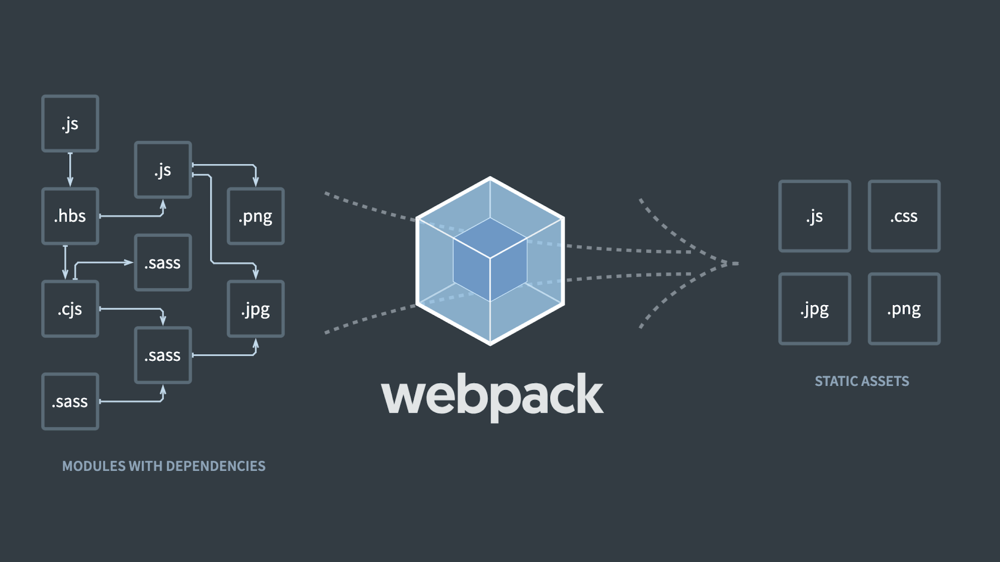

# Webpack: Úplné základy a tutoriál k tomu

Webpack je nástroj pro zpracování souborů a usnadnění práci vývojářů. Jde o kombinaci balíčkovače (*module bundler* jako je Browserify) se spouštěčem úloh (*task runner* jako jsou Gulp nebo Grunt.

<figure>

<figcaption markdown="1">
*Webpack můžete definovat mnoha způsoby. „Automatizační nástroj s ještě horší konfigurací než Grunt.“ [napsal](https://medium.com/@vojta/slovníček-pro-webařů-v-roce-2015-4edac369d3a3) Vojta Franta, ale dodává: „Za to ale je daleko mocnější“.*
</figcaption>
</figure>

Webpack je určený primárně pro svět JavaScripu, jeho modularizaci, izolaci proměnných a chytré distribuci pomocí dělení kódu (*code splitting*). Tam je vážně téměř nepostradatelný.

## CSS, obrázky, webfonty na statických webech? Zvažte jiné nástroje {#jine-nastroje}

U všech souborů, které do Webpacku nacpete – a že jimi mohou být kromě JS i CSSka, obrázky, webfonty a cokoliv vás napadne – se předpokládá, že budou součástí výstupního javascriptového balíčku.

To chcete u javascriptových aplikací, ale asi většinou ne u statických webů, kde se předpokládá, že styly a spol. budou v samostatných souborech oddělených od JS.

<!-- AdSnippet -->

Vyřešit se to ve Webpacku dá: Existuje hodně [loaderů](#pojmy-loader), zpracovávačů souborů. Jenže i tak to často bude jako se drbat levou nohou za pravým uchem.

Pro zpracování čehokoliv mimo JavaScript jsou prostě lepší tradiční spouštěče jako [Grunt](grunt.md), [Gulp](https://gulpjs.com), [NPM skripty](https://www.freecodecamp.org/news/introduction-to-npm-scripts-1dbb2ae01633/) nebo třeba [Make](https://cs.wikipedia.org/wiki/Make).

Podívejte se na video „Webpack“.

YouTube: [youtu.be/nYg829xX8uo](https://www.youtube.com/watch?v=nYg829xX8uo)

Ale mě to stejně nedalo. Vyzkoušel jsem si nastavit Webpack tak, aby zpracoval styly psané v [preprocesoru](https://www.vzhurudolu.cz/blog/12-css-preprocesory-1) SCSS do samostatného CSS. Bolelo to. Ale vznikl díky tomu alespoň pěkný tutoriál pro začátečníky.

## Tutoriál: Sass do CSS pomocí Webpacku {#tutorial}

Pojďte čichnout k samotným základům tohodle silného nástroje. Budu to brát opravdu krok za krokem pro úplné začátečníky, ale věřím, že si leccos ujasní i zkušenější webpackeři.

Předpokládám, že znáte příkazovou řádku a základní nástroje typu [NPM](npm.md).

### Krok 1: Předpoklady {#tutorial-1}

Začneme úplně od nuly. Vezměme, že máme tohle jednoduché HTML uložené v `index.html`:

```html
<!-- index.html: -->
<!DOCTYPE html>
<html>
  <head>
    <title>Webpack Demo</title>
    <meta charset="utf-8" />
  </head>
  <body>
    <div id="app"></div>
    <script src="dist/main.js"></script>
  </body>
</html>
```

Dále jsme si vytvořili testovací javascriptový soubor, konkrétně do `src/index.js`:

```js
// src/index.js:
console.log("hello world!");
```

To bude hlavní vstup pro Webpack.

### Krok 2: Instalujeme Webpack {#tutorial-2}

Pokud máme nainstalovaný balíčkovač [NPM](npm.md), můžeme teď [inicializovat náš projekt](npm.md#npm-init):

```bash
npm init --yes
```

Oním `--yes` dáváme instrukci, aby NPM v konfiguraci ponechalo výchozí hodnoty. Výsledkem jsou připravené konfiguráky [package.json](package-json.md) a [package-lock.json](package-lock-json.md).

Ty zatím s Webpackem nemají nic společného. Nainstalujeme si jej až teď:

```bash
npm install --save-dev webpack webpack-cli
```

Balíček `webpack` asi netřeba představovat. Ten druhý – `webpack-cli` – slouží k ovládání Webpacku z příkazové řádky. To se bude hodit.

NPM by nám mělo vrátit tohle:

```bash
+ webpack-cli@3.3.9
+ webpack@4.41.0
added 453 packages from 237 contributors and audited 5286 packages in 98.758s
found 0 vulnerabilities
```

Uf! Proběhlo to dobře. Můžeme dál.

### Krok 3: Spouštíme Webpack {#tutorial-3}

Teď už máme splněné minimální požadavky na běh Webpacku. Je nainstalovaný a existuje soubor, který může zpracovávat.

Můžeme si jej tedy spustit v adresáři s projektem:

```bash
npx webpack
```

Pokud neznáte příkaz [npx](https://www.npmjs.com/package/npx): Spustí NPM balíček, který nemáte nainstalovaný na svém kompjůtru nebo jej nemáte v aktuálním adresáři.

Pokud ale budete Webpack používat intenzivně, doporučuji jednorázovou globální instalaci: `npm install webpack-cli -g`. Pak je možné nástroj pouštět ze všech adresářů jednoduchým příkazem `webpack`.

Zpět k příkazové řádce. Vrátí se něco jako:

```bash
Hash: 4fa48f2cc331e12d15a4
Version: webpack 4.41.0
Time: 360ms
Built at: 2019-10-04 06:33:56
  Asset       Size  Chunks             Chunk Names
main.js  957 bytes       0  [emitted]  main
Entrypoint main = main.js
[0] ./src/index.js 28 bytes {0} [built]

WARNING in configuration
The 'mode' option has not been set, webpack will fallback to 'production' for this value. Set 'mode' option to 'development' or 'production' to enable defaults for each environment.
You can also set it to 'none' to disable any default behavior. Learn more: https://webpack.js.org/configuration/mode/
```

Asi jste si všimli, že jsme Webpacku neposkytli žádnou konfiguraci. V tomhle případě běží ve výchozím módu. Co přesně udělal?

- Podíval se do adresáře `src/`, zda nenajde soubor `index.js`. A ano, byl tam.
- Sestavil si interní [strom závislostí](#pojmy-dependency-graph), v tomto případě  spíše *bonsai* závislostí.
- Výstup uložil do `dist/main.js`, což je výchozí nastavení pro výstupní soubor.
- Vypočítal hash, unikátní kód pro toto sestavení (`4fa48f2cc331e12d15a4`), a spolu s ním pro nás vypotil nějaké další statistiky.
- Seřval nás, že si máme nastavit [mód práce](#pojmy-mode). Ve výchozím režimu předpokládá, že tvoří výstupy produkční prostředí, tedy veřejný běh webové aplikace.

### Krok 4: Kompilujeme Sass {#tutorial-4}

Vezměme, že máme dva jednoduché SCSS soubory, na kterých si ukážeme, jak ve Webpacku funguje kompilace kódu z preprocesoru Sass do CSS:

```scss
// src/styles.scss:

html {
  font-family: Verdana, Geneva, Tahoma, sans-serif;
}

@import "_component.scss";

// src/_component.scss:

.component {
  font-size: 2rem;
  padding: 1rem;
}
```

V dalším kroku si přidáme balíčky a jejich konfiguraci, které nám umožní kompilovat soubory. Nejprve instalace balíčků:

```bash
npm install css-loader sass-loader node-sass style-loader --save-dev
```

Co jsme nainstalovali?

- [node-sass](https://github.com/sass/node-sass) - kompilátor pro Sass
- [sass-loader](https://github.com/webpack-contrib/sass-loader) - Webpack „loader“ pro Sass
- [css-loader](https://github.com/webpack-contrib/css-loader) – převaděč direktiv `@import` z CSS do importů, kterým rozumí JavaScript
- [style-loader](https://github.com/webpack-contrib/style-loader) – vkládání CSS do DOMu

Pak zde máme minimální konfiguaci Webpacku. Najdete ji většinou v souboru `webpack.config.js`:

```js
module.exports = {
  entry: "./src/index.js",
  output: {
    filename: "main-configured.js"
  }
};
```

Vysvětlíme:

- Položka `entry` ukazuje na [vstupní soubory](#pojmy-entry). Může jich pochopitelně být více.
- V `output` zase najdete [výstup](#pojmy-output), tedy soubor kam Webpack ukládá.

Do konfigurace pak přidáme nový [modul](#pojmy-module):

```js
module: {
  rules: [
    {
      test: /\.scss$/,
      use: [
        'style-loader',
        'css-loader',
        'sass-loader'
      ]
    }
  ]
}  
```

Vytvořili jsme pravidlo (objekty uvnitř `rules`), které vezme soubory končící příponou `.scss` a aplikuje (`use`) na ně naše loadery v uvedeném pořadí.

Můžeme si teď zkusmo pustit příkaz `webpack`. Jenže se nic nestane.

<div class="related" markdown="1" class="web-only">
- [NPM a Node.js: Rozcestník](rozcestnik-npm-node.md)
- [Katalog devstacků](devstacky.md)
- [Grunt.js](grunt.md)
</div>

Tohle je právě jeden z rozdílů mezi [Gruntem](grunt.md), Gulpem a Webpackem. Webpack je JS-centrický, vše se u něj točí kolem javascriptových balíčků.

To, co jsme vytvořili, je CSS balíček připravený pro distribuci uvnitř JS balíčku.

Vytvořené CSS můžeme importovat do `index.js`:

```js
import "./styles.scss";
console.log("hello world!");
```

Po dalším spuštění Webpacku se nám vložní dovnitř distrubučního JS balíčku nějak takhle:

```js
function(e, t, n) {
  (e.exports = n(3)(!1)).push([
    e.i,
    "html{font-family:Verdana, Geneva, Tahoma, sans-serif}.component{font-size:2rem;padding:1rem}\n",
    ""
  ]);
},
```

Můžete s tím být spokojení, ale u běžných statických webů to asi nechcete. Musíte tedy zařídit ukládání do souboru.

### Krok 5: Ukládáme CSS do souboru {#tutorial-5}

Nainstalujeme si [plugin](#pojmy-plugin) pro extrakci CSS do souboru – [mini-css-extract-plugin](https://github.com/webpack-contrib/mini-css-extract-plugin):

```bash
npm install --save-dev mini-css-extract-plugin
```

A nyní jej zadrátujeme do konfigurace Webpacku. Vzhledem k tomu, že jde o poslední krok, tady je celý finální `webpack.config.js`:

```js
const MiniCssExtractPlugin = require("mini-css-extract-plugin");

module.exports = {
  entry: ["./src/index.js", "./src/styles.scss"],
  output: {
    filename: "main-configured.js"
  },
  plugins: [
    new MiniCssExtractPlugin({
      filename: "style.css"
    }),
  ],
  module: {
    rules: [
      {
        test: /\.scss$/,
        use: [
          {
            loader: MiniCssExtractPlugin.loader
          },
          "css-loader",
          "sass-loader"
        ]
      }
    ]
  }
};
```

Podívejme se, co jsme od minulé verze změnili:

- Načteme a použijeme náš extrakční plugin: `require("mini-css-extract-plugin")`.
- Do položky `entry` pro vstupní soubory jsme přidali SCSS soubor: `["./src/index.js", "./src/styles.scss"]`.
- V pravidle pro `.scss` soubory jsme odstranili `style-loader`, protože už nestojíme o vkládání CSS do DOMu. Naopak jsme přidali použití nového pluginu `loader: MiniCssExtractPlugin.loader`.

Pro vstřebání úplných základů by to mohlo stačit, nechci to komplikovat.

Celé demo si můžete projít na [github.com/machal/webpack-demo](https://github.com/machal/webpack-demo).

<!-- AdSnippet -->

Dále bychom mohli zapracovat například prohnání výsledného CSS [Autoprefixerem](autoprefixer.md), přidání [HMR (Hot Module Reloadingu)](#pojmy-hot-module-replacement) – automatického obnovování stylů v prohlížeči, detekci produkčního a vývojového prostředí a spoustu dalších věcí.

Pojďme si teď ale zopakovat pojmy, kterými jsem vás během popisu tutoriálu zasypal.

## Slovník pojmů k Webpacku {#pojmy}

### Entry (vstup) {#pojmy-entry}

Zdrojové soubory, nad kterými bude Webpack provádět své operace. Výchozí je `index.js` v adresáři `src`. Je možné zde použít jeden soubor…

```js
entry: {
  entry: "./src/file.js"
}
```

…objekt:

```js
entry: {
  app: "./src/app.js",
  adminApp: "./src/admin.js"
}
```

…nebo třeba pole:

```js
entry: ["./src/index.js", "./src/styles.scss"],
```

### Output (výstup) {#pojmy-output}

Výstupní soubor nebo soubory, kam se má ukládat. Výchozí je `main.js` v adresáři `dist/`.

Můžete to ale nastavit mnoha způsoby:

```js
const path = require("path");

module.exports = {
  output: {
    filename: "main.js",
    path: path.resolve(__dirname, "public"),
  }
};
```

Uvedený kód vezme aktuální složku a výstupní soubory bude ukládat do podsložky `public/`.

### Loader {#pojmy-loader}

Loadery jsou určeny pro otevření a zpracování souborů.

Takový [html-loader](https://webpack.js.org/loaders/html-loader/) umí zpracovávat HTML kód. V příkladu výše jsme používali [css-loader](https://webpack.js.org/loaders/css-loader/) a [sass-loader](https://webpack.js.org/loaders/sass-loader/), jejichž účel už asi nemusím vysvětlovat.

### Plugin {#pojmy-plugin}

Pluginem se ve Webpacku rozumí cokoliv, co má širší funkčnost než jen zpracování souborů. Pluginy se typicky integrují do procesu sestavování a nějak jej ovlivňují. To loadery neumí.

Plugin [mini-css-extract-plugin](https://github.com/webpack-contrib/mini-css-extract-plugin) z našeho příkladu zařídil ukládání stylů do zvláštního CSS souboru.

### Modul {#pojmy-module}

Modulem se rozumí kousek kódu, který slouží jako samostatná komponenta.

Nemusí jím být jen soubor volaný [zápisem `import`](https://developer.mozilla.org/en-US/docs/Web/JavaScript/Reference/Statements/import) v JavaScriptu, ale cokoliv podobného, i v jiných jazycích. Například `@import` v LESSu či Sassu nebo obrázek stahovaný díky tomu, že v HTML zapíšeme ``.

### Dependency graph (strom závislostí) {#pojmy-dependency-graph}

Webpack si interně vede strom závislostí, tedy vztahy jednotlivých souborů. Netýká se to opět jen těch javascriptových, ale jakýchkoliv jiných, které se v aplikaci používají.

### Hot Module Replacement {#pojmy-hot-module-replacement}

Tahle funkce Webpacku by se dala přeložit jako „rychlá náhrada modulů“. Jde o to, že vám při vývoji aplikace vyměňuje naživo v prohlížeči jen ty kousky kódu, které jste upravili.

Zároveň to vkládá všechny změny kódu rovnou do verze běžící v prohlížeči. Nemusíte tedy obnovovat stránku a je to při práci na projektu krásně rychlé. Více informací je na [Webpack.js.org](https://webpack.js.org/concepts/hot-module-replacement/).

### Mód běhu {#pojmy-mode}

Webpack umožňuje běh v produkčním režimu (`production`), kdy výstupní soubory například automaticky minifikuje. To se hodí pro běh v ostrých, veřejných prostředích.

Můžeme si to ale přepnout do vývojářského režimu (`development`), kdy se neminifikuje a obecně dovoluje snadnější ladění chyb.

V konfiguračním souboru to vypadá takto:

```js
module.exports = {
  mode: 'development'
};
```

Při běhu na příkazovce pak následovně:

```bash
webpack --mode=development
```

Více informací najdete na [Webpack.js.org](https://webpack.js.org/configuration/mode/).

Teď už jen pár odkazů k dalšímu studiu a končíme.

## Odkazy {#odkazy}

V češtině:

- [
Ackee: Webpack – moderní Web Development](https://www.ackee.cz/blog/moderni-web-development-webpack/)
- [Zdroják: Webpack - Balíme si na dovolenou v produkci](https://www.zdrojak.cz/clanky/webpack-balime-si-dovolenou-produkci/)

V angličtině:

- [Webpack.js.org](https://webpack.js.org)
- [CreateApp.dev: Naklikatelná konfigurace](https://createapp.dev/)
- [Tutoriál od The Net Ninja na YouTube](https://www.youtube.com/watch?v=ytRnPV0kRN0&list=PL4cUxeGkcC9iTQ3J5oa6orDIMQKKxl8dC&fbclid=IwAR1a1vBixjYPFs8R3gcjwUAjtDNN9PM15QmpWiohaZmTLpYUJkFXnIAigyE)
- [Kniha od SurviveJS](https://survivejs.com/webpack/)
- [Tutoriál: Webpack Encore](https://symfonycasts.com/screencast/webpack-encore)
- [Bharat Tiwari: Webpack Loaders, CSS and Style Loaders](https://medium.com/a-beginners-guide-for-webpack-2/webpack-loaders-css-and-sass-2cc0079b5b3a)
- [petehunt/webpack-howto](https://github.com/petehunt/webpack-howto)

Znáte nějaké další zajímavé zdroje k Webpacku? Neváhejte napsat do komentářů nebo na sociální sítě.

<!-- AdSnippet -->
