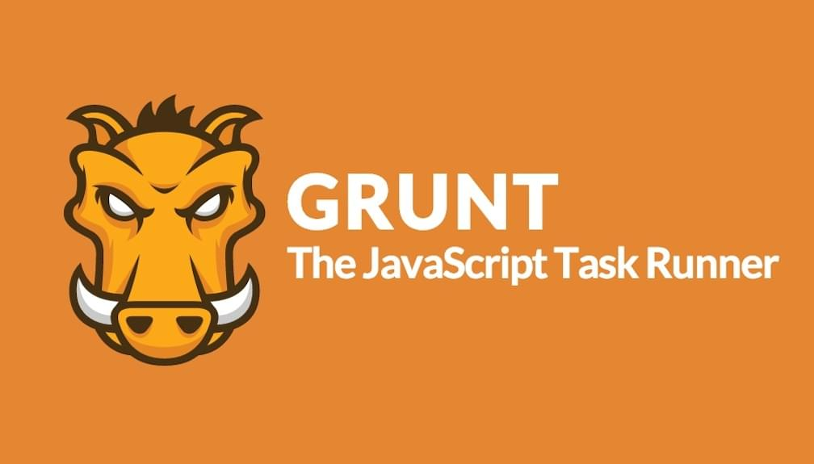

# Grunt.js

[Grunt](http://gruntjs.com/) si říká „The JavaScript Task Runner“ a má v logu divočáka. Ale není to nic jiného než robot sloužící webovým vývojářům. Automatizuje opakující se nebo nudné úkoly.

V praxi to vypadá tak, že si něco spustíte na příkazové řádce, ono vám to hlídá změny v souborech a po jejich provedení vyvolá nějaké akce. Další úlohy se zase spouštějí ručně, třeba nahrání webu na server.

Jednoduchým příkladem budiž minifikace CSS, JS souborů. Nebo jejich spojování do jednoho kvůli šetření requestů pro zvýšení rychlosti načítání. Nebo zpracování [preprocesorového](http://www.vzhurudolu.cz/blog/12-css-preprocesory-1) kódu do CSS či kompilace CoffeeScriptu do JavaScriptu. Zdá se vám to málo? Pak vězte, že [úloh jsou stovky](http://gruntjs.com/plugins) – a je docela snadné si napsat vlastní.

Důvody proč mám Grunt rád nejlíp ukáže [seznam úloh co využívám](grunt-pluginy.md).

To jde, ne? A to si myslím, že jsem jen mírně pokročilý uživatel Gruntu a čeká mě ještě hooodně objevování.

## Proč Grunt?

Pokud si rádi šetříte práci, je Grunt naprosto návyková záležitost.

Dobré je ale zmínit, že pro používání Gruntu musíte alespoň trochu kamarádit s příkazovou řádkou. Žádné pokročilé vědomosti potřeba nejsou. Sám chodím kolem příkazové řádky po špičkách, ale s Gruntem jsem se zkamarádil docela rychle.

Grunt má alternativy v podobě GUI robotů typu CodeKit, Prepros nebo Koala. Jenže ty umí fakt jen ty základní úlohy typu kompilace, minifikace, spojování. Maximálně ještě tvorbu [Source Maps](http://roots.io/using-less-source-maps/).

Grunt je robot nevykleštěný. Umí toho daleko víc. Navíc jeho konfigurák (`Gruntfile.js`) verzujete, takže nastavení úloh sdílíte se všemi členy týmu. Nemusíte se tak bát, že jeden vývojář kompiluje LESS kód jedním způsobem a druhý jiným. A úlohu, kterou si napíše jeden lenivý vývojář pro šetření práce, sdílí celý tým.

## Jak si Grunt rozjet?

Popíšu to velice zjednodušeně. Raději se ještě podívejte do článku [o instalaci Node.js](node-instalace.md) nebo do [dokumentace Gruntu](http://gruntjs.com/getting-started).

1. První co potřebujete je [instalace Node.js](http://nodejs.org/). Pak byste měli mít k dispozici instalátor Node balíčků, [npm](https://www.npmjs.org/).
2. Druhý krok je nainstalovat (jako administrátor) samotný Grunt: `npm install -g grunt-cli`
3. Jednotlivé Grunt úlohy ([pluginy](http://gruntjs.com/plugins)) se pak instalují jako další Node balíčky už do konkrétního adresáře. Třeba kompilátor LESSu takhle: `npm install grunt-contrib-less --save-dev`
4. V adresáři projektu se vám takhle vytvoří konfigurák se seznamem Node balíčků, které používáte — `packages.json`.
5. Teď už stačí jen nakonfigurovat Grunt úkoly. Dělá se to souborem `Gruntfile.js`, který byste si měli napsat sami. [Tady je popsaný víc](http://gruntjs.com/sample-gruntfile).
6. Když už tedy máte nainstalovaný Node, nainstalovaný Grunt, nainstalované Node balíčky pro Grunt úlohy a `Gruntfile` s konfigurací, můžete se Gruntu říct, aby vám zobrazil všechny dostupné příkazy: `grunt --help`.

Poslechněte si [Brus kódu s Riki Fridrichem](http://bruskodu.cz/epizoda/2/) nebo běžte na jeho [školení](http://www.vzhurudolu.cz/kurzy/grunt-gulp), kde si Grunt porovnáte s konkurenčním Gulpem.

