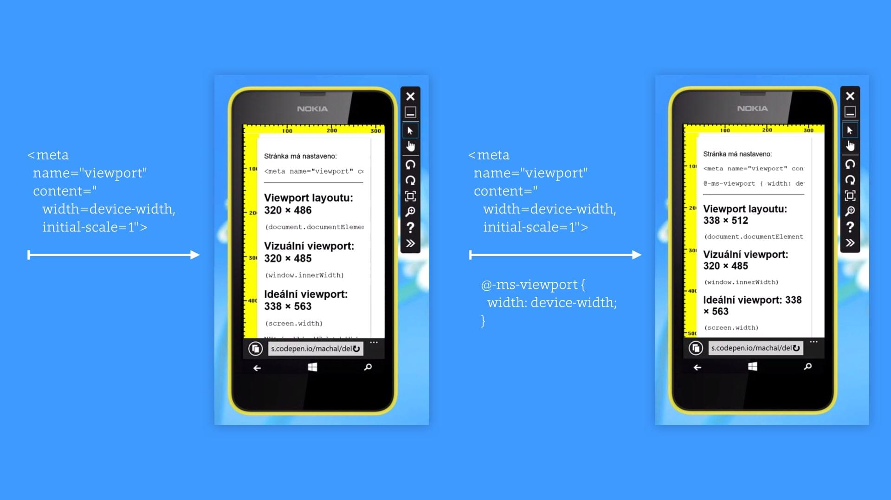

# Viewport na Windows 8 a 8.1

S viewportem jsou jen problémy. A Internet Explorer na Windows Phone 8 a 8.1 dal téhle větě nový rozměr.

Pokud se nechcete zabývat celým příběhem, do CSS si prostě přidejte tohle pravidlo:

```css
@-ms-viewport { width: device-width; }
```

A pokud chcete hezky zobrazovat weby na mobilních Windows 8, přidejte si do stránky i kousek javascriptu z konce tohoto článku. Raději si text ovšem přečtěte celý, je to chvilka času.

## Windows Phone 8.1 a menší problémy

Pokud  použijeme [meta viewport](http://jecas.cz/meta-viewport) s hodnotami `width=device-width, initial-scale=1`, mobilní Explorer si z nějakých (fakt prapodivných, co si budem povídat) důvodů nastaví kratší rozměr layoutového viewportu [na 320 pixelů](https://www.facebook.com/groups/frontendisti/permalink/1580597372151781/). Například na [Lumia 630](http://www.gsmarena.com/nokia_lumia_630-6232.php), která má fyzické rozlišení 480×854, pak zobrazí stránku v rozlišení 320×486.



Tady je oprava jednoduchá, stačí do CSS přidat už zmíněné `@-ms-viewport { width: device-width; }`.

Po použití tohoto pravidla začne zmiňovaná Lumia 630 na Windows Phone 8.1 zobrazovat stránky ve svém ideálním viewportu – 338×512 pixelů. Oukej, to bychom měli.

## Větší problémy na Windows Phone 8

Zvažte jak moc tohle chcete řešit. Windows 8.1 měly v lednu 2015 celosvětově téměř [dvoutřetinový podíl ze všech WP](https://twitter.com/machal/status/562543744235626496), verze 8 ani ne čtvrtinový. Na druhou stranu je řešení jednoduché – stačí přidat kousek Javascriptu. Ale nepředbíhejme, pojďme k problému.

Znáte [snap mód](https://www.youtube.com/watch?v=DS9kPoJ5xvA) z desktopových Windows 8? Česky snad *přichycení*. Mód, ve kterém si aplikaci přilepíte k hraně obrazovky. Pokud ve snap módu běží Internet Explorer ve verzi 10 a zobrazuje responzivní web, nestačí mu obvyklý meta tag viewport. Pokud se má web přizpůsobovat šířce okna, je potřeba nastavit to už zmíněnou CSS deklarací `@-ms-viewport { width: device-width; }`.

Jak už to ale bývá – zvídaví lidé přišli na to, že s přidáním pravidla `@-ms-viewport` se zároveň na Windows Phone 8 začínají weby [zobrazovat v hardwarovém rozlišení](http://mattstow.com/responsive-design-in-ie10-on-windows-phone-8.html), nikoliv [CSS rozlišení](http://www.vzhurudolu.cz/prirucka/css-pixel) jak bychom chtěli. [Řešení](http://timkadlec.com/2013/01/windows-phone-8-and-device-width/) pak – bohužel – spočívá v detekci mobilního Exploreru ve verzi 10 a podstrčení modifikovaného viewportu:

	if (navigator.userAgent.match(/IEMobile\/10\.0/)) {
    	var msViewportStyle = document.createElement("style");
	    msViewportStyle.appendChild(
    	    document.createTextNode(
       	     "@-ms-viewport{width:auto!important}"
       	 )
	    );
    	document.getElementsByTagName("head")[0].
       	 appendChild(msViewportStyle);
	}

A to je šťastný konec dalšího dílu pohádky o zlobivém Microsoftu, milé děti.
